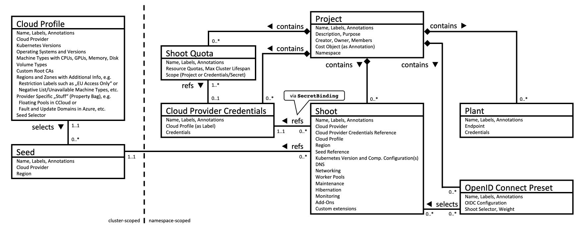

## Overview

The Gardener API server is a Kubernetes-native extension based on its [aggregation layer](https://kubernetes.io/docs/concepts/extend-kubernetes/api-extension/apiserver-aggregation/).
It is registered via an `APIService` object and designed to run inside a Kubernetes cluster whose API it wants to extend.

After registration, it exposes the following resources:

## `CloudProfile`s

`CloudProfile`s are resources that describe a specific environment of an underlying infrastructure provider, e.g. AWS, Azure, etc.
Each shoot has to reference a `CloudProfile` to declare the environment it should be created in.
In a `CloudProfile`, the gardener operator specifies certain constraints like available machine types, regions, which Kubernetes versions they want to offer, etc.
End-users can read `CloudProfile`s to see these values, but only operators can change the content or create/delete them.
When a shoot is created or updated, then an admission plugin checks that only allowed values are used via the referenced `CloudProfile`.

Additionally, a `CloudProfile` may contain a `providerConfig`, which is a special configuration dedicated for the infrastructure provider.
Gardener does not evaluate or understand this config, but extension controllers might need it for declaration of provider-specific constraints, or global settings.

Please see [this](../../example/30-cloudprofile.yaml) example manifest and consult the documentation of your provider extension controller to get information about its `providerConfig`.

### `NamespacedCloudProfile`s

In addition to `CloudProfile`s, `NamespacedCloudProfile`s exist to enable project-level customizations of `CloudProfile`s.
Project administrators can create and manage cloud profiles with overrides or extensions specific to their project.

Please see [this](../../example/35-namespacedcloudprofile.yaml) example manifest and [this](../usage/project/namespaced-cloud-profiles.md) usage documentation for further information.

## `InternalSecret`s

End-users can read and/or write `Secret`s in their project namespaces in the garden cluster. This prevents Gardener components from storing such "Gardener-internal" secrets in the respective project namespace.
`InternalSecret`s are resources that contain shoot or project-related secrets that are "Gardener-internal", i.e., secrets used and managed by the system that end-users don't have access to.
`InternalSecret`s are defined like plain Kubernetes `Secret`s, behave exactly like them, and can be used in the same manners. The only difference is, that the `InternalSecret` resource is a dedicated API resource (exposed by gardener-apiserver).
This allows separating access to "normal" secrets and internal secrets by the usual RBAC means.

Gardener uses an `InternalSecret` per Shoot for syncing the client CA to the project namespace in the garden cluster (named `<shoot-name>.ca-client`). The [`shoots/adminkubeconfig` subresource](../usage/shoot/shoot_access.md#shootsadminkubeconfig-subresource) signs short-lived client certificates by retrieving the CA from the `InternalSecret`.

Operators should configure `gardener-apiserver` to encrypt the `internalsecrets.core.gardener.cloud` resource in etcd.

Please see [this](../../example/11-internal-secret.yaml) example manifest.

## `Seed`s

`Seed`s are resources that represent seed clusters.
Gardener does not care about how a seed cluster got created - the only requirement is that it is of at least Kubernetes v1.27 and passes the Kubernetes conformance tests.
The Gardener operator has to either deploy the gardenlet into the cluster they want to use as seed (recommended, then the gardenlet will create the `Seed` object itself after bootstrapping) or provide the kubeconfig to the cluster inside a secret (that is referenced by the `Seed` resource) and create the `Seed` resource themselves.

Please see [this](../../example/45-secret-seed-backup.yaml), [this](../../example/50-seed.yaml), and optionally [this](../../example/40-secret-seed.yaml) example manifests.

## Shoot `Quota`s

To allow end-users not having their dedicated infrastructure account to try out Gardener, the operator can register an account owned by them that they allow to be used for trial clusters.
Trial clusters can be put under quota so that they don't consume too many resources (resulting in costs) and that one user cannot consume all resources on their own.
These clusters are automatically terminated after a specified time, but end-users may extend the lifetime manually if needed.

Please see [this](../../example/60-quota.yaml) example manifest.

## `Project`s

The first thing before creating a shoot cluster is to create a `Project`.
A project is used to group multiple shoot clusters together.
End-users can invite colleagues to the project to enable collaboration, and they can either make them `admin` or `viewer`.
After an end-user has created a project, they will get a dedicated namespace in the garden cluster for all their shoots.

Please see [this](../../example/05-project-dev.yaml) example manifest.

## `SecretBinding`s

Now that the end-user has a namespace the next step is registering their infrastructure provider account.

Please see [this](../../example/70-secret-provider.yaml) example manifest and consult the documentation of the extension controller for the respective infrastructure provider to get information about which keys are required in this secret.

After the secret has been created, the end-user has to create a special `SecretBinding` resource that binds this secret.
Later, when creating shoot clusters, they will reference such binding.

Please see [this](../../example/80-secretbinding.yaml) example manifest.

## `Shoot`s

Shoot cluster contain various settings that influence how end-user Kubernetes clusters will look like in the end.
As Gardener heavily relies on extension controllers for operating system configuration, networking, and infrastructure specifics, the end-user has the possibility (and responsibility) to provide these provider-specific configurations as well.
Such configurations are not evaluated by Gardener (because it doesn't know/understand them), but they are only transported to the respective extension controller.

:warning: This means that any configuration issues/mistake on the end-user side that relates to a provider-specific flag or setting cannot be caught during the update request itself but only later during the reconciliation (unless a validator webhook has been registered in the garden cluster by an operator).

Please see [this](../../example/90-shoot.yaml) example manifest and consult the documentation of the provider extension controller to get information about its `spec.provider.controlPlaneConfig`, `.spec.provider.infrastructureConfig`, and `.spec.provider.workers[].providerConfig`.

## `(Cluster)OpenIDConnectPreset`s

Please see [this](../usage/security/openidconnect-presets.md) separate documentation file.

## Overview Data Model

