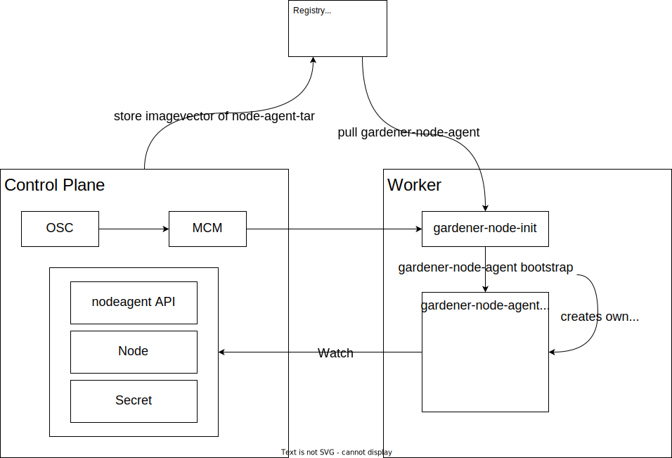

## Overview

The goal of the `gardener-node-agent` is to bootstrap a machine into a worker node and maintain node-specific components, which run on the node and are unmanaged by Kubernetes (e.g. the `kubelet` service, systemd units, ...).

It effectively is a Kubernetes controller deployed onto the worker node.

## Architecture and Basic Design

This figure visualizes the overall architecture of the `gardener-node-agent`. On the left side, it starts with an [`OperatingSystemConfig`](../extensions/resources/operatingsystemconfig.md) resource (`OSC`) with a corresponding worker pool specific `cloud-config-<worker-pool>` secret being passed by reference through the userdata to a machine by the `machine-controller-manager` (MCM).

On the right side, the `cloud-config` secret will be extracted and used by the `gardener-node-agent` after being installed. Details on this can be found in the next section.

Finally, the `gardener-node-agent` runs a systemd service watching on secret resources located in the `kube-system` namespace like our `cloud-config` secret that contains the `OperatingSystemConfig`. When `gardener-node-agent` applies the OSC, it installs the `kubelet` + configuration on the worker node.

## Installation and Bootstrapping

This section describes how the `gardener-node-agent` is initially installed onto the worker node.

In the beginning, there is a very small bash script called [`gardener-node-init.sh`](../../pkg/component/extensions/operatingsystemconfig/nodeinit/templates/scripts/init.tpl.sh), which will be copied to `/var/lib/gardener-node-agent/init.sh` on the node with cloud-init data.
This script's sole purpose is downloading and starting the `gardener-node-agent`.
The binary artifact is extracted from an [OCI artifact](https://github.com/opencontainers/image-spec/blob/main/manifest.md) and lives at `/opt/bin/gardener-node-agent`.

Along with the init script, a configuration for the `gardener-node-agent` is carried over to the worker node at `/var/lib/gardener-node-agent/config.yaml`.
This configuration contains things like the shoot's `kube-apiserver` endpoint, the according certificates to communicate with it, and controller configuration.

In a bootstrapping phase, the `gardener-node-agent` sets itself up as a systemd service.
It also executes tasks that need to be executed before any other components are installed, e.g. formatting the data device for the `kubelet`.

## Controllers

This section describes the controllers in more details.

### [`Lease` Controller](../../pkg/nodeagent/controller/lease)

This controller creates a `Lease` for `gardener-node-agent` in `kube-system` namespace of the shoot cluster.
Each instance of `gardener-node-agent` creates its own `Lease` when its corresponding `Node` was created.
It renews the `Lease` resource every 10 seconds. This indicates a heartbeat to the external world.

### [`Node` Controller](../../pkg/nodeagent/controller/node)

This controller watches the `Node` object for the machine it runs on.
The correct `Node` is identified based on the hostname of the machine (`Node`s have the `kubernetes.io/hostname` label).
Whenever the `worker.gardener.cloud/restart-systemd-services` annotation changes, the controller performs the desired changes by restarting the specified systemd unit files.
See also [this document](../usage/shoot-operations/shoot_operations.md#restart-systemd-services-on-particular-worker-nodes) for more information.
After restarting all units, the annotation is removed.

> ℹ️ When the `gardener-node-agent` systemd service itself is requested to be restarted, the annotation is removed first to ensure it does not restart itself indefinitely.

### [Operating System Config Controller](../../pkg/nodeagent/controller/operatingsystemconfig)

This controller contains the main logic of `gardener-node-agent`.
It watches `Secret`s whose `data` map contains the [`OperatingSystemConfig`](../extensions/resources/operatingsystemconfig.md#reconcile-purpose) which consists of all systemd units and files that are relevant for the node configuration.
Amongst others, a prominent example is the configuration file for `kubelet` and its unit file for the `kubelet.service`.
It also watches `Node`s and requeues the corresponding `Secret` when the reason of the node condition `InPlaceUpdate` changes to `ReadyForUpdate`.

The controller decodes the configuration and computes the files and units that have changed since its last reconciliation.
It writes or update the files and units to the file system, removes no longer needed files and units, reloads the systemd daemon, and starts or stops the units accordingly.

After successful reconciliation, it persists the just applied `OperatingSystemConfig` into a file on the host.
This file will be used for future reconciliations to compute file/unit changes.

The controller also maintains two annotations on the `Node`:

- `worker.gardener.cloud/kubernetes-version`, describing the version of the installed `kubelet`.
- `checksum/cloud-config-data`, describing the checksum of the applied `OperatingSystemConfig` (used in future reconciliations to determine whether it needs to reconcile, and to report that this node is up-to-date).

### [Token Controller](../../pkg/nodeagent/controller/token)

This controller watches the access token `Secret`s in the `kube-system` namespace configured via the `gardener-node-agent`'s component configuration (`.controllers.token.syncConfigs[]` field).
Whenever the `.data.token` field changes, it writes the new content to a file on the configured path on the host file system.
This mechanism is used to download its own access token for the shoot cluster, but also the access tokens of other `systemd` components (e.g., `valitail`).
Since the underlying client is based on `k8s.io/client-go` and the kubeconfig points to this token file, it is dynamically reloaded without the necessity of explicit configuration or code changes.
This procedure ensures that the most up-to-date tokens are always present on the host and used by the `gardener-node-agent` and the other `systemd` components.
The controller is also triggered via a source channel, which is done by the `Operating System Config` controller during an in-place service account key rotation.

## Reasoning

The `gardener-node-agent` is a replacement for what was called the `cloud-config-downloader` and the `cloud-config-executor`, both written in `bash`. The `gardener-node-agent` implements this functionality as a regular controller and feels more uniform in terms of maintenance.

With the new architecture we gain a lot, let's describe the most important gains here.

### Developer Productivity

Since the Gardener community develops in Go day by day, writing business logic in `bash` is difficult, hard to maintain, almost impossible to test. Getting rid of almost all `bash` scripts which are currently in use for this very important part of the cluster creation process will enhance the speed of adding new features and removing bugs.

### Speed

Until now, the `cloud-config-downloader` runs in a loop every `60s` to check if something changed on the shoot which requires modifications on the worker node. This produces a lot of unneeded traffic on the API server and wastes time, it will sometimes take up to `60s` until a desired modification is started on the worker node.
By writing a "real" Kubernetes controller, we can watch for the `Node`, the `OSC` in the `Secret`, and the shoot-access token in the `secret`. If any of these object changed, and only then, the required action will take effect immediately.
This will speed up operations and will reduce the load on the API server of the shoot especially for large clusters.

## Scalability

The `cloud-config-downloader` adds a random wait time before restarting the `kubelet` in case the `kubelet` was updated or a configuration change was made to it. This is required to reduce the load on the API server and the traffic on the internet uplink. It also reduces the overall downtime of the services in the cluster because every `kubelet` restart transforms a node for several seconds into `NotReady` state which potentially interrupts service availability.

Decision was made to keep the existing jitter mechanism which calculates the `kubelet-download-and-restart-delay-seconds` on the controller itself.

### Correctness

The configuration of the `cloud-config-downloader` is actually done by placing a file for every configuration item on the disk on the worker node. This was done because parsing the content of a single file and using this as a value in `bash` reduces to something like `VALUE=$(cat /the/path/to/the/file)`. Simple, but it lacks validation, type safety and whatnot.
With the `gardener-node-agent` we introduce a new API which is then stored in the `gardener-node-agent` `secret` and stored on disk in a single YAML file for comparison with the previous known state. This brings all benefits of type safe configuration.
Because actual and previous configuration are compared, removed files and units are also removed and stopped on the worker if removed from the `OSC`.

### Availability

Previously, the `cloud-config-downloader` simply restarted the systemd units on every change to the `OSC`, regardless which of the services changed. The `gardener-node-agent` first checks which systemd unit was changed, and will only restart these. This will prevent unneeded `kubelet` restarts.
