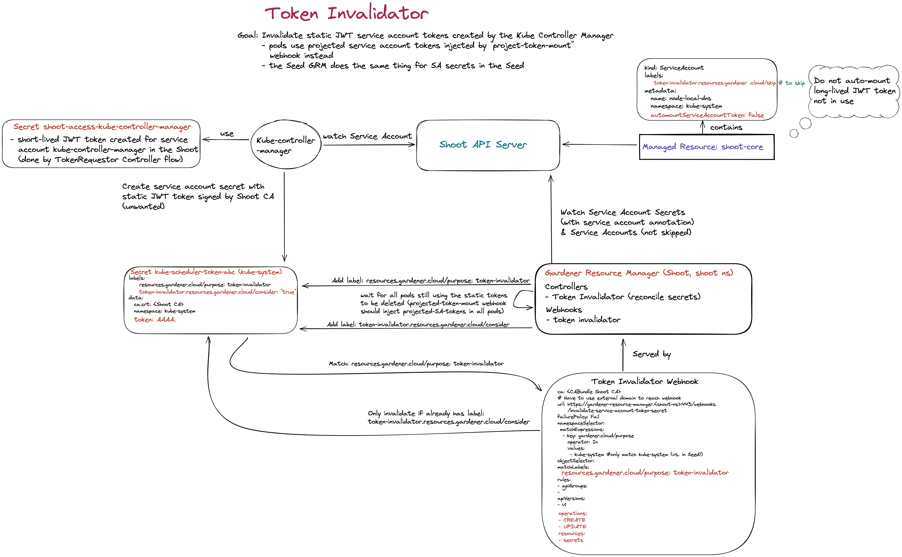
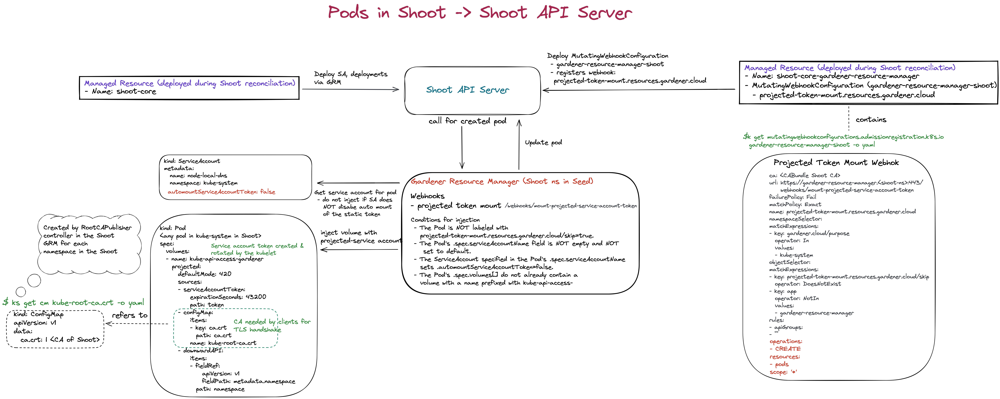

## Overview

Initially, the `gardener-resource-manager` was a project similar to the [kube-addon-manager](https://github.com/kubernetes/kubernetes/tree/master/cluster/addons/addon-manager).
It manages Kubernetes resources in a target cluster which means that it creates, updates, and deletes them.
Also, it makes sure that manual modifications to these resources are reconciled back to the desired state.

In the Gardener project we were using the kube-addon-manager since more than two years.
While we have progressed with our [extensibility story](../proposals/01-extensibility.md) (moving cloud providers out-of-tree), we had decided that the kube-addon-manager is no longer suitable for this use-case.
The problem with it is that it needs to have its managed resources on its file system.
This requires storing the resources in `ConfigMap`s or `Secret`s and mounting them to the kube-addon-manager pod during deployment time.
The `gardener-resource-manager` uses `CustomResourceDefinition`s which allows to dynamically add, change, and remove resources with immediate action and without the need to reconfigure the volume mounts/restarting the pod.

Meanwhile, the `gardener-resource-manager` has evolved to a more generic component comprising several controllers and webhook handlers.
It is deployed by gardenlet once per seed (in the `garden` namespace) and once per shoot (in the respective shoot namespaces in the seed).

## Component Configuration

Similar to other Gardener components, the `gardener-resource-manager` uses a so-called component configuration file.
It allows specifying certain central settings like log level and formatting, client connection configuration, server ports and bind addresses, etc.
In addition, controllers and webhooks can be configured and sometimes even disabled.

Note that the very basic `ManagedResource` and health controllers cannot be disabled.

You can find an example configuration file [here](../../example/resource-manager/10-componentconfig.yaml).

## Controllers

### [`ManagedResource` Controller](../../pkg/resourcemanager/controller/managedresource)

This controller watches custom objects called `ManagedResource`s in the `resources.gardener.cloud/v1alpha1` API group.
These objects contain references to secrets, which itself contain the resources to be managed.
The reason why a `Secret` is used to store the resources is that they could contain confidential information like credentials.

```yaml
---
apiVersion: v1
kind: Secret
metadata:
  name: managedresource-example1
  namespace: default
type: Opaque
data:
  objects.yaml: YXBpVmVyc2lvbjogdjEKa2luZDogQ29uZmlnTWFwCm1ldGFkYXRhOgogIG5hbWU6IHRlc3QtMTIzNAogIG5hbWVzcGFjZTogZGVmYXVsdAotLS0KYXBpVmVyc2lvbjogdjEKa2luZDogQ29uZmlnTWFwCm1ldGFkYXRhOgogIG5hbWU6IHRlc3QtNTY3OAogIG5hbWVzcGFjZTogZGVmYXVsdAo=
    # apiVersion: v1
    # kind: ConfigMap
    # metadata:
    #   name: test-1234
    #   namespace: default
    # ---
    # apiVersion: v1
    # kind: ConfigMap
    # metadata:
    #   name: test-5678
    #   namespace: default
---
apiVersion: resources.gardener.cloud/v1alpha1
kind: ManagedResource
metadata:
  name: example
  namespace: default
spec:
  secretRefs:
  - name: managedresource-example1
```

In the above example, the controller creates two `ConfigMap`s in the `default` namespace.
When a user is manually modifying them, they will be reconciled back to the desired state stored in the `managedresource-example` secret.

It is also possible to inject labels into all the resources:

```yaml
---
apiVersion: v1
kind: Secret
metadata:
  name: managedresource-example2
  namespace: default
type: Opaque
data:
  other-objects.yaml: YXBpVmVyc2lvbjogYXBwcy92MSAjIGZvciB2ZXJzaW9ucyBiZWZvcmUgMS45LjAgdXNlIGFwcHMvdjFiZXRhMgpraW5kOiBEZXBsb3ltZW50Cm1ldGFkYXRhOgogIG5hbWU6IG5naW54LWRlcGxveW1lbnQKc3BlYzoKICBzZWxlY3RvcjoKICAgIG1hdGNoTGFiZWxzOgogICAgICBhcHA6IG5naW54CiAgcmVwbGljYXM6IDIgIyB0ZWxscyBkZXBsb3ltZW50IHRvIHJ1biAyIHBvZHMgbWF0Y2hpbmcgdGhlIHRlbXBsYXRlCiAgdGVtcGxhdGU6CiAgICBtZXRhZGF0YToKICAgICAgbGFiZWxzOgogICAgICAgIGFwcDogbmdpbngKICAgIHNwZWM6CiAgICAgIGNvbnRhaW5lcnM6CiAgICAgIC0gbmFtZTogbmdpbngKICAgICAgICBpbWFnZTogbmdpbng6MS43LjkKICAgICAgICBwb3J0czoKICAgICAgICAtIGNvbnRhaW5lclBvcnQ6IDgwCg==
    # apiVersion: apps/v1
    # kind: Deployment
    # metadata:
    #   name: nginx-deployment
    # spec:
    #   selector:
    #     matchLabels:
    #       app: nginx
    #   replicas: 2 # tells deployment to run 2 pods matching the template
    #   template:
    #     metadata:
    #       labels:
    #         app: nginx
    #     spec:
    #       containers:
    #       - name: nginx
    #         image: nginx:1.7.9
    #         ports:
    #         - containerPort: 80

---
apiVersion: resources.gardener.cloud/v1alpha1
kind: ManagedResource
metadata:
  name: example
  namespace: default
spec:
  secretRefs:
  - name: managedresource-example2
  injectLabels:
    foo: bar
```

In this example, the label `foo=bar` will be injected into the `Deployment`, as well as into all created `ReplicaSet`s and `Pod`s.

#### Preventing Reconciliations

If a `ManagedResource` is annotated with `resources.gardener.cloud/ignore=true`, then it will be skipped entirely by the controller (no reconciliations or deletions of managed resources at all).
However, when the `ManagedResource` itself is deleted (for example when a shoot is deleted), then the annotation is not respected and all resources will be deleted as usual.
This feature can be helpful to temporarily patch/change resources managed as part of such `ManagedResource`.
Condition checks will be skipped for such `ManagedResource`s.

#### Modes

The `gardener-resource-manager` can manage a resource in the following supported modes:
- `Ignore`
    - The corresponding resource is removed from the `ManagedResource` status (`.status.resources`). No action is performed on the cluster.
    - The resource is no longer "managed" (updated or deleted).
    - The primary use case is a migration of a resource from one `ManagedResource` to another one.

The mode for a resource can be specified with the `resources.gardener.cloud/mode` annotation. The annotation should be specified in the encoded resource manifest in the Secret that is referenced by the `ManagedResource`.

#### Resource Class and Reconciliation Scope

By default, the `gardener-resource-manager` controller watches for `ManagedResource`s in all namespaces.
The `.sourceClientConnection.namespace` field in the component configuration restricts the watch to `ManagedResource`s in a single namespace only.
Note that this setting also affects all other controllers and webhooks since it's a central configuration.

A `ManagedResource` has an optional `.spec.class` field that allows it to indicate that it belongs to a given class of resources.
The `.controllers.resourceClass` field in the component configuration restricts the watch to `ManagedResource`s with the given `.spec.class`.
A default class is assumed if no class is specified.

For instance, the `gardener-resource-manager` which is deployed in the Shoot’s control plane namespace in the Seed does not specify a `.spec.class` and watches only for resources in the control plane namespace by specifying it in the `.sourceClientConnection.namespace`  field.

If the `.spec.class` changes this means that the resources have to be handled by a different Gardener Resource Manager. That is achieved by:
1. Cleaning all referenced resources by the Gardener Resource Manager that was responsible for the old class in its target cluster.
2. Creating all referenced resources by the Gardener Resource Manager that is responsible for the new class in its target cluster.

#### [Conditions](../../pkg/resourcemanager/controller/health)

A `ManagedResource` has a `ManagedResourceStatus`, which has an array of Conditions. Conditions currently include:

| Condition              | Description                                               |
|------------------------|-----------------------------------------------------------|
| `ResourcesApplied`     | `True` if all resources are applied to the target cluster |
| `ResourcesHealthy`     | `True` if all resources are present and healthy           |
| `ResourcesProgressing` | `False` if all resources have been fully rolled out       |

`ResourcesApplied` may be `False` when:
- the resource `apiVersion` is not known to the target cluster
- the resource spec is invalid (for example the label value does not match the required regex for it)
- ...

`ResourcesHealthy` may be `False` when:
- the resource is not found
- the resource is a Deployment and the Deployment does not have the minimum availability.
- ...

`ResourcesProgressing` may be `True` when:
- a `Deployment`, `StatefulSet` or `DaemonSet` has not been fully rolled out yet, i.e. not all replicas have been updated with the latest changes to `spec.template`.
- there are still old `Pod`s belonging to an older `ReplicaSet` of a `Deployment` which are not terminated yet.

Each Kubernetes resources has different notion for being healthy. For example, a Deployment is considered healthy if the controller observed its current revision and if the number of updated replicas is equal to the number of replicas.

The following `status.conditions` section describes a healthy `ManagedResource`:

```yaml
conditions:
- lastTransitionTime: "2022-05-03T10:55:39Z"
  lastUpdateTime: "2022-05-03T10:55:39Z"
  message: All resources are healthy.
  reason: ResourcesHealthy
  status: "True"
  type: ResourcesHealthy
- lastTransitionTime: "2022-05-03T10:55:36Z"
  lastUpdateTime: "2022-05-03T10:55:36Z"
  message: All resources have been fully rolled out.
  reason: ResourcesRolledOut
  status: "False"
  type: ResourcesProgressing
- lastTransitionTime: "2022-05-03T10:55:18Z"
  lastUpdateTime: "2022-05-03T10:55:18Z"
  message: All resources are applied.
  reason: ApplySucceeded
  status: "True"
  type: ResourcesApplied
```

#### Ignoring Updates

In some cases, it is not desirable to update or re-apply some of the cluster components (for example, if customization is required or needs to be applied by the end-user).
For these resources, the annotation "resources.gardener.cloud/ignore" needs to be set to "true" or a truthy value (Truthy values are "1", "t", "T", "true", "TRUE", "True") in the corresponding managed resource secrets.
This can be done from the components that create the managed resource secrets, for example Gardener extensions or Gardener. Once this is done, the resource will be initially created and later ignored during reconciliation.

#### Finalizing Deletion of Resources After Grace Period

When a `ManagedResource` is deleted, the controller deletes all managed resources from the target cluster.
In case the resources still have entries in their `.metadata.finalizers[]` list, they will remain stuck in the system until another entity removes the finalizers.
If you want the controller to forcefully finalize the deletion after some grace period (i.e., setting `.metadata.finalizers=null`), you can annotate the managed resources with `resources.gardener.cloud/finalize-deletion-after=<duration>`, e.g., `resources.gardener.cloud/finalize-deletion-after=1h`.

#### Preserving `replicas` or `resources` in Workload Resources

The objects which are part of the `ManagedResource` can be annotated with:

- `resources.gardener.cloud/preserve-replicas=true` in case the `.spec.replicas` field of workload resources like `Deployment`s, `StatefulSet`s, etc., shall be preserved during updates.
- `resources.gardener.cloud/preserve-resources=true` in case the `.spec.containers[*].resources` fields of all containers of workload resources like `Deployment`s, `StatefulSet`s, etc., shall be preserved during updates.

> This can be useful if there are non-standard horizontal/vertical auto-scaling mechanisms in place.
Standard mechanisms like `HorizontalPodAutoscaler` or `VerticalPodAutoscaler` will be auto-recognized by `gardener-resource-manager`, i.e., in such cases the annotations are not needed.

#### Origin

All the objects managed by the resource manager get a dedicated annotation
`resources.gardener.cloud/origin` describing the `ManagedResource` object that describes
this object. The default format is `<namespace>/<objectname>`.

In multi-cluster scenarios (the `ManagedResource` objects are maintained in a
cluster different from the one the described objects are managed), it might
be useful to include the cluster identity, as well.

This can be enforced by setting the `.controllers.clusterID` field in the component configuration.
Here, several possibilities are supported:
- given a direct value: use this as id for the source cluster.
- `<cluster>`: read the cluster identity from a `cluster-identity` config map
  in the `kube-system` namespace (attribute `cluster-identity`). This is
  automatically maintained in all clusters managed or involved in a gardener landscape.
- `<default>`: try to read the cluster identity from the config map. If not found,
  no identity is used.
- empty string: no cluster identity is used (completely cluster local scenarios).

By default, cluster id is not used. If cluster id is specified, the format is `<cluster id>:<namespace>/<objectname>`.

In addition to the origin annotation, all objects managed by the resource manager get a dedicated label `resources.gardener.cloud/managed-by`. This label can be used to describe these objects with a [selector](https://kubernetes.io/docs/concepts/overview/working-with-objects/labels/). By default it is set to "gardener", but this can be overwritten by setting the `.conrollers.managedResources.managedByLabelValue` field in the component configuration.

#### Compression

The number and size of manifests for a `ManagedResource` can accumulate to a considerable amount which leads to increased `Secret` data.
A decent compression algorithm helps to reduce the footprint of such `Secret`s and the load they put on `etcd`, the `kube-apiserver`, and client caches.
We found [Brotli](https://github.com/google/brotli) to be a suitable candidate for most use cases (see comparison table [here](https://github.com/gardener/gardener/pull/9868)).
When the `gardener-resource-manager` detects a data key with the known suffix `.br`, it automatically un-compresses the data first before processing the contained manifest.

To decompress a ManagedResource Secret use:
```
kubectl -n <namespace> get secret <managed-resource-secret> -o jsonpath='{.data.data\.yaml\.br}' | base64 -d | brotli -d
```

On macOS, the brotli binary can be installed via homebrew using the [brotli formula](https://formulae.brew.sh/formula/brotli).

### [`health` Controller](../../pkg/resourcemanager/controller/health)

This controller processes `ManagedResource`s that were reconciled by the main [ManagedResource Controller](#managedResource-controller) at least once.
Its main job is to perform checks for maintaining the well [known conditions](#conditions) `ResourcesHealthy` and `ResourcesProgressing`.

#### Progressing Checks

In Kubernetes, applied changes must usually be rolled out first, e.g. when changing the base image in a `Deployment`.
Progressing checks detect ongoing roll-outs and report them in the `ResourcesProgressing` condition of the corresponding `ManagedResource`.

The following object kinds are considered for progressing checks:
- `DaemonSet`
- `Deployment`
- `StatefulSet`
- [`Prometheus`](https://github.com/prometheus-operator/prometheus-operator)
- [`Alertmanager`](https://github.com/prometheus-operator/prometheus-operator)
- [`Certificate`](https://github.com/gardener/cert-management)
- [`Issuer`](https://github.com/gardener/cert-management)

#### Health Checks

`gardener-resource-manager` can evaluate the health of specific resources, often by consulting their conditions.
Health check results are regularly updated in the `ResourcesHealthy` condition of the corresponding `ManagedResource`.

The following object kinds are considered for health checks:
- `CustomResourceDefinition`
- `DaemonSet`
- `Deployment`
- `Job`
- `Pod`
- `ReplicaSet`
- `ReplicationController`
- `Service`
- `StatefulSet`
- [`VerticalPodAutoscaler`](https://github.com/kubernetes/autoscaler/tree/master/vertical-pod-autoscaler)
- [`Prometheus`](https://github.com/prometheus-operator/prometheus-operator)
- [`Alertmanager`](https://github.com/prometheus-operator/prometheus-operator)
- [`Certificate`](https://github.com/gardener/cert-management)
- [`Issuer`](https://github.com/gardener/cert-management)

#### Skipping Health Check

If a resource owned by a `ManagedResource` is annotated with `resources.gardener.cloud/skip-health-check=true`, then the resource will be skipped during health checks by the `health` controller. The `ManagedResource` conditions will not reflect the health condition of this resource anymore. The `ResourcesProgressing` condition will also be set to `False`.

### [Garbage Collector For Immutable `ConfigMap`s/`Secret`s](../../pkg/resourcemanager/controller/garbagecollector)

In Kubernetes, workload resources (e.g., `Pod`s) can mount `ConfigMap`s or `Secret`s or reference them via environment variables in containers.
Typically, when the content of such a `ConfigMap`/`Secret` gets changed, then the respective workload is usually not dynamically reloading the configuration, i.e., a restart is required.
The most commonly used approach is probably having the so-called [checksum annotations in the pod template](https://helm.sh/docs/howto/charts_tips_and_tricks/#automatically-roll-deployments), which makes Kubernetes recreate the pod if the checksum changes.
However, it has the downside that old, still running versions of the workload might not be able to properly work with the already updated content in the `ConfigMap`/`Secret`, potentially causing application outages.

In order to protect users from such outages (and also to improve the performance of the cluster), the Kubernetes community provides the ["immutable `ConfigMap`s/`Secret`s feature"](https://kubernetes.io/docs/concepts/configuration/configmap/#configmap-immutable).
Enabling immutability requires `ConfigMap`s/`Secret`s to have unique names.
Having unique names requires the client to delete `ConfigMap`s/`Secret`s no longer in use.

In order to provide a similarly lightweight experience for clients (compared to the well-established checksum annotation approach), the `gardener-resource-manager` features an optional garbage collector controller (disabled by default).
The purpose of this controller is cleaning up such immutable `ConfigMap`s/`Secret`s if they are no longer in use.

#### How Does the Garbage Collector Work?

The following algorithm is implemented in the GC controller:

1. List all `ConfigMap`s and `Secret`s labeled with `resources.gardener.cloud/garbage-collectable-reference=true`.
1. List all `Deployment`s, `StatefulSet`s, `DaemonSet`s, `Job`s, `CronJob`s, `Pod`s, `ManagedResource`s and for each of them:
    - iterate over the `.metadata.annotations` and for each of them:
        - If the annotation key follows the `reference.resources.gardener.cloud/{configmap,secret}-<hash>` scheme and the value equals `<name>`, then consider it as "in-use".
1. Delete all `ConfigMap`s and `Secret`s not considered as "in-use".

Consequently, clients need to:

1. Create immutable `ConfigMap`s/`Secret`s with unique names (e.g., a checksum suffix based on the `.data`).
1. Label such `ConfigMap`s/`Secret`s with `resources.gardener.cloud/garbage-collectable-reference=true`.
1. Annotate their workload resources with `reference.resources.gardener.cloud/{configmap,secret}-<hash>=<name>` for all `ConfigMap`s/`Secret`s used by the containers of the respective `Pod`s.

   ⚠️ Add such annotations to `.metadata.annotations`, as well as to all templates of other resources (e.g., `.spec.template.metadata.annotations` in `Deployment`s or `.spec.jobTemplate.metadata.annotations` and `.spec.jobTemplate.spec.template.metadata.annotations` for `CronJob`s.
   This ensures that the GC controller does not unintentionally consider `ConfigMap`s/`Secret`s as "not in use" just because there isn't a `Pod` referencing them anymore (e.g., they could still be used by a `Deployment` scaled down to `0`).

ℹ️ For the last step, there is a helper function `InjectAnnotations` in the `pkg/controller/garbagecollector/references`, which you can use for your convenience.

**Example:**

```yaml
---
apiVersion: v1
kind: ConfigMap
metadata:
  name: test-1234
  namespace: default
  labels:
    resources.gardener.cloud/garbage-collectable-reference: "true"
---
apiVersion: v1
kind: ConfigMap
metadata:
  name: test-5678
  namespace: default
  labels:
    resources.gardener.cloud/garbage-collectable-reference: "true"
---
apiVersion: v1
kind: Pod
metadata:
  name: example
  namespace: default
  annotations:
    reference.resources.gardener.cloud/configmap-82a3537f: test-5678
spec:
  containers:
  - name: nginx
    image: nginx:1.14.2
    terminationGracePeriodSeconds: 2
```

The GC controller would delete the `ConfigMap/test-1234` because it is considered as not "in-use".

ℹ️ If the GC controller is activated then the `ManagedResource` controller will no longer delete `ConfigMap`s/`Secret`s having the above label.

#### How to Activate the Garbage Collector?

The GC controller can be activated by setting the `.controllers.garbageCollector.enabled` field to `true` in the component configuration.

### [TokenInvalidator Controller](../../pkg/resourcemanager/controller/tokeninvalidator)

The Kubernetes community is slowly transitioning from static `ServiceAccount` token `Secret`s to [`ServiceAccount` Token Volume Projection](https://kubernetes.io/docs/tasks/configure-pod-container/configure-service-account/#service-account-token-volume-projection).
Typically, when you create a `ServiceAccount`

```yaml
apiVersion: v1
kind: ServiceAccount
metadata:
  name: default
```

then the [`serviceaccount-token`](https://github.com/kubernetes/kubernetes/blob/master/pkg/controller/serviceaccount/tokens_controller.go) controller (part of `kube-controller-manager`) auto-generates a `Secret` with a static token:

```yaml
apiVersion: v1
kind: Secret
metadata:
   annotations:
      kubernetes.io/service-account.name: default
      kubernetes.io/service-account.uid: 86e98645-2e05-11e9-863a-b2d4d086dd5a)
   name: default-token-ntxs9
type: kubernetes.io/service-account-token
data:
   ca.crt: base64(cluster-ca-cert)
   namespace: base64(namespace)
   token: base64(static-jwt-token)
```

Unfortunately, when using `ServiceAccount` Token Volume Projection in a `Pod`, this static token is actually not used at all:

```yaml
apiVersion: v1
kind: Pod
metadata:
  name: nginx
spec:
  serviceAccountName: default
  containers:
  - image: nginx
    name: nginx
    volumeMounts:
    - mountPath: /var/run/secrets/tokens
      name: token
  volumes:
  - name: token
    projected:
      sources:
      - serviceAccountToken:
          path: token
          expirationSeconds: 7200
```

While the `Pod` is now using an expiring and auto-rotated token, the static token is still generated and valid.

There is neither a way of preventing `kube-controller-manager` to generate such static tokens, nor a way to proactively remove or invalidate them:

- https://github.com/kubernetes/kubernetes/issues/77599
- https://github.com/kubernetes/kubernetes/issues/77600

Disabling the `serviceaccount-token` controller is an option, however, especially in the Gardener context it may either break end-users or it may not even be possible to control such settings.
Also, even if a future Kubernetes version supports native configuration of the above behaviour, Gardener still supports older versions which won't get such features but need a solution as well.

This is where the _TokenInvalidator_ comes into play:
Since it is not possible to prevent `kube-controller-manager` from generating static `ServiceAccount` `Secret`s, the _TokenInvalidator_ is, as its name suggests, just invalidating these tokens.
It considers all such `Secret`s belonging to `ServiceAccount`s with `.automountServiceAccountToken=false`.
By default, all namespaces in the target cluster are watched, however, this can be configured by specifying the `.targetClientConnection.namespace` field in the component configuration.
Note that this setting also affects all other controllers and webhooks since it's a central configuration.

```yaml
apiVersion: v1
kind: ServiceAccount
metadata:
  name: my-serviceaccount
automountServiceAccountToken: false
```

This will result in a static `ServiceAccount` token secret whose `token` value is invalid:

```yaml
apiVersion: v1
kind: Secret
metadata:
  annotations:
    kubernetes.io/service-account.name: my-serviceaccount
    kubernetes.io/service-account.uid: 86e98645-2e05-11e9-863a-b2d4d086dd5a
  name: my-serviceaccount-token-ntxs9
type: kubernetes.io/service-account-token
data:
  ca.crt: base64(cluster-ca-cert)
  namespace: base64(namespace)
  token: AAAA
```

Any attempt to regenerate the token or creating a new such secret will again make the component invalidating it.

> You can opt-out of this behaviour for `ServiceAccount`s setting `.automountServiceAccountToken=false` by labeling them with `token-invalidator.resources.gardener.cloud/skip=true`.

In order to enable the _TokenInvalidator_ you have to set both `.controllers.tokenValidator.enabled=true` and `.webhooks.tokenValidator.enabled=true` in the component configuration.

The below graphic shows an overview of the Token Invalidator for Service account secrets in the Shoot cluster.


### [TokenRequestor Controller](../../pkg/controller/tokenrequestor)

This controller provides the service to create and auto-renew tokens via the [`TokenRequest` API](https://kubernetes.io/docs/reference/kubernetes-api/authentication-resources/token-request-v1/).

It provides a functionality similar to the kubelet's [Service Account Token Volume Projection](https://kubernetes.io/docs/tasks/configure-pod-container/configure-service-account/#service-account-token-volume-projection).
It was created to handle the special case of issuing tokens to pods that run in a different cluster than the API server they communicate with (hence, using the native token volume projection feature is not possible).

The controller differentiates between `source cluster` and `target cluster`.
The `source cluster` hosts the `gardener-resource-manager` pod. Secrets in this cluster are watched and modified by the controller.
The `target cluster` _can_ be configured to point to another cluster. The existence of ServiceAccounts are ensured and token requests are issued against the target.
When the `gardener-resource-manager` is deployed next to the Shoot's controlplane in the Seed, the `source cluster` is the Seed while the `target cluster` points to the Shoot.

#### Reconciliation Loop

This controller reconciles `Secret`s in all namespaces in the source cluster with the label: `resources.gardener.cloud/purpose=token-requestor`.
See [this YAML file](../../example/resource-manager/30-secret-tokenrequestor.yaml) for an example of the secret.

The controller ensures a `ServiceAccount` exists in the target cluster as specified in the annotations of the `Secret` in the source cluster:

```yaml
serviceaccount.resources.gardener.cloud/name: <sa-name>
serviceaccount.resources.gardener.cloud/namespace: <sa-namespace>
```

You can optionally annotate the `Secret` with `serviceaccount.resources.gardener.cloud/labels`, e.g. `serviceaccount.resources.gardener.cloud/labels={"some":"labels","foo":"bar"}`.
This will make the `ServiceAccount` getting labelled accordingly.

The requested tokens will act with the privileges which are assigned to this `ServiceAccount`.

The controller will then request a token via the [`TokenRequest` API](https://kubernetes.io/docs/reference/kubernetes-api/authentication-resources/token-request-v1/) and populate it into the `.data.token` field to the `Secret` in the source cluster.

Alternatively, the client can provide a raw kubeconfig (in YAML or JSON format) via the `Secret`'s `.data.kubeconfig` field.
The controller will then populate the requested token in the kubeconfig for the user used in the `.current-context`.
For example, if `.data.kubeconfig` is

```yaml
apiVersion: v1
clusters:
- cluster:
    certificate-authority-data: AAAA
    server: some-server-url
  name: shoot--foo--bar
contexts:
- context:
    cluster: shoot--foo--bar
    user: shoot--foo--bar-token
  name: shoot--foo--bar
current-context: shoot--foo--bar
kind: Config
preferences: {}
users:
- name: shoot--foo--bar-token
  user:
    token: ""
```

then the `.users[0].user.token` field of the kubeconfig will be updated accordingly.

The TokenRequestor can also optionally inject the current CA bundle if the secret is annotated with

```yaml
serviceaccount.resources.gardener.cloud/inject-ca-bundle: "true"
```

If a `kubeconfig` is present in the secret, the CA bundle is set in the in the `cluster.certificate-authority-data` field of the cluster of the current context.
Otherwise, the bundle is stored in an additional secret key `bundle.crt`.

The controller also adds an annotation to the `Secret` to keep track when to renew the token before it expires.
By default, the tokens are issued to expire after 12 hours. The expiration time can be set with the following annotation:

```yaml
serviceaccount.resources.gardener.cloud/token-expiration-duration: 6h
```

It automatically renews once 80% of the lifetime is reached, or after `24h`.

Optionally, the controller can also populate the token into a `Secret` in the target cluster. This can be requested by annotating the `Secret` in the source cluster with:

```yaml
token-requestor.resources.gardener.cloud/target-secret-name: "foo"
token-requestor.resources.gardener.cloud/target-secret-namespace: "bar"
```

Overall, the TokenRequestor controller provides credentials with limited lifetime (JWT tokens)
used by Shoot control plane components running in the Seed to talk to the Shoot API Server.
Please see the graphic below:


> ℹ️ Generally, the controller can run with multiple instances in different components.
> For example, `gardener-resource-manager` might run the `TokenRequestor` controller, but `gardenlet` might run it, too.
> In order to differentiate which instance of the controller is responsible for a `Secret`, it can be labeled with `resources.gardener.cloud/class=<class>`.
> The `<class>` must be configured in the respective controller, otherwise it will be responsible for all `Secret`s no matter whether they have the label or not.

### [`CertificateSigningRequest` Approver](../../pkg/resourcemanager/controller/csrapprover)

#### Kubelet Server

Gardener configures the kubelets such that they request two certificates via the `CertificateSigningRequest` API:

1. client certificate for communicating with the `kube-apiserver`
2. server certificate for serving its HTTPS server

For client certificates, the `kubernetes.io/kube-apiserver-client-kubelet` signer is used (see [Certificate Signing Requests](https://kubernetes.io/docs/reference/access-authn-authz/certificate-signing-requests/#kubernetes-signers) for more details).
The `kube-controller-manager`'s `csrapprover` controller is responsible for auto-approving such `CertificateSigningRequest`s so that the respective certificates can be issued.

For server certificates, the `kubernetes.io/kubelet-serving` signer is used.
Unfortunately, the `kube-controller-manager` is not able to auto-approve such `CertificateSigningRequest`s (see [kubernetes/kubernetes#73356](https://github.com/kubernetes/kubernetes/issues/73356) for details).

That's the motivation for having this controller as part of `gardener-resource-manager`.
It watches `CertificateSigningRequest`s with the `kubernetes.io/kubelet-serving` signer and auto-approves them when all the following conditions are met:

- The `.spec.username` is prefixed with `system:node:`.
- There must be at least one DNS name or IP address as part of the certificate SANs.
- The common name in the CSR must match the `.spec.username`.
- The organization in the CSR must only contain `system:nodes`.
- There must be a `Node` object with the same name in the shoot cluster.
- There must be exactly one `Machine` for the node in the seed cluster.
- The DNS names part of the SANs must be equal to all `.status.addresses[]` of type `Hostname` in the `Node`.
- The IP addresses part of the SANs must be equal to all `.status.addresses[]` of type `InternalIP` in the `Node`.

If any one of these requirements is violated, the `CertificateSigningRequest` will be denied.
Otherwise, once approved, the `kube-controller-manager`'s `csrsigner` controller will issue the requested certificate. 

#### Gardener Node Agent

There is a second use case for `CSR Approver`, because [Gardener Node Agent](node-agent.md) is able to use client certificates for communication with `kube-apiserver`.
These certificates are requested via the `CertificateSigningRequest` API. They are using the `kubernetes.io/kube-apiserver-client` signer.
Three use cases are covered:
- Bootstrap a new `node`.
- Renew certificates.
- Migrate nodes using `gardener-node-agent` service account.

There is no auto-approve for these `CertificateSigningRequest`s either.
As there are more users of `kubernetes.io/kube-apiserver-client` signer this controller handles only `CertificateSigningRequest`s when the common name in the CSR is prefixed with `gardener.cloud:node-agent:machine:`.
The prefix is followed by the `username` which must be equal to the `machine.Name`. 
It auto-approves them when the following conditions are met.

Bootstrapping:
- The `.spec.username` is prefixed with `system:node:`.
- A `Machine` for common name pattern `gardener.cloud:node-agent:machine:<machine-name>` in the CSR exists.
- The `Machine` does not have a `label` with key `node`.

Certificate renewal:
- The `.spec.username` is prefixed with `gardener.cloud:node-agent:machine:`.
- A `Machine` for common name pattern `gardener.cloud:node-agent:machine:<machine-name>` in the CSR exists.
- The common name in the CSR must match the `.spec.username`.

Migration:
- The `.spec.username` is equal to `system:serviceaccount:kube-system:gardener-node-agent`.
- A `Machine` for common name pattern `gardener.cloud:node-agent:machine:<machine-name>` in the CSR exists.
- The `Machine` has a `label` with key `node`.

If the common name in the CSR is not prefixed with `gardener.cloud:node-agent:machine:`, the `CertificateSigningRequest` will be ignored.
If any one of these requirements is violated, the `CertificateSigningRequest` will be denied.
Otherwise, once approved, the `kube-controller-manager`'s `csrsigner` controller will issue the requested certificate.

### [`NetworkPolicy` Controller](../../pkg/resourcemanager/controller/networkpolicy)

This controller reconciles `Service`s with a non-empty `.spec.podSelector`.
It creates two `NetworkPolicy`s for each port in the `.spec.ports[]` list.
For example:

```yaml
apiVersion: v1
kind: Service
metadata:
  name: gardener-resource-manager
  namespace: a
spec:
  selector:
    app: gardener-resource-manager
  ports:
  - name: server
    port: 443
    protocol: TCP
    targetPort: 10250
```

leads to

```yaml
apiVersion: networking.k8s.io/v1
kind: NetworkPolicy
metadata:
  annotations:
    gardener.cloud/description: Allows ingress TCP traffic to port 10250 for pods
      selected by the a/gardener-resource-manager service selector from pods running
      in namespace a labeled with map[networking.resources.gardener.cloud/to-gardener-resource-manager-tcp-10250:allowed].
  name: ingress-to-gardener-resource-manager-tcp-10250
  namespace: a
spec:
  ingress:
  - from:
    - podSelector:
        matchLabels:
          networking.resources.gardener.cloud/to-gardener-resource-manager-tcp-10250: allowed
    ports:
    - port: 10250
      protocol: TCP
  podSelector:
    matchLabels:
      app: gardener-resource-manager
  policyTypes:
  - Ingress
---
apiVersion: networking.k8s.io/v1
kind: NetworkPolicy
metadata:
  annotations:
    gardener.cloud/description: Allows egress TCP traffic to port 10250 from pods
      running in namespace a labeled with map[networking.resources.gardener.cloud/to-gardener-resource-manager-tcp-10250:allowed]
      to pods selected by the a/gardener-resource-manager service selector.
  name: egress-to-gardener-resource-manager-tcp-10250
  namespace: a
spec:
  egress:
  - to:
    - podSelector:
        matchLabels:
          app: gardener-resource-manager
    ports:
    - port: 10250
      protocol: TCP
  podSelector:
    matchLabels:
      networking.resources.gardener.cloud/to-gardener-resource-manager-tcp-10250: allowed
  policyTypes:
  - Egress
```

A component that initiates the connection to `gardener-resource-manager`'s `tcp/10250` port can now be labeled with `networking.resources.gardener.cloud/to-gardener-resource-manager-tcp-10250=allowed`.
That's all this component needs to do - it does not need to create any `NetworkPolicy`s itself.

#### Cross-Namespace Communication

Apart from this "simple" case where both communicating components run in the same namespace `a`, there is also the cross-namespace communication case.
With above example, let's say there are components running in another namespace `b`, and they would like to initiate the communication with `gardener-resource-manager` in `a`.
To cover this scenario, the `Service` can be annotated with `networking.resources.gardener.cloud/namespace-selectors='[{"matchLabels":{"kubernetes.io/metadata.name":"b"}}]'`.

> Note that you can specify multiple namespace selectors in this annotation which are OR-ed.

This will make the controller create additional `NetworkPolicy`s as follows:

```yaml
apiVersion: networking.k8s.io/v1
kind: NetworkPolicy
metadata:
  annotations:
    gardener.cloud/description: Allows ingress TCP traffic to port 10250 for pods selected
      by the a/gardener-resource-manager service selector from pods running in namespace b
      labeled with map[networking.resources.gardener.cloud/to-a-gardener-resource-manager-tcp-10250:allowed].
  name: ingress-to-gardener-resource-manager-tcp-10250-from-b
  namespace: a
spec:
  ingress:
  - from:
    - namespaceSelector:
        matchLabels:
          kubernetes.io/metadata.name: b
      podSelector:
        matchLabels:
          networking.resources.gardener.cloud/to-a-gardener-resource-manager-tcp-10250: allowed
    ports:
    - port: 10250
      protocol: TCP
  podSelector:
    matchLabels:
      app: gardener-resource-manager
  policyTypes:
  - Ingress
---
apiVersion: networking.k8s.io/v1
kind: NetworkPolicy
metadata:
  annotations:
    gardener.cloud/description: Allows egress TCP traffic to port 10250 from pods running in
      namespace b labeled with map[networking.resources.gardener.cloud/to-a-gardener-resource-manager-tcp-10250:allowed]
      to pods selected by the a/gardener-resource-manager service selector.
  name: egress-to-a-gardener-resource-manager-tcp-10250
  namespace: b
spec:
  egress:
  - to:
    - namespaceSelector:
        matchLabels:
          kubernetes.io/metadata.name: a
      podSelector:
        matchLabels:
          app: gardener-resource-manager
    ports:
    - port: 10250
      protocol: TCP
  podSelector:
    matchLabels:
      networking.resources.gardener.cloud/to-a-gardener-resource-manager-tcp-10250: allowed
  policyTypes:
  - Egress
```

The components in namespace `b` now need to be labeled with `networking.resources.gardener.cloud/to-a-gardener-resource-manager-tcp-10250=allowed`, but that's already it.

> Obviously, this approach also works for namespace selectors different from `kubernetes.io/metadata.name` to cover scenarios where the namespace name is not known upfront or where multiple namespaces with a similar label are relevant.
> The controller creates two dedicated policies for each namespace matching the selectors. 

#### `Service` Targets In Multiple Namespaces

Finally, let's say there is a `Service` called `example` which exists in different namespaces whose names are not static (e.g., `foo-1`, `foo-2`), and a component in namespace `bar` wants to initiate connections with all of them.

The `example` `Service`s in these namespaces can now be annotated with `networking.resources.gardener.cloud/namespace-selectors='[{"matchLabels":{"kubernetes.io/metadata.name":"bar"}}]'`.
As a consequence, the component in namespace `bar` now needs to be labeled with `networking.resources.gardener.cloud/to-foo-1-example-tcp-8080=allowed`, `networking.resources.gardener.cloud/to-foo-2-example-tcp-8080=allowed`, etc.
This approach does not work in practice, however, since the namespace names are neither static nor known upfront.

To overcome this, it is possible to specify an alias for the concrete namespace in the pod label selector via the `networking.resources.gardener.cloud/pod-label-selector-namespace-alias` annotation.

In above case, the `example` `Service` in the `foo-*` namespaces could be annotated with `networking.resources.gardener.cloud/pod-label-selector-namespace-alias=all-foos`.
This would modify the label selector in all `NetworkPolicy`s related to cross-namespace communication, i.e. instead of `networking.resources.gardener.cloud/to-foo-{1,2,...}-example-tcp-8080=allowed`, `networking.resources.gardener.cloud/to-all-foos-example-tcp-8080=allowed` would be used.
Now the component in namespace `bar` only needs this single label and is able to talk to all such `Service`s in the different namespaces.

> Real-world examples for this scenario are the `kube-apiserver` `Service` (which exists in all shoot namespaces), or the `istio-ingressgateway` `Service` (which exists in all `istio-ingress*` namespaces).
> In both cases, the names of the namespaces are not statically known and depend on user input.

#### Overwriting The Pod Selector Label

For a component which initiates the connection to many other components, it's sometimes impractical to specify all the respective labels in its pod template.
For example, let's say a component `foo` talks to `bar{0..9}` on ports `tcp/808{0..9}`.
`foo` would need to have the ten `networking.resources.gardener.cloud/to-bar{0..9}-tcp-808{0..9}=allowed` labels.

As an alternative and to simplify this, it is also possible to annotate the targeted `Service`s with `networking.resources.gardener.cloud/from-<some-alias>-allowed-ports`.
For our example, `<some-alias>` could be `all-bars`.

As a result, component `foo` just needs to have the label `networking.resources.gardener.cloud/to-all-bars=allowed` instead of all the other ten explicit labels.

⚠️ Note that this also requires to specify the list of allowed container ports as annotation value since the pod selector label will no longer be specific for a dedicated service/port.
For our example, the `Service` for `barX` with `X` in `{0..9}` needs to be annotated with `networking.resources.gardener.cloud/from-all-bars-allowed-ports=[{"port":808X,"protocol":"TCP"}]` in addition.

> Real-world examples for this scenario are the `Prometheis` in seed clusters which initiate the communication to a lot of components in order to scrape their metrics.
> Another example is the `kube-apiserver` which initiates the communication to webhook servers (potentially of extension components that are not known by Gardener itself).

#### Ingress From Everywhere

All above scenarios are about components initiating connections to some targets.
However, some components also receive incoming traffic from sources outside the cluster.
This traffic requires adequate ingress policies so that it can be allowed.

To cover this scenario, the `Service` can be annotated with `networking.resources.gardener.cloud/from-world-to-ports=[{"port":"10250","protocol":"TCP"}]`. 
As a result, the controller creates the following `NetworkPolicy`:

```yaml
apiVersion: networking.k8s.io/v1
kind: NetworkPolicy
metadata:
  name: ingress-to-gardener-resource-manager-from-world
  namespace: a
spec:
  ingress:
  - from:
    - namespaceSelector: {}
      podSelector: {}
    - ipBlock:
        cidr: 0.0.0.0/0
    - ipBlock:
        cidr: ::/0
    ports:
    - port: 10250
      protocol: TCP
  podSelector:
    matchLabels:
      app: gardener-resource-manager
  policyTypes:
  - Ingress
```

The respective pods don't need any additional labels.
If the annotation's value is empty (`[]`) then all ports are allowed.

#### Services Exposed via `Ingress` Resources

The controller can optionally be configured to watch `Ingress` resources by specifying the pod and namespace selectors for the `Ingress` controller.
If this information is provided, it automatically creates `NetworkPolicy` resources allowing the respective ingress/egress traffic for the backends exposed by the `Ingress`es.
This way, neither custom `NetworkPolicy`s nor custom labels must be provided.

The needed configuration is part of the component configuration:

```yaml
controllers:
  networkPolicy:
    enabled: true
    concurrentSyncs: 5
  # namespaceSelectors:
  # - matchLabels:
  #     kubernetes.io/metadata.name: default
    ingressControllerSelector:
      namespace: default
      podSelector:
        matchLabels:
          foo: bar
```

As an example, let's assume that above `gardener-resource-manager` `Service` was exposed via the following `Ingress` resource:

```yaml
apiVersion: networking.k8s.io/v1
kind: Ingress
metadata:
  name: gardener-resource-manager
  namespace: a
spec:
  rules:
  - host: grm.foo.example.com
    http:
      paths:
      - backend:
          service:
            name: gardener-resource-manager
            port:
              number: 443
        path: /
        pathType: Prefix
```

As a result, the controller would automatically create the following `NetworkPolicy`s:


```yaml
apiVersion: networking.k8s.io/v1
kind: NetworkPolicy
metadata:
  annotations:
    gardener.cloud/description: Allows ingress TCP traffic to port 10250 for pods
      selected by the a/gardener-resource-manager service selector from ingress controller
      pods running in the default namespace labeled with map[foo:bar].
  name: ingress-to-gardener-resource-manager-tcp-10250-from-ingress-controller
  namespace: a
spec:
  ingress:
  - from:
    - podSelector:
        matchLabels:
          foo: bar
      namespaceSelector:
        matchLabels:
          kubernetes.io/metadata.name: default
    ports:
    - port: 10250
      protocol: TCP
  podSelector:
    matchLabels:
      app: gardener-resource-manager
  policyTypes:
  - Ingress
---
apiVersion: networking.k8s.io/v1
kind: NetworkPolicy
metadata:
  annotations:
    gardener.cloud/description: Allows egress TCP traffic to port 10250 from pods
      running in the default namespace labeled with map[foo:bar] to pods selected by
      the a/gardener-resource-manager service selector.
  name: egress-to-a-gardener-resource-manager-tcp-10250-from-ingress-controller
  namespace: default
spec:
  egress:
  - to:
    - podSelector:
        matchLabels:
          app: gardener-resource-manager
      namespaceSelector:
        matchLabels:
          kubernetes.io/metadata.name: a
    ports:
    - port: 10250
      protocol: TCP
  podSelector:
    matchLabels:
      foo: bar
  policyTypes:
  - Egress
```

> ℹ️ Note that `Ingress` resources reference the service port while `NetworkPolicy`s reference the target port/container port.
> The controller automatically translates this when reconciling the `NetworkPolicy` resources.

### [`Node` Controller](../../pkg/resourcemanager/controller/node)

#### [Critical Components Controller](../../pkg/resourcemanager/controller/node/criticalcomponents)

Gardenlet configures kubelet of shoot worker nodes to register the `Node` object with the `node.gardener.cloud/critical-components-not-ready` taint (effect `NoSchedule`).
This controller watches newly created `Node` objects in the shoot cluster and removes the taint once all node-critical components are scheduled and ready.
If the controller finds node-critical components that are not scheduled or not ready yet, it checks the `Node` again after the duration configured in `ResourceManagerConfiguration.controllers.node.backoff`
Please refer to the [feature documentation](../usage/advanced/node-readiness.md) or [proposal issue](https://github.com/gardener/gardener/issues/7117) for more details.

#### [Node Agent Reconciliation Delay Controller](../../pkg/resourcemanager/controller/node/agentreconciliationdelay)

This controller computes a reconciliation delay per node by using a simple linear mapping approach based on the index of the nodes in the list of all nodes in the shoot cluster.
This approach ensures that the delays of all instances of `gardener-node-agent` are distributed evenly.

The minimum and maximum delays can be configured, but they are defaulted to `0s` and `5m`, respectively.

This approach works well as long as the number of nodes in the cluster is not higher than the configured maximum delay in seconds.
In this case, the delay is still computed linearly, however, the more nodes exist in the cluster, the closer the delay times become (which might be of limited use then).
Consider increasing the maximum delay by annotating the `Shoot` with `shoot.gardener.cloud/cloud-config-execution-max-delay-seconds=<value>`.
The highest possible value is `1800`.

The controller adds the `node-agent.gardener.cloud/reconciliation-delay` annotation to nodes whose value is read by the [node-agent](node-agent.md)s.

## Webhooks

### Mutating Webhooks

#### High Availability Config

This webhook is used to conveniently apply the configuration to make components deployed to seed or shoot clusters highly available.
The details and scenarios are described in [High Availability Of Deployed Components](../development/high-availability-of-components.md).

The webhook reacts on creation/update of `Deployment`s, `StatefulSet`s and `HorizontalPodAutoscaler`s in namespaces labeled with `high-availability-config.resources.gardener.cloud/consider=true`.


The webhook performs the following actions:

1. The `.spec.replicas` (or `spec.minReplicas` respectively) field is mutated based on the `high-availability-config.resources.gardener.cloud/type` label of the resource and the `high-availability-config.resources.gardener.cloud/failure-tolerance-type` annotation of the namespace:

   | Failure Tolerance Type ➡️<br>/<br>⬇️ Component Type️ ️| unset | empty | non-empty |
   | --------------------------------------------------- | ----- | ----- | --------- |
   | `controller`                                        | `2`   | `1`   | `2`       |
   | `server`                                            | `2`   | `2`   | `2`       |

   - The replica count values can be overwritten by the `high-availability-config.resources.gardener.cloud/replicas` annotation.
   - It does NOT mutate the replicas when:
     - the replicas are already set to `0` (hibernation case), or
     - when the resource is scaled horizontally by `HorizontalPodAutoscaler`, and the current replica count is higher than what was computed above.

2. When the `high-availability-config.resources.gardener.cloud/zones` annotation is NOT empty and either the `high-availability-config.resources.gardener.cloud/failure-tolerance-type` annotation is set or the `high-availability-config.resources.gardener.cloud/zone-pinning` annotation is set to `true`, then it adds a [node affinity](https://kubernetes.io/docs/concepts/scheduling-eviction/assign-pod-node/#node-affinity) to the pod template spec:

   ```yaml
   spec:
     affinity:
       nodeAffinity:
         requiredDuringSchedulingIgnoredDuringExecution:
           nodeSelectorTerms:
           - matchExpressions:
             - key: topology.kubernetes.io/zone
               operator: In
               values:
               - <zone1>
             # - ...
   ```

   This ensures that all pods are pinned to only nodes in exactly those concrete zones.

3. [Topology Spread Constraints](https://kubernetes.io/docs/concepts/scheduling-eviction/topology-spread-constraints/) are added to the pod template spec when the `.spec.replicas` are greater than `1`. When the `high-availability-config.resources.gardener.cloud/zones` annotation ...

    - ... contains only one zone, then the following is added:

      ```yaml
      spec:
        topologySpreadConstraints:
        - topologyKey: kubernetes.io/hostname
          minDomains: 3 # lower value of max replicas or 3
          maxSkew: 1
          whenUnsatisfiable: ScheduleAnyway # or DoNotSchedule
          labelSelector: ...
      ```

      This ensures that the (multiple) pods are scheduled across nodes. `minDomains` is set when failure tolerance is configured or annotation `high-availability-config.resources.gardener.cloud/host-spread="true"` is given.

    - ... contains at least two zones, then the following is added:

      ```yaml
      spec:
        topologySpreadConstraints:
        - topologyKey: kubernetes.io/hostname
          maxSkew: 1
          whenUnsatisfiable: ScheduleAnyway # or DoNotSchedule
          labelSelector: ...
        - topologyKey: topology.kubernetes.io/zone
          minDomains: 2 # lower value of max replicas or number of zones
          maxSkew: 1
          whenUnsatisfiable: DoNotSchedule
          labelSelector: ...
      ```

      This enforces that the (multiple) pods are scheduled across zones.
      The `minDomains` calculation is based on whatever value is lower - (maximum) replicas or number of zones. This is the number of minimum domains required to schedule pods in a highly available manner.

   Independent on the number of zones, when one of the following conditions is true, then the field `whenUnsatisfiable` is set to `DoNotSchedule` for the constraint with `topologyKey=kubernetes.io/hostname` (which enforces the node-spread):

   - The `high-availability-config.resources.gardener.cloud/host-spread` annotation is set to `true`.
   - The `high-availability-config.resources.gardener.cloud/failure-tolerance-type` annotation is set and NOT empty.

4. Adds default tolerations for [taint-based evictions](https://kubernetes.io/docs/concepts/scheduling-eviction/taint-and-toleration/#taint-based-evictions):

   Tolerations for taints `node.kubernetes.io/not-ready` and `node.kubernetes.io/unreachable` are added to the handled `Deployment` and `StatefulSet` if their `podTemplate`s do not already specify them.
   The `TolerationSeconds` are taken from the respective configuration section of the webhook's configuration (see [example](../../example/resource-manager/10-componentconfig.yaml))).
   
   We consider fine-tuned values for those tolerations a matter of high-availability because they often help to reduce recovery times in case of node or zone outages, also see [High-Availability Best Practices](../usage/high-availability/shoot_high_availability_best_practices.md).
   In addition, this webhook handling helps to set defaults for many but not all workload components in a cluster. For instance, Gardener can use this webhook to set defaults for nearly every component in seed clusters but only for the system components in shoot clusters. Any customer workload remains unchanged.

#### Kubernetes Service Host Injection

By default, when `Pod`s are created, Kubernetes implicitly injects the `KUBERNETES_SERVICE_HOST` environment variable into all containers.
The value of this variable points it to the default Kubernetes service (i.e., `kubernetes.default.svc.cluster.local`).
This allows pods to conveniently talk to the API server of their cluster.

In shoot clusters, this network path involves the `apiserver-proxy` `DaemonSet` which eventually forwards the traffic to the API server.
Hence, it results in additional network hop.

The purpose of this webhook is to explicitly inject the `KUBERNETES_SERVICE_HOST` environment variable into all containers and setting its value to the FQDN of the API server.
This way, the additional network hop is avoided.

#### Auto-Mounting Projected `ServiceAccount` Tokens

When this webhook is activated, then it automatically injects projected `ServiceAccount` token volumes into `Pod`s and all its containers if all of the following preconditions are fulfilled:

1. The `Pod` is NOT labeled with `projected-token-mount.resources.gardener.cloud/skip=true`.
2. The `Pod`'s `.spec.serviceAccountName` field is NOT empty and NOT set to `default`.
3. The `ServiceAccount` specified in the `Pod`'s `.spec.serviceAccountName` sets `.automountServiceAccountToken=false`.
4. The `Pod`'s `.spec.volumes[]` DO NOT already contain a volume with a name prefixed with `kube-api-access-`.

The projected volume will look as follows:

```yaml
spec:
  volumes:
  - name: kube-api-access-gardener
    projected:
      defaultMode: 420
      sources:
      - serviceAccountToken:
          expirationSeconds: 43200
          path: token
      - configMap:
          items:
          - key: ca.crt
            path: ca.crt
          name: kube-root-ca.crt
      - downwardAPI:
          items:
          - fieldRef:
              apiVersion: v1
              fieldPath: metadata.namespace
            path: namespace
```

> The `expirationSeconds` are defaulted to `12h` and can be overwritten with the `.webhooks.projectedTokenMount.expirationSeconds` field in the component configuration, or with the `projected-token-mount.resources.gardener.cloud/expiration-seconds` annotation on a `Pod` resource.

The volume will be mounted into all containers specified in the `Pod` to the path `/var/run/secrets/kubernetes.io/serviceaccount`.
This is the default location where client libraries expect to find the tokens and mimics the [upstream `ServiceAccount` admission plugin](https://github.com/kubernetes/kubernetes/tree/v1.22.2/plugin/pkg/admission/serviceaccount). See [Managing Service Accounts](https://kubernetes.io/docs/reference/access-authn-authz/service-accounts-admin/#serviceaccount-admission-controller) for more information.

Overall, this webhook is used to inject projected service account tokens into pods running in the Shoot and the Seed cluster.
Hence, it is served from the Seed GRM and each Shoot GRM.
Please find an overview below for pods deployed in the Shoot cluster:



#### Pod Topology Spread Constraints

When this webhook is enabled, then it mimics the [topologyKey feature](https://kubernetes.io/docs/concepts/scheduling-eviction/topology-spread-constraints/#spread-constraint-definition) for [Topology Spread Constraints (TSC)](https://kubernetes.io/docs/concepts/scheduling-eviction/topology-spread-constraints) on the label `pod-template-hash`.
Concretely, when a pod is labelled with `pod-template-hash`, the handler of this webhook extends any topology spread constraint in the pod:

```yaml
metadata:
  labels:
    pod-template-hash: 123abc
spec:
  topologySpreadConstraints:
  - maxSkew: 1
    topologyKey: topology.kubernetes.io/zone
    whenUnsatisfiable: DoNotSchedule
    labelSelector:
      matchLabels:
        pod-template-hash: 123abc # added by webhook
```

The procedure circumvents a [known limitation](https://github.com/kubernetes/kubernetes/issues/98215) with TSCs which leads to imbalanced deployments after rolling updates.
Gardener enables this webhook to schedule pods of deployments across nodes and zones.

Please note that the `gardener-resource-manager` itself as well as pods labelled with `topology-spread-constraints.resources.gardener.cloud/skip` are excluded from any mutations.

#### System Components Webhook

If enabled, this webhook handles scheduling concerns for system components `Pod`s (except those managed by `DaemonSet`s).
The following tasks are performed by this webhook:

1. Add `pod.spec.nodeSelector` as given in the webhook configuration.
2. Add `pod.spec.tolerations` as given in the webhook configuration.
3. Add `pod.spec.tolerations` for any existing nodes matching the node selector given in the webhook configuration. Known taints and tolerations used for [taint based evictions](https://kubernetes.io/docs/concepts/scheduling-eviction/taint-and-toleration/#taint-based-evictions) are disregarded.

Gardener enables this webhook for `kube-system` and `kubernetes-dashboard` namespaces in shoot clusters, selecting `Pod`s being labelled with `resources.gardener.cloud/managed-by: gardener`.
It adds a configuration, so that `Pod`s will get the `worker.gardener.cloud/system-components: true` node selector (step 1) as well as tolerate any custom taint (step 2) that is added to system component worker nodes (`shoot.spec.provider.workers[].systemComponents.allow: true`).
In addition, the webhook merges these tolerations with the ones required for at that time available system component `Node`s in the cluster (step 3).
Both is required to ensure system component `Pod`s can be _scheduled_ or _executed_ during an active shoot reconciliation that is happening due to any modifications to `shoot.spec.provider.workers[].taints`, e.g. `Pod`s must be scheduled while there are still `Node`s not having the updated taint configuration.

> You can opt-out of this behaviour for `Pod`s by labeling them with `system-components-config.resources.gardener.cloud/skip=true`.

#### EndpointSlice Hints

This webhook mutates [`EndpointSlice`s](https://kubernetes.io/docs/concepts/services-networking/endpoint-slices/). For each endpoint in the EndpointSlice, it sets the endpoint's hints to the endpoint's zone.

```yaml
apiVersion: discovery.k8s.io/v1
kind: EndpointSlice
metadata:
  name: example-hints
endpoints:
- addresses:
  - "10.1.2.3"
  conditions:
    ready: true
  hostname: pod-1
  zone: zone-a
  hints:
    forZones:
    - name: "zone-a" # added by webhook
- addresses:
  - "10.1.2.4"
  conditions:
    ready: true
  hostname: pod-2
  zone: zone-b
  hints:
    forZones:
    - name: "zone-b" # added by webhook
```

The webhook aims to circumvent issues with the Kubernetes `TopologyAwareHints` feature that currently does not allow to achieve a deterministic topology-aware traffic routing. For more details, see the following issue [kubernetes/kubernetes#113731](https://github.com/kubernetes/kubernetes/issues/113731) that describes drawbacks of the `TopologyAwareHints` feature for our use case.
If the above-mentioned issue gets resolved and there is a native support for deterministic topology-aware traffic routing in Kubernetes, then this webhook can be dropped in favor of the native Kubernetes feature.

### Validating Webhooks

#### Unconfirmed Deletion Prevention For Custom Resources And Definitions

As part of Gardener's [extensibility concepts](../extensions/overview.md), a lot of `CustomResourceDefinition`s are deployed to the seed clusters that serve as extension points for provider-specific controllers.
For example, the [`Infrastructure` CRD](../extensions/resources/infrastructure.md) triggers the provider extension to prepare the IaaS infrastructure of the underlying cloud provider for a to-be-created shoot cluster.
Consequently, these extension CRDs have a lot of power and control large portions of the end-user's shoot cluster.
Accidental or undesired deletions of those resource can cause tremendous and hard-to-recover-from outages and should be prevented.

When this webhook is activated, it reacts for `CustomResourceDefinition`s and most of the custom resources in the `extensions.gardener.cloud/v1alpha1` API group.
It also reacts for the `druid.gardener.cloud/v1alpha1.Etcd` resources.

The webhook prevents `DELETE` requests for those `CustomResourceDefinition`s labeled with `gardener.cloud/deletion-protected=true`, and for all mentioned custom resources if they were not previously annotated with the `confirmation.gardener.cloud/deletion=true`.
This prevents that undesired `kubectl delete <...>` requests are accepted.

#### Extension Resource Validation

When this webhook is activated, it reacts for most of the custom resources in the `extensions.gardener.cloud/v1alpha1` API group.
It also reacts for the `druid.gardener.cloud/v1alpha1.Etcd` resources.

The webhook validates the resources specifications for `CREATE` and `UPDATE` requests.

### Authorization Webhooks

#### `node-agent-authorizer` webhook

`gardener-resource-manager` serves an authorization webhook for shoot `kube-apiserver`s which authorizes requests made by the `gardener-node-agent`.
It works similar to [`SeedAuthorizer`](../deployment/gardenlet_api_access.md). However, the logic used to make decisions is much simpler so it does not implement a decision graph.
In many cases, the objects `gardener-node-agent` is allowed to access depend on the `Node` it is running on.

The username of the `gardener-node-agent` used for authorization requests is derived from the name of the `Machine` resource responsible for the node that the `gardener-node-agent` is running on. It follows the pattern `gardener.cloud:node-agent:machine:<machine-name>`.
The name of the `Node` which runs on a `Machine` is read from `node` label of the `Machine`.
All `gardener-node-agent` users are assigned to `gardener.cloud:node-agents` group.

Today, the following rules are implemented: 

| Resource                     | Verbs                                      | Description                                                                                                                                                                     |
|------------------------------|--------------------------------------------|---------------------------------------------------------------------------------------------------------------------------------------------------------------------------------|
| `CertificateSigningRequests` | `get`, `create`                            | Allow `create` requests for all `CertificateSigningRequests`s. Allow `get` requests for `CertificateSigningRequests`s created by the same user.                                 |
| `Events`                     | `create`, `patch`                          | Allow to `create` and `patch` all `Event`s.                                                                                                                                     |
| `Leases`                     | `get`, `list`, `watch`, `create`, `update` | Allow `get`, `list`, `watch`, `create`, `update` requests for `Leases` with the name `gardener-node-agent-<node-name>` in `kube-system` namespace.                              |
| `Nodes`                      | `get`, `list`, `watch`, `patch`, `update`  | Allow `get`, `watch`, `patch`, `update` requests for the `Node` where `gardener-node-agent` is running. Allow `list` requests for all nodes.                                    |
| `Secrets`                    | `get`, `list`, `watch`                     | Allow `get`, `list`, `watch` request to `gardener-valitail` secret and the gardener-node-agent-secret of the worker group of the `Node` where `gardener-node-agent` is running. |
