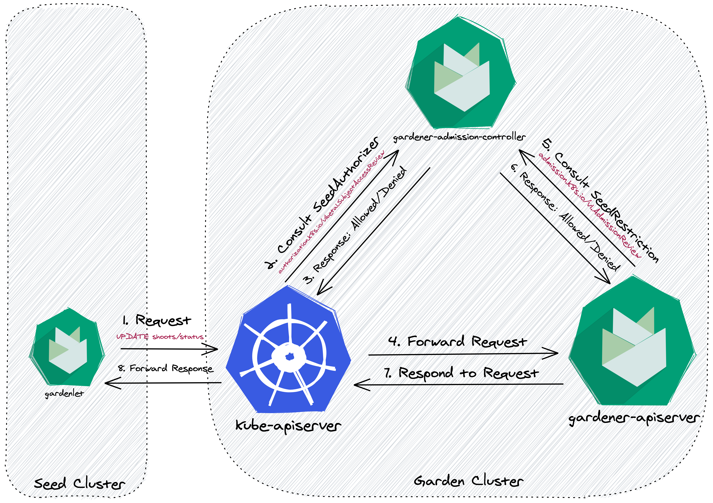
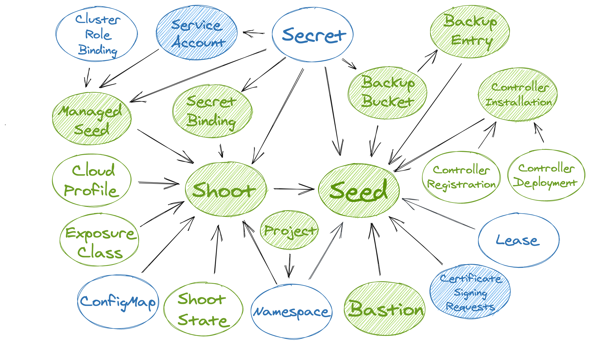

# Scoped API Access for Gardenlets

By default, `gardenlet`s have administrative access in the garden cluster.
They are able to execute any API request on any object independent of whether the object is related to the seed cluster the `gardenlet` is responsible fto.
As RBAC is not powerful enough for fine-grained checks and for the sake of security, Gardener provides two optional but recommended configurations for your environments that scope the API access for `gardenlet`s.

Similar to the [`Node` authorization mode in Kubernetes](https://kubernetes.io/docs/reference/access-authn-authz/node/), Gardener features a `SeedAuthorizer` plugin.
It is a special-purpose authorization plugin that specifically authorizes API requests made by the `gardenlet`s.

Likewise, similar to the [`NodeRestriction` admission plugin in Kubernetes](https://kubernetes.io/docs/reference/access-authn-authz/admission-controllers/#noderestriction), Gardener features a `NodeRestriction` plugin.
It is a special-purpose admission plugin that specifically limits the Kubernetes objects `gardenlet`s can modify.

📚 You might be interested to look into the [design proposal for scoped Kubelet API access](https://github.com/kubernetes/community/blob/master/contributors/design-proposals/node/kubelet-authorizer.md) from the Kubernetes community.
It can be translated to Gardener and Gardenlets with their `Seed` and `Shoot` resources.

## Flow Diagram

The following diagram shows how the two plugins are included in the request flow of a `gardenlet`.
When they are not enabled then the `kube-apiserver` is internally authorizing the request via RBAC before forwarding the request directly to the `gardener-apiserver`, i.e., the `gardener-admission-controller` would not be consulted (this is not entirely correct because it also serves other admission webhook handlers, but for simplicity reasons this document focuses on the API access scope only).

When enabling the plugins, there is one additional step for each before the `gardener-apiserver` responds to the request. 



Please note that the example shows a request to an object (`Shoot`) residing in one of the API groups served by `gardener-apiserver`.
However, the `gardenlet` is also interacting with objects in API groups served by the `kube-apiserver` (e.g., `Secret`,`ConfigMap`, etc.).
In this case, the consultation of the `SeedRestriction` admission plugin is performed by the `kube-apiserver` itself before it forwards the request to the `gardener-apiserver`.

## `SeedAuthorizer` Authorization Webhook Enablement

The `SeedAuthorizer` is implemented as [Kubernetes authorization webhook](https://kubernetes.io/docs/reference/access-authn-authz/webhook/) and part of the [`gardener-admission-controller`](../concepts/admission-controller.md) component running in the garden cluster.

⚠️ This authorization plugin is still in development and should not be used yet.

### Implementation Details

Internally, the `SeedAuthorizer` uses a directed, acyclic graph data structure in order to efficiently respond to authorization requests for gardenlets:

* A vertex in this graph represents a Kubernetes resource with its kind, namespace, and name (e.g., `Shoot:garden-my-project/my-shoot`).
* An edge from vertex `u` to vertex `v` in this graph exists when (1) `v` is referred by `u` and `v` is a `Seed`, or when (2) `u` is referred by `v`.

For example, a `Shoot` refers to a `Seed`, a `CloudProfile`, a `SecretBinding`, etc., so it has an outgoing edge to the `Seed` (1) and incoming edges from the `CloudProfile` and `SecretBinding` vertices (2).



In above picture the resources that are actively watched have are shaded.
Gardener resources are green while Kubernetes resources are blue.
It shows the dependencies between the resources and how the graph is built based on above rules.

ℹ️ Above picture shows all resources that may be accessed by `gardenlet`s, except for the `Quota` resource which is only included for completeness.

Now, when a `gardenlet` wants to access certain resources then the `SeedAuthorizer` uses a Depth-First traversal starting from the vertex representing the resource in question, e.g., from a `Project` vertex.
If there is a path from the `Project` vertex to the vertex representing the `Seed` the gardenlet is responsible for then it allows the request.

#### Metrics

The `SeedAuthorizer` registers the following metrics related to the mentioned graph implementation:

| Metric | Description |
| --- | --- |
| `gardener_admission_controller_seed_authorizer_graph_update_duration_seconds` | Histogram of duration of resource dependency graph updates in seed authorizer, i.e., how long does it take to update the graph's vertices/edges when a resource is created, changed, or deleted. |
| `gardener_admission_controller_seed_authorizer_graph_path_check_duration_seconds` | Histogram of duration of checks whether a path exists in the resource dependency graph in seed authorizer. |

#### Debug Handler

When the `.server.enableDebugHandlers` field in the `gardener-admission-controller`'s component configuration is set to `true` then it serves a handler that can be used for debugging the resource dependency graph under `/debug/resource-dependency-graph`.

The handler renders an HTML page displaying the current graph with a list of vertices and its associated incoming and outgoing edges to other vertices.
Depending on the size of the Gardener landscape (and consequently, the size of the graph), it might not be possible to render it in its entirety.
If there are more than 2000 vertices then the default filtering will selected for `kind=Seed` to prevent overloading the output.

_Example output_:

```text
-------------------------------------------------------------------------------
|
| # Seed:my-seed
|   -> (11)
|     BackupBucket:73972fe2-3d7e-4f61-a406-b8f9e670e6b7
|     BackupEntry:garden-my-project/shoot--dev--my-shoot--4656a460-1a69-4f00-9372-7452cbd38ee3
|     ControllerInstallation:dns-external-mxt8m
|     ControllerInstallation:extension-shoot-cert-service-4qw5j
|     ControllerInstallation:networking-calico-bgrb2
|     ControllerInstallation:os-gardenlinux-qvb5z
|     ControllerInstallation:provider-gcp-w4mvf
|     Secret:garden/backup
|     Shoot:garden-my-project/my-shoot
|
-------------------------------------------------------------------------------
|
| # Shoot:garden-my-project/my-shoot
|   <- (1)
|     Seed:my-seed
|   -> (5)
|     CloudProfile:gcp
|     Namespace:garden-my-project
|     Secret:garden-my-project/my-dns-secret
|     SecretBinding:garden-my-project/my-credentials
|     ShootState:garden-my-project/my-shoot
|
-------------------------------------------------------------------------------
|
| # ShootState:garden-my-project/my-shoot
|   <- (1)
|     Shoot:garden-my-project/my-shoot
|
-------------------------------------------------------------------------------

... (etc., similarly for the other resources)
```

There are anchor links to easily jump from one resource to another, and the page provides means for filtering the results based on the `kind`, `namespace`, and/or `name`.

#### Pitfalls

When there is a relevant update to an existing resource, i.e., when a reference to another resource is changed, then the corresponding vertex (along with all associated edges) is first deleted from the graph before it gets added again with the up-to-date edges.
However, this does only work for vertices belonging to resources that are only created in exactly one "watch handler".
For example, the vertex for a `SecretBinding` can either be created in the `SecretBinding` handler itself or in the `Shoot` handler.
In such cases, deleting the vertex before (re-)computing the edges might lead to race conditions and potentially render the graph invalid.
Consequently, instead of deleting the vertex, only the edges the respective handler is responsible for are deleted.

## `SeedRestriction` Admission Webhook Enablement

The `SeedRestriction` is implemented as [Kubernetes admission webhook](https://kubernetes.io/docs/reference/access-authn-authz/extensible-admission-controllers/) and part of the [`gardener-admission-controller`](../concepts/admission-controller.md) component running in the garden cluster.

⚠️ This admission plugin is still in development and should not be used yet.
