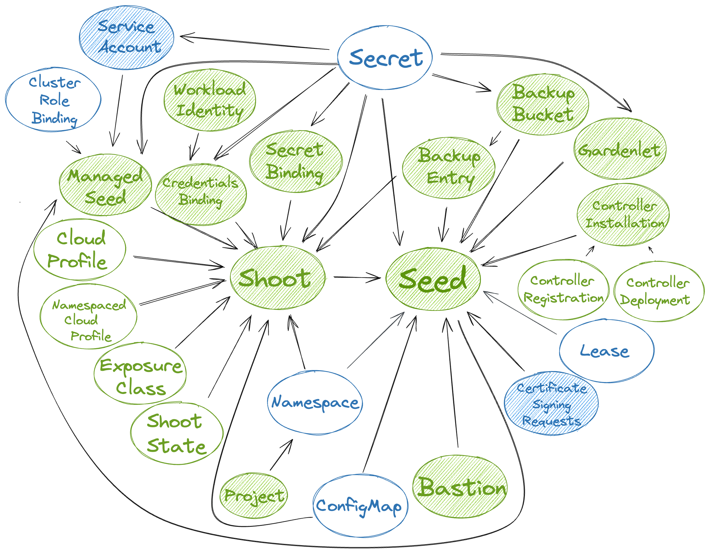

# Scoped API Access for gardenlets and Extensions

By default, `gardenlet`s have administrative access in the garden cluster.
They are able to execute any API request on any object independent of whether the object is related to the seed cluster the `gardenlet` is responsible for.
As RBAC is not powerful enough for fine-grained checks and for the sake of security, Gardener provides two optional but recommended configurations for your environments that scope the API access for `gardenlet`s.

Similar to the [`Node` authorization mode in Kubernetes](https://kubernetes.io/docs/reference/access-authn-authz/node/), Gardener features a `SeedAuthorizer` plugin.
It is a special-purpose authorization plugin that specifically authorizes API requests made by the `gardenlet`s.

Likewise, similar to the [`NodeRestriction` admission plugin in Kubernetes](https://kubernetes.io/docs/reference/access-authn-authz/admission-controllers/#noderestriction), Gardener features a `SeedRestriction` plugin.
It is a special-purpose admission plugin that specifically limits the Kubernetes objects `gardenlet`s can modify.

📚 You might be interested to look into the [design proposal for scoped Kubelet API access](https://github.com/kubernetes/design-proposals-archive/blob/main/node/kubelet-authorizer.md) from the Kubernetes community.
It can be translated to Gardener and Gardenlets with their `Seed` and `Shoot` resources.

Historically, `gardenlet` has been the only component running in the seed cluster that has access to both the seed cluster and the garden cluster.
Starting from Gardener [`v1.74.0`](https://github.com/gardener/gardener/releases/v1.74.0), extensions running on seed clusters can also get [access to the garden cluster](../extensions/garden-api-access.md) using a token for a dedicated ServiceAccount.
Extensions using this mechanism only get permission to read global resources like `CloudProfiles` (this is granted to all authenticated users) unless the plugins described in this document are enabled.

Generally, the plugins handle extension clients exactly like gardenlet clients with some minor [exceptions](#rule-exceptions-for-extension-clients).
Extension clients in the sense of the plugins are clients authenticated as a `ServiceAccount` with the `extension-` name prefix in a `seed-` namespace of the garden cluster.
Other `ServiceAccounts` are not considered as seed clients, not handled by the plugins, and only get the described read access to global resources.

## Flow Diagram

The following diagram shows how the two plugins are included in the request flow of a `gardenlet`.
When they are not enabled, then the `kube-apiserver` is internally authorizing the request via RBAC before forwarding the request directly to the `gardener-apiserver`, i.e., the `gardener-admission-controller` would not be consulted (this is not entirely correct because it also serves other admission webhook handlers, but for simplicity reasons this document focuses on the API access scope only).

When enabling the plugins, there is one additional step for each before the `gardener-apiserver` responds to the request.


Please note that the example shows a request to an object (`Shoot`) residing in one of the API groups served by `gardener-apiserver`.
However, the `gardenlet` is also interacting with objects in API groups served by the `kube-apiserver` (e.g., `Secret`,`ConfigMap`).
In this case, the consultation of the `SeedRestriction` admission plugin is performed by the `kube-apiserver` itself before it forwards the request to the `gardener-apiserver`.

## Implemented Rules

Today, the following rules are implemented:

| Resource                    | Verbs                                                           | Path(s)                                                                                                                                                                              | Description                                                                                                                                                                                                                                                                      |
|-----------------------------|-----------------------------------------------------------------|--------------------------------------------------------------------------------------------------------------------------------------------------------------------------------------|----------------------------------------------------------------------------------------------------------------------------------------------------------------------------------------------------------------------------------------------------------------------------------|
| `BackupBucket`              | `get`, `list`, `watch`, `create`, `update`, `patch`, `delete`   | `BackupBucket` -> `Seed`                                                                                                                                                             | Allow `get`, `list`, `watch` requests for all `BackupBucket`s. Allow only `create`, `update`, `patch`, `delete` requests for `BackupBucket`s assigned to the `gardenlet`'s `Seed`.                                                                                               |
| `BackupEntry`               | `get`, `list`, `watch`, `create`, `update`, `patch`             | `BackupEntry` -> `Seed`                                                                                                                                                              | Allow `get`, `list`, `watch` requests for all `BackupEntry`s. Allow only `create`, `update`, `patch` requests for `BackupEntry`s assigned to the `gardenlet`'s `Seed` and referencing `BackupBucket`s assigned to the `gardenlet`'s `Seed`.                                      |
| `Bastion`                   | `get`, `list`, `watch`, `create`, `update`, `patch`             | `Bastion` -> `Seed`                                                                                                                                                                  | Allow `get`, `list`, `watch` requests for all `Bastion`s. Allow only `create`, `update`, `patch` requests for `Bastion`s assigned to the `gardenlet`'s `Seed`.                                                                                                                   |
| `CertificateSigningRequest` | `get`, `create`                                                 | `CertificateSigningRequest` -> `Seed`                                                                                                                                                | Allow only `get`, `create` requests for `CertificateSigningRequest`s related to the `gardenlet`'s `Seed`.                                                                                                                                                                        |
| `CloudProfile`              | `get`                                                           | `CloudProfile` -> `Shoot` -> `Seed`                                                                                                                                                  | Allow only `get` requests for `CloudProfile`s referenced by `Shoot`s that are assigned to the `gardenlet`'s `Seed`.                                                                                                                                                              |
| `ClusterRoleBinding`        | `create`, `get`, `update`, `patch`, `delete`                    | `ClusterRoleBinding` -> `ManagedSeed` -> `Shoot` -> `Seed`                                                                                                                           | Allow `create`, `get`, `update`, `patch` requests for `ManagedSeed`s in the bootstrapping phase assigned to the gardenlet's `Seed`s. Allow `delete` requests from gardenlets bootstrapped via `ManagedSeed`s.                                                                    |
| `ConfigMap`                 | `get`                                                           | `ConfigMap` -> `Seed`, `ConfigMap` -> `Shoot` -> `Seed`                                                                                                                              | Allow only `get` requests for `ConfigMap`s referenced by `Seed`s, or `Shoot`s that are assigned to the `gardenlet`'s `Seed`. Allow reading the `kube-system/cluster-identity` `ConfigMap`.                                                                                      |
| `ControllerRegistration`    | `get`, `list`, `watch`                                          | `ControllerRegistration` -> `ControllerInstallation` -> `Seed`                                                                                                                       | Allow `get`, `list`, `watch` requests for all `ControllerRegistration`s.                                                                                                                                                                                                         |
| `ControllerDeployment`      | `get`                                                           | `ControllerDeployment` -> `ControllerInstallation` -> `Seed`                                                                                                                         | Allow `get` requests for `ControllerDeployments`s referenced by `ControllerInstallation`s assigned to the `gardenlet`'s `Seed`.                                                                                                                                                  |
| `ControllerInstallation`    | `get`, `list`, `watch`, `update`, `patch`                       | `ControllerInstallation` -> `Seed`                                                                                                                                                   | Allow `get`, `list`, `watch` requests for all `ControllerInstallation`s. Allow only `update`, `patch` requests for `ControllerInstallation`s assigned to the `gardenlet`'s `Seed`.                                                                                               |
| `CredentialsBinding`        | `get`                                                           | `CredentialsBinding` -> `Shoot` -> `Seed`                                                                                                                                            | Allow only `get` requests for `CredentialsBinding`s referenced by `Shoot`s that are assigned to the `gardenlet`'s `Seed`.                                                                                                                                                        |
| `Event`                     | `create`, `patch`                                               | none                                                                                                                                                                                 | Allow to `create` or `patch` all kinds of `Event`s.                                                                                                                                                                                                                              |
| `ExposureClass`             | `get`                                                           | `ExposureClass` -> `Shoot` -> `Seed`                                                                                                                                                 | Allow `get` requests for `ExposureClass`es referenced by `Shoot`s that are assigned to the `gardenlet`'s `Seed`. Deny `get` requests to other `ExposureClass`es.                                                                                                                 |
| `Gardenlet`                 | `get`, `list`, `watch`, `update`, `patch`, `create`             | `Gardenlet` -> `Seed`                                                                                                                                                                | Allow `get`, `list`, `watch` requests for all `Gardenlet`s. Allow only `create`, `update`, and `patch` requests for `Gardenlet`s belonging to the `gardenlet`'s `Seed`.                                                                                                          |
| `Lease`                     | `create`, `get`, `watch`, `update`                              | `Lease` -> `Seed`                                                                                                                                                                    | Allow `create`, `get`, `update`, and `delete` requests for `Lease`s of the `gardenlet`'s `Seed`.                                                                                                                                                                                 |
| `ManagedSeed`               | `get`, `list`, `watch`, `update`, `patch`                       | `ManagedSeed` -> `Shoot` -> `Seed`                                                                                                                                                   | Allow `get`, `list`, `watch` requests for all `ManagedSeed`s. Allow only `update`, `patch` requests for `ManagedSeed`s referencing a `Shoot` assigned to the `gardenlet`'s `Seed`.                                                                                               |
| `Namespace`                 | `get`                                                           | `Namespace` -> `Shoot` -> `Seed`                                                                                                                                                     | Allow `get` requests for `Namespace`s of `Shoot`s that are assigned to the `gardenlet`'s `Seed`. Always allow `get` requests for the `garden` `Namespace`.                                                                                                                       |
| `NamespacedCloudProfile`    | `get`                                                           | `NamespacedCloudProfile` -> `Shoot` -> `Seed`                                                                                                                                        | Allow only `get` requests for `NamespacedCloudProfile`s referenced by `Shoot`s that are assigned to the `gardenlet`'s `Seed`.                                                                                                                                                    |
| `Project`                   | `get`                                                           | `Project` -> `Namespace` -> `Shoot` -> `Seed`                                                                                                                                        | Allow `get` requests for `Project`s referenced by the `Namespace` of `Shoot`s that are assigned to the `gardenlet`'s `Seed`.                                                                                                                                                     |
| `SecretBinding`             | `get`                                                           | `SecretBinding` -> `Shoot` -> `Seed`                                                                                                                                                 | Allow only `get` requests for `SecretBinding`s referenced by `Shoot`s that are assigned to the `gardenlet`'s `Seed`.                                                                                                                                                             |
| `Secret`                    | `create`, `get`, `update`, `patch`, `delete`(, `list`, `watch`) | `Secret` -> `Seed`, `Secret` -> `Shoot` -> `Seed`, `Secret` -> `SecretBinding` -> `Shoot` -> `Seed`, `Secret` -> `CredentialsBinding` -> `Shoot` -> `Seed`, `BackupBucket` -> `Seed` | Allow `get`, `list`, `watch` requests for all `Secret`s in the `seed-<name>` namespace. Allow only `create`, `get`, `update`, `patch`, `delete` requests for the `Secret`s related to resources assigned to the `gardenlet`'s `Seed`s.                                           |
| `Seed`                      | `get`, `list`, `watch`, `create`, `update`, `patch`, `delete`   | `Seed`                                                                                                                                                                               | Allow `get`, `list`, `watch` requests for all `Seed`s. Allow only `create`, `update`, `patch`, `delete` requests for the `gardenlet`'s `Seed`s. [1]                                                                                                                              |
| `ServiceAccount`            | `create`, `get`, `update`, `patch`, `delete`                    | `ServiceAccount` -> `ManagedSeed` -> `Shoot` -> `Seed`, `ServiceAccount` -> `Namespace` -> `Seed`                                                                                    | Allow `create`, `get`, `update`, `patch` requests for `ManagedSeed`s in the bootstrapping phase assigned to the `gardenlet`'s `Seed`s. Allow `delete` requests from gardenlets bootstrapped via `ManagedSeed`s. Allow all verbs on `ServiceAccount`s in seed-specific namespace. |
| `Shoot`                     | `get`, `list`, `watch`, `update`, `patch`                       | `Shoot` -> `Seed`                                                                                                                                                                    | Allow `get`, `list`, `watch` requests for all `Shoot`s. Allow only `update`, `patch` requests for `Shoot`s assigned to the `gardenlet`'s `Seed`.                                                                                                                                 |
| `ShootState`                | `get`, `create`, `update`, `patch`                              | `ShootState` -> `Shoot` -> `Seed`                                                                                                                                                    | Allow only `get`, `create`, `update`, `patch` requests for `ShootState`s belonging by `Shoot`s that are assigned to the `gardenlet`'s `Seed`.                                                                                                                                    |
| `WorkloadIdentity`          | `get`                                                           | `WorkloadIdentity` -> `CredentialsBinding` -> `Shoot` -> `Seed`                                                                                                                      | Allow only `get` requests for `WorkloadIdentities` referenced by `CredentialsBinding`s referenced by `Shoot`s that are assigned to the `gardenlet`'s `Seed`.                                                                                                                     |

> [1] If you use `ManagedSeed` resources then the `gardenlet` reconciling them ("parent `gardenlet`") may be allowed to submit certain requests for the `Seed` resources resulting out of such `ManagedSeed` reconciliations (even if the "parent `gardenlet`" is not responsible for them):

ℹ️ It is allowed to delete the `Seed` resources if the corresponding `ManagedSeed` objects already have a `deletionTimestamp` (this is secure as `gardenlet`s themselves don't have permissions for deleting `ManagedSeed`s).

### Rule Exceptions for Extension Clients

Extension clients are allowed to perform the same operations as gardenlet clients with the following exceptions:

- Extension clients are granted the read-only subset of verbs for `CertificateSigningRequests`, `ClusterRoleBindings`, and `ServiceAccounts` (to prevent privilege escalation).
- Extension clients are granted full access to `Lease` objects but only in the seed-specific namespace.

When the need arises, more exceptions might be added to the access rules for resources that are already handled by the plugins.
E.g., if an extension needs to populate additional shoot-specific `InternalSecrets`, according handling can be introduced.
Permissions for resources that are not handled by the plugins can be granted using additional RBAC rules (independent of the plugins).

## `SeedAuthorizer` Authorization Webhook Enablement

The `SeedAuthorizer` is implemented as a [Kubernetes authorization webhook](https://kubernetes.io/docs/reference/access-authn-authz/webhook/) and part of the [`gardener-admission-controller`](../concepts/admission-controller.md) component running in the garden cluster.

🎛 In order to activate it, you have to follow these steps:

1. Set the following flags for the `kube-apiserver` of the garden cluster (i.e., the `kube-apiserver` whose API is extended by Gardener):
   - `--authorization-mode=RBAC,Node,Webhook` (please note that `Webhook` should appear after `RBAC` in the list [1]; `Node` might not be needed if you use a virtual garden cluster)
   - `--authorization-webhook-config-file=<path-to-the-webhook-config-file>`
   - `--authorization-webhook-cache-authorized-ttl=0`
   - `--authorization-webhook-cache-unauthorized-ttl=0`

2. The webhook config file (stored at `<path-to-the-webhook-config-file>`) should look as follows:
   ```yaml
   apiVersion: v1
   kind: Config
   clusters:
   - name: garden
     cluster:
       certificate-authority-data: base64(CA-CERT-OF-GARDENER-ADMISSION-CONTROLLER)
       server: https://gardener-admission-controller.garden/webhooks/auth/seed
   users:
   - name: kube-apiserver
     user: {}
   contexts:
   - name: auth-webhook
     context:
       cluster: garden
       user: kube-apiserver
   current-context: auth-webhook
   ```

3. When deploying the [Gardener `controlplane` Helm chart](../../charts/gardener/controlplane), set `.global.rbac.seedAuthorizer.enabled=true`. This will ensure that the RBAC resources granting global access for all `gardenlet`s will be deployed.

4. Delete the existing RBAC resources granting global access for all `gardenlet`s by running:
   ```bash
   kubectl delete \
     clusterrole.rbac.authorization.k8s.io/gardener.cloud:system:seeds \
     clusterrolebinding.rbac.authorization.k8s.io/gardener.cloud:system:seeds \
     --ignore-not-found
   ```

Please note that you should activate the [`SeedRestriction`](#seedrestriction-admission-webhook-enablement) admission handler as well.

> [1] The reason for the fact that `Webhook` authorization plugin should appear after `RBAC` is that the `kube-apiserver` will be depending on the `gardener-admission-controller` (serving the webhook). However, the `gardener-admission-controller` can only start when `gardener-apiserver` runs, but `gardener-apiserver` itself can only start when `kube-apiserver` runs. If `Webhook` is before `RBAC`, then `gardener-apiserver` might not be able to start, leading to a deadlock.

### Authorizer Decisions

As mentioned earlier, it's the authorizer's job to evaluate API requests and return one of the following decisions:

- `DecisionAllow`: The request is allowed, further configured authorizers won't be consulted.
- `DecisionDeny`: The request is denied, further configured authorizers won't be consulted.
- `DecisionNoOpinion`: A decision cannot be made, further configured authorizers will be consulted.

For backwards compatibility, no requests are denied at the moment, so that they are still deferred to a subsequent authorizer like RBAC.
Though, this might change in the future.

First, the `SeedAuthorizer` extracts the `Seed` name from the API request.
This step considers the following two cases:

1. If the authenticated user belongs to the `gardener.cloud:system:seeds` group, it is considered a gardenlet client.
   - This requires a proper TLS certificate that the `gardenlet` uses to contact the API server and is automatically given if [TLS bootstrapping](../concepts/gardenlet.md#TLS-Bootstrapping) is used.
   - The authorizer extracts the seed name from the username by stripping the `gardener.cloud:system:seed:` prefix.
   - In cases where this information is missing e.g., when a custom Kubeconfig is used, the authorizer cannot make any decision. Thus, RBAC is still a considerable option to restrict the `gardenlet`'s access permission if the above explained preconditions are not given.
2. If the authenticated user belongs to the `system:serviceaccounts` group, it is considered an extension client under the following conditions:
   - The `ServiceAccount` must be located in a `seed-` namespace. I.e., the user has to belong to a group with the `system:serviceaccounts:seed-` prefix. The seed name is extracted from this group by stripping the prefix.
   - The `ServiceAccount` must have the `extension-` prefix. I.e., the username must have the `system:serviceaccount:seed-<seed-name>:extension-` prefix.

With the `Seed` name at hand, the authorizer checks for an **existing path** from the resource that a request is being made for to the `Seed` belonging to the `gardenlet`/extension.
Take a look at the [Implementation Details](#implementation-details) section for more information.

### Implementation Details

Internally, the `SeedAuthorizer` uses a directed, acyclic graph data structure in order to efficiently respond to authorization requests for `gardenlet`s/extensions:

* A vertex in this graph represents a Kubernetes resource with its kind, namespace, and name (e.g., `Shoot:garden-my-project/my-shoot`).
* An edge from vertex `u` to vertex `v` in this graph exists when
  * (1) `v` is referred by `u` and `v` is a `Seed`, or when
  * (2) `u` is referred by `v`, or when
  * (3) `u` is strictly associated with `v`.

For example, a `Shoot` refers to a `Seed`, a `CloudProfile`, a `SecretBinding`, etc., so it has an outgoing edge to the `Seed` (1) and incoming edges from the `CloudProfile` and `SecretBinding` vertices (2).
However, there might also be a `ShootState` or a `BackupEntry` resource strictly associated with this `Shoot`, hence, it has incoming edges from these vertices (3).



In the above picture, the resources that are actively watched are shaded.
Gardener resources are green, while Kubernetes resources are blue.
It shows the dependencies between the resources and how the graph is built based on the above rules.

ℹ️ The above picture shows all resources that may be accessed by `gardenlet`s/extensions, except for the `Quota` resource which is only included for completeness.

Now, when a `gardenlet`/extension wants to access certain resources, then the `SeedAuthorizer` uses a Depth-First traversal starting from the vertex representing the resource in question, e.g., from a `Project` vertex.
If there is a path from the `Project` vertex to the vertex representing the `Seed` the `gardenlet`/extension is responsible for. then it allows the request.

#### Metrics

The `SeedAuthorizer` registers the following metrics related to the mentioned graph implementation:

| Metric | Description |
| --- | --- |
| `gardener_admission_controller_seed_authorizer_graph_update_duration_seconds` | Histogram of duration of resource dependency graph updates in seed authorizer, i.e., how long does it take to update the graph's vertices/edges when a resource is created, changed, or deleted. |
| `gardener_admission_controller_seed_authorizer_graph_path_check_duration_seconds` | Histogram of duration of checks whether a path exists in the resource dependency graph in seed authorizer. |

#### Debug Handler

When the `.server.enableDebugHandlers` field in the `gardener-admission-controller`'s component configuration is set to `true`, then it serves a handler that can be used for debugging the resource dependency graph under `/debug/resource-dependency-graph`.

🚨 Only use this setting for development purposes, as it enables unauthenticated users to view all data if they have access to the `gardener-admission-controller` component.

The handler renders an HTML page displaying the current graph with a list of vertices and its associated incoming and outgoing edges to other vertices.
Depending on the size of the Gardener landscape (and consequently, the size of the graph), it might not be possible to render it in its entirety.
If there are more than 2000 vertices, then the default filtering will selected for `kind=Seed` to prevent overloading the output.

_Example output_:

```text
-------------------------------------------------------------------------------
|
| # Seed:my-seed
|   <- (11)
|     BackupBucket:73972fe2-3d7e-4f61-a406-b8f9e670e6b7
|     BackupEntry:garden-my-project/shoot--dev--my-shoot--4656a460-1a69-4f00-9372-7452cbd38ee3
|     ControllerInstallation:dns-external-mxt8m
|     ControllerInstallation:extension-shoot-cert-service-4qw5j
|     ControllerInstallation:networking-calico-bgrb2
|     ControllerInstallation:os-gardenlinux-qvb5z
|     ControllerInstallation:provider-gcp-w4mvf
|     Secret:garden/backup
|     Shoot:garden-my-project/my-shoot
|
-------------------------------------------------------------------------------
|
| # Shoot:garden-my-project/my-shoot
|   <- (5)
|     CloudProfile:gcp
|     Namespace:garden-my-project
|     Secret:garden-my-project/my-dns-secret
|     SecretBinding:garden-my-project/my-credentials
|     ShootState:garden-my-project/my-shoot
|   -> (1)
|     Seed:my-seed
|
-------------------------------------------------------------------------------
|
| # ShootState:garden-my-project/my-shoot
|   -> (1)
|     Shoot:garden-my-project/my-shoot
|
-------------------------------------------------------------------------------

... (etc., similarly for the other resources)
```

There are anchor links to easily jump from one resource to another, and the page provides means for filtering the results based on the `kind`, `namespace`, and/or `name`.

#### Pitfalls

When there is a relevant update to an existing resource, i.e., when a reference to another resource is changed, then the corresponding vertex (along with all associated edges) is first deleted from the graph before it gets added again with the up-to-date edges.
However, this does only work for vertices belonging to resources that are only created in exactly one "watch handler".
For example, the vertex for a `SecretBinding` can either be created in the `SecretBinding` handler itself or in the `Shoot` handler.
In such cases, deleting the vertex before (re-)computing the edges might lead to race conditions and potentially renders the graph invalid.
Consequently, instead of deleting the vertex, only the edges the respective handler is responsible for are deleted.
If the vertex ends up with no remaining edges, then it also gets deleted automatically.
Afterwards, the vertex can either be added again or the updated edges can be created.

## `SeedRestriction` Admission Webhook Enablement

The `SeedRestriction` is implemented as [Kubernetes admission webhook](https://kubernetes.io/docs/reference/access-authn-authz/extensible-admission-controllers/) and part of the [`gardener-admission-controller`](../concepts/admission-controller.md) component running in the garden cluster.

🎛 In order to activate it, you have to set `.global.admission.seedRestriction.enabled=true` when using the [Gardener `controlplane` Helm chart](../../charts/gardener/controlplane).
This will add an additional webhook in the existing `ValidatingWebhookConfiguration` of the `gardener-admission-controller` which contains the configuration for the `SeedRestriction` handler.
Please note that it should only be activated when the `SeedAuthorizer` is active as well.

### Admission Decisions

The admission's purpose is to perform extended validation on requests which require the body of the object in question.
Additionally, it handles `CREATE` requests of `gardenlet`s/extensions (the above discussed resource dependency graph cannot be used in such cases because there won't be any vertex/edge for non-existing resources).

Gardenlets/extensions are restricted to only create new resources which are somehow related to the seed clusters they are responsible for.
