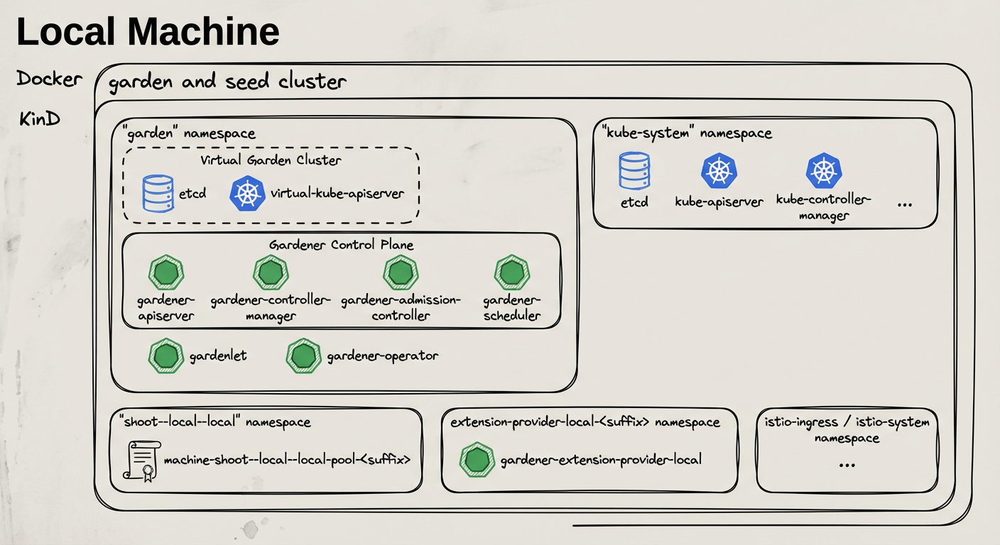

# Deploying Gardener Locally

This document will walk you through deploying Gardener on your local machine.
If you encounter difficulties, please open an issue so that we can make this process easier.

## Overview

Gardener runs in any Kubernetes cluster.
In this guide, we will start a [KinD](https://kind.sigs.k8s.io/) cluster which is used as both garden and seed cluster (please refer to the [architecture overview](../concepts/architecture.md)) for simplicity.

Based on [Skaffold](https://skaffold.dev/), the container images for all required components will be built and deployed into the cluster (via their [Helm charts](https://helm.sh/)).



## Alternatives

When deploying Gardener on your local machine you might face several limitations:

- Your machine doesn't have enough compute resources (see [prerequisites](#prerequisites)) for hosting a second seed cluster or multiple shoot clusters.
- Testing Gardener's [IPv6 features](../development/ipv6.md) requires a Linux machine and native IPv6 connectivity to the internet, but you're on macOS or don't have IPv6 connectivity in your office environment or via your home ISP.

In these cases, you might want to check out one of the following options that run the setup described in this guide elsewhere for circumventing these limitations:

- [remote local setup](#remote-local-setup): deploy on a remote pod for more compute resources
- [dev box on Google Cloud](https://github.com/gardener-community/dev-box-gcp): deploy on a Google Cloud machine for more compute resource and/or simple IPv4/IPv6 dual-stack networking

## Prerequisites

- Make sure that you have followed the [Local Setup guide](../development/local_setup.md) up until the [Get the sources](../development/local_setup.md#get-the-sources) step.
- Make sure your Docker daemon is up-to-date, up and running and has enough resources (at least `8` CPUs and `8Gi` memory; see [here](https://docs.docker.com/desktop/mac/#resources) how to configure the resources for Docker for Mac).
  > Please note that 8 CPU / 8Gi memory might not be enough for more than two `Shoot` clusters, i.e., you might need to increase these values if you want to run additional `Shoot`s.
  > If you plan on following the optional steps to [create a second seed cluster](#optional-setting-up-a-second-seed-cluster), the required resources will be more - at least `10` CPUs and `18Gi` memory.
  Additionally, please configure at least `120Gi` of disk size for the Docker daemon.
  > Tip: You can clean up unused data with `docker system df` and `docker system prune -a`.

## Setting Up the KinD Cluster (Garden and Seed)

```bash
make kind-up
```

> If you want to setup an IPv6 KinD cluster, use `make kind-up IPFAMILY=ipv6` instead.

This command sets up a new KinD cluster named `gardener-local` and stores the kubeconfig in the `./example/gardener-local/kind/local/kubeconfig` file.

> It might be helpful to copy this file to `$HOME/.kube/config`, since you will need to target this KinD cluster multiple times.
Alternatively, make sure to set your `KUBECONFIG` environment variable to `./example/gardener-local/kind/local/kubeconfig` for all future steps via `export KUBECONFIG=$PWD/example/gardener-local/kind/local/kubeconfig`.

All following steps assume that you are using this kubeconfig.

Additionally, this command also deploys a local container registry to the cluster, as well as a few registry mirrors, that are set up as a pull-through cache for all upstream registries Gardener uses by default.
This is done to speed up image pulls across local clusters.

> You will need to add `127.0.0.1 garden.local.gardener.cloud` to your /etc/hosts.

The local registry can now be accessed either via `localhost:5001` or `garden.local.gardener.cloud:5001` for pushing and pulling.
The storage directories of the registries are mounted to the host machine under `dev/local-registry`.
With this, mirrored images don't have to be pulled again after recreating the cluster.

The command also deploys a default [calico](https://github.com/projectcalico/calico) installation as the cluster's CNI implementation with `NetworkPolicy` support (the default `kindnet` CNI doesn't provide `NetworkPolicy` support).
Furthermore, it deploys the [metrics-server](https://github.com/kubernetes-sigs/metrics-server) in order to support HPA and VPA on the seed cluster.

## Setting Up IPv6 Single-Stack Networking (optional)

First, ensure that your `/etc/hosts` file contains an entry resolving `garden.local.gardener.cloud` to the IPv6 loopback address:

```text
::1 garden.local.gardener.cloud
```

Typically, only `ip6-localhost` is mapped to `::1` on linux machines.
However, we need `garden.local.gardener.cloud` to resolve to both `127.0.0.1` and `::1` so that we can talk to our registry via a single address (`garden.local.gardener.cloud:5001`).

Next, we need to configure NAT for outgoing traffic from the kind network to the internet.
After executing `make kind-up IPFAMILY=ipv6`, execute the following command to set up the corresponding iptables rules:

```bash
ip6tables -t nat -A POSTROUTING -o $(ip route show default | awk '{print $5}') -s fd00:10::/64 -j MASQUERADE
```

## Setting Up Gardener

```bash
make gardener-up
```

> If you want to setup an IPv6 ready Gardener, use `make gardener-up IPFAMILY=ipv6` instead.

This will first build the base images (which might take a bit if you do it for the first time).
Afterwards, the Gardener resources will be deployed into the cluster.

## Developing Gardener

```bash
make gardener-dev
```

This is similar to `make gardener-up` but additionally starts a [skaffold dev loop](https://skaffold.dev/docs/workflows/dev/).
After the initial deployment, skaffold starts watching source files.
Once it has detected changes, press any key to trigger a new build and deployment of the changed components.

Tip: you can set the `SKAFFOLD_MODULE` environment variable to select specific modules of the skaffold configuration (see [`skaffold.yaml`](../../skaffold.yaml)) that skaffold should watch, build, and deploy.
This significantly reduces turnaround times during development.

For example, if you want to develop changes to gardenlet:

```bash
# initial deployment of all components
make gardener-up
# start iterating on gardenlet without deploying other components
make gardener-dev SKAFFOLD_MODULE=gardenlet
```

## Debugging Gardener

```bash
make gardener-debug
```

This is using skaffold debugging features. In the Gardener case, Go debugging using [Delve](https://github.com/go-delve/delve) is the most relevant use case.
Please see the [skaffold debugging documentation](https://skaffold.dev/docs/workflows/debug/) how to set up your IDE accordingly or check the examples below ([GoLand](#debugging-in-goland), [VS Code](#debugging-in-vs-code)).

`SKAFFOLD_MODULE` environment variable is working the same way as described for [Developing Gardener](#developing-gardener). However, skaffold is not watching for changes when debugging,
because it would like to avoid interrupting your debugging session.

For example, if you want to debug gardenlet:

```bash
# initial deployment of all components
make gardener-up
# start debugging gardenlet without deploying other components
make gardener-debug SKAFFOLD_MODULE=gardenlet
```

In debugging flow, skaffold builds your container images, reconfigures your pods and creates port forwardings for the `Delve` debugging ports to your localhost.
The default port is `56268`. If you debug multiple pods at the same time, the port of the second pod will be forwarded to `56269` and so on.
Please check your console output for the concrete port-forwarding on your machine.

> Note: Resuming or stopping only a single goroutine (Go Issue [25578](https://github.com/golang/go/issues/25578), [31132](https://github.com/golang/go/issues/31132)) is currently not supported, so the action will cause all the goroutines to get activated or paused.
([vscode-go wiki](https://github.com/golang/vscode-go/wiki/debugging#connecting-to-headless-delve-with-target-specified-at-server-start-up))

This means that when a goroutine of gardenlet (or any other gardener-core component you try to debug) is paused on a breakpoint, all the other goroutines are paused. Hence, when the whole gardenlet process is paused, it can not renew its lease and can not respond to the liveness and readiness probes. Skaffold automatically increases `timeoutSeconds` of liveness and readiness probes to 600. Anyway, we were facing problems when debugging that pods have been killed after a while.

Thus, leader election, health and readiness checks for `gardener-admission-controller`, `gardener-apiserver`, `gardener-controller-manager`, `gardener-scheduler`,`gardenlet` and `operator` are disabled when debugging.

If you have similar problems with other components which are not deployed by skaffold, you could temporarily turn off the leader election and disable liveness and readiness probes there too.

### Debugging in GoLand

1. Edit your **Run/Debug Configurations**.
2. Add a new **Go Remote** configuration.
3. Set the port to `56268` (or any increment of it when debugging multiple components).
4. _Recommended:_ Change the behavior of **On disconnect** to **Leave it running**.

### Debugging in VS Code

1. Create or edit your `.vscode/launch.json` configuration.
2. Add the following configuration:

```json5
{
  "name": "go remote",
  "type": "go",
  "request": "attach",
  "mode": "remote",
  "port": 56268, // or any increment of it when debugging multiple components
  "host": "127.0.0.1"
}
```

Since the [ko](https://skaffold.dev/docs/builders/builder-types/ko/) builder is used in Skaffold to build the images, it's not necessary to specify the `cwd` and `remotePath` options as they match the workspace folder ([ref](https://skaffold.dev/docs/workflows/debug/#skaffold-debug-using-the-vs-code-go-extension)).

## Creating a `Shoot` Cluster

You can wait for the `Seed` to be ready by running:

```bash
./hack/usage/wait-for.sh seed local GardenletReady SeedSystemComponentsHealthy ExtensionsReady
```

Alternatively, you can run `kubectl get seed local` and wait for the `STATUS` to indicate readiness:

```bash
NAME    STATUS   PROVIDER   REGION   AGE     VERSION       K8S VERSION
local   Ready    local      local    4m42s   vX.Y.Z-dev    v1.28.1
```

In order to create a first shoot cluster, just run:

```bash
kubectl apply -f example/provider-local/shoot.yaml
```

You can wait for the `Shoot` to be ready by running:

```bash
NAMESPACE=garden-local ./hack/usage/wait-for.sh shoot local APIServerAvailable ControlPlaneHealthy ObservabilityComponentsHealthy EveryNodeReady SystemComponentsHealthy
```

Alternatively, you can run `kubectl -n garden-local get shoot local` and wait for the `LAST OPERATION` to reach `100%`:

```bash
NAME    CLOUDPROFILE   PROVIDER   REGION   K8S VERSION   HIBERNATION   LAST OPERATION            STATUS    AGE
local   local          local      local   1.28.1        Awake         Create Processing (43%)   healthy   94s
```

If you don't need any worker pools, you can create a workerless `Shoot` by running:

```bash
kubectl apply -f example/provider-local/shoot-workerless.yaml
```

(Optional): You could also execute a simple e2e test (creating and deleting a shoot) by running:

```shell
make test-e2e-local-simple KUBECONFIG="$PWD/example/gardener-local/kind/local/kubeconfig"
```

### Accessing the `Shoot` Cluster

⚠️ Please note that in this setup, shoot clusters are not accessible by default when you download the kubeconfig and try to communicate with them.
The reason is that your host most probably cannot resolve the DNS names of the clusters since `provider-local` extension runs inside the KinD cluster (for more details, see [DNSRecord](../extensions/provider-local.md#dnsrecord)).
Hence, if you want to access the shoot cluster, you have to run the following command which will extend your `/etc/hosts` file with the required information to make the DNS names resolvable:

```bash
cat <<EOF | sudo tee -a /etc/hosts

# Begin of Gardener local setup section
# Shoot API server domains
172.18.255.1 api.local.local.external.local.gardener.cloud
172.18.255.1 api.local.local.internal.local.gardener.cloud

# Ingress
172.18.255.1 p-seed.ingress.local.seed.local.gardener.cloud
172.18.255.1 g-seed.ingress.local.seed.local.gardener.cloud
172.18.255.1 gu-local--local.ingress.local.seed.local.gardener.cloud
172.18.255.1 p-local--local.ingress.local.seed.local.gardener.cloud
172.18.255.1 v-local--local.ingress.local.seed.local.gardener.cloud

# E2e tests
172.18.255.1 api.e2e-managedseed.garden.external.local.gardener.cloud
172.18.255.1 api.e2e-managedseed.garden.internal.local.gardener.cloud
172.18.255.1 api.e2e-hib.local.external.local.gardener.cloud
172.18.255.1 api.e2e-hib.local.internal.local.gardener.cloud
172.18.255.1 api.e2e-hib-wl.local.external.local.gardener.cloud
172.18.255.1 api.e2e-hib-wl.local.internal.local.gardener.cloud
172.18.255.1 api.e2e-unpriv.local.external.local.gardener.cloud
172.18.255.1 api.e2e-unpriv.local.internal.local.gardener.cloud
172.18.255.1 api.e2e-wake-up.local.external.local.gardener.cloud
172.18.255.1 api.e2e-wake-up.local.internal.local.gardener.cloud
172.18.255.1 api.e2e-wake-up-wl.local.external.local.gardener.cloud
172.18.255.1 api.e2e-wake-up-wl.local.internal.local.gardener.cloud
172.18.255.1 api.e2e-wake-up-ncp.local.external.local.gardener.cloud
172.18.255.1 api.e2e-wake-up-ncp.local.internal.local.gardener.cloud
172.18.255.1 api.e2e-migrate.local.external.local.gardener.cloud
172.18.255.1 api.e2e-migrate.local.internal.local.gardener.cloud
172.18.255.1 api.e2e-migrate-wl.local.external.local.gardener.cloud
172.18.255.1 api.e2e-migrate-wl.local.internal.local.gardener.cloud
172.18.255.1 api.e2e-mgr-hib.local.external.local.gardener.cloud
172.18.255.1 api.e2e-mgr-hib.local.internal.local.gardener.cloud
172.18.255.1 api.e2e-rotate.local.external.local.gardener.cloud
172.18.255.1 api.e2e-rotate.local.internal.local.gardener.cloud
172.18.255.1 api.e2e-rotate-wl.local.external.local.gardener.cloud
172.18.255.1 api.e2e-rotate-wl.local.internal.local.gardener.cloud
172.18.255.1 api.e2e-rot-noroll.local.external.local.gardener.cloud
172.18.255.1 api.e2e-rot-noroll.local.internal.local.gardener.cloud
172.18.255.1 api.e2e-default.local.external.local.gardener.cloud
172.18.255.1 api.e2e-default.local.internal.local.gardener.cloud
172.18.255.1 api.e2e-default-wl.local.external.local.gardener.cloud
172.18.255.1 api.e2e-default-wl.local.internal.local.gardener.cloud
172.18.255.1 api.e2e-force-delete.local.external.local.gardener.cloud
172.18.255.1 api.e2e-force-delete.local.internal.local.gardener.cloud
172.18.255.1 api.e2e-fd-hib.local.external.local.gardener.cloud
172.18.255.1 api.e2e-fd-hib.local.internal.local.gardener.cloud
172.18.255.1 api.e2e-upd-node.local.external.local.gardener.cloud
172.18.255.1 api.e2e-upd-node.local.internal.local.gardener.cloud
172.18.255.1 api.e2e-upd-node-wl.local.external.local.gardener.cloud
172.18.255.1 api.e2e-upd-node-wl.local.internal.local.gardener.cloud
172.18.255.1 api.e2e-upgrade.local.external.local.gardener.cloud
172.18.255.1 api.e2e-upgrade.local.internal.local.gardener.cloud
172.18.255.1 api.e2e-upgrade-wl.local.external.local.gardener.cloud
172.18.255.1 api.e2e-upgrade-wl.local.internal.local.gardener.cloud
172.18.255.1 api.e2e-upg-hib.local.external.local.gardener.cloud
172.18.255.1 api.e2e-upg-hib.local.internal.local.gardener.cloud
172.18.255.1 api.e2e-upg-hib-wl.local.external.local.gardener.cloud
172.18.255.1 api.e2e-upg-hib-wl.local.internal.local.gardener.cloud
172.18.255.1 gu-local--e2e-rotate.ingress.local.seed.local.gardener.cloud
172.18.255.1 gu-local--e2e-rotate-wl.ingress.local.seed.local.gardener.cloud
172.18.255.1 gu-local--e2e-rot-noroll.ingress.local.seed.local.gardener.cloud
# End of Gardener local setup section
EOF
```

To access the `Shoot`, you can acquire a `kubeconfig` by using the [`shoots/adminkubeconfig` subresource](../usage/shoot/shoot_access.md#shootsadminkubeconfig-subresource).

For convenience a [helper script](../../hack/usage/generate-admin-kubeconf.sh) is provided in the `hack` directory. By default the script will generate a kubeconfig for a `Shoot` named "local" in the `garden-local` namespace valid for one hour.

```bash
./hack/usage/generate-admin-kubeconf.sh > admin-kubeconf.yaml
```

If you want to change the default namespace or shoot name, you can do so by passing different values as arguments.

```bash
./hack/usage/generate-admin-kubeconf.sh --namespace <namespace> --shoot-name <shootname> > admin-kubeconf.yaml
```

To access an Ingress resource from the `Seed`, use the Ingress host with port `8448` (`https://<ingress-host>:8448`, for example `https://gu-local--local.ingress.local.seed.local.gardener.cloud:8448`).

## (Optional): Setting Up a Second Seed Cluster

There are cases where you would want to create a second seed cluster in your local setup.
For example, if you want to test the [control plane migration](../operations/control_plane_migration.md) feature.
The following steps describe how to do that.

Start by setting up the second KinD cluster:

```bash
make kind2-up
```

This command sets up a new KinD cluster named `gardener-local2` and stores its kubeconfig in the `./example/gardener-local/kind/local2/kubeconfig` file.
It adds another IP address (`172.18.255.2`) to your loopback device which is necessary for you to reach the new cluster locally.

In order to deploy required resources in the KinD cluster that you just created, run:

```bash
make gardenlet-kind2-up
```

The following steps assume that you are using the kubeconfig that points to the `gardener-local` cluster (first KinD cluster): `export KUBECONFIG=$PWD/example/gardener-local/kind/local/kubeconfig`.

You can wait for the `local2` `Seed` to be ready by running:

```bash
./hack/usage/wait-for.sh seed local2 GardenletReady SeedSystemComponentsHealthy ExtensionsReady
```

Alternatively, you can run `kubectl get seed local2` and wait for the `STATUS` to indicate readiness:

```bash
NAME    STATUS   PROVIDER   REGION   AGE     VERSION       K8S VERSION
local2  Ready    local      local    4m42s   vX.Y.Z-dev    v1.25.1
```

If you want to perform control plane migration, you can follow the steps outlined in [Control Plane Migration](../operations/control_plane_migration.md) to migrate the shoot cluster to the second seed you just created.

## Deleting the `Shoot` Cluster

```shell
./hack/usage/delete shoot local garden-local
```

## (Optional): Tear Down the Second Seed Cluster

``` shell
make kind2-down
```

On macOS, if you want to remove the additional IP address on your loopback device run the following script:

```shell
sudo ip addr del 172.18.255.2 dev lo0
```

## Tear Down the Gardener Environment

```shell
make kind-down
```

## Alternative Way to Set Up Garden and Seed Leveraging `gardener-operator`

Instead of starting Garden and Seed via `make kind-up gardener-up`, you can also use `gardener-operator` to create your local dev landscape.
In this setup, the virtual garden cluster has its own load balancer, so you have to create an own DNS entry in your `/etc/hosts`:

```shell
cat <<EOF | sudo tee -a /etc/hosts

# Begin of Gardener Operator local setup section
172.18.255.3 api.virtual-garden.local.gardener.cloud
172.18.255.3 plutono-garden.ingress.runtime-garden.local.gardener.cloud
# End of Gardener Operator local setup section
EOF
```

You can bring up `gardener-operator` with this command:

```shell
make kind-operator-up operator-up
```

Afterwards, you can create your local `Garden` and install `gardenlet` into the KinD cluster with this command:

```shell
make operator-seed-up
```

You find the kubeconfig for the KinD cluster at `./example/gardener-local/kind/operator/kubeconfig`.
The one for the virtual garden is accessible at `./example/operator/virtual-garden/kubeconfig`.

> [!IMPORTANT]
> When you create non-HA shoot clusters (i.e., `Shoot`s with `.spec.controlPlane.highAvailability.failureTolerance != zone`), then they are not exposed via `172.18.255.1` ([ref](#accessing-the-shoot-cluster)).
> Instead, you need to find out under which Istio instance they got exposed, and put the corresponding IP address into your `/etc/hosts` file:
> ```shell
> # replace <shoot-namespace> with your shoot namespace (e.g., `shoot--foo--bar`):
> kubectl -n "$(kubectl -n <shoot-namespace> get gateway kube-apiserver -o jsonpath={.spec.selector.istio} | sed 's/.*--/istio-ingress--/')" get svc istio-ingressgateway -o jsonpath={.status.loadBalancer.ingress..ip}
> ```
> When the shoot cluster is HA (i.e., `.spec.controlPlane.highAvailability.failureTolerance == zone`), then you can access it via `172.18.255.1`.

Similar as in the section _[Developing Gardener](#developing-gardener)_ it's possible to run a [Skaffold development loop](https://skaffold.dev/docs/workflows/dev/) as well using:
```shell
make operator-seed-dev
```

> :information_source: Please note that in this setup Skaffold is only watching for changes in the following components:
> - [`gardenlet`](../concepts/gardenlet.md)
> - `gardenlet/chart`
> - [`gardener-resource-manager`](../concepts/resource-manager.md)
> - [`gardener-node-agent`](../concepts/node-agent.md)

Finally, please use this command to tear down your environment:

```shell
make kind-operator-down
```

This setup supports creating shoots and managed seeds the same way as explained in the previous chapters.
However, the development loop has limitations and the debugging setup is not working yet.

## Remote Local Setup

Just like Prow is executing the KinD-based e2e tests in a K8s pod, it is
possible to interactively run this KinD based Gardener development environment,
aka "local setup", in a "remote" K8s pod.

```shell
k apply -f docs/deployment/content/remote-local-setup.yaml
k exec -it remote-local-setup-0 -- sh

tmux a
```

### Caveats

Please refer to the [TMUX documentation](https://github.com/tmux/tmux/wiki) for
working effectively inside the remote-local-setup pod.

To access Plutono, Prometheus or other components in a browser, two port forwards are needed:

The port forward from the laptop to the pod:

```shell
k port-forward remote-local-setup-0 3000
```

The port forward in the remote-local-setup pod to the respective component:

```shell
k port-forward -n shoot--local--local deployment/plutono 3000
```

## Related Links

- [Local Provider Extension](../extensions/provider-local.md)
