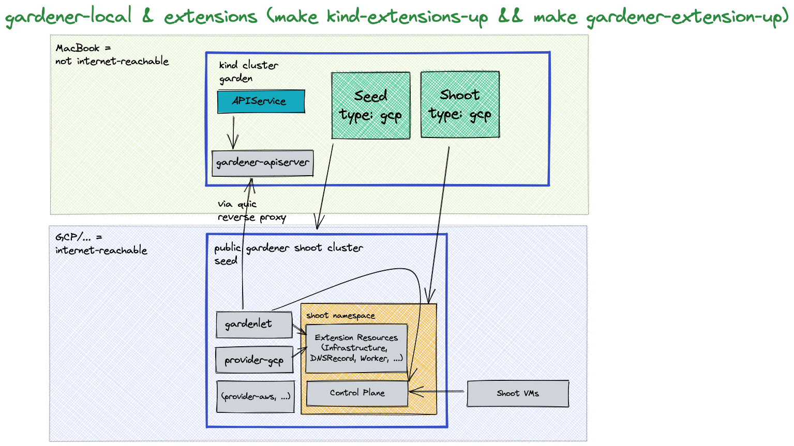

# Deploying Gardener Locally and Enabling Provider-Extensions

This document will walk you through deploying Gardener on your local machine and bootstrapping your own seed clusters on an existing Kubernetes cluster.
It is supposed to run your local Gardener developments on a real infrastructure. For running Gardener only entirely local, please check the [getting started locally](getting_started_locally.md) documentation.
If you encounter difficulties, please open an issue so that we can make this process easier.

## Overview

Gardener runs in any Kubernetes cluster.
In this guide, we will start a [KinD](https://kind.sigs.k8s.io/) cluster which is used as garden cluster. Any Kubernetes cluster could be used as seed clusters in order to support provider extensions (please refer to the [architecture overview](../concepts/architecture.md)). This guide is tested for using Kubernetes clusters provided by Gardener, AWS, Azure, and GCP as seed so far.

Based on [Skaffold](https://skaffold.dev/), the container images for all required components will be built and deployed into the clusters (via their [Helm charts](https://helm.sh/)).



## Prerequisites

- Make sure that you have followed the [Local Setup guide](../development/local_setup.md) up until the [Get the sources](../development/local_setup.md#get-the-sources) step.
- Make sure your Docker daemon is up-to-date, up and running and has enough resources (at least `8` CPUs and `8Gi` memory; see the [Docker documentation](https://docs.docker.com/desktop/settings/mac/) for how to configure the resources for Docker for Mac).
  > Additionally, please configure at least `120Gi` of disk size for the Docker daemon.
  > Tip: You can clean up unused data with `docker system df` and `docker system prune -a`.
- Make sure that you have access to a Kubernetes cluster you can use as a seed cluster in this setup.
  - The seed cluster requires at least 16 CPUs in total to run one shoot cluster
  - You could use any Kubernetes cluster for your seed cluster. However, using a Gardener shoot cluster for your seed simplifies some configuration steps.
  - When bootstrapping `gardenlet` to the cluster, your new seed will have the same provider type as the shoot cluster you use - an AWS shoot will become an AWS seed, a GCP shoot will become a GCP seed, etc. (only relevant when using a Gardener shoot as seed).

## Provide Infrastructure Credentials and Configuration

As this setup is running on a real infrastructure, you have to provide credentials for DNS, the infrastructure, and the kubeconfig for the Kubernetes cluster you want to use as seed.

> There are `.gitignore` entries for all files and directories which include credentials. Nevertheless, please double check and make sure that credentials are not committed to the version control system.

### DNS

Gardener control plane requires DNS for default and internal domains. Thus, you have to configure a valid DNS provider for your setup.

Please maintain your DNS provider configuration and credentials at `./example/provider-extensions/garden/controlplane/domain-secrets.yaml`.

You can find a template for the file at `./example/provider-extensions/garden/controlplane/domain-secrets.yaml.tmpl`.

### Infrastructure

Infrastructure secrets and the corresponding secret bindings should be maintained at:

- `./example/provider-extensions/garden/project/credentials/infrastructure-secrets.yaml`
- `./example/provider-extensions/garden/project/credentials/secretbindings.yaml`

There are templates with `.tmpl` suffixes for the files in the same folder.

### Projects

The projects and the namespaces associated with them should be maintained at `./example/provider-extensions/garden/project/project.yaml`.

You can find a template for the file at `./example/provider-extensions/garden/project/project.yaml.tmpl`.

### Seed Cluster Preparation

The `kubeconfig` of your Kubernetes cluster you would like to use as seed should be placed at `./example/provider-extensions/seed/kubeconfig`.
Additionally, please maintain the configuration of your seed in `./example/provider-extensions/gardenlet/values.yaml`. It is automatically copied from `values.yaml.tmpl` in the same directory when you run `make gardener-extensions-up` for the first time. It also includes explanations of the properties you should set.

Using a Gardener Shoot cluster as seed simplifies the process, because some configuration options can be taken from `shoot-info` and creating DNS entries and TLS certificates is automated.

However, you can use different Kubernetes clusters for your seed too and configure these things manually. Please configure the options of `./example/provider-extensions/gardenlet/values.yaml` upfront. For configuring DNS and TLS certificates, `make gardener-extensions-up`, which is explained later, will pause and tell you what to do.

### External Controllers

You might plan to deploy and register external controllers for networking, operating system, providers, etc. Please put `ControllerDeployment`s and `ControllerRegistration`s into the `./example/provider-extensions/garden/controllerregistrations` directory. The whole content of this folder will be applied to your KinD cluster.

### `CloudProfile`s

There are no demo `CloudProfiles` yet. Thus, please copy `CloudProfiles` from another landscape to the `./example/provider-extensions/garden/cloudprofiles` directory or create your own `CloudProfiles` based on the [gardener examples](../../example/30-cloudprofile.yaml). Please check the GitHub repository of your desired provider-extension. Most of them include example `CloudProfile`s. All files you place in this folder will be applied to your KinD cluster.

## Setting Up the KinD Cluster

```bash
make kind-extensions-up
```

This command sets up a new KinD cluster named `gardener-extensions` and stores the kubeconfig in the `./example/gardener-local/kind/extensions/kubeconfig` file.

> It might be helpful to copy this file to `$HOME/.kube/config`, since you will need to target this KinD cluster multiple times.
Alternatively, make sure to set your `KUBECONFIG` environment variable to `./example/gardener-local/kind/extensions/kubeconfig` for all future steps via `export KUBECONFIG=$PWD/example/gardener-local/kind/extensions/kubeconfig`.

All of the following steps assume that you are using this kubeconfig.

Additionally, this command deploys a local container registry to the cluster as well as a few registry mirrors that are set up as a pull-through cache for all upstream registries Gardener uses by default.
This is done to speed up image pulls across local clusters.

> You will need to add `127.0.0.1 garden.local.gardener.cloud` to your /etc/hosts.

The local registry can now be accessed either via `localhost:5001` or `garden.local.gardener.cloud:5001` for pushing and pulling.
The storage directories of the registries are mounted to your machine under `dev/local-registry`.
With this, mirrored images don't have to be pulled again after recreating the cluster.

The command also deploys a default [calico](https://github.com/projectcalico/calico) installation as the cluster's CNI implementation with `NetworkPolicy` support (the default `kindnet` CNI doesn't provide `NetworkPolicy` support).
Furthermore, it deploys the [metrics-server](https://github.com/kubernetes-sigs/metrics-server) in order to support HPA and VPA on the seed cluster.

## Setting Up Gardener (Garden on KinD, Seed on Gardener Cluster)

```bash
make gardener-extensions-up
```

This will first prepare the basic configuration of your KinD and Gardener clusters.
Afterwards, the images for the Garden cluster are built and deployed into the KinD cluster.
Finally, the images for the Seed cluster are built, pushed to a container registry on the Seed, and the `gardenlet` is started.

If support for workload identity is required you can invoke the top command with `DEV_SETUP_WITH_WORKLOAD_IDENTITY_SUPPORT` variable set to `true`.
This will cause the [Gardener Discovery Server](https://github.com/gardener/gardener-discovery-server) to be deployed and exposed through the seed cluster.
External systems can be then configured to trust the workload identity issuer of the local Garden cluster.

```bash
DEV_SETUP_WITH_WORKLOAD_IDENTITY_SUPPORT=true make gardener-extensions-up
```

> [!IMPORTANT]
> The Gardener Discovery Server is started with a token which is valid for 48 hours.
> Rerun `DEV_SETUP_WITH_WORKLOAD_IDENTITY_SUPPORT=true make gardener-extensions-up` in order to renew the token. 
> 
> When working with multiple seed clusters you need to only pass `DEV_SETUP_WITH_WORKLOAD_IDENTITY_SUPPORT=true` for the one seed cluster that will be used to expose the workload identity documents.
> A single Garden cluster needs only one Gardener Discovery Server.

To setup workload identity with your provider please refer to the provider specific docs:
- [AWS](https://github.com/gardener/gardener-extension-provider-aws/blob/master/docs/usage/usage.md#aws-workload-identity-federation)
- [Azure](https://github.com/gardener/gardener-extension-provider-azure/blob/master/docs/usage/usage.md#azure-workload-identity-federation)
- [GCP](https://github.com/gardener/gardener-extension-provider-gcp/blob/master/docs/usage/usage.md#gcp-workload-identity-federation)

### Adding Additional Seeds

Additional seed(s) can be added by running

```bash
make gardener-extensions-up SEED_NAME=<seed-name>
```

The seed cluster preparations are similar to the first seed:

The `kubeconfig` of your Kubernetes cluster you would like to use as seed should be placed at `./example/provider-extensions/seed/kubeconfig-<seed-name>`.
Additionally, please maintain the configuration of your seed in `./example/provider-extensions/gardenlet/values-<seed-name>.yaml`. It is automatically copied from `values.yaml.tmpl` in the same directory when you run `make gardener-extensions-up SEED_NAME=<seed-name>` for the first time. It also includes explanations of the properties you should set.

### Removing a Seed

If you have multiple seeds and want to remove one, just use

```bash
make gardener-extensions-down SEED_NAME=<seed-name>
```

If it is not the last seed, this command will only remove the seed, but leave the local Gardener cluster and the other seeds untouched.
To remove all seeds and to cleanup the local Gardener cluster, you have to run the command for each seed.

> [!TIP]
> If using development setup that supports workload identity pass `DEV_SETUP_WITH_WORKLOAD_IDENTITY_SUPPORT=true` when removing the seed that was used to host the [Gardener Discovery Server](https://github.com/gardener/gardener-discovery-server).
> ```bash
> DEV_SETUP_WITH_WORKLOAD_IDENTITY_SUPPORT=true make gardener-extensions-down SEED_NAME=<seed-name>
> ```

### Rotate credentials of container image registry in a Seed

There is a container image registry in each Seed cluster where Gardener images required for the Seed and the Shoot nodes are pushed to. This registry is password protected.
The password is generated when the Seed is deployed via `make gardener-extensions-up`. Afterward, it is not rotated automatically.
Otherwise, this could break the update of `gardener-node-agent`, because it might not be able to pull its own new image anymore
This is no general issue of `gardener-node-agent`, but a limitation `provider-extensions` setup. Gardener does not support protected container images out of the box. The function was added for this scenario only.

However, if you want to rotate the credentials for any reason, there are two options for it.
- run `make gardener-extensions-up` (to ensure that your images are up-to-date)
- `reconcile` all shoots on the seed where you want to rotate the registry password
- run `kubectl delete secrets -n registry registry-password` on your seed cluster
- run `make gardener-extensions-up`
- `reconcile` the shoots again

or
- `reconcile` all shoots on the seed where you want to rotate the registry password
- run `kubectl delete secrets -n registry registry-password` on your seed cluster
- run `./example/provider-extensions/registry-seed/deploy-registry.sh <path to seed kubeconfig> <seed registry hostname>`
- `reconcile` the shoots again


## Pause and Unpause the KinD Cluster

The KinD cluster can be paused by stopping and keeping its docker container. This can be done by running:

```bash
make kind-extensions-down
```

When you run `make kind-extensions-up` again, you will start the docker container with your previous Gardener configuration again.

This provides the option to switch off your local KinD cluster fast without leaving orphaned infrastructure elements behind.

## Creating a `Shoot` Cluster

You can wait for the `Seed` to be ready by running:

```bash
kubectl wait --for=condition=gardenletready seed provider-extensions --timeout=5m
```

`make kind-extensions-up` already includes such a check. However, it might be useful when you wake up your `Seed` from hibernation or unpause you KinD cluster.

Alternatively, you can run `kubectl get seed provider-extensions` and wait for the `STATUS` to indicate readiness:

```bash
NAME                  STATUS   PROVIDER   REGION         AGE    VERSION      K8S VERSION
provider-extensions   Ready    gcp        europe-west1   111m   v1.61.0-dev   v1.24.7
```

In order to create a first shoot cluster, please create your own `Shoot` definition and apply it to your KinD cluster. `gardener-scheduler` includes `candidateDeterminationStrategy: MinimalDistance` configuration so you are able to run schedule `Shoot`s of different providers on your `Seed`.

You can wait for your `Shoot`s to be ready by running `kubectl -n garden-local get shoots` and wait for the `LAST OPERATION` to reach `100%`. The output depends on your `Shoot` definition. This is an example output:

```bash
NAME        CLOUDPROFILE   PROVIDER   REGION         K8S VERSION   HIBERNATION   LAST OPERATION               STATUS    AGE
aws         aws            aws        eu-west-1      1.24.3        Awake         Create Processing (43%)      healthy   84s
aws-arm64   aws            aws        eu-west-1      1.24.3        Awake         Create Processing (43%)      healthy   65s
azure       az             azure      westeurope     1.24.2        Awake         Create Processing (43%)      healthy   57s
gcp         gcp            gcp        europe-west1   1.24.3        Awake         Create Processing (43%)      healthy   94s
```

### Accessing the `Shoot` Cluster

Your shoot clusters will have a public DNS entries for their API servers, so that they could be reached via the Internet via `kubectl` after you have created their `kubeconfig`.

We encourage you to use the [adminkubeconfig subresource](../proposals/16-adminkubeconfig-subresource.md) for accessing your shoot cluster. You can find an example how to use it in [Accessing Shoot Clusters](../usage/shoot/shoot_access.md#shootsadminkubeconfig-subresource).

## Deleting the `Shoot` Clusters

Before tearing down your environment, you have to delete your shoot clusters. This is highly recommended because otherwise you would leave orphaned items on your infrastructure accounts.

```bash
./hack/usage/delete shoot <your-shoot> garden-local
```

## Tear Down the Gardener Environment

Before you delete your local KinD cluster, you should shut down your `Shoots` and `Seed` in a clean way to avoid orphaned infrastructure elements in your projects.

Please ensure that your KinD and Seed clusters are online (not paused or hibernated) and run:

```bash
make gardener-extensions-down
```

This will delete all `Shoots` first (this could take a couple of minutes), then uninstall `gardenlet` from the Seed and the gardener components from the KinD. Finally, the additional components like container registry, etc., are deleted from both clusters.

When this is done, you can securely delete your local KinD cluster by running:

```bash
make kind-extensions-clean
```
