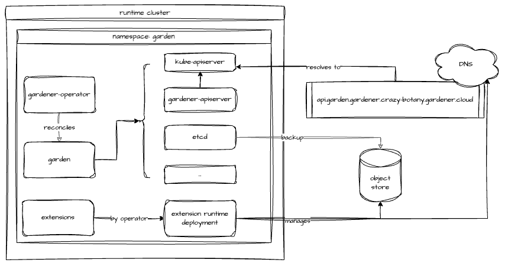

# How to Set Up a Gardener Landscape

> [!IMPORTANT]
> __DISCLAIMER__
> This document outlines the building blocks used to set up a Gardener landscape. It is not meant as a comprehensive configuration guide but rather as a starting point. Setting up a landscape requires careful planning and consideration of dimensions like the number of providers, geographical distribution, and envisioned size.
>
> To make it more tangible, some choices are made to provide examples - specifically this guide uses OpenStack as infrastructure provider, Garden Linux to run any worker nodes, and Calico as CNI.
> Providing working examples for all combinations of components is out of scope. For a detailed descriptions of components, please refer to the [documentation](https://gardener.cloud/docs/) and [API reference](https://gardener.cloud/docs/gardener/api-reference/).

## Target Picture

A Gardener landscape consists of several building blocks. The basis is an existing Kubernetes cluster which is referred to as *runtime* cluster.
Within this cluster another Kubernetes cluster is hosted, which is referred to as *virtual Garden* cluster. It is nodeless, meaning it does not host any pods as workload. The virtual Garden cluster is the management plane for the Gardener landscape and contains resources like `Shoots`, `Seeds` and so on.

Any new Gardener landscape starts with the deployment of the Gardener Operator and the creation of a `garden` namespace on the designated runtime cluster.

With the operator in place, the `Garden` resource can be deployed. It is reconciled by the Gardener Operator, which will create the "virtual" Garden cluster with its `etcd`, `kube-apiserver`, `gardener-apiserver`, and so on.
The API server is exposed through an Istio `Gateway` and a DNS record pointing to the `Gateway`'s external IP address is created.

Once the `Garden` reports readiness, basic building blocks like `CloudProfile`s, `ControllerDeployment`s, and `ControllerRegistration`s, as well as `Secret`s granting access to DNS management for the internal domain and external default domain, are deployed to the virtual Garden cluster.

To be able to host any `Shoot`s, at least one `Seed` is required. The very first `Seed` is created via a `Gardenlet` resource (more precisely `gardenlets.seedmanagement.gardener.cloud`) deployed to the virtual Garden cluster. The actual `gardenlet` Pods run on the runtime cluster or another Kubernetes cluster not managed by Gardener. Typically, this is referred to as an __unmanaged__ Seed and is considered part of the Gardener infrastructure.
In this setup, the very first `Seed` will be reserved for one or several "infrastructure" `Shoot`s. Those will be turned into `Seed`s again through a `ManagedSeed` resource. These __Gardener-managed__ `Seed`s will then host control planes of any users' `Shoot` clusters.


Reference documentation:
- [Getting Started](https://gardener.cloud/docs/getting-started/architecture/)

## Prerequisites

### Runtime Cluster

In order to install and run Gardener an already existing Kubernetes cluster is required. It serves as the root cluster hosting all the components required for the virtual Garden cluster - like a `kube-apiserver` and `etcd` but also admission webhooks or the `gardener-controller-manager`.

Reference documentation:

- [Gardener Architecture](../concepts/architecture.md)
- [Gardener concepts](https://github.com/gardener/gardener/tree/master/docs#concepts)

In this example, the runtime cluster is also used to host the very first `gardenlet`, which will register this cluster as a `Seed` as well. The `gardenlet` can be deployed to another Kubernetes cluster (recommended for productive setups). Here, using the runtime cluster keeps the amount of unmanaged clusters at a bare minimum.

### DNS Zone

The virtual Garden API endpoint (`kube-apiserver`) is exposed through an Istio `Gateway`. This in turn is reachable via a LoadBalancer `Service`. The IP address is made discoverable through DNS. Hence, a zone where an `A` record can be created is required.

Additionally, Gardener advertises `kube-apiservers` of `Shoots` through two DNS records, which requires at least one DNS zone and credentials to interact with it through automation.

Assuming the base domain for a Gardener landscape is `crazy-botany.gardener.cloud`, the following example shows a possible way to structure DNS records:

| Component                | General                                            | Example                                                 |
|:-------------------------|:---------------------------------------------------|:--------------------------------------------------------|
| Gardener Base            | gardener.\<base-domain\>                           | gardener.crazy-botany.gardener.cloud                    |
| Virtual Garden           | api.garden.\<base-domain\>                         | api.garden.gardener.crazy-botany.gardener.cloud         |
| Gardener Ingress         | ingress.garden\<gardener-base-domain\>             | ingress.garden.gardener.crazy-botany.gardener.cloud     |
| Gardener Dashboard       | dashboard.ingress.\<gardener-base-domain\>         | dashboard.ingress.garden.crazy-botany.gardener.cloud    |
| Gardener Discovery       | discovery.ingress.\<gardener-base-domain\>         | discovery.ingress.garden.crazy-botany.gardener.cloud    |
| Shoot Internal           | internal.\<gardener-base-domain\>                  | internal.gardener.crazy-botany.gardener.cloud           |
| Shoot (default) External | shoot.\<gardener-base-domain\>                     | shoot.gardener.crazy-botany.gardener.cloud              |
| Unmanaged Seed Ingress   | ingress.soil.\<gardener-base-domain\>              | ingress.soil.gardener.crazy-botany.gardener.cloud       |
| Managed Seed             | \<seed-name>.seed.\<gardener-base-domain\>         | cc-ha.seed.gardener.crazy-botany.gardener.cloud         |
| Managed Seed Ingress     | ingress.\<seed-name>.seed.\<gardener-base-domain\> | ingress.cc-ha.seed.gardener.crazy-botany.gardener.cloud |

Reference documentation:

- [Gardener Configuration](../operations/configuration.md#system-configuration)
- [DNS records](../extensions/resources/dnsrecord.md)

### Backup Bucket

The virtual Garden cluster's `etcd` is governed by [etcd-druid](https://github.com/gardener/etcd-druid). If configured, backups are created continuously and stored to a supported object store. This requires credentials to manage an object store on the chosen infrastructure.
It is recommended for any productive installation of Gardener.

### Infrastructure

For each infrastructure supported by Gardener a so-called __provider-extension__ exists. It implements the required interfaces. For this example, the [OpenStack extension](https://github.com/gardener/gardener-extension-provider-openstack) will be used.

Access to the respective infrastructure is required and needs to be handed over to Gardener in the provider-specific format (e.g., OpenStack application credentials).

Reference documentation:

- [Gardener extensibility](../README.md#extensions)
- [Provider OpenStack](https://github.com/gardener/gardener-extension-provider-openstack/tree/master/docs)

## Configure and deploy components

This section focuses on the individual building blocks of a Gardener landscape and their deployment / options.

### Gardener Operator

The Gardener Operator is provided as a [helm chart](../../charts/gardener/operator), which is also published as an OCI artifact and attached to each release of the [gardener/gardener](https://github.com/gardener/gardener/releases) repository.

When setting up a new Gardener landscape, choose the latest version and either install the chart or render the templates e.g.:

```bash
helm template ./charts/gardener/operator --namespace garden --set replicaCount=2 --set image.tag=v1.111.0
```

Reference documentation:

- [Gardener Operator](../concepts/operator.md)

### Garden

The Gardener Operator reconciles the so-called `Garden` resource, which contains a detailed configuration of the Garden landscape to be created. Specify the domain name for the Garden's API endpoint, CIDR blocks for the virtual cluster, high availability, and other options here.
To get familiar with the available options, check the [Garden example](../../example/operator/20-garden.yaml).

While most operations are carried out in the realm of the runtime cluster, two external services are required. To automate both the creation of `DNSRecord`s and a `BackupBucket`, a provider-extension needs to be deployed to the runtime cluster as well.
To facilitate the extension's deployment, the API group `operator.gardener.cloud/v1alpha1` contains an `Extension` resources, which is reconciled by the Gardener Operator. Such an `Extension` resource specifies how to install it into the runtime cluster, as well as the virtual Garden cluster. More details can be found in the [Extensions section](#extensions).

The below example shows how an `Extension` is used to deploy the provider-extension for OpenStack. Please note, it advertises to support resources of `kind: BackupBucket` and `type: openstack` as well as `kind: DNSrecord` and `type: openstack-designate`.

```yaml
apiVersion: operator.gardener.cloud/v1alpha1
kind: Extension
metadata:
  name: provider-openstack
spec:
  deployment:
    admission:
      runtimeCluster:
        helm:
          ociRepository:
            repository: europe-docker.pkg.dev/gardener-project/releases/charts/gardener/extensions/admission-openstack-runtime
            tag: v1.44.1
      values:
        replicaCount: 3
      virtualCluster:
        helm:
          ociRepository:
            repository: europe-docker.pkg.dev/gardener-project/releases/charts/gardener/extensions/admission-openstack-application
            tag: v1.44.1
    extension:
      helm:
        ociRepository:
          repository: europe-docker.pkg.dev/gardener-project/releases/charts/gardener/extensions/provider-openstack
          tag: v1.44.1
      runtimeClusterValues:
        vpa:
          enabled: true
          resourcePolicy:
            minAllowed:
              memory: 128Mi
          updatePolicy:
            updateMode: Auto
      values:
        replicaCount: 3
        resources:
          requests:
            cpu: 30m
            memory: 256Mi
      injectGardenKubeconfig: true
  resources:
  - kind: BackupBucket
    type: openstack
  - kind: BackupEntry
    type: openstack
  - kind: Bastion
    type: openstack
  - kind: ControlPlane
    type: openstack
  - kind: Infrastructure
    type: openstack
  - kind: Worker
    type: openstack
  - kind: DNSRecord
    type: openstack-designate
```

To make use of the automated DNS management, the `Garden` resource has to contain a primary provider. Here is an example for an OpenStack-based setup, where the actual credentials are stored in the referenced `Secret`:

```yaml
dns:
  providers:
  - name: primary
    type: openstack-designate
    secretRef:
      name: dns-showroom-garden
```

Additionally, the `BackupBucket` and credentials to access it are configured alongside. The easiest way to get started is by using and customizing the example linked below.



Upon the first reconciliation of the `Garden` resource, a Kubernetes control plane will be bootstrapped in the `garden` namespace. `etcd-main` and `etcd-events` are managed by [etcd-druid](https://github.com/gardener/etcd-druid) and use the `BackupBucket` created by the provider-extension.
To be able to serve any Gardener resource, the `gardener-apiserver` is deployed and registered through an `APIService` resource with the `kube-apiserver` of the virtual Garden cluster. Components like `gardener-scheduler` and `gardener-controller-manager` are deployed to act on Gardener's resources.

Once the `Garden` resource reports readiness, the virtual Garden cluster can be targeted.

```shell
kubectl get garden crazy-botany

NAME          K8S VERSION   GARDENER VERSION   LAST OPERATION   RUNTIME   VIRTUAL   API SERVER   OBSERVABILITY   AGE
crazy-botany   1.31.1        v1.110.0           Succeeded        True      True      True         True            1d
```

In case the automatic DNS record creation is not supported, a record with the external address of the `virtual-garden-istio-ingress` (found in namespace `istio-ingressgateway`) service has to be created manually.

To obtain credentials and interact with the virtual Garden cluster, please follow this [guide](../concepts/operator.md#virtual-garden-kubeconfig).

Reference documentation and examples:

- [Garden configuration example](../../example/operator/20-garden.yaml)
- [Backup secret examples](https://github.com/gardener/etcd-backup-restore/tree/master/example/storage-provider-secrets)
- [Configuration options](../concepts/operator.md#garden-resources)
- [Accessing the virtual Garden](../concepts/operator.md#virtual-garden-kubeconfig)

### Extensions

Gardener is provider-agnostic and relies on a growing set of extensions. An extension can provide support for an infrastructure (required) or add a desired feature to a Kubernetes cluster (often optional).

There are a few extensions considered essential to any Gardener installation:

- at least one [infrastructure provider](../../extensions/README.md#infrastructure-provider) (commonly referred to as provider-extension)
- at least one [operating system extension](../../extensions/README.md#operating-system) - [Garden Linux](https://github.com/gardener/gardener-extension-os-gardenlinux) is recommended
- at least one [network plugin (CNI)](../../extensions/README.md#network-plugin)
- Shoot services

An extension often consists of two components - a controller implementing the Gardener's extension contract and an admission controller. The latter is deployed to the runtime cluster and prevents misconfiguration of `Shoot`s.

#### Choices

For this example, the following choices are made:
- [Garden Linux OS extension](https://github.com/gardener/gardener-extension-os-gardenlinux)
- [Provider OpenStack](https://github.com/gardener/gardener-extension-provider-openstack)
- [Calico](https://github.com/gardener/gardener-extension-networking-calico)
- [DNS service](https://github.com/gardener/gardener-extension-shoot-dns-service)
- [Cert service](https://github.com/gardener/gardener-extension-shoot-cert-service)
- [OIDC service](https://github.com/gardener/gardener-extension-shoot-oidc-service)

Reference documentation:
- [Extension Contract](../extensions/resources/extension.md#contract-extension-resource)
- [GEP 01 Extensibility](../proposals/01-extensibility.md)
- [Extension Library](../../extensions/README.md#known-extension-implementations)

#### How to install an extension

In order to make an extension known to a Gardener landscape, two resources have to be applied to the virtual Garden cluster - firstly, a `ControllerDeployment` and secondly, a matching `ControllerRegistration`. With both in place, Gardener-managed `ControllerInstallation`s take care of the actual deployment of the extension to the target environment.

Check the [controller registration documentation](../extensions/controllerregistration.md) for more details.

Now, the classical way of installing `ControllerDeployment` and `ControllerRegistration` is to prepare the resources and apply them to the virtual Garden cluster. The `ControllerDeployment` references an OCI repository containing the extension's helm chart.

For example, to deploy the [provider OpenStack](https://github.com/gardener/gardener-extension-provider-openstack) extension, the [example file](https://github.com/gardener/gardener-extension-provider-openstack/blob/master/example/controller-registration.yaml) can be used.

To simplify this procedure, extensions can be registered through `Extension` resources in the runtime cluster. The Gardener Operator will take care of deploying the required resources to the virtual Garden cluster.
In addition, this approach allows the extensions and their admission controllers to be deployed to the runtime cluster as well. There, they can provide additional functionality like managing `DNSRecord`s or `BackupBucket`s.
More details can be found in the [Extension Resource documentation](../concepts/operator.md#extension-resource).


### Cloud Profile

In order to host any `Shoot` cluster, at least one `CloudProfile` is required. The `CloudProfile` resource describes supported Kubernetes and OS versions, as well as infrastructure capabilities like regions and their availability zones.

Hence, the next step is to craft a `CloudProfile` for each infrastructure provider and combine it with the information where the operating system images can be found. The resulting `CloudProfile` resource has to be deployed to the virtual Garden cluster.

The following list provides the high-level steps to build a `CloudProfile`:

- add at least one supported minor version to `.spec.kubernetes.versions[]`.
- add at least one region including the availability zone to `.spec.regions[]`.
- add at least one operating system to `.spec.machineImages[]` and define at least on supported version.
- add one or several machine types to `.spec.machineTypes[]`.
- specify a `.spec.providerConfig` according to the extension's documentation. Typically, this includes a list of `MachineImages`. Garden Linux, for example, publishes images and provides a list of location as part of the release notes. In case of private infrastructure, copying the images might be required.

Here is a simplified example manifest:

```yaml
apiVersion: core.gardener.cloud/v1beta1
kind: CloudProfile
metadata:
  name: openstack-example
spec:
  caBundle: | # CA Bundle installed on all nodes of the shoot clusters using this CloudProfile
    <redacted>
  kubernetes:
    versions:
    - classification: preview
      version: 1.31.3
    - classification: supported
      expirationDate: "2025-07-30T23:59:59Z"
      version: 1.31.2
  machineImages:
  - name: gardenlinux
    updateStrategy: minor
    versions:
    - architectures:
      - amd64
      - arm64
      classification: supported
      cri:
      - containerRuntimes:
        - type: gvisor
        name: containerd
      version: 1592.3.0
  machineTypes:
  - architecture: amd64
    cpu: "2"
    gpu: "0"
    memory: 4Gi
    name: small_machine
    storage:
      class: standard
      size: 64Gi
      type: default
    usable: true
  regions:
  - name: my-region-1
    zones:
    - name: my-region-1a
    - name: my-region-1b
  providerConfig:
    apiVersion: openstack.provider.extensions.gardener.cloud/v1alpha1
    kind: CloudProfileConfig
    machineImages:
    - name: gardenlinux
      versions:
      - version: 1592.3.0
        regions:
        - id: abcd-1234 # The ID of the image in the given OpenStack installation for the specified region.
          name: my-region-1
    # ...
 ```

Reference documentation:

- [`CloudProfile`s](../concepts/apiserver.md#cloudprofiles)
- [`CloudProfile` example](../../example/30-cloudprofile.yaml)
- [OpenStack `CloudProfile` example](https://github.com/gardener/gardener-extension-provider-openstack/blob/master/docs/operations/operations.md)
- [Garden Linux release notes example](https://github.com/gardenlinux/gardenlinux/releases/tag/1592.3)
- [Image vector](../deployment/image_vector.md)
- [Image vector container defaults](../../imagevector/containers.yaml)

### DNS setup for internal & external domains

Gardener maintains DNS records for a `Shoot` which requires a DNS zone and credentials to manage records in this zone. Provide the credentials alongside with information about the zone. The secrets are deployed to the virtual Garden cluster.

Reference documentation:

- [`DNSRecord`s](../extensions/resources/dnsrecord.md#what-does-gardener-create-dns-records-for)
- [Default domain example](../../example/10-secret-default-domain.yaml)
- [Internal domain example](../../example/10-secret-internal-domain.yaml)

### Gardenlet

Before the first `Shoot` can be created in a new Gardener landscape, at least one `Seed` is required. Typically, the very first `Seed` is created by deploying a properly configured `gardenlet` to an existing Kubernetes cluster. In this example, the `gardenlet` will be deployed to the runtime cluster - effectively turning it into a `Seed` as well. 
Thus, the runtime cluster serves two purposes now - it hosts the virtual Garden cluster and control planes. It is possible, and strongly recommended for larger installations, to deploy a `gardenlet` to another Kubernetes cluster. This separates the virtual Garden cluster from the first `Seed` with the control planes hosted there.

A `Seed` requires a provider-extension matching the target infrastructure to manage `DNSRecord`s for the `Seed`'s ingress domain and if configured, the `BackupBucket`. A `Secret` with the credentials to interact with the infrastructure needs to be created in the virtual Garden cluster and linked in the `gardenlet`'s configuration.

The easiest way to deploy a `gardenlet` is to create a `Gardenlet` resource in the virtual Garden cluster. Make sure to configure the CIDR blocks properly to avoid conflicts or overlaps with the runtime cluster.


A common pattern is to protect this very first `Seed`, in a sense that no control planes of user `Shoot` clusters will be scheduled to it. Instead, this `Seed` should host control planes of Gardener-managed `Seed` clusters exclusively. These in turn host the control planes of user `Shoot`s.
This pattern allows to scale out the capacity of a Gardener landscape, as creating new seeds is simple and fast. More details can be found in the [Shoot & Managed Seed section](#shoot--managed-seed).

To achieve this protection, the `gardenlet` resource should contain the following configuration:

```yaml
spec:
  config:
    seedConfig:
      spec:
        scheduling:
          visible: false
        taints:
          - key: seed.gardener.cloud/protected
```

Reference documentation:

- [Gardenlet documentation](../concepts/gardenlet.md)
- [Deploying a Gardenlet](../deployment/deploy_gardenlet.md)
- [Gardenlet example](../../example/55-gardenlet.yaml)
- [Gardenlet configuration example](../../example/20-componentconfig-gardenlet.yaml)

### Shoot & Managed Seed

With the very first `Seed` in place, the Gardener landscape can scale by the means of Gardener-managed infrastructure. To get started, a `Shoot` needs to be created in the virtual Garden cluster. This requires infrastructure credentials to be provided in the form of a `Secret` and `CredentialsBinding`. This `Shoot` should have a `toleration` for the above `taint`:

```yaml
spec:
  tolerations:
  - key: seed.gardener.cloud/protected
```

Up next, a `gardenlet` has to be installed on to this `Shoot` and it needs to be registered as a `Seed`. The recommended way is to create a `ManagedSeed` resource in the virtual Garden. The configuration for the `Seed` needs to be crafted carefully to avoid overlapping CIDR ranges etc. Additionally, the virtual Garden's API endpoint needs to be added. When deploying a `gardenlet` to the runtime cluster, cluster-internal communication through the `Service`'s cluster DNS record works well. Now with the new `gardenlet` running on a different Kubernetes cluster, the public endpoint is required in the `gardenlet`'s configuration within the `ManagedSeed` resource.

```yaml
spec:
  gardenlet:
    config:
      apiVersion: gardenlet.config.gardener.cloud/v1alpha1
      kind: GardenletConfiguration
      gardenClientConnection:
        gardenClusterAddress: https://api.garden.crazy-botany.gardener.cloud
```


Reference documentation:

- [Managed Seeds](../operations/managed_seed.md)

## Conclusion

Setting up a new Gardener landscape is much easier today - thanks to the evolution of the Gardener Operator and `Garden` resource. Utilizing the `Extension` resource reduces manual efforts significantly.
A single Gardener landscape can support multiple infrastructures for `Shoots`. To onboard an infrastructure, the relevant extensions need to be deployed as well.

Due to the vast amount of configuration options it is highly recommended to spend some time to derive a meaningful setup initially.

In this example, the runtime cluster serves two purposes - it hosts the virtual Garden cluster and runs a `gardenlet` which registers the runtime cluster itself as a seed with the virtual Garden cluster. This first seed is reserved to host the control planes of "infrastructure" `Shoot`s only. Those `Shoot`s will be turned into seeds using the `ManagedSeed` resource and allow for proper scaling.

To get started with Gardener, visit our [landing page](https://gardener.cloud) and try the [demo environment](https://demo.gardener.cloud/).
