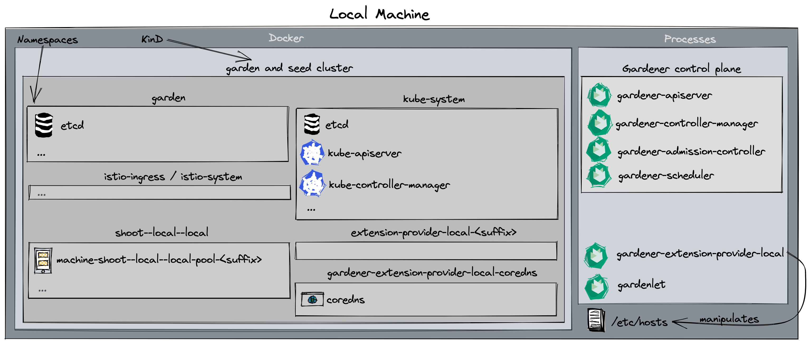

# Developing Gardener Locally

This document will walk you through running Gardener on your local machine for development purposes.
If you encounter difficulties, please open an issue so that we can make this process easier.

Gardener runs in any Kubernetes cluster.
In this guide, we will start a [KinD](https://kind.sigs.k8s.io/) cluster which is used as both garden and seed cluster (please refer to the [architecture overview](../concepts/architecture.md)) for simplicity.

The Gardener components, however, will be run as regular processes on your machine (hence, no container images are being built).



## Alternatives

When developing Gardener on your local machine you might face several limitations:

- Your machine doesn't have enough compute resources (see [prerequisites](#prerequisites)) for hosting a second seed cluster or multiple shoot clusters.
- Developing Gardener's [IPv6 features](../usage/ipv6.md) requires a Linux machine and native IPv6 connectivity to the internet, but you're on macOS or don't have IPv6 connectivity in your office environment or via your home ISP.

In these cases, you might want to check out one of the following options that run the setup described in this guide elsewhere for circumventing these limitations:

- [remote local setup](#remote-local-setup): develop on a remote pod for more compute resources
- [dev box on Google Cloud](https://github.com/gardener-community/dev-box-gcp): develop on a Google Cloud machine for more compute resource and/or simple IPv4/IPv6 dual-stack networking

## Prerequisites

- Make sure that you have followed the [Local Setup guide](./local_setup.md) up until the [Get the sources](./local_setup.md#get-the-sources) step.
- Make sure your Docker daemon is up-to-date, up and running and has enough resources (at least `4` CPUs and `4Gi` memory; see [here](https://docs.docker.com/desktop/mac/#resources) how to configure the resources for Docker for Mac).
  > Please note that 4 CPU / 4Gi memory might not be enough for more than one `Shoot` cluster, i.e., you might need to increase these values if you want to run additional `Shoot`s.
  > If you plan on following the optional steps to [create a second seed cluster](#optional-setting-up-a-second-seed-cluster), the required resources will be more - at least `10` CPUs and `16Gi` memory.

  Additionally, please configure at least `120Gi` of disk size for the Docker daemon.
  > Tip: With `docker system df` and `docker system prune -a` you can cleanup unused data.
- Make sure that you increase the maximum number of open files on your host:
  - On Mac, run `sudo launchctl limit maxfiles 65536 200000`
  - On Linux, extend the `/etc/security/limits.conf` file with

    ```text
    * hard nofile 97816
    * soft nofile 97816
    ```

    and reload the terminal.

## Setting Up the KinD Cluster (Garden and Seed)

```bash
make kind-up KIND_ENV=local
```

> If you want to setup an IPv6 KinD cluster, use `make kind-up KIND_ENV=local IPFAMILY=ipv6` instead.

This command sets up a new KinD cluster named `gardener-local` and stores the kubeconfig in the `./example/gardener-local/kind/local/kubeconfig` file.

> It might be helpful to copy this file to `$HOME/.kube/config` since you will need to target this KinD cluster multiple times.
Alternatively, make sure to set your `KUBECONFIG` environment variable to `./example/gardener-local/kind/local/kubeconfig` for all future steps via `export KUBECONFIG=example/gardener-local/kind/local/kubeconfig`.

All following steps assume that you are using this kubeconfig.

Additionally, this command also deploys a local container registry to the cluster as well as a few registry mirrors, that are set up as a pull-through cache for all upstream registries Gardener uses by default.
This is done to speed up image pulls across local clusters.
The local registry can be accessed as `localhost:5001` for pushing and pulling.
The storage directories of the registries are mounted to the host machine under `dev/local-registry`.
With this, mirrored images don't have to be pulled again after recreating the cluster.

The command also deploys a default [calico](https://github.com/projectcalico/calico) installation as the cluster's CNI implementation with `NetworkPolicy` support (the default `kindnet` CNI doesn't provide `NetworkPolicy` support).
Furthermore, it deploys the [metrics-server](https://github.com/kubernetes-sigs/metrics-server) in order to support HPA and VPA on the seed cluster.

## Setting Up IPv6 Single-Stack Networking (optional)

First, ensure that your `/etc/hosts` file contains an entry resolving `localhost` to the IPv6 loopback address:

```text
::1 localhost
```

Typically, only `ip6-localhost` is mapped to `::1` on linux machines.
However, we need `localhost` to resolve to both `127.0.0.1` and `::1` so that we can talk to our registry via a single address (`localhost:5001`).

Next, we need to configure NAT for outgoing traffic from the kind network to the internet.
After executing `make kind-up IPFAMILY=ipv6`, execute the following command to set up the corresponding iptables rules:

```bash
ip6tables -t nat -A POSTROUTING -o $(ip route show default | awk '{print $5}') -s fd00:10::/64 -j MASQUERADE
```

## Setting Up Gardener

In a terminal pane, run:

```bash
make dev-setup                                                                # preparing the environment (without webhooks for now)
kubectl wait --for=condition=ready pod -l run=etcd -n garden --timeout 2m     # wait for etcd to be ready
make start-apiserver                                                          # starting gardener-apiserver
```

> For IPv6 use `make dev-setup IPFAMILY=ipv6` instead.

In a new terminal pane, run:

```bash
kubectl wait --for=condition=available apiservice v1beta1.core.gardener.cloud # wait for gardener-apiserver to be ready
make start-admission-controller                                               # starting gardener-admission-controller
```

In a new terminal pane, run:

```bash
make dev-setup DEV_SETUP_WITH_WEBHOOKS=true                                   # preparing the environment with webhooks
make start-controller-manager                                                 # starting gardener-controller-manager
```

> For IPv6 use `make dev-setup DEV_SETUP_WITH_WEBHOOKS=true IPFAMILY=ipv6` instead.

(Optional): In a new terminal pane, run:

```bash
make start-scheduler                                                          # starting gardener-scheduler
```

In a new terminal pane, run:

```bash
make register-local-env                                                       # registering the local environment (CloudProfile, Seed, etc.)
make start-gardenlet SEED_NAME=local                                          # starting gardenlet
```

> For IPv6 use `make register-local-env IPFAMILY=ipv6` instead.

In a new terminal pane, run:

```bash
make start-extension-provider-local                                           # starting gardener-extension-provider-local
```

> For IPv6 use `make start-extension-provider-local IPFAMILY=ipv6` instead.

ℹ️ The [`provider-local`](../extensions/provider-local.md) is started with elevated privileges since it needs to manipulate your `/etc/hosts` file to enable you accessing the created shoot clusters from your local machine, see [this](../extensions/provider-local.md#dnsrecord) for more details.

## Creating a `Shoot` Cluster

You can wait for the `Seed` to become ready by running:

```bash
./hack/usage/wait-for.sh seed local GardenletReady Bootstrapped SeedSystemComponentsHealthy ExtensionsReady
```

Alternatively, you can run `kubectl get seed local` and wait for the `STATUS` to indicate readiness:

```bash
NAME    STATUS   PROVIDER   REGION   AGE     VERSION       K8S VERSION
local   Ready    local      local    4m42s   vX.Y.Z-dev    v1.21.1
```

In order to create a first shoot cluster, just run:

```bash
kubectl apply -f example/provider-local/shoot.yaml
```

You can wait for the `Shoot` to be ready by running:

```bash
NAMESPACE=garden-local ./hack/usage/wait-for.sh shoot local APIServerAvailable ControlPlaneHealthy ObservabilityComponentsHealthy EveryNodeReady SystemComponentsHealthy
```

Alternatively, you can run `kubectl -n garden-local get shoot local` and wait for the `LAST OPERATION` to reach `100%`:

```bash
NAME    CLOUDPROFILE   PROVIDER   REGION   K8S VERSION   HIBERNATION   LAST OPERATION            STATUS    AGE
local   local          local      local    1.21.0        Awake         Create Processing (43%)   healthy   94s
```

(Optional): You could also execute a simple e2e test (creating and deleting a shoot) by running:

```shell
make test-e2e-local-simple KUBECONFIG="$PWD/example/gardener-local/kind/local/kubeconfig"
```

When the `Shoot` got created successfully, you can acquire a `kubeconfig` by using the [`shoots/adminkubeconfig` subresource](../usage/shoot_access.md#shootsadminkubeconfig-subresource) to access the cluster.

## (Optional): Setting Up a Second Seed Cluster

There are cases where you would want to create a second seed cluster in your local setup. For example, if you want to test the [control plane migration](../usage/control_plane_migration.md) feature. The following steps describe how to do that.

If you are on macOS, add a new IP address on your loopback device which will be necessary for the new KinD cluster that you will create. On macOS, the default loopback device is `lo0`.


```bash
sudo ip addr add 127.0.0.2 dev lo0                                     # adding 127.0.0.2 ip to the loopback interface
```

Next, setup the second KinD cluster:

```bash
make kind2-up KIND_ENV=local
```

This command sets up a new KinD cluster named `gardener-local2` and stores its kubeconfig in the `./example/gardener-local/kind/local2/kubeconfig` file. You will need this file when starting the `provider-local` extension controller for the second seed cluster.

```bash
make register-kind2-env                                           # registering the local2 seed
make start-gardenlet SEED_NAME=local2                             # starting gardenlet for the local2 seed
```

In a new terminal pane, run:

```bash
export KUBECONFIG=./example/gardener-local/kind/local2/kubeconfig       # setting KUBECONFIG to point to second kind cluster
make start-extension-provider-local \
  WEBHOOK_SERVER_PORT=9444 \
  WEBHOOK_CERT_DIR=/tmp/gardener-extension-provider-local2 \
  SERVICE_HOST_IP=127.0.0.2 \
  METRICS_BIND_ADDRESS=:8082 \
  HEALTH_BIND_ADDRESS=:8083                                       # starting gardener-extension-provider-local
```

If you want to perform a control plane migration you can follow the steps outlined in the [Control Plane Migration](../usage/control_plane_migration.md) topic to migrate the shoot cluster to the second seed you just created.

## Deleting the `Shoot` Cluster

```shell
./hack/usage/delete shoot local garden-local
```

## (Optional): Tear Down the Second Seed Cluster

```bash
make tear-down-kind2-env
make kind2-down
```

## Tear Down the Gardener Environment

```shell
make tear-down-local-env
make kind-down
```

## Remote Local Setup

Just like Prow is executing the KinD based integration tests in a K8s pod, it is
possible to interactively run this KinD based Gardener development environment
aka "local setup" in a "remote" K8s pod.

```shell
k apply -f docs/development/content/remote-local-setup.yaml
k exec -it deployment/remote-local-setup -- sh

tmux -u a
```

### Caveats

Please refer to the [TMUX documentation](https://github.com/tmux/tmux/wiki) for
working effectively inside the remote-local-setup pod.

To access Plutono, Prometheus, or other components in a browser, two port forwards are needed:

The port forward from the laptop to the pod:

```shell
k port-forward deployment/remote-local-setup 3000
```

The port forward in the remote-local-setup pod to the respective component:

```shell
k port-forward -n shoot--local--local deployment/plutono 3000
```

## Related Links

- [Local Provider Extension](../extensions/provider-local.md)
