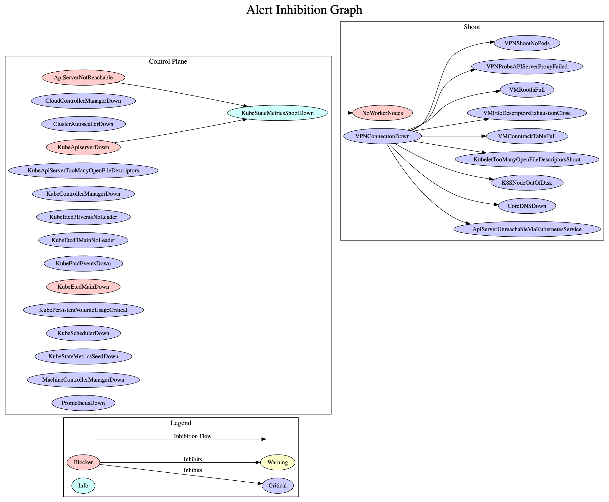

# Extending the Monitoring Stack
This document provides instructions to extend the Shoot cluster monitoring stack by integrating new scrape targets, alerts and dashboards.

Please ensure that you have understood the basic principles of [Prometheus](https://prometheus.io/docs/introduction/overview/) and its ecosystem before you continue.

:bangbang: **The purpose of the monitoring stack is to observe the behaviour of the control plane and the system components deployed by Gardener onto the worker nodes. Monitoring of custom workloads running in the cluster is out of scope.**

## Overview


Each Shoot cluster comes with its own monitoring stack. The following components are deployed into the seed and shoot:
* Seed
  * [Prometheus](https://github.com/prometheus/prometheus)
  * [Grafana](https://github.com/grafana/grafana)
  * [blackbox-exporter](https://github.com/prometheus/blackbox_exporter)
  * [kube-state-metrics](https://github.com/kubernetes/kube-state-metrics) (Seed metrics)
  * [kube-state-metrics](https://github.com/kubernetes/kube-state-metrics) (Shoot metrics)
  * [Alertmanager](https://github.com/prometheus/alertmanager) (Optional)
* Shoot
  * [node-exporter(s)](https://github.com/prometheus/node_exporter)
  * [kube-state-metrics](https://github.com/kubernetes/kube-state-metrics)
  * [blackbox-exporter](https://github.com/prometheus/blackbox_exporter)

In each Seed cluster there is a Prometheus in the `garden` namespace responsible for collecting metrics from the Seed kubelets and cAdvisors. These metrics are provided to each Shoot Prometheus via federation.

The alerts for all Shoot clusters hosted on a Seed are routed to a central Alertmanger running in the `garden` namespace of the Seed. The purpose of this central alertmanager is to forward all important alerts to the operators of the Gardener setup.

The Alertmanager in the Shoot namespace on the Seed is only responsible for forwarding alerts from its Shoot cluster to a cluster owner/cluster alert receiver via email. These Alertmanager is optional and the conditions for a deployment is already described  [here](../usage/shoots.md#configure-a-shoot-cluster-alert-receiver).

## Adding New Monitoring Targets
After exploring the metrics which your component provides or adding new metrics, you should be aware which metrics are required to write the needed alerts and dashboards.

Prometheus prefers a pull based metrics collection approach and therefore the targets to observe need to be defined upfront. The targets are defined in `charts/seed-monitoring/charts/prometheus/templates/config.yaml`.
New scrape jobs can be added in the section `scrape_configs`. Detailed information how to configure scrape jobs and how to use the kubernetes service discovery are available in the [Prometheus documentation](https://prometheus.io/docs/prometheus/latest/configuration/configuration/#scrape_config).

The `job_name` of a scrape job should be the name of the component e.g. `kube-apiserver` or `vpn`. The collection interval should be the default of `30s`. You do not need to specify this in the configuration.

Please do not ingest all metrics which are provided by a component. Rather collect only those metrics which are needed to define the alerts and dashboards (i.e. whitelist). This can be achieved by adding the following `metric_relabel_configs` statement to your scrape jobs (replace `exampleComponent` with component name).
```yaml
    - job_name: example-component
      ...
      metric_relabel_configs:
{{ include "prometheus.keep-metrics.metric-relabel-config" .Values.allowedMetrics.exampleComponent | indent 6 }}
```

The whitelist for the metrics of your job can be maintained in `charts/seed-monitoring/charts/prometheus/values.yaml` in section `allowedMetrics.exampleComponent` (replace `exampleComponent` with component name). Check the following example:
```yaml
allowedMetrics:
  ...
  exampleComponent:
  - metrics_name_1
  - metrics_name_2
  ...
```

## Adding Alerts
The alert definitons are located in `charts/seed-monitoring/charts/prometheus/rules`. There are two approaches for adding new alerts.
1. Adding additional alerts for a component which already has a set of alerts. In this case you have to extend the existing rule file for the component.
2. Adding alerts for a new component. In this case a new rule file with name scheme `example-component.rules.yaml` needs to be added.
3. Add the new alert to `alertInhibitionGraph.dot`, add any required inhibition flows and render the new graph. To render the graph run:
```bash
$ dot -Tpng ./content/alertInhibitionGraph.dot -o ./content/alertInhibitionGraph.png
```
4. Create a test for the new alert. See `Alert Tests`.

Example alert:
```yaml
groups:
- name: example.rules
  rules:
  - alert: ExampleAlert
    expr: absent(up{job="exampleJob"} == 1)
    for: 20m
    labels:
      service: example
      severity: critical # How severe is the alert? (blocker|critical|info|warning)
      type: shoot # For which topology is the alert relevant? (seed|shoot)
      visibility: all # Who should receive the alerts? (all|operator|owner)
    annotations:
      description: A longer description of the example alert that should also explain the impact of the alert.
      summary: Short summary of an example alert.
```

If the deployment of component is optional then the alert definitions needs to be added to `charts/seed-monitoring/charts/prometheus/optional-rules` instead. Furthermore the alerts for component need to be activatable in `charts/seed-monitoring/charts/prometheus/values.yaml` via `rules.optional.example-component.enabled`. The default should be `true`.

Basic instruction how to define alert rules can be found in the [Prometheus documentation](https://prometheus.io/docs/prometheus/latest/configuration/alerting_rules).

### Routing tree
The Alertmanager is grouping incoming alerts based on labels into buckets. Each bucket has its own configuration like alert receivers, initial delaying duration or resending frequency etc. You can find more information about Alertmanager routing in the [Prometheus/Alertmanager documentation](https://prometheus.io/docs/alerting/configuration/#route). The routing trees for the Alertmanagers deployed by Gardener are depicted below.

Central Seed Alertmanager
```
∟ main route (all alerts for all shoots on the seed will enter)
  ∟ group by project and shoot name
    ∟ group by visibility "all" and "operator"
      ∟ group by severity "blocker", "critical", and "info" → route to Garden operators
      ∟ group by severity "warning" (dropped)
    ∟ group by visibility "owner" (dropped)
```

Shoot Alertmanager
```
∟ main route (only alerts for one Shoot will enter)
  ∟ group by visibility "all" and "owner"
    ∟ group by severity "blocker", "critical", and "info" → route to cluster alert receiver
    ∟ group by severity "warning" (dropped, will change soon → route to cluster alert receiver)
  ∟ group by visibility "operator" (dropped)
```

### Alert Inhibition

All alerts related to components running on the Shoot workers are inhibited in case of an issue with the vpn connection, because those components can't be scraped anymore and Prometheus will fire alerts in consequence. The components running on the workers are probably healthy and the alerts are presumably false positives. The inhibition flow is shown in the figure below. If you add a new alert make sure to add it to the diagram.



### Alert Attributes
Each alert rule definition has to contain the following annotations:
- **summary**: A short description of the issue.
- **description**: A detailed explanation of the issue with hints to the possible root causes and the impact assessment of the issue.

In addtion each alert must contain the following labels:
- **type**
  - `shoot`: Components running on the Shoot worker nodes in the `kube-system` namespace.
  - `seed`: Components running on the Seed in the Shoot namespace as part of/next to the control plane.
- **service**
  - Name of the component (in lowercase) e.g. `kube-apiserver`, `alertmanager` or `vpn`.
- **severity**
  - `blocker`: All issues which make the cluster entirely unusable e.g. `KubeAPIServerDown` or `KubeSchedulerDown`
  - `critical`: All issues which affect single functionalities/components but not affect the cluster in its core functionality e.g. `VPNDown` or `KubeletDown`.
  - `info`: All issues that do not affect the cluster or its core functionality, but if this component is down we cannot determine if a blocker alert is firing. (i.e. A component with an info level severity is a dependency for a component with a blocker severity)
  - `warning`: No current existing issue, rather a hint for situations which could lead to real issue in the close future e.g. `HighLatencyApiServerToWorkers` or `ApiServerResponseSlow`.

### Alert Tests

Execute the tests in `$GARDENERHOME/.ci/test` or if you want to only test the Prometheus alerts:
```bash
$ # Install promtool
$ go get -u github.com/prometheus/prometheus/cmd/promtool

$ # Move to seed-monitoring/prometheus chart
$ cd $GARDENERHOME/charts/seed-monitoring/charts/prometheus/

$ # Execute tests
$ promtool test rules rules-tests/*test.yaml
```

If you want to add alert tests:
1. Create a new file in `rules-tests` in the form `<alert-group-name>.rules.test.yaml` or if the alerts are for an existing component with existing tests, simply add the tests to the appropriate files.

2. Make sure that newly added tests succeed. See above.

## Adding Grafana Dashboards
The dashboard definition files are located in `charts/seed-monitoring/charts/grafana/dashboards`. Every dashboard needs its own file.

If you are adding a new component dashboard please also update the overview dashboard by adding a chart for its current up/down status and with a drill down option to the component dashboard.

### Dashboard Structure
The dashboards should be structured in the following way. The assignment of the component dashboards to the categories should be handled via dashboard tags.

- Kubernetes control plane components (Tag: `control-plane`)
  - All components which are part of the Kubernetes control plane e. g. Kube API Server, Kube Controller Manager, Kube Scheduler and Cloud Controller Manager
  - ETCD + Backup/Restore
  - Kubernetes Addon Manager
- Node/Machine components (Tag: `node/machine`)
  - All metrics which are related to the behaviour/control of the Kubernetes nodes and kubelets
  - Machine-Controller-Manager + Cluster Autoscaler
- Networking components (Tag: `network`)
  - CoreDNS, KubeProxy, Calico, VPN, Nginx Ingress
- Addon components (Tag: `addon`)
  - Cert Broker
- Monitoring components (Tag: `monitoring`)
- Logging components (Tag: `logging`)

##### Mandatory Charts for Component Dashboards
For each new component, its corresponding dashboard should contain the following charts in the first row, before adding custom charts for the component in the subsequent rows.
1. Pod up/down status `up{job="example-component"}`
2. Pod/containers cpu utilization
3. Pod/containers memorty consumption
4. Pod/containers network i/o

These information is provided by the cAdvisor metrics. These metrics are already integrated. Please check the other dashboards for detailed information on how to query.

##### Chart Requirements
Each chart needs to contain:
- a meaningful name
- a detailed description (for non trivial charts)
- appropriate x/y axis descriptions
- appropriate scaling levels for the x/y axis
- proper units for the x/y axis

##### Dashboard Parameters
The following parameters should be added to all dashboards to ensure a homogeneous experience across all dashboards.

Dashboards have to ...
- contain a title which refers to the component name(s)
- contain a timezone statement which should be the browser time
- contain tags which express where the component is running (`seed` or `shoot`) and to which category the component belong (see dashboard structure)
- contain a version statement with a value of 1
- be immutable

Example dashboard configuration
```json
{
  "title": "example-component",
  "timezone": "browser",
  "tags": [
    "seed",
    "control-plane"
  ],
  "version": 1,
  "editable": "false",
}
```

Furthermore all dashboards should contain the following time options:
```json
{
  "time": {
    "from": "now-1h",
    "to": "now"
  },
  "timepicker": {
    "refresh_intervals": [
      "30s",
      "1m",
      "5m"
    ],
    "time_options": [
      "5m",
      "15m",
      "1h",
      "6h",
      "12h",
      "24h",
      "2d",
      "10d"
    ]
  },
}
```