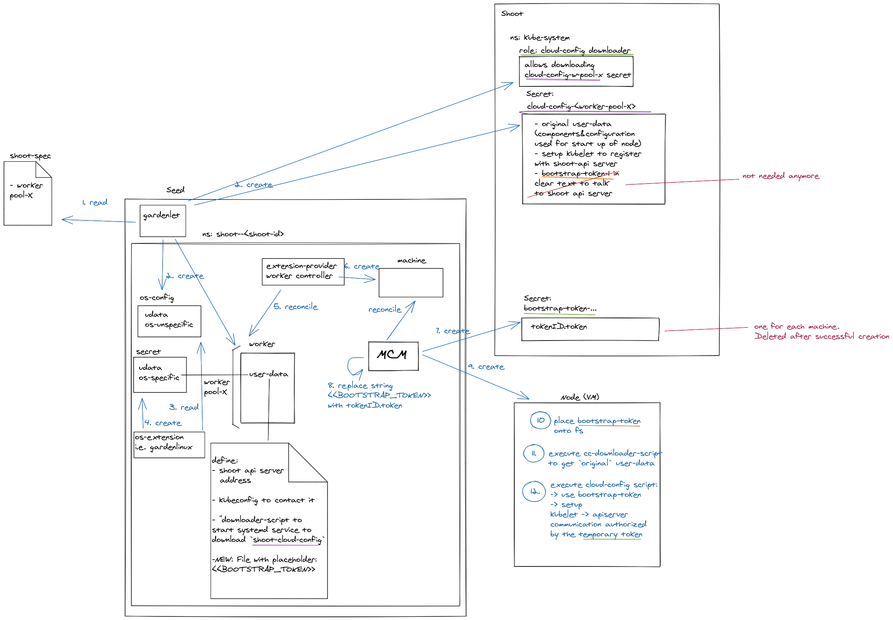

# Contract: `OperatingSystemConfig` Resource

Gardener uses the machine API and leverages the functionalities of the [machine-controller-manager](https://github.com/gardener/machine-controller-manager) (MCM) in order to manage the worker nodes of a shoot cluster.
The machine-controller-manager itself simply takes a reference to an OS-image and (optionally) some user-data (a script or configuration that is executed when a VM is bootstrapped), and forwards both to the provider's API when creating VMs.
MCM does not have any restrictions regarding supported operating systems as it does not modify or influence the machine's configuration in any way - it just creates/deletes machines with the provided metadata.

Consequently, Gardener needs to provide this information when interacting with the machine-controller-manager.
This means that basically every operating system is possible to be used, as long as there is some implementation that generates the OS-specific configuration in order to provision/bootstrap the machines.

:warning: Currently, there are a few requirements of pre-installed components that must be present in all OS images:

1. [Docker](https://www.docker.com/)
2. [containerd](https://containerd.io/)
   1. [containerd client CLI](https://github.com/projectatomic/containerd/blob/master/docs/cli.md/)
   1. `containerd` must listen on its default socket path: `unix:///run/containerd/containerd.sock`
   1. `containerd` must be configured to work with the default configuration file in: `/etc/containerd/config.toml` (eventually created by Gardener).
2. [systemd](https://www.freedesktop.org/wiki/Software/systemd/)
3. [`wget`](https://www.gnu.org/software/wget/)
4. [`jq`](https://stedolan.github.io/jq/)

The reasons for that will become evident later.

## What does the user-data bootstrapping the machines contain?

Gardener installs a few components onto every worker machine in order to allow it to join the shoot cluster.
There is the `kubelet` process, some scripts for continuously checking the health of `kubelet` and `containerd`, but also configuration for log rotation, CA certificates, etc.
You can find the complete configuration [at the components folder](../../pkg/component/extensions/operatingsystemconfig/original/components). We are calling this the "original" user-data.

## How does Gardener bootstrap the machines?

When the [`UseGardenerNodeAgent`](../deployment/feature_gates.md) feature gate is enabled, `gardenlet` makes use of `gardener-node-agent` to perform the bootstrapping and reconciliation of systemd units and files on the machine.
Please refer to [this document](../concepts/node-agent.md#installation-and-bootstrapping) for a first overview.

Usually, you would submit all the components you want to install onto the machine as part of the user-data during creation time.
However, some providers do have a size limitation (around ~16KB) for that user-data.
That's why we do not send the "original" user-data to the machine-controller-manager (who then forwards it to the provider's API).
Instead, we only send a small "init" script that downloads the "original" data and applies it on the machine directly.
This way we can extend the "original" user-data without any size restrictions.

The high-level flow is as follows:

1. For every worker pool `X` in the `Shoot` specification, Gardener creates a `Secret` named `cloud-config-<X>` in the `kube-system` namespace of the shoot cluster. The secret contains the "original" `OperatingSystemConfig` (i.e., systemd units and files for `kubelet`, etc.).
2. Gardener generates a kubeconfig with minimal permissions just allowing reading these secrets. It is used by the `gardener-node-agent` later.
3. Gardener provides the `gardener-node-init.sh` bash script and the machine image stated in the `Shoot` specification to the machine-controller-manager.
4. Based on this information, the machine-controller-manager creates the VM.
5. After the VM has been provisioned, the `gardener-node-init.sh` script starts, fetches the `gardener-node-agent` binary, and starts it.
6. The `gardener-node-agent` will read the `cloud-config-<X>` `Secret` for its worker pool (containing the "original" `OperatingSystemConfig`), and reconciles it.

The `gardener-node-agent` can update itself in case of newer Gardener versions, and it performs a continuous reconciliation of the systemd units and files in the provided `OperatingSystemConfig` (just like any other Kubernetes controller).

## What needs to be implemented to support a new operating system?

As part of the [`Shoot` reconciliation flow](../concepts/gardenlet.md#shoot-controller), `gardenlet` will create a special CRD in the seed cluster that needs to be reconciled by an extension controller, for example:

```yaml
---
apiVersion: extensions.gardener.cloud/v1alpha1
kind: OperatingSystemConfig
metadata:
  name: pool-01-original
  namespace: default
spec:
  type: <my-operating-system>
  purpose: reconcile
  reloadConfigFilePath: /var/lib/cloud-config-downloader/cloud-config
  units:
  - name: containerd.service
    dropIns:
    - name: 10-containerd-opts.conf
      content: |
        [Service]
        Environment="SOME_OPTS=--foo=bar"
  - name: containerd-monitor.service
    command: start
    enable: true
    content: |
      [Unit]
      Description=Docker-monitor daemon
      After=kubelet.service
      [Install]
      WantedBy=multi-user.target
      [Service]
      Restart=always
      EnvironmentFile=/etc/environment
      ExecStart=/opt/bin/health-monitor containerd
  files:
  - path: /var/lib/kubelet/ca.crt
    permissions: 0644
    encoding: b64
    content:
      secretRef:
        name: default-token-5dtjz
        dataKey: token
  - path: /etc/sysctl.d/99-k8s-general.conf
    permissions: 0644
    content:
      inline:
        data: |
          # A higher vm.max_map_count is great for elasticsearch, mongo, or other mmap users
          # See https://github.com/kubernetes/kops/issues/1340
          vm.max_map_count = 135217728
```

In order to support a new operating system, you need to write a controller that watches all `OperatingSystemConfig`s with `.spec.type=<my-operating-system>`.
For those it shall generate a configuration blob that fits to your operating system.

`OperatingSystemConfig`s can have two purposes: either `provision` or `reconcile`.

### `provision` Purpose

The `provision` purpose is used by `gardenlet` for the user-data that it later passes to the machine-controller-manager (and then to the provider's API) when creating new VMs.
It contains the `gardener-node-init.sh` script and systemd unit.

The OS controller has to translate the `.spec.units` and `.spec.files` into configuration that fits to the operating system.
For example, a Flatcar controller might generate a [CoreOS cloud-config](https://github.com/flatcar/coreos-cloudinit/blob/flatcar-master/Documentation/cloud-config-examples.md) or [Ignition](https://coreos.com/ignition/docs/latest/what-is-ignition.html), SLES might generate [cloud-init](https://cloudinit.readthedocs.io/en/latest/), and others might simply generate a bash script translating the `.spec.units` into `systemd` units, and `.spec.files` into real files on the disk.

> ⚠️ Please avoid mixing in additional systemd units or files - this step should just translate what `gardenlet` put into `.spec.units` and `.spec.files`. 

After generation, extension controllers are asked to store their OS config inside a `Secret` (as it might contain confidential data) in the same namespace.
The secret's `.data` could look like this:

```yaml
apiVersion: v1
kind: Secret
metadata:
  name: osc-result-pool-01-original
  namespace: default
  ownerReferences:
  - apiVersion: extensions.gardener.cloud/v1alpha1
    blockOwnerDeletion: true
    controller: true
    kind: OperatingSystemConfig
    name: pool-01-original
    uid: 99c0c5ca-19b9-11e9-9ebd-d67077b40f82
data:
  cloud_config: base64(generated-user-data)
```

Finally, the secret's metadata must be provided in the `OperatingSystemConfig`'s `.status` field:

```yaml
...
status:
  cloudConfig:
    secretRef:
      name: osc-result-pool-01-original
      namespace: default
  lastOperation:
    description: Successfully generated cloud config
    lastUpdateTime: "2019-01-23T07:45:23Z"
    progress: 100
    state: Succeeded
    type: Reconcile
  observedGeneration: 5
```

### `reconcile` Purpose

The `reconcile` purpose contains the "original" `OperatingSystemConfig` (which is later stored in `Secret`s in the shoot's `kube-system` namespace (see step 1)).

The OS controller does not need to translate anything here, but it has the option to provide additional systemd units or files via the `.status` field:

```yaml
status:
  extensionUnits:
  - name: my-custom-service.service
    command: start
    enable: true
    content: |
      [Unit]
      // some systemd unit content
  extensionFiles:
  - path: /etc/some/file
    permissions: 0644
    content:
      inline:
        data: some-file-content
  lastOperation:
    description: Successfully generated cloud config
    lastUpdateTime: "2019-01-23T07:45:23Z"
    progress: 100
    state: Succeeded
    type: Reconcile
  observedGeneration: 5
```

The `gardener-node-agent` will merge `.spec.units` and `.status.extensionUnits` as well as `.spec.files` and `.status.extensionFiles` when applying.

You can find an example implementation [here](../../pkg/provider-local/controller/operatingsystemconfig/actuator.go).

---

## How does Gardener bootstrap the machines?

> ❗️Below section is only relevant when the [`UseGardenerNodeAgent`](../deployment/feature_gates.md) feature gate is disabled.
> Once the feature gate has been promoted to GA, it will become obsolete and gets deleted.

Usually, you would submit all the components you want to install onto the machine as part of the user-data during creation time.
However, some providers do have a size limitation (around ~16KB) for that user-data.
That's why we do not send the "original" user-data to the machine-controller-manager (who then forwards it to the provider's API).
Instead, we only send a small script that downloads the "original" data and applies it on the machine directly.
This way we can extend the "original" user-data without any size restrictions - plus we can modify it without the necessity of re-creating the machine (because we run a script that downloads and updates it continuously).

The high-level flow is as follows:

1. For every worker pool `X` in the `Shoot` specification, Gardener creates a `Secret` named `cloud-config-<X>` in the `kube-system` namespace of the shoot cluster. The secret contains the "original" user-data.

1. Gardener generates a kubeconfig with minimal permissions just allowing reading these secrets. It is used by the `downloader` script later.

1. Gardener provides the `downloader` script, the kubeconfig, and the machine image stated in the `Shoot` specification to the machine-controller-manager.

1. Based on this information, the machine-controller-manager creates the VM.

1. After the VM has been provisioned, the `downloader` script starts and fetches the appropriate `Secret` for its worker pool (containing the "original" user-data), and applies it.

### Detailed Bootstrap Flow with a Worker Generated bootstrap-token

With gardener v1.23 a file with the content `<<BOOTSTRAP_TOKEN>>` is added to the `cloud-config-<worker-group>-downloader` `OperatingSystemConfig` (part of step 2 in the graphic below).
Via the OS extension, the new file (with its content in clear-text) gets passed to the corresponding `Worker` resource.

The `Worker` controller has to guarantee that:
- a bootstrap token is created.
- the `<<BOOTSTRAP_TOKEN>>` in the user data is replaced by the generated token.

One implementation of that is depicted in the diagram below, where the machine-controller-manager creates a temporary token and replaces the placeholder.

As part of the user-data, the bootstrap-token is placed on the newly created VM under a defined path.
The cloud-config-script will then refer to the file path of the added bootstrap token in the kubelet-bootstrap script.



## How does Gardener update the user-data on already existing machines?

With ongoing development and new releases of Gardener, some new components could be required to get installed onto every shoot worker VM, or existing components might need to be changed.
Gardener achieves that by simply updating the user-data inside the `Secret`s mentioned above (step 1).
The `downloader` script is continuously (every 30s) reading the secret's content (which might include an updated user-data) and storing it onto the disk.
In order to re-apply the (new) downloaded data, the secrets do not only contain the "original" user-data but also another short script (called an "execution" script).
This script checks whether the downloaded user-data differs from the one previously applied - and if required - re-applies it.
After that it uses `systemctl` to restart the installed `systemd` units.

With the help of the execution script, Gardener can centrally control how machines are updated without the need of OS providers to (re-)implement that logic.
However, as stated in the mentioned requirements above, the execution script assumes existence of Docker and `systemd`.

## What needs to be implemented to support a new operating system?

As part of the shoot flow Gardener will create a special CRD in the seed cluster that needs to be reconciled by an extension controller, for example:

```yaml
---
apiVersion: extensions.gardener.cloud/v1alpha1
kind: OperatingSystemConfig
metadata:
  name: pool-01-original
  namespace: default
spec:
  type: <my-operating-system>
  purpose: reconcile
  reloadConfigFilePath: /var/lib/cloud-config-downloader/cloud-config
  units:
  - name: docker.service
    dropIns:
    - name: 10-docker-opts.conf
      content: |
        [Service]
        Environment="DOCKER_OPTS=--log-opt max-size=60m --log-opt max-file=3"
  - name: docker-monitor.service
    command: start
    enable: true
    content: |
      [Unit]
      Description=Docker-monitor daemon
      After=kubelet.service
      [Install]
      WantedBy=multi-user.target
      [Service]
      Restart=always
      EnvironmentFile=/etc/environment
      ExecStart=/opt/bin/health-monitor docker
  files:
  - path: /var/lib/kubelet/ca.crt
    permissions: 0644
    encoding: b64
    content:
      secretRef:
        name: default-token-5dtjz
        dataKey: token
  - path: /etc/sysctl.d/99-k8s-general.conf
    permissions: 0644
    content:
      inline:
        data: |
          # A higher vm.max_map_count is great for elasticsearch, mongo, or other mmap users
          # See https://github.com/kubernetes/kops/issues/1340
          vm.max_map_count = 135217728
```

In order to support a new operating system, you need to write a controller that watches all `OperatingSystemConfig`s with `.spec.type=<my-operating-system>`.
For those it shall generate a configuration blob that fits to your operating system.
For example, a CoreOS controller might generate a [CoreOS cloud-config](https://coreos.com/os/docs/latest/cloud-config.html) or [Ignition](https://coreos.com/ignition/docs/latest/what-is-ignition.html), SLES might generate [cloud-init](https://cloudinit.readthedocs.io/en/latest/), and others might simply generate a bash script translating the `.spec.units` into `systemd` units, and `.spec.files` into real files on the disk.

`OperatingSystemConfig`s can have two purposes which can be used (or ignored) by the extension controllers: either `provision` or `reconcile`.

* The `provision` purpose is used by Gardener for the user-data that it later passes to the machine-controller-manager (and then to the provider's API) when creating new VMs. It contains the `downloader` unit.
* The `reconcile` purpose contains the "original" user-data (that is then stored in `Secret`s in the shoot's `kube-system` namespace (see step 1). This is downloaded and applies late (see step 5).

As described above, the "original" user-data must be re-applicable to allow in-place updates.
The way how this is done is specific to the generated operating system config (e.g., for CoreOS cloud-init the command is `/usr/bin/coreos-cloudinit --from-file=<path>`, whereas SLES would run `cloud-init --file <path> single -n write_files --frequency=once`).
Consequently, besides the generated OS config, the extension controller must also provide a command for re-application an updated version of the user-data.
As visible in the mentioned examples, the command requires a path to the user-data file.
Gardener will provide the path to the file in the `OperatingSystemConfig`s `.spec.reloadConfigFilePath` field (only if `.spec.purpose=reconcile`).
As soon as Gardener detects that the user data has changed it will reload the systemd daemon and restart all the units provided in the `.status.units[]` list (see the below example). The same logic applies during the very first application of the whole configuration.

After generation, extension controllers are asked to store their OS config inside a `Secret` (as it might contain confidential data) in the same namespace.
The secret's `.data` could look like this:

```yaml
apiVersion: v1
kind: Secret
metadata:
  name: osc-result-pool-01-original
  namespace: default
  ownerReferences:
  - apiVersion: extensions.gardener.cloud/v1alpha1
    blockOwnerDeletion: true
    controller: true
    kind: OperatingSystemConfig
    name: pool-01-original
    uid: 99c0c5ca-19b9-11e9-9ebd-d67077b40f82
data:
  cloud_config: base64(generated-user-data)
```

Finally, the secret's metadata, the OS-specific command to re-apply the configuration, and the list of `systemd` units that shall be considered to be restarted if an updated version of the user-data is re-applied must be provided in the `OperatingSystemConfig`'s `.status` field:

```yaml
...
status:
  cloudConfig:
    secretRef:
      name: osc-result-pool-01-original
      namespace: default
  command: /usr/bin/coreos-cloudinit --from-file=/var/lib/cloud-config-downloader/cloud-config
  lastOperation:
    description: Successfully generated cloud config
    lastUpdateTime: "2019-01-23T07:45:23Z"
    progress: 100
    state: Succeeded
    type: Reconcile
  observedGeneration: 5
  units:
  - docker-monitor.service
```

(The `.status.command` field is optional and must only be provided if `.spec.reloadConfigFilePath` exists).

Once the `.status` indicates that the extension controller finished reconciling Gardener will continue with the next step of the shoot reconciliation flow.

## CRI Support
Gardener supports specifying a Container Runtime Interface (CRI) configuration in the `OperatingSystemConfig` resource. If the `.spec.cri` section exists, then the `name` property is mandatory. The only supported values for `cri.name` at the moment are: `containerd` and `docker`, which uses the in-tree dockershim.
For example:
```yaml
---
apiVersion: extensions.gardener.cloud/v1alpha1
kind: OperatingSystemConfig
metadata:
  name: pool-01-original
  namespace: default
spec:
  type: <my-operating-system>
  purpose: reconcile
  reloadConfigFilePath: /var/lib/cloud-config-downloader/cloud-config
  cri:
    name: containerd
...
```

To support ContainerD, an OS extension must satisfy the following criteria:
1. The operating system must have built-in [ContainerD](https://containerd.io/) and the [Client CLI](https://github.com/projectatomic/containerd/blob/master/docs/cli.md/).
1. ContainerD must listen on its default socket path: `unix:///run/containerd/containerd.sock`
1. ContainerD must be configured to work with the default configuration file in: `/etc/containerd/config.toml` (Created by Gardener).

If CRI configurations are not supported, it is recommended to create a validating webhook running in the garden cluster that prevents specifying the `.spec.providers.workers[].cri` section in the `Shoot` objects.

## References and Additional Resources

* [`OperatingSystemConfig` API (Golang Specification)](../../pkg/apis/extensions/v1alpha1/types_operatingsystemconfig.go)
* [`downloader` Script](../../pkg/component/extensions/operatingsystemconfig/downloader/templates/scripts/download-cloud-config.tpl.sh) (fetching the "original" user-data and the execution script)
* [Original User-Data Templates](../../pkg/component/extensions/operatingsystemconfig/original/components)
* [Execution Script](../../pkg/component/extensions/operatingsystemconfig/executor/templates/scripts/execute-cloud-config.tpl.sh) (applying the "original" user-data)
