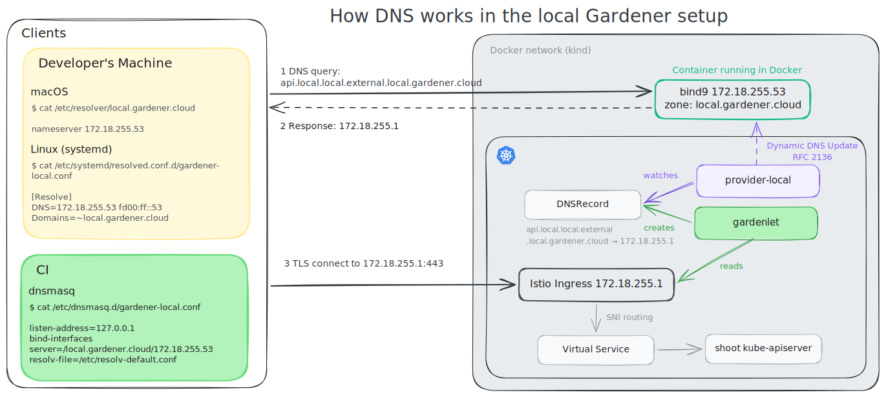

# Local Provider Extension

The "local provider" extension is used to allow the usage of seed and shoot clusters which run entirely locally without any real infrastructure or cloud provider involved.
It implements Gardener's extension contract ([GEP-0001](https://github.com/gardener/enhancements/tree/main/geps/0001-gardener-extensibility)) and thus comprises several controllers and webhooks acting on resources in seed and shoot clusters.

The code is maintained in [`pkg/provider-local`](../../pkg/provider-local).

## Motivation

The motivation for maintaining such extension is the following:

- 🛡 Output Qualification: Run fast and cost-efficient end-to-end tests, locally and in CI systems (increased confidence ⛑ before merging pull requests)
- ⚙️ Development Experience: Develop Gardener entirely on a local machine without any external resources involved (improved costs 💰 and productivity 🚀)
- 🤝 Open Source: Quick and easy setup for a first evaluation of Gardener and a good basis for first contributions

## Current Limitations

The following enlists the current limitations of the implementation.
Please note that all of them are not technical limitations/blockers, but simply advanced scenarios that we haven't had invested yet into.

1. No load balancers for Shoot clusters.

   _We have not yet developed a `cloud-controller-manager` which could reconcile load balancer `Service`s in the shoot cluster._

2. Machines/nodes are recreated during control plane migration.

   _Since the machine provider creates `Pod`s for the shoot worker nodes in the shoot's control plane namespace, they get deleted and recreated on the other seed cluster during control plane migration._

## `ManagedSeed`s

It is possible to deploy [`ManagedSeed`s](../operations/managed_seed.md) with `provider-local` by first creating a [`Shoot` in the `garden` namespace](../../example/provider-local/managedseeds/shoot-managedseed.yaml) and then creating a referencing [`ManagedSeed` object](../../example/provider-local/managedseeds/managedseed.yaml).

> Please note that this is only supported by the [`Skaffold`-based setup](../deployment/getting_started_locally.md).

The corresponding e2e test can be run via:

```bash
./hack/test-e2e-local.sh --label-filter "ManagedSeed"
```

### Implementation Details

The Gardener images built locally by `Skaffold` are pushed to/pulled from a container registry in the `kind` network managed by [`docker-compose`](../../dev-setup/infra/docker-compose.yaml) (`registry.local.gardener.cloud:5001`). The registry is accessible from the host on `127.0.0.1:5001` and `[::1]:5001`.
`provider-local` configures this registry as mirror for the shoot by mutating the `OperatingSystemConfig` and using the [default contract for extending the `containerd` configuration](../usage/advanced/custom-containerd-config.md).

In order to bootstrap a seed cluster, the `gardenlet` deploys `PersistentVolumeClaim`s and `Service`s of type `LoadBalancer`.
While storage is supported in shoot clusters by using the [`local-path-provisioner`](https://github.com/rancher/local-path-provisioner), load balancers are not supported yet.
However, `provider-local` runs a `Service` controller which specifically reconciles the seed-related `Service`s of type `LoadBalancer`.
This way, they get an IP and `gardenlet` can finish its bootstrapping process.
Note that these IPs are not reachable, however for the sake of developing `ManagedSeed`s this is sufficient for now.

Also, please note that the `provider-local` extension only gets deployed because of the `Always` deployment policy in its corresponding `ControllerRegistration` and because the DNS provider type of the seed is set to `local`.

## Implementation Details

This section contains information about how the respective controllers and webhooks in `provider-local` are implemented and what their purpose is.

### Bootstrapping

The local setup includes a [BIND9](https://www.isc.org/bind/) DNS server running as a Docker container in the `kind` network (accessible from the host on `172.18.255.53:53` and `[fd00:ff::53]:53`).
This DNS server is authoritative for the `local.gardener.cloud` zone and accepts [RFC 2136](https://datatracker.ietf.org/doc/html/rfc2136) dynamic DNS updates.
It is responsible for hosting all DNS records of the local setup and enabling clients on the host and components running in the seed/kind and shoot clusters to resolve them.

The kind cluster nodes are configured to use the local DNS server as their DNS resolver (via a custom `/etc/resolv.conf`), so all nodes and pods of the cluster can resolve names in the `local.gardener.cloud` zone.
[Machine pods](#machine-controller-manager-provider-local) created by provider-local are configured to use the same DNS server as the kind nodes (`dnsPolicy=Default`), i.e., talk directly to the BIND9 server without going through the kind cluster's coredns.

Clients on the host machine can resolve names in the `local.gardener.cloud` zone by using conditional forwarding in their DNS configuration.
On macOS, this is achieved by creating a file `/etc/resolver/local.gardener.cloud` pointing to the local DNS server (see [this blog post](https://invisiblethreat.ca/technology/2025/04/12/macos-resolvers/)).
On Linux systems using `systemd-resolved`, this is achieved by creating a file in `/etc/systemd/resolved.conf.d/` including the `Domains=~local.gardener.cloud` directive.
In e2e tests running in CI (prow), this is achieved by running `dnsmasq` in the test pod and configuring it to forward requests for the `local.gardener.cloud` zone to the local DNS server.



### Credentials

By default, provider-local doesn't require any cloud provider credentials in the shoot's `{Secret,Credentials}Binding` as all infrastructure resources are deployed in the cluster where it runs.
For this, provider-local uses its in-cluster config to connect to the Kubernetes API server of the seed/bootstrap cluster.
However, provider-local also supports overwriting the credentials by specifying a `kubeconfig` in the shoot credentials secret.
This is used in the local setup for [self-hosted shoots with managed infrastructure](https://github.com/gardener/enhancements/tree/main/geps/0028-self-hosted-shoot-clusters#managed-infrastructure).
Here, provider-local initially creates the infrastructure resources (e.g., Service, NetworkPolicies, machine Pods, etc.) in the kind cluster (during `gardenadm bootstrap`).
Later on, `gardenadm init` restores the extension resources within the self-hosted shoot cluster itself, and provider-local – running in the shoot cluster now – needs credentials to access the kind cluster API server to keep managing those resources.

### Controllers

There are controllers for all resources in the `extensions.gardener.cloud/v1alpha1` API group except for `BackupBucket` and `BackupEntry`s.

#### `ControlPlane`

This controller is deploying the [local-path-provisioner](https://github.com/rancher/local-path-provisioner) as well as a related `StorageClass` in order to support `PersistentVolumeClaim`s in the local shoot cluster.
Additionally, it creates a few (currently unused) dummy secrets (CA, server and client certificate, basic auth credentials) for the sake of testing the secrets manager integration in the extensions library.

#### `DNSRecord`

The controller manages DNS records by sending [RFC 2136](https://datatracker.ietf.org/doc/html/rfc2136) dynamic DNS updates to the local BIND9 server (see [Bootstrapping](#bootstrapping)).
For each `DNSRecord`, it sends an UPDATE message that first removes any existing resource record set for the FQDN and record type and then inserts the new records based on `DnsRecord.spec.values`.

For example, for a shoot with API server domain `api.local.local.internal.local.gardener.cloud`, the controller sends an update adding A records pointing to the IP addresses specified in the `DNSRecord`'s values.

The controller supports A, AAAA, and CNAME record types.

#### `Infrastructure`

This controller generates a `NetworkPolicy` which allows the control plane pods (like `kube-apiserver`) to communicate with the worker machine pods (see [`Worker` section](#worker)).
It also deploys a `NetworkPolicy` which allows the bastion pods to communicate with the worker machine pods (see [`Bastion` section](#bastion)).

#### `Network`

This controller is not implemented anymore. In the initial version of `provider-local`, there was a `Network` controller deploying [kindnetd](https://github.com/kubernetes-sigs/kind/blob/main/images/kindnetd/README.md) (see [release v1.44.1](https://github.com/gardener/gardener/tree/v1.44.1/pkg/provider-local/controller/network)).
However, we decided to drop it because this setup prevented us from using `NetworkPolicy`s (kindnetd does not ship a `NetworkPolicy` controller).
In addition, we had issues with shoot clusters having more than one node (hence, we couldn't support rolling updates, see [PR #5666](https://github.com/gardener/gardener/pull/5666/commits/491b3cd16e40e5c20ef02367fda93a34ff9465eb)).

#### `OperatingSystemConfig`

This controller renders a simple cloud-init template which can later be executed by the shoot worker nodes.

The shoot worker nodes are `Pod`s with a container based on the `kindest/node` image. This is maintained in the [`pkg/provider-local/node`](../../pkg/provider-local/node) directory and has a special `run-userdata` systemd service which executes the cloud-init generated earlier by the `OperatingSystemConfig` controller.

#### `Worker`

This controller leverages the standard [generic `Worker` actuator](../../extensions/pkg/controller/worker/genericactuator) in order to generate the `MachineClasses` and the `MachineDeployments` based on the specification of the `Worker` resource.

Additionally, the controller deploys RBAC objects for granting machine-controller-manager additional permissions in the namespace of the machine pods.
This is needed because the [local machine provider](#machine-controller-manager-provider-local) creates Kubernetes objects for starting `Machines`, which is different to all other machine provider implementations.

#### `Bastion`

This controller implements the `Bastion.extensions.gardener.cloud` resource by deploying a pod with the local machine image along with a `LoadBalancer` service.

Note that this controller does not respect the `Bastion.spec.ingress` configuration as there is no way to perform client IP restrictions in the local setup.

#### `Ingress`

The gardenlet creates a wildcard DNS record for the Seed's ingress domain pointing to the `nginx-ingress-controller`'s LoadBalancer.
This domain is commonly used by all `Ingress` objects created in the Seed for Seed and Shoot components.
As provider-local implements the `DNSRecord` extension API (see the [`DNSRecord`section](#dnsrecord)), this controller reconciles all `Ingress`s and creates `DNSRecord`s of type `local` for each host included in `spec.rules`.
This only happens for shoot namespaces (`gardener.cloud/role=shoot` label) to make `Ingress` domains resolvable on the machine pods.

#### `Service`

This controller reconciles `Services` of type `LoadBalancer` in the local `Seed` cluster.
Since the local Kubernetes clusters used as Seed clusters typically don't support such services, this controller sets the `.status.ingress.loadBalancer.ip[0]` to magic `172.18.255.*` or `fd00:ff::*` IP addresses that are added to the loopback interface of the host machine running the kind cluster.
It makes LoadBalancer Services (e.g. `istio-ingressgateway` and `shoot--*--*/bastion-*`) available to the host by setting `spec.ports[].nodePort` to well-known ports that are mapped to `hostPorts` in the kind cluster configuration.

`istio-ingress/istio-ingressgateway` is set to be exposed on `nodePort` `30433` by this controller.
The bastion services are exposed on `nodePort` `30022`.

In case the seed has multiple availability zones (`.spec.provider.zones`) and it uses SNI, the different zone-specific `istio-ingressgateway` loadbalancers are exposed via different IP addresses. Per default, IP addresses `172.18.255.1{0,1,2}` and `fd00:ff::1{0,1,2}` are used for the zones `0`, `1`, and `2` respectively.

#### ETCD Backups

This controller reconciles the `BackupBucket` and `BackupEntry` of the shoot allowing the `etcd-backup-restore` to create and copy backups using the `local` provider functionality. The backups are stored on the host file system. This is achieved by mounting that directory to the `etcd-backup-restore` container.

#### Extension Seed

This controller reconciles `Extensions` of type `local-ext-seed`. It creates a single `serviceaccount` named `local-ext-seed` in the shoot's namespace in the seed. The extension is reconciled before the `kube-apiserver`. More on extension lifecycle strategies can be read in [Registering Extension Controllers](registration.md#extension-lifecycle).

#### Extension Shoot

This controller reconciles `Extensions` of type `local-ext-shoot`. It creates a single `serviceaccount` named `local-ext-shoot` in the `kube-system` namespace of the shoot. The extension is reconciled after the `kube-apiserver`. More on extension lifecycle strategies can be read [Registering Extension Controllers](registration.md#extension-lifecycle).

#### Extension Shoot After Worker

This controller reconciles `Extensions` of type `local-ext-shoot-after-worker`. It creates a `deployment` named `local-ext-shoot-after-worker` in the `kube-system` namespace of the shoot. The extension is reconciled after the workers and waits until the deployment is ready. More on extension lifecycle strategies can be read [Registering Extension Controllers](registration.md#extension-lifecycle).

#### Health Checks

The health check controller leverages the [health check library](healthcheck-library.md) in order to:

- check the health of the `ManagedResource/extension-controlplane-shoot-webhooks` and populate the `SystemComponentsHealthy` condition in the `ControlPlane` resource.
- check the health of the `ManagedResource/extension-networking-local` and populate the `SystemComponentsHealthy` condition in the `Network` resource.
- check the health of the `ManagedResource/extension-worker-mcm-shoot` and populate the `SystemComponentsHealthy` condition in the `Worker` resource.
- check the health of the `Deployment/machine-controller-manager` and populate the `ControlPlaneHealthy` condition in the `Worker` resource.
- check the health of the `Node`s and populate the `EveryNodeReady` condition in the `Worker` resource.

### Webhooks

#### Control Plane

This webhook reacts on the `OperatingSystemConfig` containing the configuration of the kubelet and sets the `failSwapOn` to `false` (independent of what is configured in the `Shoot` spec) ([ref](https://github.com/kubernetes-sigs/kind/blob/b6bc112522651d98c81823df56b7afa511459a3b/site/content/docs/design/node-image.md#design)).

#### DNS Config

This webhook reacts on events for the `dependency-watchdog-probe` `Deployment`, the `blackbox-exporter` `Deployment`, as well as on events for `Pod`s created when the `machine-controller-manager` reconciles `Machine`s.
All these pods need to be able to resolve the DNS names for shoot clusters.
It sets the `.spec.dnsPolicy=None` and `.spec.dnsConfig.nameServers` to the cluster IP of the `coredns` `Service` created in the `gardener-extension-provider-local-coredns` namespaces so that these pods can resolve the DNS records for shoot clusters (see the [Bootstrapping section](#bootstrapping) for more details).
It also adds the necessary `NetworkPolicy` labels to allow the communication to the `coredns` pods.

#### Node

This webhook reacts on updates to `nodes/status` in both seed and shoot clusters and sets the `.status.{allocatable,capacity}.cpu="100"` and `.status.{allocatable,capacity}.memory="100Gi"` fields.

Background: Typically, the `.status.{capacity,allocatable}` values are determined by the resources configured for the Docker daemon (see for example the [docker Quick Start Guide](https://docs.docker.com/desktop/mac/#resources) for Mac).
Since many of the `Pod`s deployed by Gardener have quite high `.spec.resources.requests`, the `Node`s easily get filled up and only a few `Pod`s can be scheduled (even if they barely consume any of their reserved resources).
In order to improve the user experience, on startup/leader election the provider-local extension submits an empty patch which triggers the "node webhook" (see the below section) for the seed cluster.
The webhook will increase the capacity of the `Node`s to allow all `Pod`s to be scheduled.
For the shoot clusters, this empty patch trigger is not needed since the `MutatingWebhookConfiguration` is reconciled by the `ControlPlane` controller and exists before the `Node` object gets registered.

#### Shoot

This webhook reacts on the `ConfigMap` used by the `kube-proxy` and sets the `maxPerCore` field to `0` since other values don't work well in conjunction with the `kindest/node` image which is used as base for the shoot worker machine pods ([ref](https://github.com/kubernetes-sigs/kind/blob/fa7d86470f4c0e924fc4c2e767ec8491c45f4304/pkg/cluster/internal/kubeadm/config.go#L283-L285)).

### machine-controller-manager-provider-local

Out of tree (controller-based) implementation for `local` as a new provider.
The local out-of-tree provider implements the interface defined at [MCM OOT driver](https://github.com/gardener/machine-controller-manager/blob/master/pkg/util/provider/driver/driver.go).

For every `Machine` object, the [local machine provider](../../pkg/provider-local/machine-provider) creates a `Pod` in the shoot control plane namespace.
A machine pod uses an [image](../../pkg/provider-local/node) based on [kind's](https://github.com/kubernetes-sigs/kind) node image (`kindest/node`).
The machine's user data is deployed as a `Secret` in the shoot control plane namespace and mounted into the machine pod.
In contrast to kind, the local machine image doesn't directly run kubelet as a systemd unit. Instead, it has a unit for running the user data script at `/etc/machine/userdata`.

The local provider spec of the `MachineClass` supports the following fields:

```yaml
apiVersion: machine.sapcloud.io/v1alpha1
kind: MachineClass
metadata:
  name: shoot--garden-local--local-worker-06d11
  namespace: shoot--garden-local--local
provider: local
providerSpec:
  image: registry.local.gardener.cloud:5001/local-skaffold_gardener-extension-provider-local-node:...
  ipPoolNameV4: shoot-machine-pods-shoot--garden-local--local-ipv4
  ipPoolNameV6: shoot-machine-pods-shoot--garden-local--local-ipv6
  namespace: shoot--garden-local--local
```

The `image` field specifies the image reference for the `provider-local/node` image.
It is determined from the `CloudProfile.spec.providerConfig.machineImages` field.
The `ipPoolNameV{4,6}` fields specify the name of the calico `IPPool`s to allocate IP addresses for the machine pods from (which are created by the [`Infrastructure` controller](#infrastructure)).
The names are passed to the `cni.projectcalico.org/ipv{4,6}pools` annotations on the machine pods.
The `namespace` field specifies the namespace in which the machine pods are created.
Typically, this is the shoot control plane namespace.
However, for self-hosted shoots with managed infrastructure, this is the kind cluster namespace where the infrastructure resources are created during `gardenadm bootstrap` (the control plane namespace is `kube-system` in this case).

Typically, machines running in a cloud infrastructure environment can resolve the hostnames of other machines in the same cluster/network.
To mimic this behavior in the local setup, the machine provider creates a `Service` for every `Machine` with the same name as the `Pod`.
With this, local `Nodes` and `Bastions` can connect to other `Nodes` via their hostname.

## Future Work

Future work could mostly focus on resolving the above listed [limitations](#limitations), i.e.:

- Implement a `cloud-controller-manager` and deploy it via the [`ControlPlane` controller](#controlplane).
- Properly implement `.spec.machineTypes` in the `CloudProfile`s (i.e., configure `.spec.resources` properly for the created shoot worker machine pods).
