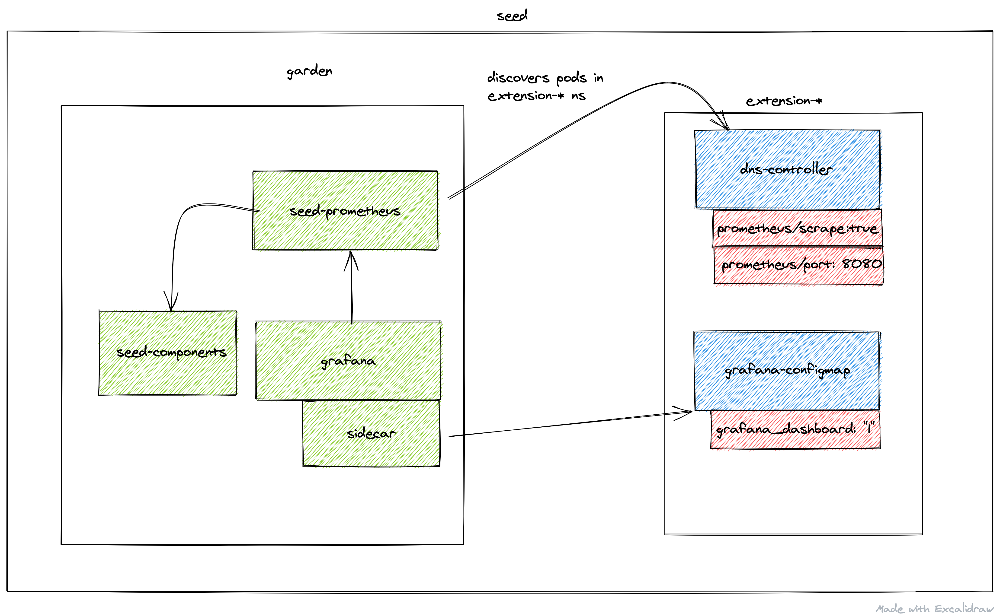

# Monitoring

## Roles of the different Prometheus instances



### Cache Prometheus

Deployed in the `garden` namespace. Important scrape targets:

- cadvisor
- node-exporter
- kube-state-metrics

**Purpose**: Act as a reverse proxy that supports server-side filtering, which is not supported by Prometheus exporters but by federation. Metrics in this Prometheus are kept for a short amount of time (~1 day) since other Prometheus instances are expected to federate from it and move metrics over. For example, the [shoot Prometheus](#shoot-prometheus) queries this Prometheus to retrieve metrics corresponding to the shoot's control plane. This way, we achieve isolation so that shoot owners are only able to query metrics for their shoots. Please note Prometheus does not support isolation features. Another example is if another Prometheus needs access to cadvisor metrics, which does not support server-side filtering, so it will query this Prometheus instead of the cadvisor. This strategy also reduces load on the kubelets and API Server.

Note some of these Prometheus' metrics have high cardinality (e.g., metrics related to all shoots managed by the seed). Some of these are aggregated with recording rules. These _pre-aggregated_ metrics are scraped by the [aggregate Prometheus](#aggregate-prometheus).

This Prometheus is not used for alerting.

### Aggregate Prometheus

Deployed in the `garden` namespace. Important scrape targets:

- other Prometheus instances
- logging components

**Purpose**: Store pre-aggregated data from the [cache Prometheus](#cache-prometheus) and [shoot Prometheus](#shoot-prometheus). An ingress exposes this Prometheus allowing it to be scraped from another cluster. Such pre-aggregated data is also used for alerting.

### Seed Prometheus

Deployed in the `garden` namespace. Important scrape targets:

- pods in extension namespaces annotated with:
```
prometheus.io/scrape=true
prometheus.io/port=<port>
prometheus.io/name=<name>
```
- cadvisor metrics from pods in the garden and extension namespaces

The job name label will be applied to all metrics from that service.

**Purpose**: Entrypoint for operators when debugging issues with extensions or other garden components.

This Prometheus is not used for alerting.

### Shoot Prometheus

Deployed in the shoot control plane namespace. Important scrape targets:

- control plane components
- shoot nodes (node-exporter)
- blackbox-exporter used to measure [connectivity](connectivity.md)

**Purpose**: Monitor all relevant components belonging to a shoot cluster managed by Gardener. Shoot owners can view the metrics in Plutono dashboards and receive alerts based on these metrics. For alerting internals refer to [this](alerting.md) document.

#### Federate from the Shoot Prometheus to an External Prometheus

Shoot owners that are interested in collecting metrics for their shoot's control-planes can do so by federating from their shoot Prometheus instances. This allows shoot owners to selectively pull metrics from the shoot Prometheus into their own Prometheus instance. Collecting shoot's control-plane metrics by directly scraping control-plane resources will not work because such resources are managed by Gardener and are either not accessible to shoot owners or are behind a load balancer.

Note Gardener is working on an OpenTelemetry-based approach for observability, but there is no official timeline for its release yet.

##### Step 1: Retrieve Prometheus Credentials and URL

Gardener provides access to the shoot control plane Prometheus instance through a monitoring secret stored in the virtual garden cluster. The necessary credentials can be found in the dashboard or by following these steps:

1. Target the shoot's project using `gardenctl`:

   ```sh
   gardenctl target --garden <garden-name> --project <project-name>
   ```

2. Retrieve the shoot's monitoring secret:

   ```sh
   kubectl get secret <shoot-name>.monitoring -o yaml
   ```

3. Extract the Prometheus URL from the secret’s annotations:

   ```sh
   metadata.annotations.prometheus-url
   ```

4. Extract the credentials from the secret’s data fields:

   ```sh
   echo "$(kubectl get secret <shoot-name>.monitoring -o jsonpath='{.data.username}' | base64 --decode)"
   echo "$(kubectl get secret <shoot-name>.monitoring -o jsonpath='{.data.password}' | base64 --decode)"

##### Step 2: Configure Federation in Your Prometheus

Once the Prometheus URL, username, and password are obtained, federation can be configured in the external Prometheus instance.

1. Edit the external Prometheus configuration to add a federation job:

   ```yaml
   scrape_configs:
     - job_name: 'gardener-federation'
       honor_labels: true
       metrics_path: '/federate'
       params:
         'match[]':
           - '{job="kube-apiserver"}'
       scheme: https
       basic_auth:
         username: '<prometheus-username>'
         password: '<prometheus-password>'
       static_configs:
         - targets:
           - '<prometheus-url>'
   ```
   Replace `<prometheus-username>`, `<prometheus-password>`, and `<prometheus-url>` with the values obtained earlier. In this example, the federation job is configured to federate metrics scraped by the `kube-apiserver` job, but `match[]` entry should be adjusted to the specific use-case.

2. Restart Prometheus to apply the configuration.

## Collect all shoot Prometheus with remote write

An optional collection of all shoot Prometheus metrics to a central Prometheus (or cortex) instance is possible with the `monitoring.shoot` setting in `GardenletConfiguration`:
```
monitoring:
  shoot:
    remoteWrite:
      url: https://remoteWriteUrl # remote write URL
      keep:# metrics that should be forwarded to the external write endpoint. If empty all metrics get forwarded
      - kube_pod_container_info
    externalLabels: # add additional labels to metrics to identify it on the central instance
      additional: label
```

If basic auth is needed it can be set via secret in garden namespace (Gardener API Server). [Example secret](../../example/10-secret-remote-write.yaml)

## Disable Gardener Monitoring

If you wish to disable metric collection for every shoot and roll your own then you can simply set.
```
monitoring:
  shoot:
    enabled: false
```
