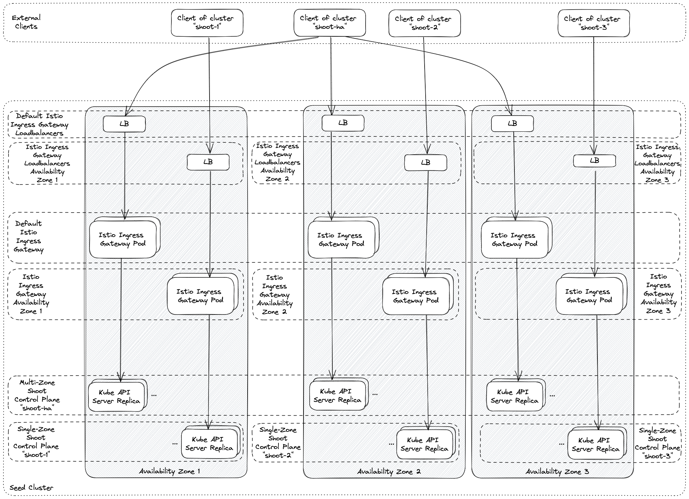

# Istio

[Istio](https://istio.io) offers a service mesh implementation with focus on several important features - traffic, observability, security, and policy.

## Prerequisites

- Third-party JWT is used, therefore each Seed cluster where this feature is enabled must have [Service Account Token Volume Projection](https://kubernetes.io/docs/tasks/configure-pod-container/configure-service-account/#service-account-token-volume-projection) enabled.
- Kubernetes 1.16+

## Differences with Istio's Default Profile

The [default profile](https://istio.io/docs/setup/additional-setup/config-profiles/) which is recommended for production deployment, is not suitable for the Gardener use case, as it offers more functionality than desired. The current installation goes through heavy refactorings due to the `IstioOperator` and the mixture of Helm values + Kubernetes API specification makes configuring and fine-tuning it very hard. A more simplistic deployment is used by Gardener. The differences are the following:

- Telemetry is not deployed.
- `istiod` is deployed.
- `istio-ingress-gateway` is deployed in a separate `istio-ingress` namespace.
- `istio-egress-gateway` is not deployed.
- None of the Istio addons are deployed.
- Mixer (deprecated) is not deployed.
- Mixer CDRs are not deployed.
- Kubernetes `Service`, Istio's `VirtualService` and `ServiceEntry` are **NOT** advertised in the service mesh. This means that if a `Service` needs to be accessed directly from the Istio Ingress Gateway, it should have `networking.istio.io/exportTo: "*"` annotation. `VirtualService` and `ServiceEntry` must have `.spec.exportTo: ["*"]` set on them respectively.
- Istio injector is not enabled.
- mTLS is enabled by default.

## Handling Multiple Availability Zones with Istio

For various reasons, e.g., improved resiliency to certain failures, it may be beneficial to use multiple availability zones in a seed cluster. While availability zones have advantages in being able to cover some failure domains, they also come with some additional challenges. Most notably, the latency across availability zone boundaries is higher than within an availability zone. Furthermore, there might be additional cost implied by network traffic crossing an availability zone boundary. Therefore, it may be useful to try to keep traffic within an availability zone if possible. The istio deployment as part of Gardener has been adapted to allow this.

A seed cluster spanning multiple availability zones may be used for [highly-available shoot control planes](../usage/high-avaliability/shoot_high_availability.md). Those control planes may use a single or multiple availability zones. In addition to that, ordinary non-highly-available shoot control planes may be scheduled to such a seed cluster as well. The result is that the seed cluster may have control planes spanning multiple availability zones and control planes that are pinned to exactly one availability zone. These two types need to be handled differently when trying to prevent unnecessary cross-zonal traffic.

The goal is achieved by using multiple istio ingress gateways. The default istio ingress gateway spans all availability zones. It is used for multi-zonal shoot control planes. For each availability zone, there is an additional istio ingress gateway, which is utilized only for single-zone shoot control planes pinned to this availability zone. This is illustrated in the following diagram.

Please note that operators may need to perform additional tuning to prevent cross-zonal traffic completely. The [loadbalancer settings in the seed specification](./seed_settings.md#load-balancer-services) offer various options, e.g., by setting the external traffic policy to `local` or using infrastructure specific loadbalancer annotations.

Furthermore, note that this approach is also taken in case [`ExposureClass`es](../usage/networking/exposureclasses.md) are used. For each exposure class, additional zonal istio ingress gateways may be deployed to cover for single-zone shoot control planes using the exposure class.
