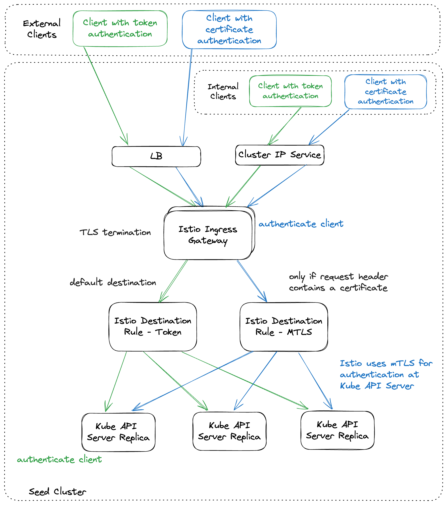

# Kube API server load balancing

Load balancing for shoot and garden Kube API servers leverages the [Gardener Istio deployment](istio.md).

In default mode Istio performs L4 load balancing. Istio distributes connections to Kube API servers preferably in the
same zone ([Topology-Aware Traffic Routing](topology_aware_routing.md#topology-aware-services-in-the-seed-cluster)).
Requests are not taken into account for a load balancing decisions. TLS is terminated by Kube API server instances.  

There is a second mode which can be activated via `IstioTLSTermination` feature gate in `gardenlet` and `gardener-operator`.
This mode introduces L7 load balancing and distributes requests among the Kube API server instances.
It does not use [Topology-Aware Traffic Routing](topology_aware_routing.md) since it contradicts the load balancing goal.
In this mode TLS is terminated in Istio. However, Istio creates a TLS connection to Kube API servers, too, so the
traffic within the cluster remains encrypted.

This document is focused on the second mode.

## How it works

L7 load balancing currently works for the externally resolvable Kube API server endpoints only. Connections which use
`apiserver-proxy` like `kubernetes.default.svc.cluster.local` still use L4 load balancing.

Clients might authenticate at Kube API server using client certificates, tokens or might connect unauthenticated. In the
first case Istio ingress gateway must validate client certificates because it terminates the TLS connection. Thus, it is
configured with an optional mutual TLS authentication. It is optional because in case of the authentication via token,
the token is validated by Kube API server. Unauthenticated requests are handled by Kube API server too. For TLS
termination and client certificate validation Kube API server certificate (including the private key) and the client CA
bundle must be synchronized into the namespace where istio ingress gateway is running.

While token authentication and unauthenticated requests are still handled by Kube API server itself, it requires
[dedicated request headers](https://kubernetes.io/docs/reference/access-authn-authz/authentication/#authenticating-proxy)
if an authentication proxy is used. Based on these headers Kube API server identifies the user and group of a request.
They are added with a lua script running in an envoy filter in istio ingress gateway. Kube API server trusts the headers
set by the authentication proxy so it requires an mTLS connection to the proxy. Istio uses the front proxy CA
(including private key) and the server CA bundle to establish the mTLS connection. These secrets again must be synchronized
into the namespace where istio ingress gateway is running. There is an own istio destination rule for the mTLS connection.

The destination host of the istio virtual service has an istio destination rule which does not use mTLS so that Kube API
server authenticates requests by itself. It is used for the token based authentication. The istio destination rule for
the mTLS connection is set by the lua script mentioned above only. This is a safety net to prevent that requests can
reach Kube API server via the trusted connection in case the lua scripts fails for some reason.

The flow for L7 load balancing is shown in the following illustration.

