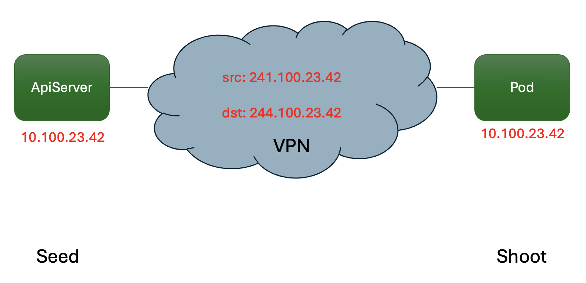

# Overlapping Network Ranges

## Motivation
Shoot clusters, and their control planes are deployed in a network managed by the Gardener. The control plane can
access shoot pods, services and nodes via a VPN connection. This makes it necessary that both the shoot and the 
control plane network ranges do not overlap. This limitation can be problematic in some cases where the network 
requirements of the shoot make a placement on existing seed clusters impossible. In the past, this has led to the costly
mitigation of deploying additional seed clusters with non-overlapping network ranges.
This document describes how Gardener handles overlapping network ranges in shoot clusters, 
which allows for more flexibility in network design and shoot placement.

## How it works
Inside the VPN tunnel, seed pod IPs and shoot IPs are disentangled by using a double-NAT mechanism, 
i.e., both the source and destination IPs are translated as shown in the following diagram:

The NAT ranges are reserved from the 240/4 range as defined in [RFC 6890](https://datatracker.ietf.org/doc/html/rfc6890#section-2.7.4)
and thus cannot be used as shoot ranges. You can find the specific ranges in the [user networking guide](https://github.com/gardener/gardener/blob/master/docs/usage/networking/shoot_networking.md#reserved-networks)

> [!IMPORTANT]
> The double-NAT mechanism only applies to the IPv4 family.
> For dual-stack or IPv6-only shoots, the IPv6 CIDRs still must not overlap with the seed CIDRs.
> However, since the IPv6 ranges are usually assigned by the cloud provider, this is not a problem in practice.

The double-NATing is achieved by IPtables rules on both ends of the VPN tunnel. The end user does not need to configure anything, as Gardener automatically applies the double-NAT mechanism when the shoot is created.
The NAT IPs from the 240/4 range also don't show up outside the VPN tunnel, so they are not visible to the end user.

## HA vs. Non-HA Shoots
The double-NAT mechanism is applied to both HA and non-HA shoots. However, the implementation differs slightly:

### Non-HA Shoots
Non-HA shoots deploy a single VPN server with an Envoy proxy in front of it. Kube-Apiserver connects to the shoot networks via this proxy.
OpenVPN operates in client-server mode, where there is one vpn client in the shoot connecting to the vpn server in the seed.
Kube-Apiserver is not connected directly to the VPN network.

### HA Shoots
[HA shoots](https://github.com/gardener/gardener/blob/master/docs/usage/high-availability/shoot_high_availability.md) deploy two VPN servers as a StatefulSet. Kube-Apiserver is connected directly to the VPN network via two VPN clients, one for each VPN server.
OpenVPN operates in client-to-client mode, where shoot VPN clients and seed VPN clients can communicate with each other directly.

#### Non-Overlapping Ranges
When an HA shoot is created, Gardener checks if the shoot pod, service, and node CIDRs overlap with the seed pod, service, and node CIDRs.
If they don't overlap, the shoot is created as usual. No double-NATing is applied, and the shoot pod, service, and node CIDRs are used as-is.

#### Overlapping Ranges
If an overlap is detected, Gardener applies the double-NAT mechanism as described above. An additional Envoy proxy is deployed in front of the VPN servers to handle the double-NATing.
This is handled transparently in Gardener and the underlying VPN, and the end user does not need to configure anything.