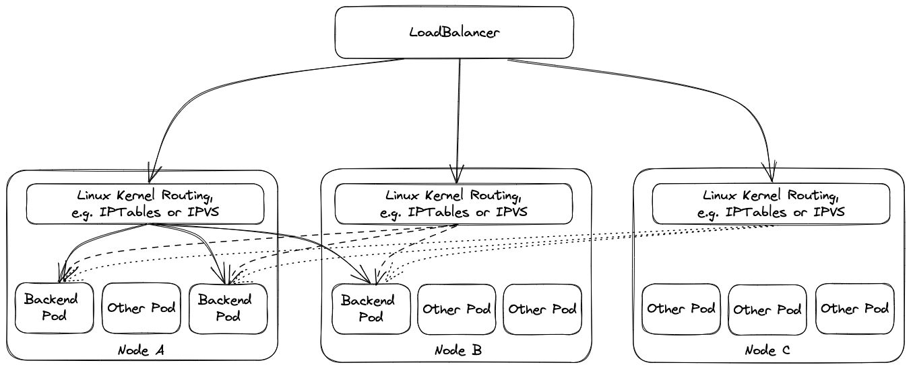

# Settings for `Seed`s

The `Seed` resource offers a few settings that are used to control the behaviour of certain Gardener components.
This document provides an overview over the available settings:

## Dependency Watchdog

Gardenlet can deploy two instances of the [dependency-watchdog](https://github.com/gardener/dependency-watchdog) into the `garden` namespace of the seed cluster.
One instance only activates the weeder while the second instance only activates the prober.

### Weeder

The weeder helps to alleviate the delay where control plane components remain unavailable by finding the respective pods in `CrashLoopBackoff` status and restarting them once their dependents become ready and available again.
For example, if `etcd` goes down then also `kube-apiserver` goes down (and into a `CrashLoopBackoff` state). If `etcd` comes up again then (without the `endpoint` controller) it might take some time until `kube-apiserver` gets restarted as well.

:warning: `.spec.settings.dependencyWatchdog.endpoint.enabled` is deprecated and will be removed in a future version of Gardener. Use `.spec.settings.dependencyWatchdog.weeder.enabled` instead.

It can be enabled/disabled via the `.spec.settings.dependencyWatchdog.endpoint.enabled` field.
It defaults to `true`.

### Prober

The `probe` controller scales down the `kube-controller-manager` of shoot clusters in case their respective `kube-apiserver` is not reachable via its external ingress.
This is in order to avoid melt-down situations, since the `kube-controller-manager` uses in-cluster communication when talking to the `kube-apiserver`, i.e., it wouldn't be affected if the external access to the `kube-apiserver` is interrupted for whatever reason.
The `kubelet`s on the shoot worker nodes, however, would indeed be affected since they typically run in different networks and use the external ingress when talking to the `kube-apiserver`.
Hence, without scaling down `kube-controller-manager`, the nodes might be marked as `NotReady` and eventually replaced (since the `kubelet`s cannot report their status anymore).
To prevent such unnecessary turbulence, `kube-controller-manager` is being scaled down until the external ingress becomes available again. In addition, as a precautionary measure, `machine-controller-manager` is also scaled down, along with `cluster-autoscaler` which depends on `machine-controller-manager`.

:warning: `.spec.settings.dependencyWatchdog.probe.enabled` is deprecated and will be removed in a future version of Gardener. Use `.spec.settings.dependencyWatchdog.prober.enabled` instead.

It can be enabled/disabled via the `.spec.settings.dependencyWatchdog.probe.enabled` field.
It defaults to `true`.

## Reserve Excess Capacity

If the excess capacity reservation is enabled, then the gardenlet will deploy a special `Deployment` into the `garden` namespace of the seed cluster.
This `Deployment`'s pod template has only one container, the `pause` container, which simply runs in an infinite loop.
The priority of the deployment is very low, so any other pod will preempt these `pause` pods.
This is especially useful if new shoot control planes are created in the seed.
In case the seed cluster runs at its capacity, then there is no waiting time required during the scale-up.
Instead, the low-priority `pause` pods will be preempted and allow newly created shoot control plane pods to be scheduled fast.
In the meantime, the cluster-autoscaler will trigger the scale-up because the preempted `pause` pods want to run again.
However, this delay doesn't affect the important shoot control plane pods, which will improve the user experience.

Use `.spec.settings.excessCapacityReservation.configs` to create excess capacity reservation deployments which allow to specify custom values for `resources`, `nodeSelector` and `tolerations`. Each config creates a deployment with a minimum number of 2 replicas and a maximum equal to the number of zones configured for this seed.
It defaults to a config reserving 2 CPUs and 6Gi of memory for each pod with no `nodeSelector` and no `tolerations`.

Excess capacity reservation is enabled when `.spec.settings.excessCapacityReservation.enabled` is `true` or not specified while `configs` are present. It can be disabled by setting the field to `false`.

## Scheduling

By default, the Gardener Scheduler will consider all seed clusters when a new shoot cluster shall be created.
However, administrators/operators might want to exclude some of them from being considered by the scheduler.
Therefore, seed clusters can be marked as "invisible".
In this case, the scheduler simply ignores them as if they wouldn't exist.
Shoots can still use the invisible seed but only by explicitly specifying the name in their `.spec.seedName` field.

Seed clusters can be marked visible/invisible via the `.spec.settings.scheduling.visible` field.
It defaults to `true`.

ℹ️ In previous Gardener versions (< 1.5) these settings were controlled via taint keys (`seed.gardener.cloud/{disable-capacity-reservation,invisible}`).
The taint keys are no longer supported and removed in version 1.12.
The rationale behind it is the implementation of tolerations similar to Kubernetes tolerations.
More information about it can be found in [#2193](https://github.com/gardener/gardener/issues/2193).

## Load Balancer Services

Gardener creates certain Kubernetes `Service` objects of type `LoadBalancer` in the seed cluster.
Most prominently, they are used for exposing the shoot control planes, namely the kube-apiserver of the shoot clusters.
In most cases, the cloud-controller-manager (responsible for managing these load balancers on the respective underlying infrastructure) supports certain customization and settings via annotations.
[This document](https://kubernetes.io/docs/concepts/services-networking/service/#loadbalancer) provides a good overview and many examples.

By setting the `.spec.settings.loadBalancerServices.annotations` field the Gardener administrator can specify a list of annotations, which will be injected into the `Service`s of type `LoadBalancer`.

### External Traffic Policy

Setting the [external traffic policy](https://kubernetes.io/docs/tasks/access-application-cluster/create-external-load-balancer/#preserving-the-client-source-ip) to `Local` can be beneficial as it
preserves the source IP address of client requests. In addition to that, it removes one hop in the data path and hence reduces request latency. On some cloud infrastructures, it can furthermore be
used in conjunction with `Service` annotations as described above to prevent cross-zonal traffic from the load balancer to the backend pod.

The default external traffic policy is `Cluster`, meaning that all traffic from the load balancer will be sent to any cluster node, which then itself will redirect the traffic to the actual receiving pod.
This approach adds a node to the data path, may cross the zone boundaries twice, and replaces the source IP with one of the cluster nodes.

Using external traffic policy `Local` drops the additional node, i.e., only cluster nodes with corresponding backend pods will be in the list of backends of the load balancer. However, this has multiple implications.
The health check port in this scenario is exposed by `kube-proxy` , i.e., if `kube-proxy` is not working on a node a corresponding pod on the node will not receive traffic from
the load balancer as the load balancer will see a failing health check. (This is quite different from ordinary service routing where `kube-proxy` is only responsible for setup, but does not need to
run for its operation.) Furthermore, load balancing may become imbalanced if multiple pods run on the same node because load balancers will split the load equally among the nodes and not among the pods. This is mitigated by corresponding node anti affinities.

Operators need to take these implications into account when considering switching external traffic policy to `Local`.

### Proxy Protocol

Traditionally, the client IP address can be used for security filtering measures, e.g. IP allow listing. However, for this to have any usefulness, the client IP address needs to be correctly transferred to the filtering entity.

Load balancers can either act transparently and simply pass the client IP on, or they terminate one connection and forward data on a new connection. The latter (intransparant) approach requires a separate way to propagate the client IP address. Common approaches are an HTTP header for TLS terminating load balancers or [(HA) proxy protocol](https://www.haproxy.org/download/3.0/doc/proxy-protocol.txt).

For level 3 load balancers, [(HA) proxy protocol](https://www.haproxy.org/download/3.0/doc/proxy-protocol.txt) is the default way to preserve client IP addresses. As it prepends a small proxy protocol header before the actual workload data, the receiving server needs to be aware of it and handle it properly. This means that activating proxy protocol needs to happen on both load balancer and receiving server at/around the same time, as otherwise the receiving server will incorrectly interpret data as workload/proxy protocol header.

For disruption-free migration to proxy protocol, set `.spec.settings.loadBalancerServices.proxyProtocol.allow` to `true`. The migration path should be to enable the option and shortly thereafter also enable proxy protocol on the load balancer with infrastructure-specific means, e.g. a corresponding load balancer annotation.

When switching back from use of proxy protocol to no use of it, use the inverse order, i.e. disable proxy protocol first on the load balancer before disabling `.spec.settings.loadBalancerServices.proxyProtocol.allow`.

### Zone-Specific Settings

In case a seed cluster is configured to use multiple zones via `.spec.provider.zones`, it may be necessary to configure the load balancers in individual zones in different way, e.g., by utilizing
different annotations. One reason may be to reduce cross-zonal traffic and have zone-specific load balancers in place. Zone-specific load balancers may then be bound to zone-specific subnets or
availability zones in the cloud infrastructure.

Besides the load balancer annotations, it is also possible to set [proxy protocol termination](#proxy-protocol) and the [external traffic policy](#external-traffic-policy) for each zone-specific load balancer individually.

## Vertical Pod Autoscaler

Gardener heavily relies on the Kubernetes [`vertical-pod-autoscaler` component](https://github.com/kubernetes/autoscaler/tree/master/vertical-pod-autoscaler).
By default, the seed controller deploys the VPA components into the `garden` namespace of the respective seed clusters.
In case you want to manage the VPA deployment on your own or have a custom one, then you might want to disable the automatic deployment of Gardener.
Otherwise, you might end up with two VPAs, which will cause erratic behaviour.
By setting the `.spec.settings.verticalPodAutoscaler.enabled=false`, you can disable the automatic deployment.

⚠️ In any case, there must be a VPA available for your seed cluster. Using a seed without VPA is not supported.

### VPA Pitfall: Excessive Resource Requests Making Pod Unschedulable
VPA is unaware of node capacity, and can increase the resource requests of a pod beyond the capacity of any single node.
Such pod is likely to become permanently unschedulable. That problem can be partly mitigated by using the
`VerticalPodAutoscaler.Spec.ResourcePolicy.ContainerPolicies[].MaxAllowed` field to constrain pod resource requests to
the level of nodes' allocatable resources. The downside is that a pod constrained in such fashion would be using more
resources than it has requested, and can starve for resources and/or negatively impact neighbour pods with which it is
sharing a node.

As an alternative, in scenarios where MaxAllowed is not set, it is important to maintain a worker pool which can
accommodate the highest level of resources that VPA would actually request for the pods it controls.

Finally, the optimal strategy typically is to both ensure large enough worker pools, and, as an insurance,
use MaxAllowed aligned with the allocatable resources of the largest worker.

## Topology-Aware Traffic Routing

Refer to the [Topology-Aware Traffic Routing documentation](./topology_aware_routing.md) as this document contains the documentation for the topology-aware routing Seed setting.
