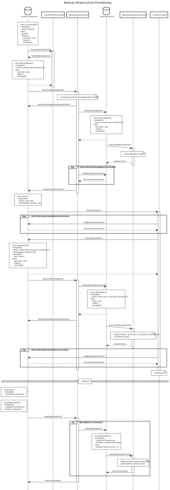

# Backup Infrastructure CRD and Controller Redesign

## Goal

- As an operator, I would like to efficiently use the backup bucket for multiple clusters, thereby limiting the total number of buckets required.
- As an operator, I would like to use a different cloud provider for backup bucket provisioning other than тхе cloud provider used for seed infrastructure.
- Have seed independent backups, so that we can easily migrate a shoot from one seed to another.
-	Execute the backup operations (including bucket creation and deletion) from a seed, because network connectivity may only be ensured from the seeds (not necessarily from the garden cluster).
-	Preserve the garden cluster as source of truth (no information is missing in the garden cluster to reconstruct the state of the backups even if seed and shoots are lost completely).
-	Do not violate the infrastructure limits in regards to blob store limits/quotas.

## Motivation

Currently, every shoot cluster has its own etcd backup bucket with a centrally configured retention period. With the growing number of clusters, we are soon running out of the [quota limits of buckets on the cloud provider](https://gist.github.com/swapnilgm/5c4d5506811e63c32ab3d73c4171d30f). Moreover, even if the clusters are deleted, the backup buckets do exist, for a configured period of retention. Hence, there is need of minimizing the total count of buckets.

In addition, currently we use seed infrastructure credentials to provision the bucket for etcd backups. This results in binding backup bucket provider to seed infrastructure provider.

## Terminology

* **Bucket**: It is equivalent to s3 bucket, abs container, gcs bucket, swift container, alicloud bucket.
* **Object**: It is equivalent s3 object, abs blob, gcs object, swift object, alicloud object,  snapshot/backup of etcd on object store.
* **Directory**: There is no concept of directory in object store as such, but usually they use directory as `/` separate common prefix for set of objects. Alternatively, they use term folder for the same.
* **deletionGracePeriod**: This signifies the grace period or retention period for which backups will be persisted post deletion of shoot.

## Current Spec
```YAML
#BackupInfra spec
Kind: BackupInfrastructure
Spec:
    seed: seedName
    shootUID : shoot.status.uid
```

## Current Naming Conventions
|||
|--|--|
|SeedNamespace : |Shoot--projectname--shootname|
|seed : |seedname|
|ShootUID : |shoot.status.UID|
|BackupInfraname :| seednamespce+sha(uid)[:5]|
|Backup-bucket-name : |BackupInfraName|
|BackupNamespace :| backup--BackupInfraName|

## Proposal

Considering the [Gardener extension proposal](https://github.com/gardener/gardener/blob/master/docs/proposals/01-extensibility.md#backup-infrastructure-provisioning) in mind, the backup infrastructure controller can be divided in two parts. There will be basically four backup infrastructure related CRD's, two on the garden apiserver and two on the seed cluster. Before going into the workflow, let's just first have look at the CRD.

### CRD on Garden Cluster
Just to give a brief overview before going into the details, we will be sticking to the fact that Garden apiserver is always the single source of truth. Since backupInfra will be maintained post deletion of shoot, the info regarding this should always come from the garden apiserver. We will continue to have a BackupInfra resource on the garden apiserver, with some modifications.

```yaml
apiVersion: garden.cloud/v1alpha1
kind: BackupBucket
metadata:
  name: packet-region1-uid[:5]
  # No namespace needed. This will be a cluster scope resource.
  ownerReferences:
  - kind: CloudProfile
    name: packet
spec:
  provider: aws
  region: eu-west-1
  secretRef: # Required for root
    name: backup-operator-aws
    namespace: garden
status:
  lastOperation: ...
  observedGeneration: ...
  seed: ...
```

```yaml
apiVersion: garden.cloud/v1alpha1
kind: BackupEntry
metadata:
  name: shoot--dev--example--3ef42 # Naming convention explained before
  namespace: garden-dev
  ownerReferences:
  - apiVersion: core.gardener.cloud/v1beta1
    blockOwnerDeletion: false
    controller: true
    kind: Shoot
    name: example
    uid: 19a9538b-5058-11e9-b5a6-5e696cab3bc8
spec:
  shootUID: 19a9538b-5058-11e9-b5a6-5e696cab3bc8 # Just for reference to find back associated shoot.
  # The following section comes from cloudProfile or seed yaml based on granularity decision.
  bucketName: packet-region1-uid[:5]
status:
  lastOperation: ...
  observedGeneration: ...
  seed: ...
```

### CRD on Seed Cluster
Considering the extension proposal, we want individual components to be handled by a controller inside the seed cluster. We will have a Backup related resource in the registered seed cluster as well.

```yaml
apiVersion: extensions.gardener.cloud/v1alpha1
kind: BackupBucket
metadata:
  name: packet-random[:5]
  # No namespace need. This will be a cluster scope resource
spec:
  type: aws
  region: eu-west-1
  secretRef:
    name: backup-operator-aws
    namespace: backup-garden
status:
  observedGeneration: ...
  state: ...
  lastError: ..
  lastOperation: ...
```

There are two points for introducing a BackupEntry resource:
1. The cloud provider specific code goes completely in the seed cluster.
2. Network issues are also handled by moving the deletion part to backup-extension-controller in the seed cluster.

```yaml
apiVersion: extensions.gardener.cloud/v1alpha1
kind: BackupEntry
metadata:
  name: shoot--dev--example--3ef42 # Naming convention explained later
  # No namespace need. This will be a cluster scope resource
spec:
  type: aws
  region: eu-west-1
  secretRef: # Required for root
    name: backup-operator-aws
    namespace: backup-garden
status:
  observedGeneration: ...
  state: ...
  lastError: ..
  lastOperation: ...
```

### Workflow

- A Gardener administrator will configure the cloudProfile with backup infra credentials and provider config as follows:

```yaml
# CloudProfile.yaml:
Spec:
    backup:
        provider: aws
        region: eu-west-1
        secretRef:
            name: backup-operator-aws
            namespace: garden
```
Here CloudProfileController will interpret this spec as follows:
- If `spec.backup` is nil:
  - No backup for any shoot.
- If `spec.backup.region` is not nil:
  - Then respect it, i.e. use the provider and unique region field mentioned there for BackupBucket.
  - Here, preferably, the `spec.backup.region` field will be unique. For cross provider the name being the same doesn’t make much sense, since the region name will be different for different providers.
- Otherwise, if `spec.backup.region` is nil:
  - In case of a same provider, i.e. `spec.backup.provider` = `spec.<type-of-provider>` or nil:
    - Then, for each region from `spec.<type-of-provider>.constraints.regions` create a `BackupBucket` instance. This can be done lazily, i.e. create a `BackupBucket` instance for region only if some seed actually spawned in the region has been registered. This will avoid creating an IaaS bucket even if no seed is registered in that region, but the region is listed in the `cloudprofile`.
    - The shoot controller will choose a backup container as per the seed region (With shoot control plane migration also, the seed’s availability zone might change but the region will remain the same as per the current scope).
  - Otherwise, in a cross provider, i.e. `spec.backup.provider` != `spec.<type-of-provider>`:
    - Report validation error: Since, for example,  we can’t expect `spec.backup.provider` = `aws`  to support the region in `spec.packet.constraint.region`, where `<type-of-provider>` is `packet`.

The following diagram represent the overall flow in details:



#### Reconciliation

Reconciliation on backup entry in the seed cluster mostly comes in the picture at the time of deletion. But we can add initialization steps like the creation of a [directory](#terminology) specific to a shoot in the backup bucket. We can simply create a BackupEntry at the time of shoot deletion as well.

#### Deletion
- On shoot deletion, the BackupEntry instance, i.e. shoot specific instance, will get a deletion timestamp because of `ownerReference`.
- If the `deletionGracePeriod` configured in the GCM component configuration is expired, the BackupInfrastructure Controller will delete the backup folder associated with it from the backup object store.
- Finally, it will remove the `finalizer` from the backupEntry instance.

### Alternative


## Discussion Points / Variations
### Manual vs Dynamic Bucket Creation
- As per the limit observed on different cloud providers, we can have a single bucket for backups on one cloud providers. So, we could avoid the little complexity introduced in the above approach by pre-provisioning buckets as a part of the landscape setup. But there won't be anybody to detect bucket existence and its reconciliation. Ideally, this should be avoided.

- Another thing we can have is, we can let an administrator register the pool of the root backup infra resource and let the controller schedule a backup on one of this.

- One more variation here could be to create a bucket dynamically per hash of the shoot UID.


### SDK vs Terraform
The initial reason for going for terraform script is its stability and the provided parallelism/concurrency in resource creation. For backup infrastructure, Terraform scripts are very minimal right now. It simply has a bucket creation script. With shared bucket logic, if possible, we might want to isolate access at the [directory](#terminology) level but again its additional one call. So, we will prefer switching to SDK for all object store operations.

### Limiting the Number of Shoots per Bucket
Again, as per the limit observed on different cloud providers, we can have a single bucket for backups on one cloud provider. But if we want to limit the number of shoots associated with bucket, we can have the central map of configuration in `gardener-controller-component-configuration.yaml`, where we will mark the supported count of shoots per cloud provider. The most probable space could be
`controller.backupInfrastructures.quota`. If the limit is reached, we can create a new `BucketBucket` instance.

For example:
```yaml
apiVersion: controllermanager.config.gardener.cloud/v1alpha1
kind: ControllerManagerConfiguration
controllers:
  backupInfrastructure:
    quota:
      - provider: aws
        limit: 100 # The numbers mentioned here are random, just for example purpose.
      - provider: azure
        limit: 80
      - provider: openstack
        limit: 100
      ...
```

## Backward Compatibility
### Migration
1. Create a shoot specific folder.
1. Transfer the old objects.
1. Create a manifest of the objects on a new bucket:
    - Each entry will have status: `None`, `Copied`, `NotFound`.
    - Copy objects one by one.
1. Scale down etcd-main with the old config. :warning: Cluster down time
1. Copy the remaining objects.
1. Scale up etcd-main with the new config.
2. Destroy the old bucket and the old backup namespace. It can be immediate or, preferably, a __lazy__ deletion.


### Legacy Mode Alternative
- If the Backup namespace is present in the seed cluster, then follow the legacy approach, i.e. reconcile the creation/existence of shoot specific bucket and backup namespace.
- If the backup namespace is not created, use shared bucket.
- __Limitation__ You never know when the existing cluster will be deleted, and hence, it might be a little difficult to maintain with the next release of Gardener. This might look simple and straight-forward for now but may become a pain point in the future, if in the worst case, because of some new use cases or refactoring, we have to change the design again. Also, even after multiple garden release we won't be able to remove deprecated existing BackupInfrastructure CRDs.

<!--
## Extension
 :ballot_box_with_check: _TODO:_ Out-of-tree object store interface library.
-->

### References
* [Gardener extension proposal](https://github.com/gardener/gardener/blob/master/docs/proposals/01-extensibility.md#backup-infrastructure-provisioning)
* [Cloud providers object store limit comparison](https://gist.github.com/swapnilgm/5c4d5506811e63c32ab3d73c4171d30f)


[references]: #references
