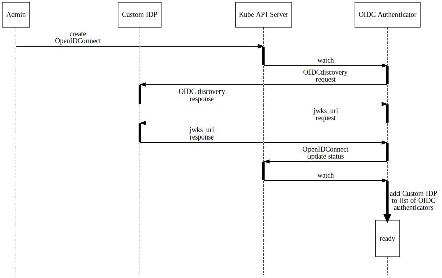
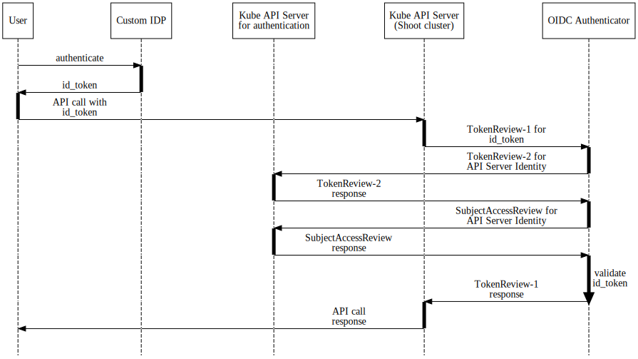

# OIDC Webhook Authenticator

## Problem

In Kubernetes, you can authenticate via several authentication strategies:

- x509 Client Certificates
- Static Token Files
- Bootstrap Tokens
- Static Password File (Basic authentication - deprecated and removed in 1.19)
- Service Account Tokens
- OpenID Connect Tokens
- Webhook Token Authentication
- Authenticating Proxy

End-users should use [OpenID Connect (OIDC) Tokens](https://kubernetes.io/docs/reference/access-authn-authz/authentication/#openid-connect-tokens) created by OIDC-compatible Identity Provider (IDP) and present [id_token](https://openid.net/specs/openid-connect-core-1_0.html#IDToken) to the `kube-apiserver`. If the `kube-apiserver` is configured to trust the IDP and the token is valid, then the user is authenticated and the [UserInfo](https://github.com/kubernetes/kubernetes/blob/99019502bd6ed038dbd1c444974d5e8c6a8dda19/staging/src/k8s.io/api/authentication/v1/types.go#L100-L117) is sent to the authorization stack.

Ideally, operators of the Gardener cluster should be able to authenticate to end-user shoot clusters with `id_token` generated by OIDC IDP, but in many cases, end-users might have already configured OIDC for their cluster and more than one OIDC configurations are not allowed.

Another interesting application of multiple OIDC providers would be per `Project` OIDC provider, where end-users of Gardener can add their own OIDC-compatible IDPs.

To workaround the one OIDC per `kube-apiserver` limitation, a new `OIDC Webhook Authenticator` (OWA) could be implemented.

## Goals

- Dynamic registrations of OpenID Connect configurations.
- Close as possible to the Kubernetes build-in OIDC Authenticator.
- Build as an optional extension and not required for functional shoot or Gardener cluster.

## Non-Goals

- [Dynamic Authorization](https://kubernetes.io/docs/reference/access-authn-authz/webhook/) is out of scope.

## Proposal

The `kube-apiserver` can use [Webhook Token Authentication](https://kubernetes.io/docs/reference/access-authn-authz/authentication/#webhook-token-authentication) to send a [Bearer Tokens (id_token)](https://tools.ietf.org/html/rfc6750#section-2.1) to the external webhook for validation:

```json
{
  "apiVersion": "authentication.k8s.io/v1beta1",
  "kind": "TokenReview",
  "spec": {
    "token": "(BEARERTOKEN)"
  }
}
```

Where upon verification, the remote webhook returns the identity of the user (if authentication succeeds):

```json
{
  "apiVersion": "authentication.k8s.io/v1beta1",
  "kind": "TokenReview",
  "status": {
    "authenticated": true,
    "user": {
      "username": "janedoe@example.com",
      "uid": "42",
      "groups": [
        "developers",
        "qa"
      ],
      "extra": {
        "extrafield1": [
          "extravalue1",
          "extravalue2"
        ]
      }
    }
  }
}
```

### Registration of New OpenIDConnect

This new OWA can be configured with multiple OIDC providers and the entire flow can look like this:

1. Admin adds a new `OpenIDConnect` resource (via CRD) to the cluster.

    ```yaml
    apiVersion: authentication.gardener.cloud/v1alpha1
    kind: OpenIDConnect
    metadata:
      name: foo
    spec:
      issuerURL: https://foo.bar
      clientID: some-client-id
      usernameClaim: email
      usernamePrefix: "test-"
      groupsClaim: groups
      groupsPrefix: "baz-"
      supportedSigningAlgs:
      - RS256
      requiredClaims:
        baz: bar
      caBundle: LS0tLS1CRUdJTiBDRVJU...base64-encoded CA certs for issuerURL.
    ```

1. OWA watches for changes on this resource and does [OIDC discovery](https://openid.net/specs/openid-connect-discovery-1_0.html). The [OIDC provider's configuration](https://openid.net/specs/openid-connect-discovery-1_0.html#ProviderConfigurationResponse) has to be accessible under the `spec.issuerURL` with a [well-known path (.well-known/openid-configuration)](https://openid.net/specs/openid-connect-discovery-1_0.html#ProviderConfig).
1. OWA uses the `jwks_uri` obtained from the OIDC providers configuration, to fetch the OIDC provider's public keys from that endpoint.
1. OWA uses those keys, issuer, client_id and other settings to add an OIDC authenticator to an in-memory list of [Token Authenticators](https://pkg.go.dev/k8s.io/apiserver/pkg/authentication/authenticator?tab=doc#Token).



### End-User Authentication via New OpenIDConnect IDP

When a user presents an `id_token` obtained from a OpenID Connect, the flow looks like this:

1. The user authenticates against a Custom IDP.
1. `id_token` is obtained from the Custom IDP.
1. The user uses `id_token` to perform an API call to `kube-apiserver`.
1. As the `id_token` is not matched by any build-in or configured authenticators in the `kube-apiserver`, it is send to OWA for validation.

    ```json
    {
      "TokenReview": {
        "kind": "TokenReview",
        "apiVersion": "authentication.k8s.io/v1beta1",
        "spec": {
          "token": "ddeewfwef..."
        }
      }
    }
    ```

1. OWA uses `TokenReview` to authenticate the calling API server (the `kube-apiserver` for delegation of authentication and authorization may be different from the calling `kube-apiserver`).

    ```json
    {
      "TokenReview": {
        "kind": "TokenReview",
        "apiVersion": "authentication.k8s.io/v1beta1",
        "spec": {
          "token": "api-server-token..."
        }
      }
    }
    ```

1. After the Authentication API server returns the identity of the calling API server:

    ```json
    {
        "apiVersion": "authentication.k8s.io/v1",
        "kind": "TokenReview",
        "metadata": {
            "creationTimestamp": null
        },
        "spec": {
            "token": "eyJhbGciOiJSUzI1NiIsImtpZCI6InJocEdLTXZlYjV1OE5heD..."
        },
        "status": {
            "authenticated": true,
            "user": {
                "groups": [
                    "system:serviceaccounts",
                    "system:serviceaccounts:shoot--abcd",
                    "system:authenticated"
                ],
                "uid": "14db103e-88bb-4fb3-8efd-ca9bec91c7bf",
                "username": "system:serviceaccount:shoot--abcd:kube-apiserver"
            }
        }
    }
    ```

    OWA makes a `SubjectAccessReview` call to the Authorization API server to ensure that calling API server is allowed to validate tokens:

    ```json
    {
      "apiVersion": "authorization.k8s.io/v1",
      "kind": "SubjectAccessReview",
      "spec": {
        "groups": [
          "system:serviceaccounts",
          "system:serviceaccounts:shoot--abcd",
          "system:authenticated"
        ],
        "nonResourceAttributes": {
          "path": "/validate-token",
          "verb": "post"
        },
        "user": "system:serviceaccount:shoot--abcd:kube-apiserver"
      },
      "status": {
        "allowed": true,
        "reason": "RBAC: allowed by RoleBinding \"kube-apiserver\" of ClusterRole \"kube-apiserver\" to ServiceAccount \"system:serviceaccount:shoot--abcd:kube-apiserver\""
      }
    }
    ```

1. OWA then iterates over all registered `OpenIDConnect` Token authenticators and tries to validate the token.
1. Upon a successful validation, it returns the `TokeReview` with user, groups, and extra parameters:

    ```json
    {
      "TokenReview": {
        "kind": "TokenReview",
        "apiVersion": "authentication.k8s.io/v1beta1",
        "spec": {
          "token": "ddeewfwef..."
        },
        "status": {
          "authenticated": true,
          "user": {
            "username": "test-foo@bar.com",
            "groups": [
              "baz-employee"
            ],
            "extra": {
              "gardener.cloud/authenticator/name": [
                "foo"
              ],
              "gardener.cloud/authenticator/uid": [
                "e5062528-e5a4-4b97-ad83-614d015b0979"
              ]
            }
          }
        }
      }
    }
    ```

    It also adds some extra information which can be used by custom authorizers later on:

    1. `gardener.cloud/authenticator/name` contains the name of the `OpenIDConnect` authenticator which was used.
    1. `gardener.cloud/authenticator/uid` contains the `metadata.uid` of the `OpenIDConnect` authenticator which was used.


1. The `kube-apiserver` proceeds with authorization checks and returns a response.

An overview of the flow:



## Deployment for Shoot Clusters

OWA can be deployed per shoot cluster via the [Shoot OIDC Service Extension](https://github.com/gardener/gardener-extension-shoot-oidc-service). The shoot's `kube-apiserver` is mutated so that it has the following flag configured.

```text
--authentication-token-webhook-config-file=/etc/webhook/kubeconfig
```

OWA, on the other hand, uses the shoot's `kube-apiserver` and delegates auth capabilities to it. This means that the needed RBAC is managed in the shoot cluster. By default only the shoot's `kube-apiserver` has permissions to validate tokens against OWA.
