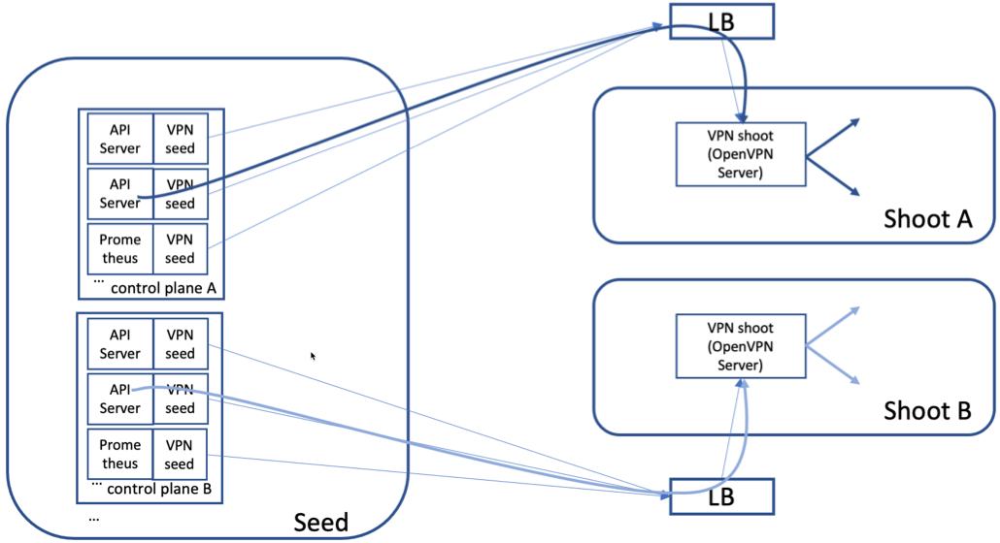
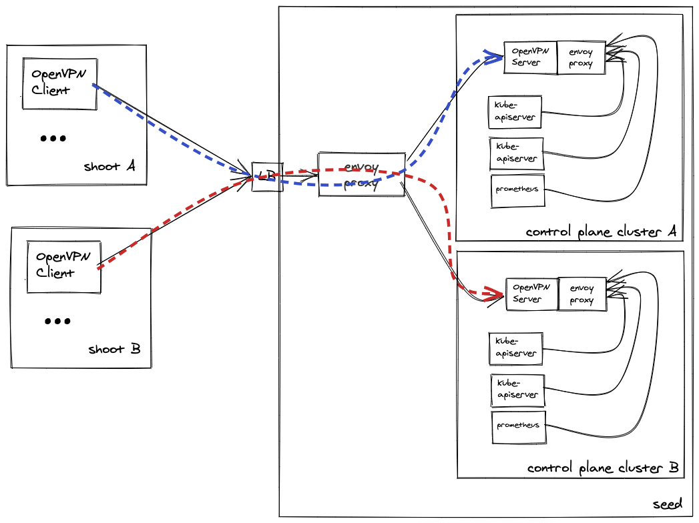
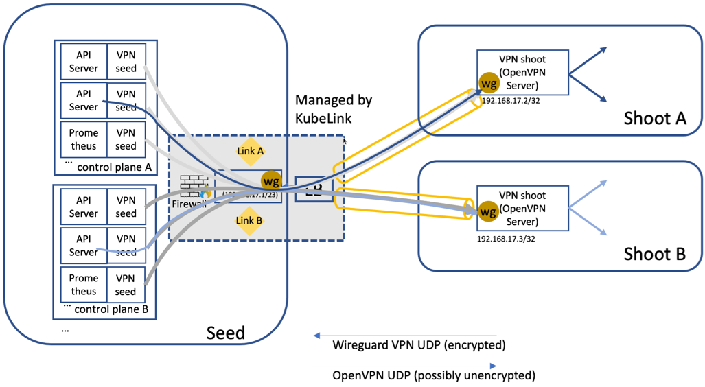

# GEP-14: Reversed Cluster VPN

## Table of Contents

* [Motivation](#Motivation)
* [Proposal](#Proposal)
* [Alternatives](#Alternatives)

## Motivation

It is necessary to describe the current VPN solution and outline its shortcomings in order to motivate this proposal.

### Problem Statement

Today's Gardener cluster VPN solution has several issues including:

1. Connection establishment is always from the seed cluster to the shoot cluster. This means that there needs to be connectivity both ways which is not desirable in many cases (OpenStack, VMware) and causes high effort in firewall configuration or extra infrastructure. These firewall configurations are prohibited in some cases due to security policies.
2. Shoot clusters must provide a VPN endpoint. This means extra cost for the endpoint (roughly €20/month on hyperscalers) or consumption of scarce resources (limited number of VMware NSX-T load balancers).

A first implementation has been provided to resolve the issues with the [Konnectivity server](https://github.com/gardener/gardener/blob/master/docs/proposals/11-apiserver-network-proxy.md). As we did find several shortcomings with the underlying technology component, the [apiserver-network-proxy](https://github.com/kubernetes-sigs/apiserver-network-proxy), we believe that this is not a suitable way ahead. We have opened an [issue](https://github.com/kubernetes-sigs/apiserver-network-proxy/issues/180) and provided two solution proposals to the community. We do see some remedies, e.g., using the [Quick Protocol](https://de.wikipedia.org/wiki/Quick_UDP_Internet_Connections) instead of GRPC but we (a) consider the implementation effort significantly higher compared to this proposal and (b) would use an experimental protocol to solve a problem that can also be solved with existing and proven core network technologies.

We will therefore not continue to invest into this approach. We will, however, research a similar approach (see below, in [Further Research](#further-research)).

### Current Solution Outline

The current solution consists of multiple VPN connections from each API server pod and the Prometheus pod of a control plane to an OpenVPN server running in the shoot cluster. This OpenVPN server is exposed via a load balancer that must have an IP address which is reachable from the seed cluster. The routing in the seed cluster pods is configured to route all traffic for the node, pod, and service ranges to the shoot cluster. This means that there is no address overlap allowed between seed- and shoot cluster node, pod, and service ranges.

In the seed cluster, the `vpn-seed` container is a sidecar to the kube-apiserver and prometheus pods. OpenVPN acts as a TCP client connecting to an OpenVPN TCP server. This is not optimal (e.g. tunneling TCP over TCP is discouraged) but at the time of development there was no UDP load balancer available on at least one of the major hyperscalers. Connectivity could have been switched to UDP later but the development effort was not spent.

The solution is depicted in this diagram:



These are the essential parts of the OpenVPN client configuration in the `vpn-seed` sidecar container:
```
# use TCP instead of UDP (commonly not supported by load balancers)
proto tcp-client

[...]

# get all routing information from server
pull

tls-client
key "/srv/secrets/vpn-seed/tls.key"
cert "/srv/secrets/vpn-seed/tls.crt"
ca "/srv/secrets/vpn-seed/ca.crt"

tls-auth "/srv/secrets/tlsauth/vpn.tlsauth" 1
cipher AES-256-CBC

# https://openvpn.net/index.php/open-source/documentation/howto.html#mitm
remote-cert-tls server

# pull filter
pull-filter accept "route 100.64.0.0 255.248.0.0"
pull-filter accept "route 100.96.0.0 255.224.0.0"
pull-filter accept "route 10.1.60.0 255.255.252.0"
pull-filter accept "route 192.168.123."
pull-filter ignore "route"
pull-filter ignore redirect-gateway
pull-filter ignore route-ipv6
pull-filter ignore redirect-gateway-ipv6
```

Encryption is based on SSL certificates with an additional HMAC signature to all SSL/TLS handshake packets. As multiple clients connect to the OpenVPN server in the shoot cluster, all clients must be assigned a unique IP address. This is done by the OpenVPN server pushing that configuration to the client (keyword `pull`). As this is potentially problematic because the OpenVPN server runs in an untrusted environment, there are pull filters denying all but necessary routes for the pod, service, and node networks.

The OpenVPN server running in the shoot cluster is configured as follows:

```
mode server
tls-server
proto tcp4-server
dev tun0

[...]

server 192.168.123.0 255.255.255.0

push "route 10.243.0.0 255.255.128.0"
push "route 10.243.128.0 255.255.128.0"

duplicate-cn

key "/srv/secrets/vpn-shoot/tls.key"
cert "/srv/secrets/vpn-shoot/tls.crt"
ca "/srv/secrets/vpn-shoot/ca.crt"
dh "/srv/secrets/dh/dh2048.pem"

tls-auth "/srv/secrets/tlsauth/vpn.tlsauth" 0
push "route 10.242.0.0 255.255.0.0"
```

It is a TCP TLS server and configured to automatically assign IP addresses for OpenVPN clients (`server` directive). In addition, it pushes the shoot cluster node-, pod-, and service ranges to the clients running in the seed cluster (`push` directive).

> **Note:** The network mesh spanned by OpenVPN uses the network range `192.168.123.0 - 192.168.123.255`. This network range cannot be used in either shoot-, or seed clusters. If it is used, this might cause subtle problem due to network range overlaps. Unfortunately, this appears not to be well documented but this restriction exists since the very beginning. We should clean up this technical debt as part of the exercise.

### Goals

* We intend to supersede the current VPN solution with the solution outlined in this proposal.
* We intend to remove the code for the Konnectivity tunnel once this solution proposal has been validated.

### Non-Goals

* The solution is not a low latency or high throughput solution. As the kube-apiserver to shoot cluster traffic does not demand these properties, we do not intend to invest in improvements.
* We do not intend to provide continuous availability to the shoot-seed VPN connection. We expect the availability to be comparable to the existing solution.

## Proposal

The proposal is depicted in the following diagram:



We have added an OpenVPN server pod (`vpn-seed-server`) to each control plane. The OpenVPN client in the shoot cluster (`vpn-shoot-client`) connects to the OpenVPN server.

The two containers `vpn-seed-server` and `vpn-shoot-client` are new containers and are not related to containers in the `github.com/gardener/vpn` project. We will create a new project `github.com/gardener/vpn2` for these containers. With this solution we intend to supersede the containers from the `github.com/gardener/vpn` project.

A service `vpn-seed-server` of type `ClusterIP` is created for each control plane in its namespace.

The `vpn-shoot-client` pod connects to the correct `vpn-seed-server` service via the SNI passthrough proxy introduced with [SNI Passthrough proxy for kube-apiservers](https://github.com/gardener/gardener/blob/master/docs/proposals/08-shoot-apiserver-via-sni.md) on port 8132.

Shoot OpenVPN clients (`vpn-shoot-client`) connect to the correct OpenVPN Server using the http proxy feature provided by OpenVPN. A configuration is added to the envoy proxy to detect http proxy requests and open a connection attempt to the correct OpenVPN server.

The `kube-apiserver` to shoot cluster connections are established using the API server proxy feature via an envoy proxy sidecar container of the `vpn-seed-server` container.

The restriction regarding the `192.168.123.0/24` network range in the current VPN solution still applies to this proposal. No other restrictions are introduced. In the context of this GEP a pull requst has been filed to block usage of that range by shoot clusters.

### Performance and Scalability

We do expect performance and throughput to be slightly lower compared to the existing solution. This is because the OpenVPN server acts as an additional hop and must decrypt and re-encrypt traffic that passes through. As there are no low latency or high thoughput requirements for this connection, we do not assume this to be an issue.

### Availability and Failure Scenarios

This solution reuses multiple instances of the envoy component used for the kube-apiserver endpoints. We assume that the availability for kube-apiservers is good enough for the cluster VPN as well.

The OpenVPN client- and server pods are singleton pods in this approach and therefore are affected by potential failures and during cluster-, and control plane updates. Potential outages are only restricted to single shoot clusters and are comparable to the situation with the existing solution today.

### Feature Gates and Migration Strategy

We have introduced a gardenlet feature gate `ReversedVPN`. If `APIServerSNI` and `ReversedVPN` are enabled, the proposed solution is automatically enabled for all shoot clusters hosted by the seed. If `ReversedVPN` is enabled but `APIServerSNI` is not, the gardenlet will panic during startup as this is an invalid configuration. All existing shoot clusters will automatically be migrated during the next reconciliation. We assume that the `ReversedVPN` feature will work with Gardener as well as operator managed Istio.

We have also added a shoot annotation `alpha.featuregates.shoot.gardener.cloud/reversed-vpn`, which can override the feature gate to enable or disable the solution for individual clusters. This is only respected if `APIServerSNI` is enabled, otherwise it is ignored.

### Security Review

The change in the VPN solution will potentially open up new attack vectors. We will perform a thorough analysis outside of this document.

## Alternatives

### WireGuard and Kubelink based Cluster VPN

We have done a detailed investigation and implementation of a reversed VPN based on WireGuard. While we believe that it is technically feasible and superior to the approach presented above, there are some concerns with regards to scalability, and high availability. As the WireGuard scenario based on kubelink is relevant for other use cases we continue to improve this implementation and address the concerns but we concede that this might not be on time for the cluster VPN. We nevertheless keep the implementation and provide an outline as part of this proposal.

The general idea of the proposal is to keep the existing cluster VPN solution more or less as is, but change the underlying network used for the `vpn seed => vpn shoot` connection. The underlying network should be established in the reversed direction, i.e., the shoot cluster should initiate the network connection, but it nevertheless should work in both directions.

We achieve this by tunneling the open vpn connection through a WireGuard tunnel, which is established from the shoot to the seed (note that WireGuard uses UDP as protocol). Independent of that we can also use UDP for the OpenVPN connection, but we can also stay with TCP as it was before. While this might look like a big change, it only introduces minor changes to the existing solution, but let's look at the details. In essence, the OpenVPN connection does not require a public endpoint in the shoot cluster but it uses the internal endpoint provided by the WireGuard tunnel.

This is roughly depcited in this diagram. Note that the `vpn-seed` and `vpn-shoot` containers only require very little changes and are fully backwards compatible.



The WireGuard network needs a separate network range/CIDR. It has to be unique for the seed and all its shoot clusters. An example for an assumed workload of around 1000 shoot clusters would be `192.168.128.0/22` (1024 IP addresses), i.e. `192.168.128.0-192.168.131.255`. The IP addresses from this range need to be managed, but the IP address management (IPAM) using the Gardener Kubernetes objects like seed and shootstate as backing store is fairly straightforward. This is especially true as we do not expect large network ranges and only infrequent IP allocations. Hence, the IP address allocation can be quite simple, i.e., scan the range for a free IP address of all shoot clusters in a seed and allocate the first free address from the range.

There is another restriction: in case shoot clusters are configured to be seed clusters, this network range must not overlap with the "parent" seed cluster. If the parent seed cluster uses `192.168.128.0/22`, the child seed cluster can, for example, use `192.168.132.0/22`. Grandchildren can, however, use grandparent IP address ranges. Also, 2 children seed clusters can use identical ranges.

This slightly adds to the restrictions described in the current solution outline, in that the arbitrary chosen `192.168.123.0/24` range is restricted. For the purpose of this implementation, we propose to extend that restriction to `192.168.128.0/17` range. Most of it would be reserved for "future use", however. We are well aware that this adds to the burden of correctly configuring Gardener landscapes.

We do consider this to be a challenge that needs to be addressed by careful configuration of the Gardener seed cluster infrastructure. Together with the `192.168.123.0/24` address range, these ranges should be automatically blocked for usage by shoots.

WireGuard can utilize the Linux kernel so that after initialization/configuration no user space processes are required. We propose to recommend the WireGuard kernel module as the default solution for all seeds. For shoot clusters, the WireGuard kernel based approach is also recommended, but the user space solution should also work, as we expect less traffic on the shoot side. We expect the userspace implementation to work on all operating systems supported by Gardener in case no kernel module is available.

Almost all seed clusters are already managed by Gardener and we assume that those are configured with the WireGuard kernel module. There are, however, some cases where we use other Kubernetes distributions as seed cluster which may not have an operating system with WireGuard module available. We will therefore generally support the user space WireGuard process on seed cluster but place a size restriction on the number of control planes on those seeds.

There is a user space implementation of WireGuard, which can be used on Linux distributions without the WireGuard kernel module. (WireGuard moved into the standard Linux kernel 5.6.) Our proposal can handle the kernel/user space switch transparently, i.e., we include the user space binaries and use them only when required. However, especially for the seed, the kernel based solution might be more attractive. Garden Linux 318.4.0 supports WireGuard.

We have looked at Ubuntu and SuSE chost:

- SuSE chost does not provide the WireGuard kernel module and it is not installable via zypper. It should, however, be straightforward for SuSE to include that in their next release.
- Ubuntu does not provide the kernel module either but it can be installed using `apt-get install wireguard`. With that, it appears straightforward to provide an image with WireGuard pre-installed.

On the seed, we add a WireGuard device to one node on the host network. For all other nodes on the seed, we adapt the routes accordingly to route traffic destined for the WireGuard network to our WireGuard node. The Kubernetes pods managing the WireGuard device and routes are only used for initial configuration and later reconfiguration. During runtime, they can restart without any impact on the operation of the WireGuard network as the WireGuard device is managed by the Linux kernel.

With Calico as the networking solution it is not easily possible to put the WireGuard endpoint into a pod. Putting the WireGuard endpoint into a pod would require to define it as a gateway in the api server or prometheus pods, but this is not possible since Calico does not span a proper subnet. While the defined CIDR in the pod network might be `100.96.0.0/11`, the network visible from within a pod is only `100.96.0.5/32`. This restriction might not exist with other networking solutions.

The WireGuard endpoint on the seed is exposed via a load balancer. We propose to use [kubelink](https://github.com/mandelsoft/kubelink) to manage the WireGuard configuration/device on the seed. We consider the management of the WireGuard endpoint to be complex especially in error situations which is the reason for utilizing kubelink as there is already significant experience managing an endpoint. We propose moving kubelink to the Gardener org in case it is used by this proposal.

Kubelink addresses three challenges managing WireGuard interfaces on cluster nodes. First, with WireGuard interfaces directly on the node (`hostNetwork=true`), the lifecycle of the interface is decoupled from the lifecycle of the pod that created it. This means that there will have to be means of cleaning up the interfaces and its configuration in case the interface moves to a different node. Second, additional routing information must be distributed across the cluster. The WireGuard CIDR is unknown to the network implementation, so additional routes must be distributed on all nodes of the cluster. Third, kubelink dynamically configures the Wireguard interface with endpoints and their public keys.

On the shoot, we create the keys and acquire the WireGuard IP in the standard secret generation. The data is added as a secret to the control plane and to the shootstate. The vpn shoot deployment is extended to include the WireGuard device setup inside the vpn shoot pod network. For certain infrastructures (AWS), we need a re-advertiser to resolve the seed WireGuard endpoint and evaluate whether the IP address changed.

While it is possible to configure a WireGuard device using DNS names, only IP addresses can be stored in Linux Kernel data structures. A change of a load balancer IP address can therefore not be mitigated on that level. As WireGuard dynamically adapts endpoint IP addresses, a change in load banlancer IPs is mitigated in most but not all cases. This is why a re-advertiser is required for public cloud providers such as AWS.

The load balancer exposing the OpenVPN endpoint in the shoot cluster is no longer required and therefore removed if this functionality is used.

As we want to slowly expand the usage of the WireGuard solution, we propose to introduce a feature gate for it. Furthermore, since the WireGuard network requires a separate network range, we propose to introduce a new section to the seed settings with two additional flags (enabled & cidr):

```
apiVersion: core.gardener.cloud/v1beta1
kind: Seed
metadata:
  name: my-seed
  ...
spec:
  ...
  settings:
  ...
    wireguard:
      enabled: true
      cidr: 192.168.128.0/22
```

Last but not least, we propose to introduce an annotation to the shoots to enable/disable the WireGuard tunnel explicitly.

```
apiVersion: core.gardener.cloud/v1beta1
kind: Shoot
metadata:
  name: my-shoot
  annotations:
    alpha.featuregates.shoot.gardener.cloud/wireguard-tunnel: "true"
  ...
```

Using this approach, it is easy to switch the solution on and off, i.e., migrate the shoot clusters automatically during ordinary reconciliation.

#### High Availability

There is an issue if the node that hosts the WireGuard endpoint fails. The endpoint is migrated to another node, however, the time required to do this might exceed the budget for downtimes, although one could argue that a disruption of less than 30 seconds to 1 minute does not qualify as a downtime and will in almost all cases be not noticeable by end users.

In this case, we also assume that TCP connections won't be interrupted - they would just appear to hang. We will confirm this behavior and the potential downtime as part of the development and testing effort, as this is hard to predict.

As a possible mitigation, we propose to instantiate 2 Kubelink instances in the seed cluster that are served by two different load balancers. The instances must run on different nodes (if possible but we assume a proper seed cluster has more than one node). Each shoot cluster connects to both endpoints. This means that the OpenVPN server is reachable with two different IP addresses. The VPN seed sidecars must attempt to connect to both of them and will continue to do so. The "Persistent Keepalive" feature is set to 21 seconds by default but could be reduced. Due to the redundancy, however, this appears not to be necessary.

It is desirable that both connections are used in an equal manner. One strategy could be to use the kubelink 1 connection if the first target WireGuard address is even (the last byte of the IPv4 address), otherwise the kubelink 2 connection. The `vpn-seed` sidecars can then use the following configuration in their OpenVPN configuration file:

 ```
<connection>
remote 192.168.45.3 1194 udp
</connection>

<connection>
remote 192.168.47.34 1194 udp
</connection>
```

OpenVPN will go through the list sequentially and try to connect to these endpoints.

As an additional mitigation, it appears possible to instantiate WireGuard devices on all hosts and replicate its relevant conntrack state across all cluster nodes. The relevant conntrack state keeps the state of all connections passing through the WireGuard interface (e.g. the WireGuard CIDR). conntrack and the tools to replicate conntrack state are part of the essential Linux netfilter tools package.

#### Load Considerations

What happens in case of a failure? In this case, one router will end up owning all connections as the clients will attempt to use the next connection. This could be mitigated by adding a third redundant WireGuard connection. Using this strategy, the failure of one WireGuard endpoint would result in the equal distribution of connections to the two remaining interfaces. We believe, however, that this will not be necessary.

The cluster node running the Wireguard endpoint is essentially a router that routes all traffic to the various shoot clusters. This is established and proven technology that already exists since decades and has been highly optimized since then. This is also the technology that hyperscalers rely on to provide VPN connectivity to their customers. This said, hyperscalers essentially provide solutions based on IPsec, which is known not to scale as well as Wireguard. Wireguard is a relatively new technology but we have no doubt that it is less stable than existing IPsec solution.

Regarding performance, there is a lot of information on the Internet basically suggesting that Wireguard performs better than other VPN solutions such as IPsec or OpenVPN. One example is the [Wireguard Performance Section](https://www.wireguard.com/performance/) and the [Performance Analysis of VPN Gateways](https://www.net.in.tum.de/fileadmin/bibtex/publications/papers/2020-ifip-moonwire.pdf) document.

Based on this, we have no reason to believe that one router will not be able to handle all traffic going to and coming from shoot clusters. Nevertheless, we will closely monitor the situation in our tests and will take action if necessary.

#### Further Research

Based on feedback on this proposal and while working on this implementation, we identified two additinal approaches that we have not thought of so far. The first idea can be used to replace the "inner" OpenVPN implementation and the second can be used to replace WireGuard with OpenVPN and get rid of the single point of failure.

1. Instead of using OpenVPN for the inner seed/shoot communication, we can use the proxy protocol and use a TCP proxy (e.g. envoy) in the shoot cluster to broker the seed-shoot connections. The advantage is that with this solution, seed- and shoot cluster network ranges are allowed to overlap. Disadvantages are increased implementation effort and less efficient network in terms of throughput and scalability. We believe, however, that the reduced network efficiency does not invalidate this option.

2. There is an option in OpenVPN to specify a tcp proxy as part of the endpoint configuration.

