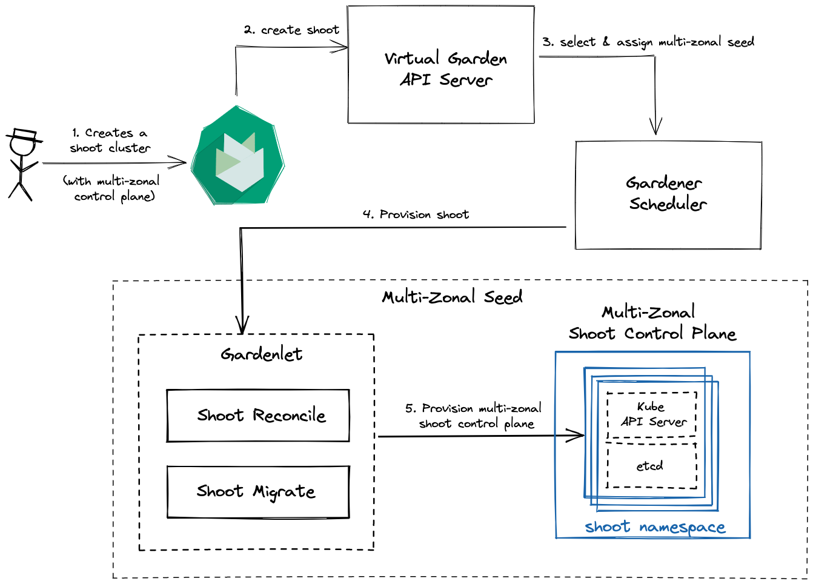
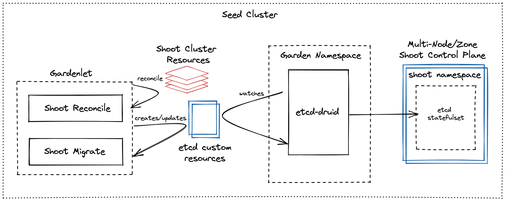

# Multi Zonal Shoot Control Planes

This document proposes an approach to enable a shoot cluster to use a highly available control plane.

## Content
- [Multi Zonal Shoot Control Planes](#multi-zonal-shoot-control-planes)
  - [Content](#content)
  - [Overview](#overview)
  - [Out of scope](#out-of-scope)
  - [Boundary Conditions](#boundary-conditions)
  - [High Availablity Topologies](#high-availablity-topologies)
    - [Overview](#overview-1)
    - [etcd](#etcd)
    - [Kube API Server](#kube-api-server)
    - [KCM/MCM/CA](#kcmmcmca)
  - [Setting up an HA Seed](#setting-up-a-ha-seed)
    - [Hosting a single-zonal HA shoot control plane](#hosting-a-single-zonal-ha-shoot-control-plane)
    - [Hosting a multi-zonal HA shoot control plane](#hosting-a-multi-zonal-ha-shoot-control-plane)
  - [Scheduling HA Shoot Control Plane](#scheduling-ha-shoot-control-plane)
    - [Recommendation on number of zones](#recommendation-on-number-of-zones)
      - [One zone cluster](#one-zone-cluster)
      - [Two zone cluster](#two-zone-cluster)
      - [General Recommendation](#general-recommendation)
    - [Scheduling constraints options](#scheduling-constraints-options)
      - [Affinity and Anti-Affinity - `Preferred`](#affinity-and-anti-affinity---preferred)
      - [Topology Spread Constraints (a.k.a TSC)](#topology-spread-constraints-aka-tsc)
  - [Gardener API Changes](#gardener-api-changes)
    - [Shoot Spec](#shoot-spec)
      - [Future enhancements](#future-enhancements)
  - [Seed Control Plane Components](#seed-control-plane-components)
  - [Shoot Control Plane Components](#shoot-control-plane-components)
    - [Zone affinity](#zone-affinity)
    - [Kube API Server](#kube-api-server-1)
      - [Scheduling](#scheduling)
    - [Gardener Resource Manager](#gardener-resource-manager)
      - [Scheduling](#scheduling-1)
    - [Etcd](#etcd-1)
      - [CRD Changes](#crd-changes)
        - [TLS configuration](#tls-configuration)
        - [Scheduling constraints](#scheduling-constraints)
      - [Network Policy Changes](#network-policy-changes)
      - [Configuration changes](#configuration-changes)
        - [Timeout configuration](#timeout-configuration)
        - [Resource thresholds](#resource-thresholds)
      - [Scheduling](#scheduling-2)
  - [Gardener Scheduler Changes](#gardener-scheduler-changes)
    - [Determining Seed for a Shoot](#determining-seed-for-a-shoot)
    - [Compute Seed Usage](#compute-seed-usage)
  - [Handling Outages](#handling-outages)
    - [Node failures](#node-failures)
      - [Impact of Node failure](#impact-of-node-failure)
    - [What is Zone outage?](#what-is-zone-outage)
      - [Impact of a Zone Outage](#impact-of-a-zone-outage)
    - [Identify a Zone outage](#identify-a-zone-outage)
    - [Identify zone recovery](#identify-zone-recovery)
    - [Future scope: Tracking Zone Health](#future-scope-tracking-zone-health)
    - [Recovery](#recovery)
      - [Current Recovery mechanisms](#current-recovery-mechanisms)
      - [Recovery from Node failure](#recovery-from-node-failure)
      - [Recovery from Zone failure](#recovery-from-zone-failure)
    - [Option #1: Leverage existing recovery options - `Preferred`](#option-1-leverage-existing-recovery-options---preferred)
    - [Option #2: Redundencies for all critical control plane components](#option-2-redundencies-for-all-critical-control-plane-components)
    - [Option #3: Auto-rebalance pods in the event of AZ failure](#option-3-auto-rebalance-pods-in-the-event-of-az-failure)
  - [Cost Implications on hosting HA control plane](#cost-implications-on-hosting-ha-control-plane)
    - [Compute & Storage](#compute--storage)
    - [Network latency](#network-latency)
    - [Cross-Zonal traffic](#cross-zonal-traffic)
      - [Ingress/Egress traffic analysis](#ingressegress-traffic-analysis)
      - [Optimizing Cost: Topology Aware Hint](#optimizing-cost-topology-aware-hint)
  - [References](#references)
  - [Appendix](#appendix)
    - [Etdc Active-Passive Options](#etdc-active-passive-options)
    - [Topology Spread Constraints evaluation and findings](#topology-spread-constraints-evaluation-and-findings)
    - [Inject etcd scheduling policies](#inject-etcd-scheduling-policies)
    - [Availability Zone Outage simulation](#availability-zone-outage-simulation)
    - [Ingress/Egress Traffic Analysis Details](#ingressegress-traffic-analysis-details)

## Overview

High availability of Kubernetes control planes is desired to ensure continued operation, even in the case of partial failures of nodes or availabilty zones. Tolerance to common failure domains ranges from hardware (e.g. utility power sources and backup power sources, network switches, disk/data, racks, cooling systems etc.) to software. Each consumer therefore needs to decide on the degree of failure isolation that is desired for the control plane of their respective shoot clusters. Gardener today only offers highly available control planes for some of its components (like Kubernetes API Server and Gardener Resource Manager) which are deployed with multiple replicas with affinity rules, which allow the spread of the replicas across nodes. Many of the other critical control plane components including `etcd` are only offered with a single replica, making them susceptible to both node failure as well as zone failure causing downtimes.

Gardener is currently in the process of extending its tolerance for node failure for `etcd` via [multi-node-etcd](https://github.com/gardener/etcd-druid/tree/master/docs/proposals/multi-node) which provisions and manages an `etcd` cluster across nodes in a single availability zone.
This GEP extends the failure domain tolerance for critical shoot control plane components by providing high availability across availability zones.

## Out of scope

> `Multi-zonal Seed cluster` has workers spread across multiple zones

The following topics are out of purview of this GEP:
* Provisioning of a multi-zonal seed cluster
* Upgrading from a single-zone shoot control plane to a multi-zonal shoot control plane
* Any Gardener Dashboard extension to allow end-users to select an HA control plane
* There are different failure domains - node, availability zone, region. In this proposal only node and AZ failure domains are targetted. In other words, multi-region shoot cluster control plane deployments are not in scope.

## Boundary Conditions

* Upgrade of shoot control plane from non-HA to a HA control plane will be supported. However, downgrade from HA to a non-HA control plane will not be supported.
* Downgrading a multi-zonal seed cluster to a non-multi-zonal seed cluster should be prevented as it is not supported.
* In the current scope, three control plane components - `Kube API Server`, `etcd` and `Gardener Resource Manager` will be highly available. In the future, other components could be set up in HA mode.
* It is assumed that for a multi-zonal control plane, zones will be co-located within a single region. In the current proposal, the consumer can only enable/disable high-availability and choose failure tolerance between multiple nodes within a single zone or multiple nodes spread across multiple zones.

## High Availablity Topologies

### Overview

Resilience in applications can be achieved in various ways, the most popular ones among them being:

**Active-Active**

In this setup more than one replica of a service actively participates in serving requests. The primary intent of this setup is to achieve load balancing. Load balancing will distribute the incoming traffic across all replicas of the service, preventing overloading of a single replica. This setup however is not suitable for services which run one or more reconciliation loops for managing resources as each active replica would then attempt to reconcile the same set of resources resulting in race conditions and undeterministic state handling.

**Active-Passive**

In this setup a service will have more than one replica. However, only one replica will be active and all other replicas will be passive or on standby.
The primary intent of this setup is to have one or more backup replicas that are ready to take over as soon as the primary/active replica is no longer available.

Let us further delve into topology options/preference for critical control plane components.

### etcd

`etcd` is a stateful service which offers high consistency and linearizability. It is therefore essential that any change made to the underlying database is consistent across all members of an `etcd` cluster. This is ensured by only allowing the leader `etcd` member to do changes (PUT/DELETE) whereas the read requests can be served by any member who is in sync with the leader.

A highly available `etcd` can be set up in both `Active-Active` and `Active-Passive` topologies. In Gardener, the `Active-Active` topology is chosen as it is also the one that is intrinsically offered by `etcd`. Deployment options for `Active-Passive` are covered in the [appendix](#etdc-active-passive-options).

`etcd` leverages `raft` to provide a distributed, consistent and replicated state machine across several etcd nodes. Each voting-member in the cluster is an active participant. etcd cluster's [failure tolerance](https://etcd.io/docs/v3.3/faq/) suggests that there should be odd-numbered cluster members. An optimum size of 3 members is usually recommended (which can survive 1 etcd member failure). One can go up to a 5 member cluster to provide greater failure tolerance (of 2 members). Larger clusters do provide increasing failure tolerance, but there is also an increasing cost of replication which then has an impact on the leader and thus impacts overall performance of the cluster.

To achieve higher failure tolerance etcd cluster members can be spread in different ways:
* Have multiple etcd replicas in a single node.
* Have one etcd replica per node in a single zone.
* Have one etcd replica per node and zone in a multi-zonal setup within a single region.
* Have one etcd replica per region across multiple regions.

As one crosses zonal and/or regional boundaries, failure tolerance improves but there is an impact on latencies and also on cost incurred due to cross zonal/regional traffic. Therefore, topology spread for an etcd cluster should depend upon failure tolerence as defined by the customer.

**Pros**
* Leverages built-in clustering support from etcd, thus providing self-managed cluster members who can discover other members, participate in leader election in case the leader is no longer available, recover from failures where the quorum is not completely lost and provide higher level of consistency via raft consensus for update/delete/create operations.
* Provides better availability as long as the quorum is not lost.
* Rolling update of nodes, vertical autoscaling of etcd pods can be done without disruption as long as quorum is maintained.
* Allows spread of etcd members across zones providing higher availability. Clubbed with `Topology aware routing` the cost of cross zonal traffic can be potentially reduced.

**Cons**
*  Raft consensus algorithm results in increased egress/ingress traffic amongst etdc members. For cross zonal setups this will add to additional network cost.
*  Load on the leader increases due to additional responsibility for synchronizing the revisions of its replicated log with all followers.

### Kube API Server

Kube API Server is a statless application and is set up in `Active-Active` topology. Each instance of Kube API Server can service any request.

### KCM/MCM/CA

Kube-Controller-Manager, Machine-Controller-Manager and Cluster-Autoscaler are setup in `Active-Passive` topology. If there is more than one replica for these controller components,  leader election takes place to ensure that there is one active/primary replica which will become the leader that will run the reconcilation. The backup will be passive and will eye to become the leader. The backup replica will not run any reconciliations.

## Setting up an HA Seed

For every seed cluster, an operator typically creates three dedicated worker groups:
* Worker group to host `etcd` pods
* Worker group to host `etcd-compaction` jobs
* Worker group to host other control plane components

### Hosting a single-zonal HA shoot control plane

To host an HA shoot control plane within a single zone, it should be ensured that each worker group as defined above should at least have three nodes. This is also the minimum size that is required by a highly-available `etcd` cluster with a failure tolerance of a single node. If there are lesser number of nodes especially in the worker group dedicated for the hosting `etcd` statefulset, then some `etcd` pods will be stuck in `Pending` state, leading to a potential loss in quorum. Affinity rules for etcd pods will enforce that there is one pod per node within that zone.

### Hosting a multi-zonal HA shoot control plane

To host an HA shoot control plane across availability zones, worker groups dedicated for `etcd` and other control plane components should have a minimum of three nodes spread across a minimum of three availability zones.

An additional label `seed.gardener.cloud/multi-zonal: true` should be added to the seed indicating that this seed is capable of hosting multi-zonal HA shoot control planes, which in turn will help gardener scheduler to short-list the seeds as candidates.

> NOTE: It is also possible that Gardener can itself set this label based on the number of zones that worker groups have been provisioned with. If the number of zones >= 3, then this label can be automatically set.

**Validations**

> NOTE: Following validation is only applicable for `managed-seeds`.

It is possible that the label is changed incorrectly or added to a seed which has lesser than two availability zones. To prevent incorrect labeling of the multi-zonal capability on seeds, following validation should be added to [seed admission plugin](https://github.com/gardener/gardener/blob/master/plugin/pkg/seed/validator/admission.go) for `admission.Update` and `admission.Create` operations:

* Get the cluster, from the cluster get the shoot resource, from the shoot resource get the number of zones. If the number of zones is less than 3 and the label `seed.gardener.cloud/multi-zonal` is set to `true` then an error should be returned.

## Scheduling HA Shoot Control Plane

### Recommendation on number of zones

It is recommended that for high-availability setup an odd number of zones must be used. This also follows the [recommendations](https://etcd.io/docs/v3.4/faq/#why-an-odd-number-of-cluster-members) on the etcd cluster size. The recommendations for number of zones will be largely influenced by quorum-based etcd cluster setup recommendations as other shoot control plane components are either stateless or non-quorum-based stateful components.

To illustrate the impact of this recommendation on the high-availability setup, let's go through some cases:

#### One zone cluster

In case there is only 1 zone, then it is recommended that there be odd number of nodes (at least 3) in the zone.
* etcd will be spread across 3 nodes (one etcd member per node).
* Kube API Server will have at least one pod per node.
* Gardener resource manager will have one pod per node
* Rest of the control plane components, which have a single replica, will be deployed on one of the nodes

#### Two zone cluster

**etcd and Kube API server**

For the sake of argument if we spread a 3 member etcd cluster amongst 2 zones (AZ-1, AZ-2) then lets assume that AZ-1 gets 2 etcd members and AZ-2 gets 1 etcd member. Let's further evaluate the zone failure scenarios:
* If AZ-1 goes down then, quorum is lost and the only remaining etcd member enters into a read-only state.
* If AZ-2 goes down then:
  * If the leader is in AZ-2, then it will force a re-election and the quorum will be restored with 2 etcd members in AZ-1.
  * If the leader is not in AZ-2, then etcd cluster will still be operational without any downtime as the quorum is not lost.

**Rest of the control plane components**

* As per the affinity rules suggested for Kube API server and Gardener Resource Manager, out of 2 zones, 1 zone will get 2 replicas (spread across different nodes within that zone) and another zone will get a 1 replica.
* Rest of the control plane components which have a single replica will be deployed on one of the nodes in any of the two zones.

For regions that have two zones or less, recommendation is to provide HA setup only in a single zone by spreading the HA control plane components across nodes in a single zone. Reasons for not spreading across two zones:
* There seems to be no clear benefit to spreading an etcd cluster across 2 zones as there is an additional cost of cross-zonal traffic that will be incurred due to communication amongst the etcd members and also due to API server communication with an etcd member across zones.
* There is no significant gain in availability as compared to an etcd cluster provisioned within a single zone. Therefore it is a recommendation that for regions having 2 availability zones, etcd cluster should only be spread across nodes in a single AZ.

If there is a hard requirement to schedule a multi-zone shoot control plane and there are only two availability zones available, then the shoot control plane **will not** be scheduled.

#### General Recommendation

In general, if `n` is the number of availability zones and if `n` is even, then `n-1` zones should be used as a target to deploy the shoot control plane components. If `n` is odd, then all `n` zones can be used as a target to deploy the shoot control plane components. For a special case of `n <= 2`, since only one zone will be used as a target, then the number of nodes that should be provisioned in this zone should be equal to the etcd cluster size to ensure that etcd members are spread across nodes (one etcd member per node).

### Scheduling constraints options

Kubernetes provides several ways in which etcd members can be spread across different failure domains such as nodes/zones. In this section, we evaluate different options.

#### Affinity and Anti-Affinity - `Preferred`

Kubernetes provides `affinity/anti-affinity` rules on `nodes` and `pods` to influence the scheduling of pods of control plane components across failure domains. To influence the scheduling of pods across nodes/zones, `pod-affinity` and `pod-anti-affinity` rules can be used in combination.

#### Topology Spread Constraints (a.k.a TSC)

Topology spread constraints rely on node labels ([well-known-labels](https://kubernetes.io/docs/reference/labels-annotations-taints/)) to identify the topology domain(s) that each node is in. Please see [TSC](#references) documentation for further details. TSC provides finer control over scheduling of resources as compared to `affinity/anti-affinity` constraints.

In order to spread replicas of a control plane component across several nodes/zones, the following TSC could be used:
```yaml
spec:
  topologySpreadConstraints:
  - maxSkew: 1
    topologyKey: topology.kubernetes.io/zone
    whenUnsatisfiable: DoNotSchedule
    labelSelector:
      matchLabels:
        app: etcd-statefulset
  - maxSkew: 1
    topologyKey: kubernetes.io/hostname
    whenUnsatisfiable: DoNotSchedule
    labelSelector:
      matchLabels:
        app: <app-name>
```
> NOTE: One can combine `TopologySpreadConstraints` and `Affinity` rules.

As per the documentation, the above two constrains will be evaluated in `conjunction`. In other words, these will be `and`ed together.
The above constrains imply that, if there are more than 1 zone, then the first constraint will restrict 1 control plane component replica per zone (maxSkew=1) and the second constraint will be applied on nodes within a zone, further restricting one control plane component replica per node. This ideally covers HA scenarios for a `single-zone-multi-node` and `multi-zone-multi-node`.

During testing of this feature, we found a few inconsistencies in the implementation and some quirks. See [appendix](#topology-spread-constraints-evaluation-and-findings) for findings.
At the time of writing of this document, TSC is still not fully mature as is evident from the above findings. It is therefore the current recommendation to not use it for any scheduling decisions.

## Gardener API Changes

### Shoot Spec

We propose to extend the `shoot` resource to have a dedicated field under `spec.kubernetes.controlplane` which allows the consumer to define `highAvailability` configuration.

There are a few options that were considered:

> NOTE: In the below mentioned HA configuration, the focus is on control plane HA. It is not clear what it would mean to define HA configuration for data plane components. However, for better clarity of scope and to provide extensibility in the future, HA configurations are housed under `controlPlane`.

**Option #1:**
```yaml
kind: Shoot
apiVersion: core.gardener.cloud/v1beta1
spec:
  kubernetes:
    controlPlane:
      highAvailability:
        enabled: true # by default HA is disabled.
        type: <single-zone | multi-zone>
```

In this option, an existing `spec.kubernetes` nested field is used as a parent. Since `spec.kubernetes` hosts resources across control plane and data plane, it is required to introduce another parent `controlPlane` under which `highAvailability` configuration can be defined.

**Option #2**
```yaml
kind: Shoot
apiVersion: core.gardener.cloud/v1beta1
spec:
  highAvailability:
    controlPlane:
      enabled: true # by default HA is disabled.
      type: <single-zone | multi-zone>
```

In this option, `highAvailability` is directly defined under `spec`. To ensure clarity of scope for high availability, `controlPlane` is defined as a parent for hosting the HA configuration.

**Option #3**
```yaml
kind: Shoot
apiVersion: core.gardener.cloud/v1beta1
spec:
  kubernetes:
    controlPlane:
      highAvailability:
        enabled: true # by default HA is disabled.
        failureDomain:
          type: <single-zone | multi-zone>
          whenUnsatisfied: <DoNotSchedule | ScheduleAnyway>
```

This option is a variant of `Option-#1`. It provides an additional capability to the consumer to clearly define the behavior, if the chosen type of failure domain cannot be provisioned by gardener due lack of available seeds capable of either hosting a `single-zone` or `multi-zone` shoot control plane.

**Option #4**
```yaml
kind: Shoot
apiVersion: core.gardener.cloud/v1beta1
spec:
  kubernetes:
    kubeAPIServer:
      highAvailability:
        enabled: true
        type: <single-zone | multi-zone>
    etcd:
      highAvailability:
        enabled: true
        type: <single-zone | multi-zone>
```

This option takes the approach of specifying HA configuration at the component level. This is the most flexible option where one could choose which components should be set up in a HA mode. However, this also comes with additional implementation complexity especially w.r.t validations.

#### Future enhancements

Following additional options influencing scheduling and provisioning of shoot control plane components could be provided in the future:

_Failure tolerance_

In the context of an etcd cluster, a 3 member cluster will only provide a failure tolerance of 1 availability zone (for multi-zone) or node (for single-zone-multi-node). This can still be the default setup, but an option could be provided to make it configurable.

```yaml
kind: Shoot
apiVersion: core.gardener.cloud/v1beta1
spec:
  kubernetes:
    controlPlane:
      highAvailability:
        enabled: true # by default HA is disabled.
        type: <single-zone | multi-zone>
        failureTolerance: <possible values should be in the range 1..2(included)>
```

_Region Affinity_

Today, it is possible that the shoot control plane is provisioned in a different region than the shoot cluster due to unavailability of a suitable seed in the same region. This leads to cross regional traffic for any communication from the shoot cluster to its control plane, adding additional network traffic cost and greater latencies.

An option can be provided to the consumer to specify, if region affinity is preferred or required.

```yaml
kind: Shoot
apiVersion: core.gardener.cloud/v1beta1
spec:
  kubernetes:
    controlPlane:
      highAvailability:
        enabled: true # by default HA is disabled.
        type: <single-zone | multi-zone>
        failureTolerance: <possible values should be in the range 1..2(included)>
      regionAffinity: <preferred | required>
```

If `preferred` is chosen (which will also be the default value), then an attempt will be made to choose the shoot cluster worker pool region and if that is not possible, then a different region for the shoot control plane will be chosen. If `required` is chosen, then the selection of the target seed can only happen from seeds in the same region as the shoot cluster worker pools. If no seed is found, then shoot creation will be retried and an appropriate error message is shown to the consumer.

_Scheduling Alternative when unsatisfied_

It is possible that at the time of shoot cluster scheduling a `multi-zonal` seed is not available across regions or in the same region if `regionAffinity` is set to `required`. Consumers can choose not to schedule the shoot control plane if the failure domain requirement is not satisfied or continue to provision the shoot control plane to a weaker failure domain. This could be achieved by specifying their failure domain strictness explicitly as part of the shoot spec.

```yaml
kind: Shoot
apiVersion: core.gardener.cloud/v1beta1
spec:
  kubernetes:
    controlPlane:
      highAvailability:
        enabled: true # by default HA is disabled.
        failureDomain:
          type: <single-zone | multi-zone>
          whenUnsatisfied: <DoNotSchedule | ScheduleAnyway>
        failureTolerance: <possible values should be in the range 1..2(included)>
      regionAffinity: <preferred | required>
```

If the value of `failureDomain.whenUnsatisfied` is set to `DoNotSchedule`, then the consumer will be assured that if the shoot control plane is provisioned it will be the failure domain that the consumer has chosen. If on the other hand `failureDomain.whenUnsatisfied` is set to `ScheduleAnyway`, then if the `failureDomain.type` is chosen as `multi-zone` and if there is no multi-zonal seed (with zones >=3) a `single-zone` HA control plane will be provisioned instead.

## Seed Control Plane Components

Seed control plane components (deployment/statefulset) which are already setup with multiple replicas should change their affinity rules to the following:

**ZoneSpread is false**
```yaml
spec:
  affinity:
    podAntiAffinity:
      requiredDuringSchedulingIgnoredDuringExecution:
      - labelSelector:
          matchLabels:
            <labels>
        topologyKey: "kubernetes.io/hostname"
```

**ZoneSpread is true**
```yaml
spec:
  affinity:
    podAntiAffinity:
      preferredDuringSchedulingIgnoredDuringExecution:
      - labelSelector:
          matchLabels:
            <labels>
      topologyKey: "topology.kubernetes.io/zone"
      requiredDuringSchedulingIgnoredDuringExecution:
      - labelSelector:
          matchLabels:
            <labels>
        topologyKey: "kubernetes.io/hostname"
```

## Shoot Control Plane Components

### Zone affinity

Only if `single-zone` shoot control plane components need to be scheduled on `multi-zonal` seed clusters, then it must be ensured that all shoot control plane components are provisioned inside a single zone. In addition to the `affinity` rules, `nodeSelector` should be added to the control plane component spec to ensure zone affinity.

```yaml
spec:
  nodeSelector:
    topology.kubernetes.io/zone: <zone-name>
```

### Kube API Server

An additional field should be introduced in `gardener/pkg/operation/botanist/component/kubeapiserver/kube_apiserver.go` to capture if the spread of replicas is across zones.

```go
// other fields in this struct have been omitted for brevity
type Values struct {
 	// ZoneSpread determines if the Kube-Apiserver should be spread across multiple zones.
	ZoneSpread bool
}
```

`Values.ZoneSpread` together with `AutoscalingConfig.MinReplicas = len(availability-zones)`, scheduling constraints can be set for Kube API Server.

#### Scheduling

As part of shoot reconciliation running in the seed `gardenlet`, Kube API Server is deployed/reconciled. During the deployment, the value of `ZoneSpread` is checked. If is true, then `topologyKey` of `topology.kubernetes.io/zone` is used, else the default value of `kubernetes.io/hostname` is used for `topologyKey`. Following affinity constraint is set:

**ZoneSpread is false**
```yaml
spec:
  affinity:
    podAntiAffinity:
      requiredDuringSchedulingIgnoredDuringExecution:
      - labelSelector:
          matchLabels:
            app: kubernetes
            role: apiserver
        topologyKey: "kubernetes.io/hostname"
```

**ZoneSpread is true**
```yaml
spec:
  affinity:
    podAntiAffinity:
      preferredDuringSchedulingIgnoredDuringExecution:
      - labelSelector:
          matchLabels:
            app: kubernetes
            role: apiserver
      topologyKey: "topology.kubernetes.io/zone"
      requiredDuringSchedulingIgnoredDuringExecution:
      - labelSelector:
          matchLabels:
            app: kubernetes
            role: apiserver
        topologyKey: "kubernetes.io/hostname"
```

### Gardener Resource Manager

In every shoot control plane currently `Gardener Resource Manager (GRM)` is deployed with 3 replicas and has currently a fixed `PodAntiAffinity` scheduling policy which spreads the pods across nodes even when the shoot control plane is setup across multiple zones.

In `gardener/pkg/operation/botanist/component/resourcemanager/resource_manager.go` an additional struct field should be introduced to indicate whether the pod spread should be across zones.

```go
type Values struct {
	// ZoneSpread determines if the Gardener-Resource-Manager should be spread across multiple zones.
  // True means that it should be spread across zones, false means that it should be spread across nodes in a single zone.
	ZoneSpread bool
}
```

#### Scheduling

As part of shoot reconciliation running in the seed `gardenlet`, Gardener Resource Manager is deployed/reconciled. During the deployment value of `ZoneSpread` is checked. If is true, then `topologyKey` of `topology.kubernetes.io/zone` is used else the default value of `kubernetes.io/hostname` is used for `topologyKey`. Following affinity constraint is set:

_MatchLabels for Gardener Resource Manager_
* app: gardener-resource-manager
* gardener.cloud/role: controlplane

**ZoneSpread is false**
```yaml
spec:
  affinity:
    podAntiAffinity:
      requiredDuringSchedulingIgnoredDuringExecution:
      - labelSelector:
          matchLabels:
            app: gardener-resource-manager
            gardener.cloud/role: controlplane
        topologyKey: "kubernetes.io/hostname"
```

**ZoneSpread is true**
```yaml
spec:
  affinity:
    podAntiAffinity:
      preferredDuringSchedulingIgnoredDuringExecution:
      - labelSelector:
          matchLabels:
            app: gardener-resource-manager
            gardener.cloud/role: controlplane
      topologyKey: "topology.kubernetes.io/zone"
      requiredDuringSchedulingIgnoredDuringExecution:
      - labelSelector:
          matchLabels:
            app: gardener-resource-manager
            gardener.cloud/role: controlplane
        topologyKey: "kubernetes.io/hostname"
```

### Etcd

#### CRD Changes

To support multi-node etcd cluster, the following changes were made to the `etcd` CRD specification.

##### TLS configuration

Communication between etcd client and server as well as communication amongst etcd peers needs to be secured. To address this, the existing `etcd.properties.tls` field is replaced with two new fields:

**ClientUrlTLS**

TLS configuration which contains the CA, client and server TLS secrets for secure communication from the clients to the etcd cluster.

<details>
<summary>ClientUrlTLS Spec</summary>

```yaml
etcd:
  properties:
    clientUrlTls:
      description: ClientUrlTLS contains the ca, server TLS and client
        TLS secrets for client communication to ETCD cluster
      properties:
        clientTLSSecretRef:
          description: SecretReference represents a Secret Reference.
            It has enough information to retrieve secret in any namespace
          properties:
            name:
              description: Name is unique within a namespace to reference
                a secret resource.
              type: string
            namespace:
              description: Namespace defines the space within which
                the secret name must be unique.
              type: string
          type: object
        serverTLSSecretRef:
          description: SecretReference represents a Secret Reference.
            It has enough information to retrieve secret in any namespace
          properties:
            name:
              description: Name is unique within a namespace to reference
                a secret resource.
              type: string
            namespace:
              description: Namespace defines the space within which
                the secret name must be unique.
              type: string
          type: object
        tlsCASecretRef:
          description: SecretReference defines a reference to a secret.
          properties:
            dataKey:
              description: DataKey is the name of the key in the data
                map containing the credentials.
              type: string
            name:
              description: Name is unique within a namespace to reference
                a secret resource.
              type: string
            namespace:
              description: Namespace defines the space within which
                the secret name must be unique.
              type: string
          type: object
      required:
      - serverTLSSecretRef
      - tlsCASecretRef
      type: object
```
</details>

**PeerUrlTLS**

TLS configuration which contains the CA, client+server TLS secrets to establish secure communication amongst etcd peers.

<details>
<summary>PeerUrlTLS Spec</summary>

```yaml
etcd:
  properties:
    peerUrlTls:
      description: PeerUrlTLS contains the ca and server TLS secrets
        for peer communication within ETCD cluster Currently, PeerUrlTLS
        does not require client TLS secrets for gardener implementation
        of ETCD cluster.
      properties:
        clientTLSSecretRef:
          description: SecretReference represents a Secret Reference.
            It has enough information to retrieve secret in any namespace
          properties:
            name:
              description: Name is unique within a namespace to reference
                a secret resource.
              type: string
            namespace:
              description: Namespace defines the space within which
                the secret name must be unique.
              type: string
          type: object
        serverTLSSecretRef:
          description: SecretReference represents a Secret Reference.
            It has enough information to retrieve secret in any namespace
          properties:
            name:
              description: Name is unique within a namespace to reference
                a secret resource.
              type: string
            namespace:
              description: Namespace defines the space within which
                the secret name must be unique.
              type: string
          type: object
        tlsCASecretRef:
          description: SecretReference defines a reference to a secret.
          properties:
            dataKey:
              description: DataKey is the name of the key in the data
                map containing the credentials.
              type: string
            name:
              description: Name is unique within a namespace to reference
                a secret resource.
              type: string
            namespace:
              description: Namespace defines the space within which
                the secret name must be unique.
              type: string
          type: object
```
</details>

##### Scheduling constraints

Gardenlet periodically reconciles control planes of shoot clusters managed by a seed. As part of reconciliation, shoot reconciler will determine if `HAControlPlanes` feature gate has been enabled and the shoot spec has `highAvailability` configuration set. Based on the HA configuration, reconciler will create/update the etcd CRD instance for a shoot creating/updating the scheduling policy.

`etcd` CRD spec has been updated with an additional field `schedulingConstraints`.

<details>
<summary>SchedulingConstraints Spec</summary>

```yaml
schedulingConstraints:
  description: SchedulingConstraints defines the different scheduling
    constraints that must be applied to the pod spec in the etcd statefulset.
  properties:
    affinity:
      description: Affinity defines the various affinity and anti-affinity
        rules for a pod that are honoured by the kube-scheduler.
      properties:
        nodeAffinity:
          description: Describes node affinity scheduling rules for
            the pod.
          properties:
            preferredDuringSchedulingIgnoredDuringExecution:
              description: The scheduler will prefer to schedule pods
                to nodes that satisfy the affinity expressions specified
                by this field, but it may choose a node that violates
                one or more of the expressions. The node that is most
                preferred is the one with the greatest sum of weights,
                i.e. for each node that meets all of the scheduling
                requirements (resource request, requiredDuringScheduling
                affinity expressions, etc.), compute a sum by iterating
                through the elements of this field and adding "weight"
                to the sum if the node matches the corresponding matchExpressions;
                the node(s) with the highest sum are the most preferred.
              items:
                description: An empty preferred scheduling term matches
                  all objects with implicit weight 0 (i.e. it's a no-op).
                  A null preferred scheduling term matches no objects
                  (i.e. is also a no-op).
                properties:
                  preference:
                    description: A node selector term, associated with
                      the corresponding weight.
                    properties:
                      matchExpressions:
                        description: A list of node selector requirements
                          by node's labels.
                        items:
                          description: A node selector requirement is
                            a selector that contains values, a key,
                            and an operator that relates the key and
                            values.
                          properties:
                            key:
                              description: The label key that the selector
                                applies to.
                              type: string
                            operator:
                              description: Represents a key's relationship
                                to a set of values. Valid operators
                                are In, NotIn, Exists, DoesNotExist.
                                Gt, and Lt.
                              type: string
                            values:
                              description: An array of string values.
                                If the operator is In or NotIn, the
                                values array must be non-empty. If the
                                operator is Exists or DoesNotExist,
                                the values array must be empty. If the
                                operator is Gt or Lt, the values array
                                must have a single element, which will
                                be interpreted as an integer. This array
                                is replaced during a strategic merge
                                patch.
                              items:
                                type: string
                              type: array
                          required:
                          - key
                          - operator
                          type: object
                        type: array
                      matchFields:
                        description: A list of node selector requirements
                          by node's fields.
                        items:
                          description: A node selector requirement is
                            a selector that contains values, a key,
                            and an operator that relates the key and
                            values.
                          properties:
                            key:
                              description: The label key that the selector
                                applies to.
                              type: string
                            operator:
                              description: Represents a key's relationship
                                to a set of values. Valid operators
                                are In, NotIn, Exists, DoesNotExist.
                                Gt, and Lt.
                              type: string
                            values:
                              description: An array of string values.
                                If the operator is In or NotIn, the
                                values array must be non-empty. If the
                                operator is Exists or DoesNotExist,
                                the values array must be empty. If the
                                operator is Gt or Lt, the values array
                                must have a single element, which will
                                be interpreted as an integer. This array
                                is replaced during a strategic merge
                                patch.
                              items:
                                type: string
                              type: array
                          required:
                          - key
                          - operator
                          type: object
                        type: array
                    type: object
                  weight:
                    description: Weight associated with matching the
                      corresponding nodeSelectorTerm, in the range 1-100.
                    format: int32
                    type: integer
                required:
                - preference
                - weight
                type: object
              type: array
            requiredDuringSchedulingIgnoredDuringExecution:
              description: If the affinity requirements specified by
                this field are not met at scheduling time, the pod will
                not be scheduled onto the node. If the affinity requirements
                specified by this field cease to be met at some point
                during pod execution (e.g. due to an update), the system
                may or may not try to eventually evict the pod from
                its node.
              properties:
                nodeSelectorTerms:
                  description: Required. A list of node selector terms.
                    The terms are ORed.
                  items:
                    description: A null or empty node selector term
                      matches no objects. The requirements of them are
                      ANDed. The TopologySelectorTerm type implements
                      a subset of the NodeSelectorTerm.
                    properties:
                      matchExpressions:
                        description: A list of node selector requirements
                          by node's labels.
                        items:
                          description: A node selector requirement is
                            a selector that contains values, a key,
                            and an operator that relates the key and
                            values.
                          properties:
                            key:
                              description: The label key that the selector
                                applies to.
                              type: string
                            operator:
                              description: Represents a key's relationship
                                to a set of values. Valid operators
                                are In, NotIn, Exists, DoesNotExist.
                                Gt, and Lt.
                              type: string
                            values:
                              description: An array of string values.
                                If the operator is In or NotIn, the
                                values array must be non-empty. If the
                                operator is Exists or DoesNotExist,
                                the values array must be empty. If the
                                operator is Gt or Lt, the values array
                                must have a single element, which will
                                be interpreted as an integer. This array
                                is replaced during a strategic merge
                                patch.
                              items:
                                type: string
                              type: array
                          required:
                          - key
                          - operator
                          type: object
                        type: array
                      matchFields:
                        description: A list of node selector requirements
                          by node's fields.
                        items:
                          description: A node selector requirement is
                            a selector that contains values, a key,
                            and an operator that relates the key and
                            values.
                          properties:
                            key:
                              description: The label key that the selector
                                applies to.
                              type: string
                            operator:
                              description: Represents a key's relationship
                                to a set of values. Valid operators
                                are In, NotIn, Exists, DoesNotExist.
                                Gt, and Lt.
                              type: string
                            values:
                              description: An array of string values.
                                If the operator is In or NotIn, the
                                values array must be non-empty. If the
                                operator is Exists or DoesNotExist,
                                the values array must be empty. If the
                                operator is Gt or Lt, the values array
                                must have a single element, which will
                                be interpreted as an integer. This array
                                is replaced during a strategic merge
                                patch.
                              items:
                                type: string
                              type: array
                          required:
                          - key
                          - operator
                          type: object
                        type: array
                    type: object
                  type: array
              required:
              - nodeSelectorTerms
              type: object
          type: object
        podAffinity:
          description: Describes pod affinity scheduling rules (e.g.
            co-locate this pod in the same node, zone, etc. as some
            other pod(s)).
          properties:
            preferredDuringSchedulingIgnoredDuringExecution:
              description: The scheduler will prefer to schedule pods
                to nodes that satisfy the affinity expressions specified
                by this field, but it may choose a node that violates
                one or more of the expressions. The node that is most
                preferred is the one with the greatest sum of weights,
                i.e. for each node that meets all of the scheduling
                requirements (resource request, requiredDuringScheduling
                affinity expressions, etc.), compute a sum by iterating
                through the elements of this field and adding "weight"
                to the sum if the node has pods which matches the corresponding
                podAffinityTerm; the node(s) with the highest sum are
                the most preferred.
              items:
                description: The weights of all of the matched WeightedPodAffinityTerm
                  fields are added per-node to find the most preferred
                  node(s)
                properties:
                  podAffinityTerm:
                    description: Required. A pod affinity term, associated
                      with the corresponding weight.
                    properties:
                      labelSelector:
                        description: A label query over a set of resources,
                          in this case pods.
                        properties:
                          matchExpressions:
                            description: matchExpressions is a list
                              of label selector requirements. The requirements
                              are ANDed.
                            items:
                              description: A label selector requirement
                                is a selector that contains values,
                                a key, and an operator that relates
                                the key and values.
                              properties:
                                key:
                                  description: key is the label key
                                    that the selector applies to.
                                  type: string
                                operator:
                                  description: operator represents a
                                    key's relationship to a set of values.
                                    Valid operators are In, NotIn, Exists
                                    and DoesNotExist.
                                  type: string
                                values:
                                  description: values is an array of
                                    string values. If the operator is
                                    In or NotIn, the values array must
                                    be non-empty. If the operator is
                                    Exists or DoesNotExist, the values
                                    array must be empty. This array
                                    is replaced during a strategic merge
                                    patch.
                                  items:
                                    type: string
                                  type: array
                              required:
                              - key
                              - operator
                              type: object
                            type: array
                          matchLabels:
                            additionalProperties:
                              type: string
                            description: matchLabels is a map of {key,value}
                              pairs. A single {key,value} in the matchLabels
                              map is equivalent to an element of matchExpressions,
                              whose key field is "key", the operator
                              is "In", and the values array contains
                              only "value". The requirements are ANDed.
                            type: object
                        type: object
                      namespaceSelector:
                        description: A label query over the set of namespaces
                          that the term applies to. The term is applied
                          to the union of the namespaces selected by
                          this field and the ones listed in the namespaces
                          field. null selector and null or empty namespaces
                          list means "this pod's namespace". An empty
                          selector ({}) matches all namespaces. This
                          field is beta-level and is only honored when
                          PodAffinityNamespaceSelector feature is enabled.
                        properties:
                          matchExpressions:
                            description: matchExpressions is a list
                              of label selector requirements. The requirements
                              are ANDed.
                            items:
                              description: A label selector requirement
                                is a selector that contains values,
                                a key, and an operator that relates
                                the key and values.
                              properties:
                                key:
                                  description: key is the label key
                                    that the selector applies to.
                                  type: string
                                operator:
                                  description: operator represents a
                                    key's relationship to a set of values.
                                    Valid operators are In, NotIn, Exists
                                    and DoesNotExist.
                                  type: string
                                values:
                                  description: values is an array of
                                    string values. If the operator is
                                    In or NotIn, the values array must
                                    be non-empty. If the operator is
                                    Exists or DoesNotExist, the values
                                    array must be empty. This array
                                    is replaced during a strategic merge
                                    patch.
                                  items:
                                    type: string
                                  type: array
                              required:
                              - key
                              - operator
                              type: object
                            type: array
                          matchLabels:
                            additionalProperties:
                              type: string
                            description: matchLabels is a map of {key,value}
                              pairs. A single {key,value} in the matchLabels
                              map is equivalent to an element of matchExpressions,
                              whose key field is "key", the operator
                              is "In", and the values array contains
                              only "value". The requirements are ANDed.
                            type: object
                        type: object
                      namespaces:
                        description: namespaces specifies a static list
                          of namespace names that the term applies to.
                          The term is applied to the union of the namespaces
                          listed in this field and the ones selected
                          by namespaceSelector. null or empty namespaces
                          list and null namespaceSelector means "this
                          pod's namespace"
                        items:
                          type: string
                        type: array
                      topologyKey:
                        description: This pod should be co-located (affinity)
                          or not co-located (anti-affinity) with the
                          pods matching the labelSelector in the specified
                          namespaces, where co-located is defined as
                          running on a node whose value of the label
                          with key topologyKey matches that of any node
                          on which any of the selected pods is running.
                          Empty topologyKey is not allowed.
                        type: string
                    required:
                    - topologyKey
                    type: object
                  weight:
                    description: weight associated with matching the
                      corresponding podAffinityTerm, in the range 1-100.
                    format: int32
                    type: integer
                required:
                - podAffinityTerm
                - weight
                type: object
              type: array
            requiredDuringSchedulingIgnoredDuringExecution:
              description: If the affinity requirements specified by
                this field are not met at scheduling time, the pod will
                not be scheduled onto the node. If the affinity requirements
                specified by this field cease to be met at some point
                during pod execution (e.g. due to a pod label update),
                the system may or may not try to eventually evict the
                pod from its node. When there are multiple elements,
                the lists of nodes corresponding to each podAffinityTerm
                are intersected, i.e. all terms must be satisfied.
              items:
                description: Defines a set of pods (namely those matching
                  the labelSelector relative to the given namespace(s))
                  that this pod should be co-located (affinity) or not
                  co-located (anti-affinity) with, where co-located
                  is defined as running on a node whose value of the
                  label with key <topologyKey> matches that of any node
                  on which a pod of the set of pods is running
                properties:
                  labelSelector:
                    description: A label query over a set of resources,
                      in this case pods.
                    properties:
                      matchExpressions:
                        description: matchExpressions is a list of label
                          selector requirements. The requirements are
                          ANDed.
                        items:
                          description: A label selector requirement
                            is a selector that contains values, a key,
                            and an operator that relates the key and
                            values.
                          properties:
                            key:
                              description: key is the label key that
                                the selector applies to.
                              type: string
                            operator:
                              description: operator represents a key's
                                relationship to a set of values. Valid
                                operators are In, NotIn, Exists and
                                DoesNotExist.
                              type: string
                            values:
                              description: values is an array of string
                                values. If the operator is In or NotIn,
                                the values array must be non-empty.
                                If the operator is Exists or DoesNotExist,
                                the values array must be empty. This
                                array is replaced during a strategic
                                merge patch.
                              items:
                                type: string
                              type: array
                          required:
                          - key
                          - operator
                          type: object
                        type: array
                      matchLabels:
                        additionalProperties:
                          type: string
                        description: matchLabels is a map of {key,value}
                          pairs. A single {key,value} in the matchLabels
                          map is equivalent to an element of matchExpressions,
                          whose key field is "key", the operator is
                          "In", and the values array contains only "value".
                          The requirements are ANDed.
                        type: object
                    type: object
                  namespaceSelector:
                    description: A label query over the set of namespaces
                      that the term applies to. The term is applied
                      to the union of the namespaces selected by this
                      field and the ones listed in the namespaces field.
                      null selector and null or empty namespaces list
                      means "this pod's namespace". An empty selector
                      ({}) matches all namespaces. This field is beta-level
                      and is only honored when PodAffinityNamespaceSelector
                      feature is enabled.
                    properties:
                      matchExpressions:
                        description: matchExpressions is a list of label
                          selector requirements. The requirements are
                          ANDed.
                        items:
                          description: A label selector requirement
                            is a selector that contains values, a key,
                            and an operator that relates the key and
                            values.
                          properties:
                            key:
                              description: key is the label key that
                                the selector applies to.
                              type: string
                            operator:
                              description: operator represents a key's
                                relationship to a set of values. Valid
                                operators are In, NotIn, Exists and
                                DoesNotExist.
                              type: string
                            values:
                              description: values is an array of string
                                values. If the operator is In or NotIn,
                                the values array must be non-empty.
                                If the operator is Exists or DoesNotExist,
                                the values array must be empty. This
                                array is replaced during a strategic
                                merge patch.
                              items:
                                type: string
                              type: array
                          required:
                          - key
                          - operator
                          type: object
                        type: array
                      matchLabels:
                        additionalProperties:
                          type: string
                        description: matchLabels is a map of {key,value}
                          pairs. A single {key,value} in the matchLabels
                          map is equivalent to an element of matchExpressions,
                          whose key field is "key", the operator is
                          "In", and the values array contains only "value".
                          The requirements are ANDed.
                        type: object
                    type: object
                  namespaces:
                    description: namespaces specifies a static list
                      of namespace names that the term applies to. The
                      term is applied to the union of the namespaces
                      listed in this field and the ones selected by
                      namespaceSelector. null or empty namespaces list
                      and null namespaceSelector means "this pod's namespace"
                    items:
                      type: string
                    type: array
                  topologyKey:
                    description: This pod should be co-located (affinity)
                      or not co-located (anti-affinity) with the pods
                      matching the labelSelector in the specified namespaces,
                      where co-located is defined as running on a node
                      whose value of the label with key topologyKey
                      matches that of any node on which any of the selected
                      pods is running. Empty topologyKey is not allowed.
                    type: string
                required:
                - topologyKey
                type: object
              type: array
          type: object
        podAntiAffinity:
          description: Describes pod anti-affinity scheduling rules
            (e.g. avoid putting this pod in the same node, zone, etc.
            as some other pod(s)).
          properties:
            preferredDuringSchedulingIgnoredDuringExecution:
              description: The scheduler will prefer to schedule pods
                to nodes that satisfy the anti-affinity expressions
                specified by this field, but it may choose a node that
                violates one or more of the expressions. The node that
                is most preferred is the one with the greatest sum of
                weights, i.e. for each node that meets all of the scheduling
                requirements (resource request, requiredDuringScheduling
                anti-affinity expressions, etc.), compute a sum by iterating
                through the elements of this field and adding "weight"
                to the sum if the node has pods which matches the corresponding
                podAffinityTerm; the node(s) with the highest sum are
                the most preferred.
              items:
                description: The weights of all of the matched WeightedPodAffinityTerm
                  fields are added per-node to find the most preferred
                  node(s)
                properties:
                  podAffinityTerm:
                    description: Required. A pod affinity term, associated
                      with the corresponding weight.
                    properties:
                      labelSelector:
                        description: A label query over a set of resources,
                          in this case pods.
                        properties:
                          matchExpressions:
                            description: matchExpressions is a list
                              of label selector requirements. The requirements
                              are ANDed.
                            items:
                              description: A label selector requirement
                                is a selector that contains values,
                                a key, and an operator that relates
                                the key and values.
                              properties:
                                key:
                                  description: key is the label key
                                    that the selector applies to.
                                  type: string
                                operator:
                                  description: operator represents a
                                    key's relationship to a set of values.
                                    Valid operators are In, NotIn, Exists
                                    and DoesNotExist.
                                  type: string
                                values:
                                  description: values is an array of
                                    string values. If the operator is
                                    In or NotIn, the values array must
                                    be non-empty. If the operator is
                                    Exists or DoesNotExist, the values
                                    array must be empty. This array
                                    is replaced during a strategic merge
                                    patch.
                                  items:
                                    type: string
                                  type: array
                              required:
                              - key
                              - operator
                              type: object
                            type: array
                          matchLabels:
                            additionalProperties:
                              type: string
                            description: matchLabels is a map of {key,value}
                              pairs. A single {key,value} in the matchLabels
                              map is equivalent to an element of matchExpressions,
                              whose key field is "key", the operator
                              is "In", and the values array contains
                              only "value". The requirements are ANDed.
                            type: object
                        type: object
                      namespaceSelector:
                        description: A label query over the set of namespaces
                          that the term applies to. The term is applied
                          to the union of the namespaces selected by
                          this field and the ones listed in the namespaces
                          field. null selector and null or empty namespaces
                          list means "this pod's namespace". An empty
                          selector ({}) matches all namespaces. This
                          field is beta-level and is only honored when
                          PodAffinityNamespaceSelector feature is enabled.
                        properties:
                          matchExpressions:
                            description: matchExpressions is a list
                              of label selector requirements. The requirements
                              are ANDed.
                            items:
                              description: A label selector requirement
                                is a selector that contains values,
                                a key, and an operator that relates
                                the key and values.
                              properties:
                                key:
                                  description: key is the label key
                                    that the selector applies to.
                                  type: string
                                operator:
                                  description: operator represents a
                                    key's relationship to a set of values.
                                    Valid operators are In, NotIn, Exists
                                    and DoesNotExist.
                                  type: string
                                values:
                                  description: values is an array of
                                    string values. If the operator is
                                    In or NotIn, the values array must
                                    be non-empty. If the operator is
                                    Exists or DoesNotExist, the values
                                    array must be empty. This array
                                    is replaced during a strategic merge
                                    patch.
                                  items:
                                    type: string
                                  type: array
                              required:
                              - key
                              - operator
                              type: object
                            type: array
                          matchLabels:
                            additionalProperties:
                              type: string
                            description: matchLabels is a map of {key,value}
                              pairs. A single {key,value} in the matchLabels
                              map is equivalent to an element of matchExpressions,
                              whose key field is "key", the operator
                              is "In", and the values array contains
                              only "value". The requirements are ANDed.
                            type: object
                        type: object
                      namespaces:
                        description: namespaces specifies a static list
                          of namespace names that the term applies to.
                          The term is applied to the union of the namespaces
                          listed in this field and the ones selected
                          by namespaceSelector. null or empty namespaces
                          list and null namespaceSelector means "this
                          pod's namespace"
                        items:
                          type: string
                        type: array
                      topologyKey:
                        description: This pod should be co-located (affinity)
                          or not co-located (anti-affinity) with the
                          pods matching the labelSelector in the specified
                          namespaces, where co-located is defined as
                          running on a node whose value of the label
                          with key topologyKey matches that of any node
                          on which any of the selected pods is running.
                          Empty topologyKey is not allowed.
                        type: string
                    required:
                    - topologyKey
                    type: object
                  weight:
                    description: weight associated with matching the
                      corresponding podAffinityTerm, in the range 1-100.
                    format: int32
                    type: integer
                required:
                - podAffinityTerm
                - weight
                type: object
              type: array
            requiredDuringSchedulingIgnoredDuringExecution:
              description: If the anti-affinity requirements specified
                by this field are not met at scheduling time, the pod
                will not be scheduled onto the node. If the anti-affinity
                requirements specified by this field cease to be met
                at some point during pod execution (e.g. due to a pod
                label update), the system may or may not try to eventually
                evict the pod from its node. When there are multiple
                elements, the lists of nodes corresponding to each podAffinityTerm
                are intersected, i.e. all terms must be satisfied.
              items:
                description: Defines a set of pods (namely those matching
                  the labelSelector relative to the given namespace(s))
                  that this pod should be co-located (affinity) or not
                  co-located (anti-affinity) with, where co-located
                  is defined as running on a node whose value of the
                  label with key <topologyKey> matches that of any node
                  on which a pod of the set of pods is running
                properties:
                  labelSelector:
                    description: A label query over a set of resources,
                      in this case pods.
                    properties:
                      matchExpressions:
                        description: matchExpressions is a list of label
                          selector requirements. The requirements are
                          ANDed.
                        items:
                          description: A label selector requirement
                            is a selector that contains values, a key,
                            and an operator that relates the key and
                            values.
                          properties:
                            key:
                              description: key is the label key that
                                the selector applies to.
                              type: string
                            operator:
                              description: operator represents a key's
                                relationship to a set of values. Valid
                                operators are In, NotIn, Exists and
                                DoesNotExist.
                              type: string
                            values:
                              description: values is an array of string
                                values. If the operator is In or NotIn,
                                the values array must be non-empty.
                                If the operator is Exists or DoesNotExist,
                                the values array must be empty. This
                                array is replaced during a strategic
                                merge patch.
                              items:
                                type: string
                              type: array
                          required:
                          - key
                          - operator
                          type: object
                        type: array
                      matchLabels:
                        additionalProperties:
                          type: string
                        description: matchLabels is a map of {key,value}
                          pairs. A single {key,value} in the matchLabels
                          map is equivalent to an element of matchExpressions,
                          whose key field is "key", the operator is
                          "In", and the values array contains only "value".
                          The requirements are ANDed.
                        type: object
                    type: object
                  namespaceSelector:
                    description: A label query over the set of namespaces
                      that the term applies to. The term is applied
                      to the union of the namespaces selected by this
                      field and the ones listed in the namespaces field.
                      null selector and null or empty namespaces list
                      means "this pod's namespace". An empty selector
                      ({}) matches all namespaces. This field is beta-level
                      and is only honored when PodAffinityNamespaceSelector
                      feature is enabled.
                    properties:
                      matchExpressions:
                        description: matchExpressions is a list of label
                          selector requirements. The requirements are
                          ANDed.
                        items:
                          description: A label selector requirement
                            is a selector that contains values, a key,
                            and an operator that relates the key and
                            values.
                          properties:
                            key:
                              description: key is the label key that
                                the selector applies to.
                              type: string
                            operator:
                              description: operator represents a key's
                                relationship to a set of values. Valid
                                operators are In, NotIn, Exists and
                                DoesNotExist.
                              type: string
                            values:
                              description: values is an array of string
                                values. If the operator is In or NotIn,
                                the values array must be non-empty.
                                If the operator is Exists or DoesNotExist,
                                the values array must be empty. This
                                array is replaced during a strategic
                                merge patch.
                              items:
                                type: string
                              type: array
                          required:
                          - key
                          - operator
                          type: object
                        type: array
                      matchLabels:
                        additionalProperties:
                          type: string
                        description: matchLabels is a map of {key,value}
                          pairs. A single {key,value} in the matchLabels
                          map is equivalent to an element of matchExpressions,
                          whose key field is "key", the operator is
                          "In", and the values array contains only "value".
                          The requirements are ANDed.
                        type: object
                    type: object
                  namespaces:
                    description: namespaces specifies a static list
                      of namespace names that the term applies to. The
                      term is applied to the union of the namespaces
                      listed in this field and the ones selected by
                      namespaceSelector. null or empty namespaces list
                      and null namespaceSelector means "this pod's namespace"
                    items:
                      type: string
                    type: array
                  topologyKey:
                    description: This pod should be co-located (affinity)
                      or not co-located (anti-affinity) with the pods
                      matching the labelSelector in the specified namespaces,
                      where co-located is defined as running on a node
                      whose value of the label with key topologyKey
                      matches that of any node on which any of the selected
                      pods is running. Empty topologyKey is not allowed.
                    type: string
                required:
                - topologyKey
                type: object
              type: array
          type: object
      type: object
  type: object
```
</details>

#### Network Policy Changes

Multi-node etcd brings an additional communication line amongst the etcd members which should now be allowed.

An additional network policy needs to be created:

<details>
<summary> Etcd Peer Network Policy </summary>

```yaml
apiVersion: networking.k8s.io/v1
kind: NetworkPolicy
name: allow-etcd-peer
namespace: <shoot-ns>
labels:
  gardener.cloud/role: controlplane
spec:
  egress:
  - ports:
    - port: 2379
      protocol: TCP
    - port: 8080
      protocol: TCP
    - port: 2380
      protocol: TCP
    to:
    - podSelector:
        matchLabels:
          app: etcd-statefulset
          gardener.cloud/role: controlplane
  ingress:
  - from:
    - podSelector:
        matchLabels:
          app: etcd-statefulset
          gardener.cloud/role: controlplane
    ports:
    - port: 2379
      protocol: TCP
    - port: 8080
      protocol: TCP
    - port: 2380
      protocol: TCP
  podSelector:
    matchLabels:
      app: etcd-statefulset
      gardener.cloud/role: controlplane
  policyTypes:
  - Ingress
  - Egress
```
</details>

#### Configuration changes

##### Timeout configuration

It has been observed that network latencies across zones differ from one provider to another. Volume types that are available across providers can also differ w.r.t disk latency. It is therefore prudent to [fine tune](https://etcd.io/docs/v3.3/tuning/) `heart beat` interval and `election timeout` intervals for an etcd cluster. Performance tests against various providers need to be conducted to determine optimal configurations for every cloud provider.

##### Resource thresholds

For an etcd pod, there is a correponding `vpa` object defined. With a single replica etcd setup, if the VPA recommendation changes, the etcd pod is evicted eventually to come up with the new recommended values, then there used to be a downtime. For a multi-replica etcd cluster which is either spread across nodes within a single zone or multiple zones, there should not be any downtime introduced due to VPA scaling of etcd pods with a pod disruption budget (PDB).

_Pod Disruption Budget (PDB)_

To ensure that quorum is not lost, a PDB is defined which ensures that no more than one member is unavailable. If VPA recommends different resource targets for more than one etcd member, then at most one member (for a 3 member etcd cluster) can be evicted/deleted at a time ensuring that the quorum is intact and etcd cluster can continue to service requests from the Kube API Server. The number of members that can be evicted at a time will depend upon fault tolerance offered by the etcd cluster which in turn will depend upon the size of the etcd cluster. For a 3 member etcd cluster, fault tolerance is 1 and for a 5 member etcd cluster, fault tolerance is 2 etc.

**Scenario #1**

In context to VPA recommendations causing etcd pod evictions, consider the following scenario:

Due to heavy load on the etcd leader, VPA recommends higher CPU/Memory and as a result the leader is evicted. The leadership will be transferred to one of the followers. Since the load has not reduced, it is possible that the new leader also runs into resource constraints causing yet another VPA recommended eviction. This could continue if the load on etcd cluster does not reduce causing every member in the etcd cluster to be scaled-up by VPA. In this scenario, the leadership transfer can happen at most `n-1` number of times where `n` is the size of the etcd cluster.

If the load on etcd varies drastically, then it is possible that etcd member evictions will happen more frequently resulting in possible and continuous leadership loss and thus triggering frequent leader elections.

> **NOTE:**
>
> This will not cause any loss in quorum but etcd cluster will be reduced to its limit of fault tolerance for an extended period of time. During this time, etcd cluster will not be able to tolerate loss of any other member as that will result in quorum loss (in a 3 member etcd cluster).

**Scenario #2**

It is possible that while an etcd member is being evicted to be restarted with the VPA recommended values, another etcd member crashes. For a 3 member etcd cluster which allows a fault tolerance of 1, this will result in loss of quorum.

In order to ensure that the pod evictions due to VPA recommendations do not increase the risk of a quorum loss, appropriate thresholds should be chosen for VPA to ensure that scaling is not very frequent.

#### Scheduling

Assuming that the etcd cluster size is fixed to 3, following are the different scenarios and the proposed scheduling rules:

**Case-#1**

Number of zones available is less than or equal to 2. This is also applicable for `single-zone` HA shoot control plane setup.

_Affinity rules_

```yaml
spec:
  affinity:
    podAffinity:
      requiredDuringSchedulingIgnoredDuringExecution:
      - labelSelector:
          matchExpressions:
          - key: app
            operator: In
            values:
            - etcd-statefulset
        topologyKey: "topology.kubernetes.io/zone"
    podAntiAffinity:
      requiredDuringSchedulingIgnoredDuringExecution:
      - labelSelector:
          matchExpressions:
          - key: app
            operator: In
            values:
            - etcd-statefulset
        topologyKey: "kubernetes.io/hostname"
```

The above constraint will ensure that etcd cluster members are provisioned within a single zone but no more than one member is provisioned on a given node within a zone. This also ensures that there is no more than one etcd member per node.

**Case #2**

Number of zones are greater than or equal to the etcd cluster size.

_Affinity rules_

```yaml
spec:
  affinity:
    podAntiAffinity:
      requiredDuringSchedulingIgnoreddDuringExecution:
      - labelSelector:
          matchExpressions:
          - key: app
            operator: In
            values:
            - etcd-statefulset
        topologyKey: "topology.kubernetes.io/zone"
```

The above rule ensures that no more than one etcd member is provisioned in one zone.

## Gardener Scheduler Changes

At the time of creation of a shoot cluster, the consumer can request a highly available shoot control plane by changing the shoot spec and explictly setting the type of high-availability (`single-zone` or `multi-zone`). Following is the flow once the request to create a shoot cluster is submitted.



Currently, `Gardener Scheduler` watches for shoot resources that do not have a seed assigned to it and then it attempts to [determine the seed](https://github.com/gardener/gardener/blob/master/docs/concepts/scheduler.md#algorithm-overview).

### Determining Seed for a Shoot

A scheduling request could be for a shoot with HA or non-HA control plane. It is therefore required to appropriately select a seed. There are two use cases that need to be considered:

**Case #1**

A shoot which has no seed assigned is to be scheduled.

_Proposed Changes_

Introduce a new filtering step in [reconciler](https://github.com/gardener/gardener/blob/4dbba56e24b5999fd728cb84b09a4d6d54f64479/pkg/scheduler/controller/shoot/reconciler.go#L110) which will do the following:

* Seggregate avaialble seeds into `multi-zonal` seeds and `non-multi-zonal` seeds.
* Assign selection priority based on shoot spec HA configuration for the control plane.
  * Shoot with `multi-zonal` control plane can only be scheduled on `multi-zonal` seed. Therefore for these shoots the target list of seeds will only be the ones which are `multi-zonal`.
  * Shoot with `non-multi-zonal` control plane can be scheduled either on `non-multi-zonal` seed or `multi-zonal` seed. In order to find the best fit - first check if there is any available seed in `non-multi-zonal` seeds. If there is one, then that is assigned. If there is no available seed in `non-multi-zonal` seeds, then look for an available seed in `multi-zonal` seeds.

The above selection algorithm should be applied only after applying the [strategy](https://github.com/gardener/gardener/blob/4e2d28f2af7093eb94819652a6f4709b5fbfaf06/pkg/scheduler/controller/shoot/reconciler.go#L256-L274). This ensures that strategy based selection e.g `region affinity` or `minimum distance` is applied first and then selection of a `single-zone` or `multi-zone` seed cluster is made to optimize the geographic separation between the shoot cluster and the shoot cluster control plane.

**Case #2**

A shoot has a pre-defined non-HA seed. A change has been made to the shoot spec, setting control HA to `multi-zone`. Garden scheduler needs to react to the change in the HA configuration for the shoot control plane.

_Proposed Changes_

* [scheduler manager](https://github.com/gardener/gardener/blob/4dbba56e24b5999fd728cb84b09a4d6d54f64479/pkg/scheduler/controller/shoot/scheduler.go#L57) should remove the predicate `ShootIsUnassigned` and instead define a new predicate which allows a `reconcile.Request` to be created if one of the following is satisified:
  * Shoot does not have any assigned seed
  * Shoot spec has changed requesting an uprade from non-HA control plane to a HA control plane. This can be checked by checking the HA configuration in the spec and compare it with the `status` to determine if the upgrade requested is from a non-HA shoot control plane to a HA shoot control plane.
* [reconciler](https://github.com/gardener/gardener/blob/4dbba56e24b5999fd728cb84b09a4d6d54f64479/pkg/scheduler/controller/shoot/reconciler.go#L52-L99) - function now needs to additionally check if an upgrade request has been made. If it is a valid upgrade request for the shoot control plane, then the reconciler should unassign the current seed for this shoot. A new seed appropriate to the HA control plane requirement will be assigned. In this case, since there is a change in the seed assignment, `control-plane-migration` flow will kick in and will commence the migration of the control plane from the non-HA seed to a HA seed.

**Unbalanced usage of zones in a multi-zonal seed cluster**

It is possible that `single-zone` shoot control planes are scheduled onto `multi-zonal` seed clusters. This can result in unbalanced utilization of zones and node groups (in Gardener terms, this maps to `MachineDeployment`). Optimal zone selection for `single-zone` shoot control plane is currently not possible. Selection of zone and node-group will be best effort.

### Compute Seed Usage

At present seed usage is computed by counting the number of shoot control planes that are hosted in a seed. Every seed has a `status.allocatable.shoots` set to 250 (configurable via [ResourceConfiguration](https://github.com/gardener/gardener/blob/4e2d28f2af7093eb94819652a6f4709b5fbfaf06/pkg/gardenlet/apis/config/v1alpha1/types.go#L449). Operators need to rethink this value for multi-zonal seed clusters.

Which parameters could be considered?
* Number of available machines of a type as requsted as part of the shoot spec. Sufficient capacity should be available to also allow rolling updates which will also be governed by `maxSurge` configuration at the worker pool level.
* Node CIDR ranges need to be adjusted as that will have a bearing on the number of nodes per seed.
* Resources required to run HA control plane (memory, CPU). Sufficient buffer needs to be assumed to accomodate VPA recommendations in case of high load scenarios.
* Number of volumes that will be required to host a multi-node/multi-zone etcd cluster will increase by `(n-1)` where `n` is the total number of members in the etcd cluster.

The above list is not an exhaustive list and is just indicative that the currently set limit of 250 will have to be revisited.

## Handling Outages

### Node failures

It is possible that node(s) hosting the control plane component are no longer available/reachable. Some of the reasons could be crashing of a node, kubelet running on the node is unable to renew its lease, network partition etc. The topology of control plane components and recovery mechanisms will determine the duration of the downtime that will result when a node is no longer reachable/available.

#### Impact of Node failure

It is possible that the nodes hosting shoot control planes either crash or are unable to communicate to its Kube API server to renew their lease.

**Case #1**

HA Type: `single-zone`

For control plane components having multiple replicas, each replica will be provisioned on a different node (one per node) as per the scheduling constraints.

Since there are lesser than the desired replicas for shoot control plane pods, `kube-scheduler` will attempt to look for another node while respecting pod scheduling constraints. If a node is found where there are no control plane components deployed, then it will choose that node to schedule the control plane pods. If there are no nodes that satisfy the scheduling constraints, then it must wait for `Cluster-Autoscaler` to scale the node group and then for the `Machine-Controller-Manager` to provision a new node in the scaled node group. In the event `Machine-Controller-Manager` is unable to create a new machine, then the replica that was evicted from the failed node, will be stuck in `Pending` state.

_Impact on etcd_

Assuming that default etcd cluster size of 3 members, unavailability of one node is tolerated. If more than 1 node hosting the control plane components goes down or is unavailable, then etcd cluster will lose quorum till new nodes are provisioned.

**Case #2**

HA Type: `multi-zone`

For control plane components having multiple replicas, each replica will be spread across zones as per the scheduling constraints.

_etcd_

`kube-scheduler` will attempt to look for another node in the same zone since the pod scheduling constraints will prevent it from scheduling the pod onto another zone. If a node is found where there are no control plane components deployed, then it will choose that node to schedule the control plane pods. If there are no nodes that satisfy the scheduling constraints, then it must wait for `Machine-Controller-Manager` to provision a new node. Reference to `PVC` will also prevent an `etcd` member from getting scheduled in another zone since persistent volumes are not shared across availability zones.

_Kube API Server and Gardener Resource Manager_

Affinity rules for these components use `preferredDuringSchedulingIgnoredDuringExecution` for `topologyKey: topology.kubernetes.io/zone` which allows the replica deployed on the now deleted machine to be brought up on another node within the same zone. However, if there is no node available in that zone, then it will look for an available node (where there is no existing replica present) in another zone.

_Other control plane components having single replica_

Currently there are no pod scheduling constraints on such control plane components. Current recovery mechanisms as described above will come into play and recover these pods.

### What is Zone outage?

No clear definition of a zone outage emerges. However, we can look at different reasons for a zone outage across providers that have been listed in the past and derive a definition out of it.

Some of the most common failures for zone outages have been due to:
* Network congestion, failure of network devices etc., resulting in loss of connectivity to the nodes within a zone.
* Infrastructure power down due to cooling systems failure/general temperature threshold breach.
* Loss of power due to extreme weather conditions and failure of primary and backup generators resulting in partial or complete shutdown of infrastructure.
* Operator mistakes leading to cascading DNS issues, over-provisioning of servers resulting in massive increase in system memory.
* Stuck volumes or volumes with severely degraded performance which are unable to service read and write requests which can potentially have cascading effects on other critical services like load balancers, database services etc.

The above list is not comprehensive but a general pattern emerges. The outages range from:
1. Shutdown of machines in a specific availability zone due to infrastrucure failure which in turn could be due to many reasons listed above.
2. Network connectivity to the machines running in an availability zone is either severly impacted or broken.
3. Subset of essential services (e.g. EBS volumes in case of AWS provider) are unhealthy which might also have a cascading effect on other services.

One can further derive that either there is a complete breakdown of an entire availability zone (1 and 2 above) or there is a degradation or unavailability of a subset of essential services.

In the first version of this document we define an AZ outage only when either of (1) or (2) occurs as defined above.

#### Impact of a Zone Outage

As part of the current recovery mechanisms (described above), if `Machine-Controller-Manager` is able to delete the machines, then per `MachineDeployment` it will delete one machine at a time and wait for a new machine to transition from `Pending` to `Running` state. In case of a network unreachability, it will be able to delete a machine and subsequently launch a new machine but the newly launched machine will be stuck in `Pending` state as the `Kubelet` running on the machine will not be able to create its lease. There will also not be any corresponding `Node` object for the newly launched machine. Rest of the machines in this `MachineDeployment` will be stuck in `Unknown` state.

**Kube API Server & Gardener Resource Manager**

These pods are stateless, losing one pod can be tolerated since there will be two other replicas that will continue to run in other two zones which are available (considering that there are 3 zones in a region). Pod Anti-Affinity rule is set with `preferredDuringSchedulingIgnoredDuringExecution` allowing rescheduling of a pod to another zone and any available node which does not have a running Kube API Server/Gardener Resource Manager pod. (See current recovery mechanisms described above to see when these pods will be rescheduled).

**etcd**

A minimum and default size of HA etcd cluster setup is 3. This allows tolerance of one AZ failure. If more than one AZ fails or is unreachable then etcd cluster will lose its quorum. Pod Anti-Affinity policies that are initially set will not allow automatic rescheduling of etcd pod onto another zone (unless of course affinity rules are dynamically changed). Reference to `PVC` will also prevent an `etcd` member from getting scheduled in another zone, since persistent volumes are not shared across availability zones.

**Other Shoot Control Plane Components**

All the other shoot control plane components have:
* Single replicas
* No affinity rules influencing their scheduling

See the current recovery mechanisms described above.

### Identify a Zone outage

> NOTE: This section should be read in context of the currently limited definition of a zone outage as described above.

In case the `Machine-Controller-Manager` is unable to delete `Failed` machines, then following will be observed:
* All nodes in that zone will be stuck in `NotReady` or `Unknown` state and there will be an additional taint `key: node.kubernetes.io/unreachable, effect: NoSchedule` on the node resources.
* Across all `MachineDeployment` in the affected zone, one machine will be in `Terminating` state and other existing machines will be in `Unknown` state. There might one additional machine in `CrashLoopBackOff`.

In case the `Machine-Controller-Manager` is able to delete the `Failed` machines then following will be observed:
* For every `MachineDeployment` in the affected zone, there will be one machine stuck in `Pending` state and all other machines will be in `Unknown` state.
* For the machine in `Pending` state there will not be any corresponding node object.
* For all the machines in `Unknown` state, corresponding node resource will be in `NotReady/Unknown` state and there will be an additional taint `key: node.kubernetes.io/unreachable, effect: NoSchedule` on each of the node.

If the above state is observed for an extended period of time (beyond a threshold that could be defined), then it can be deduced that there is a zone outage.

### Identify zone recovery

> NOTE: This section should be read in context of the current limited definition of a zone outage as described above.

The machines which were previously stuck in either `Pending` or `CrashLoopBackOff` state are now in `Running` state and if there are corresponding `Node` resources created for machines, then the zonal recovery has started.

> NOTE: In the future, when `Zonal Health` is introduced as a resource, then one could also inspect the status of this resource to identify zone recovery.

### Future scope: Tracking Zone Health

A zone is shared across one or more seed clusters. If an availability zone is no longer reachable or available then it can potentially impact more than one seed cluster. A request to schedule a new shoot control plane should avoid a non-available zone and therefore seed(s) which have their worker pools in unhealthy zones. This is especially valid for HA shoot control planes where control plane components like `etcd` (assuming a 3 member cluster) will then be provisioned with only 2 members, thereby running with no further failure tolerance.

It is therefore proposed that a new custom resource `Zone` be introduced which  will be initially used to track the health of a zone as part of its `status`. A `ZoneController` will periodically inspect the health of a zone by inspecting network connectivity, health of provisioned nodes, health of critical services hosted, etc. in the zone and report the state as part of its `status`. The consumer can leverage this information to further decide how to react.

In general, tracking zonal health should be undertaken especially when the move is towards multi-zonal clusters. The above is just one proposal, but there can be other even better ways to achieve this. This is outside the purview of this GEP and should be taken up separately.

### Recovery

#### Current Recovery mechanisms

Gardener and upstream Kubernetes already provide recovery mechanism for node and pod recovery in case of a failure of a node.

_Machine recovery_

In the seed control plane, `Kube Controller Manager` will detect that a node has not renewed its lease and after a timeout (usually 2 mins - configurable via `--node-monitor-grace-period`) it will transition the `Node` to `Unknown` state. `Machine-Controller-Manager` will detect that an existing `Node` has transitioned to `Unknown` state and will do the following:
* It will transition the corresponding `Machine` to `Failed` state after waiting for a duration(currently 10 mins configured via [machine-health-timeout](https://github.com/gardener/gardener-extension-provider-gcp/blob/dff3d2417ff732fcce69ba10bbe5d04e13781539/charts/internal/machine-controller-manager/seed/templates/deployment.yaml)).
* Thereafter a `deletion timestamp` will be put on this machine indicating that the machine is now going to be terminated, transitioning the machine to `Terminating` state.
* It attempts to drain the node first and if it is unable to drain the node, then currently after a period of 2 hours (configurable via `machine-drain-timeout`), it will attempt to force-delete the `Machine` and create a new machine.

In case `Machine-Controller-Manager` is unable to delete a machine, then that machine will be stuck in `Terminating` state. It will attempt to launch a new machine and if that also fails, then the new machine will transition to `CrashLoopBackoff` and will be stuck in this state.

_Pod recovery_

Once `Kube Controller Manager` transitions the node to `Unknown`/`NotReady`, it also puts the following taints on the node:
```yaml
taints:
- effect: NoSchedule
  key: node.kubernetes.io/unreachable
- effect: NoExecute
  key: node.kubernetes.io/unreachable
```

This annotation has the following effect:
* New pods will not be scheduled unless they have a toleration added which is all permissive or matches the effect and/or key.

In case where `kubelet` cannot reach the control plane, draining the node will not be possible. Gardener provides (garbage collection)[https://github.com/gardener/gardener/blob/4e2d28f2af7093eb94819652a6f4709b5fbfaf06/pkg/gardenlet/controller/shoot/shoot_care_control.go#L343] which (forcefully deletes)[https://github.com/gardener/gardener/blob/4e2d28f2af7093eb94819652a6f4709b5fbfaf06/pkg/operation/care/garbage_collection.go#L117-L138] pods after currently configured duration of 5 mins. This will force the kube scheduler to reschedule these pods to nodes in zones that are available.

#### Recovery from Node failure

If there is a single node failure in any availability zone irrespective of whether it is a `single-zone` or `multi-zone` setup, then the recovery is automatic (see current recovery mechanisms described above). In the mean time, if there are other available nodes (as per affinity rules) in the same availability zone, then the scheduler will deploy the affected shoot control plane components on these nodes.

#### Recovery from Zone failure

In the following section, options are presented to recover from an availability zone failure in a multi-zone shoot control plane setup.

### Option #1: Leverage existing recovery options - `Preferred`

In this option existing recovery mechanisms as described above are used. There is no change to the current replicas for all shoot control plane components and there is no dynamic rebalancing of quorum based pods considered.

_Pros:_
* Less complex to implement since no dynamic rebalancing of pods is required and there is no need to determine if there is an AZ outage.
* Additional cost to host an HA shoot control plane is kept to the bare minimum.
* Existing recovery mechanisms are leveraged.

_Cons:_
* Existing recovery of pods will result in a downtime of up to ~5 mins for pods which can be rescheduled onto another node/zone.
* etcd cluster will run with one less member resulting in no tolerance to any further failure. If it takes a long time to recover a zone then etcd cluster is now susceptible to a quorum loss, if any further failure happens.
* Any zero downtime maintenance is disabled during this time.
* If the recovery of the zone takes a long time, then it is possible that difference revision between the leader and the follower (which was in the zone that is not available) becomes large. When the AZ is restored and the etcd pod is deployed again, then there will be an additional load on the etcd leader to synchronize this etcd member.

### Option #2: Redundencies for all critical control plane components

In this option :
* Kube API Server, Gardener Resource Manager and etcd will be setup with a minimum of 3 replicas as it is done today.
* All other critical control plane components are setup with more than one replicas. Based on the criticality of the functionality different replica count (>1) could be decided.
* As in `Option #1` no additional recovery mechanism other than what currently exists are provided.

_Pros:_
* Toleration to at least a single AZ is now provided for all critical control plane components.
* There is no need for dynamic rebalancing of pods in the event of an AZ failure and there is also no need to determine if there is an AZ outage reducing the complexity.

_Cons_:
* Provisioning redundencies entails additional hosting cost. With all critical components now set up with more than one replica, the overall requirement for compute resources will increase.
* Increase in the overall resource requirements will result in lesser number of shoot control planes that can be hosted in a seed, thereby requiring more seeds to be provisioned, which also increases the cost of hosting seeds.
* If the recovery of the zone takes a long time, then it is possible that difference revision between the leader and the follower (which was in the zone that is not available) becomes large. When the AZ is restored and the etcd pod is deployed again, then there will be an additional load on the etcd leader to synchronize this etcd member.

> **NOTE:**
>
> ---
> Before increasing the replicas for control plane components that currently have a single replica following needs to be checked:
> 1. Is the control plane component stateless? If it is stateless, then it is easier to increase the replicas.
> 1. If the control plane component is not stateless, then check if leader election is required to ensure that at any time there is only one leader and the rest of the replicas will only be followers. This will require additional changes to be implemented if they are not already there.

### Option #3: Auto-rebalance pods in the event of AZ failure

> NOTE: Pre-requisute for this option is to have the ability to detect an outage and recover from it.

Only Kube API Server, Gardener Resource Manager and etcd will be setup with multiple replicas spread across zones. Rest of the control plane components will continue to have a single replica. However, in this option etcd cluster members will be rebalanced to ensure that the desired replicas are available at all times.

_Recovering etcd cluster to its full strength_

Affinity rules set on etcd statefulset enforces that there will be at most one etcd member per zone. Two approaches could be taken:

**Variant-#1**

Change the affinity rules and always use `preferredDuringSchedulingIgnoredDuringExecution` for `topologyKey: topology.kubernetes.io/zone`. If all zones are available then it will prefer to distribute the etcd members across zones, each zone having just one replica. In case of zonal failure, kube scheduler will be able to re-schedule this pod in another zone while ensuring that it chooses a node within that zone that does not already have an etcd member running.

_Pros_
* Simpler to implement as it does not require any change in the affinity rules upon identification of a zonal failure.
* Etcd cluster runs with full strength as long as there is a single zone where etcd pods can be rescheduled.

_Cons_
* It is possible that even when there is no zonal failure, more than one etcd member can be provisioned in a single zone. The chances of that happening are slim as typically there is a dedicate worker pool for hosting etcd pods.

**Variant-#2**

Use `requiredDuringSchedulingIgnoredDuringExecution` for `topologyKey: topology.kubernetes.io/zone` during the initial setup to strictly enforce one etcd member per zone.

If and when a zonal failure is detected then `etcd-druid` should do the following:
* Remove the PV and PVC for the etcd member in a zone having an outage
* Change the affinity rules for etcd pods to now use `preferredDuringSchedulingIgnoredDuringExecution` for `topologyKey: topology.kubernetes.io/zone` during the downtime duration of a zone.
* Delete the etcd pod in the zone which has an outage

This will force the kube-scheduler to schedule the new pod in another zone.

When it is detected that the zone has now recovered then it should rebalance the etcd members. To achieve that the following `etcd-druid` should do the following:
* Change the affinity rule to again have `requiredDuringSchedulingIgnoredDuringExecution` for `topologyKey: topology.kubernetes.io/zone`
* Delete an etcd pod from a zone which has 2 pods running. Subsequently also delete the associated PV and PVC.

The kube-scheduler will now schedule this pod in the just recovered zone.

Consequence of doing this is that `etcd-druid`, which today runs with a single replica, now needs to have a HA setup across zones.

_Pros_
* When all the zones are healthy and available, it ensures that there is at most one pod per zone, thereby providing the desired QoS w.r.t failure tolerance. Only in the case of a zone failure will it relax the rule for spreading etcd members to allowing more than one member in a zone to be provisioned. However this would ideally be temporary.
* Etcd cluster runs with full strength as long as there is a single zone where etcd pods can be rescheduled.

_Cons_
* It is complex to implement.
* Requires `etcd-druid` to be highly available as it now plays a key role in ensuring that the affinity rules are changed and PV/PVC's are deleted.

## Cost Implications on hosting HA control plane

### Compute & Storage

Cost differential as compared to current setup will be due to:
> Consider a 3 zone cluster (in case of multi-zonal shoot control plane) and 3 node cluster (in case of single-zonal shoot control plane)

* **Machines**: Depending on the number of zones, a minimum of one additional machine per zone will be provisioned.
* **Persistent Volume**: 2 additional PV's needs to be provisioned for `etcd-main` pods.
* **Backup-Bucket**: `etcd` backup-restore container uses provider object store as a backup-bucket to store full and delta snapshots. In a multi-node etcd setup, there will only be a leading backup-bucket sidecar (in etcd leader pod) that will only be taking snapshots and uploading it to the object store. Therefore there is no additional cost incurred as compared to the current non-HA shoot control plane setup.

### Network latency

//TODO: Will be updated in some time.

### Cross-Zonal traffic

Providers typically do not charge ingress and egress traffic which is contained within an availability zone. However, they do charge traffic that is across zones.

Cross zonal traffic rates for some of the providers are:
* AWS: https://aws.amazon.com/vpc/pricing/ and https://aws.amazon.com/ec2/pricing/on-demand/
* Azure: https://azure.microsoft.com/en-in/pricing/details/bandwidth/
* GCP: https://cloud.google.com/vpc/network-pricing

Setting up multi-zonal shoot control plane will therefore have a higher running cost due to ingress/egress cost as compared to a `single-zone` HA/non-HA control plane.

#### Ingress/Egress traffic analysis

Majority of the cross zonal traffic is generated via the following communication lines:
* Between Kube API Server and etcd members (ingress/egress)
* Amongst etcd members (ingress/egress)

Since both of these components are spread across zones, their contribution to the cross-zonal network cost is the largest. In this section the focus is only on these components and the cross-zonal traffic that gets generated.

Details of the network traffic is described in [Ingress/Egress traffic analysis](#Ingress/Egress-Traffic-Analysis-Details) section.

**Observation Summary**

_Terminology_

* `Idle state`: In an `idle` state of a shoot control plane, there is no user driven activity which results in a call to the API server. All the controllers have started and initial listing of watched resources has been completed (in other words informer caches are now in sync).

_Findings_

* etcd inherently uses `raft` consensus protocol to provide consistency and linearizability guarantees. All `PUT` or `DELETE` requests are always and only serviced by the `leader etcd pod`. Kube API Server can either connect to a `leader` or a `follower` etcd.
  * If Kube API Server connects to the leader then for every `PUT`, the leader will additionally distribute the request payload to all the followers and only if the majority of followers responded with a successful update to their local `boltDB` database, will the leader commit the message and subsequently respond back to the client. For `Delete`, a similar flow is executed but instead of passing around the entire k8s resource, only keys that need to be deleted are passed, making this operation significantly lighter from the network bandwidth consumption perspective.
  * If the Kube API Server connects to a follower then for every `PUT`, the follower will first forward the `PUT` request along with the request payload to the leader, who in turn will attempt to get consensus from majority of the followers by again sending the entire request payload to all the followers. Rest of the flow is the same as above. There is an additional network traffic from follower to leader and is equal to the weight of the request payload. For `Delete` a similar flow is executed where the follower will forward the keys that need to be deleted to the leader as an additional step. Rest of the flow is the same as the `PUT` request flow. Since the keys are quite small in size, the network bandwidth consumed is very small.
* `GET` calls made to the Kube API Server with `labels + selector` get translated to `range` requests to etcd. etcd's database does not understand labels and selectors and is therefore not optimized for k8s query patterns. This call can either be serviced by the `leader` or `follower` etcd member. `follower` etcd will not forward the call to the leader.
* From within controllers, periodic informer resync which generates reconcile events does not make calls to the Kube API Server.
* If a `follower` etcd is not in sync (w.r.t revisions) with the `leader` etcd, then it will reject the call. The client (in this case Kube API server) retries. Needs to be checked, if it retries by connecting to another etcd member. This will result in additional cross zonal traffic. This is currently not a concern as members are generally kept in sync and will only go out of sync in case of a crash of a member or addition of a new member (as a learner) or during rolling updates. However, the time it takes to complete the sync is generally quick.
* etcd cluster members which are spread across availability zones generated a total cross zonal traffic of ~84 Kib/s in an ideal multi-zonal shoot control plane. Across several runs we have seen this number go upto ~100Kib/s.
* etcd follower to another etcd follower remains consistent at ~2Kib/s in all the cases that have been tested (see Appendix).
* Kube API Server making a PUT call to a etcd follower is more expensive than directly making the call to the etcd leader. A PUT call also carries the entire payload of the k8s resource that is being created. `Topology aware hints` should be evaluated to potentially reduce the network cost to some extent.
* In case of a large difference (w.r.t revision) between a follower and a leader, significant network traffic is observed between the leader and the follower. This is usually an edge case, but occurrence of these cases should be monitored.

#### Optimizing Cost: Topology Aware Hint

In a multi-zonal shoot control plane setup there will be multiple replicas of Kube API server and etcd spread across different availability zones. Network cost and latency is much lower when the communication is within a zone and increases once zonal boundary is crossed. Network traffic amongst etcd members cannot be optimized as these are strictly spread across different zones. However, what could be optimized is the network traffic between Kube API Server and etcd member (leader or follower) deployed within a single zone. Kubernetes provides [topology aware hints](https://kubernetes.io/docs/concepts/services-networking/topology-aware-hints/) to influence how clients should consume endpoints. Additional metadata is added to `EndpointSlice` to influence routing of traffic to the endpoints closer to the caller. `Kube-Proxy` utilizes the hints (added as metadata) to favor routing to topologically closer endpoints.

_During evaluation of this feature some caveats were discovered:_

For each cluster, gardener provides a capability to create one or more `Worker Pool/Group`. Each worker pool can span across one or more availability zones. For a combination of each worker pool and zone there will be a corresponding `MachineDeployment` which will also map 1:1 to a `Node Group` which is understood by cluster-autoscaler.

Consider the following cluster setup:


`EndpointSliceController` does the following:
* Computes the overall allocatable CPU across all zones - call it `TotalCPU`
* Computes the allocatable CPU for all nodes per zone - call it `ZoneTotalCPU`
* For each zone it computes the CPU ratio via `ZoneTotalCPU/TotalCPU`. If the ratio between any two zones is approaching 2x, then it will remove all topology hints.

Given that the cluster-autoscaler can scale the individual node groups based on unscheduled pods or lower than threshold usage, it is possible that topological hints are added and removed dynamically. This results in non-determinism w.r.t request routing across zones, resulting in difficult to estimate cross-zonal network cost and network latencies.

[K8S#110714](https://github.com/kubernetes/kubernetes/issues/110714) has been raised.

## References

1. https://kubernetes.io/docs/concepts/workloads/pods/pod-topology-spread-constraints/
1. https://kubernetes.io/docs/concepts/scheduling-eviction/assign-pod-node/

## Appendix

### Etdc Active-Passive Options

In this topology there will be just one `active/primary etcd` instance and all other `etcd` instances will be running as `hot-standby`. Each `etcd` instance serves as an independent single node cluster.
There are three options to setup an `active-passive` etcd.

<details>
<summary>Option-1: Independent single node etcd clusters</summary>


`Primary etcd` will periodically take a snapshot (full and delta) and will push these snapshots to the backup-bucket. `Hot-Standy etcd` instances will periodically query the backup-bucket and sync its database accordingly. If a new full snapshot is available which has a higher revision number than what is available in its local etcd database then it will restore from a full snapshot. It will additionally check if there are delta snapshots having a higher revision number. If that is the case then it will apply the delta snapshots directly to its local etcd database.
> NOTE: There is no need to run an embedded etcd to apply delta snapshots.

For the sake of illustration only assume that there are two etcd pods `etcd-0` and `etcd-1` with corresponding labels which uniquely identify each pod. Assume that `etcd-0` is the current `primary/active` etcd instance.

`etcd-druid` will take an additional responsibility to monitor the health of `etcd-0` and `etcd-1`. When it detects that the `etcd-0` is no longer healthy it will patch the `etcd` service to point to the `etcd-1` pod by updating the label/selector so that it becomes the `primary` etcd. It will then restart `etc-0` pod and henceforth that will serve as a `hot-standby`.

**Pros**
* There is no leader election, no quorum related issues to be handled. It is simpler to setup and manage.
* Allows you to just have a total of two etcd nodes - one is active and another is passive. In an `active-active` cluster it is always recommended to have odd numbered etcd members (minimum of 3). This allows high availability across zones in cases where regions only have 2 zones (e.g. CCloud and Azure regions that do not have more than 2 zones).

**Cons**
* For a multi-zonal etcd setup since there is only one active etcd, all instances of API Server's spread across zones will connect to a single etcd instance. This results in a drastic increase in cross-zonal traffic, translating to higher operating cost.
* As compared to an `active-active` etcd cluster there is not much difference in cost of compute resources (CPU, Memory, Storage)
* etcd-druid will have to periodically check the health of both the `primary` and `hot-standby` nodes and ensure that these are up and running.
* There will be a potential delay in determining that a `primary` etcd instance is no longer healthy. Thereby increasing the delay in switching to the `hot-standy` etcd instance causing longer downtime. It is also possible that at the same time `hot-standy` also went down or is otherwise unhealthy resulting in a complete downtime. The amount of time it will take to recover from such a situation would be several minutes (time to start etcd pod + time to restore either from full snapshot or apply delta snapshots).
* Synchronization is always via backup-bucket which will be less frequent as compared to an `active-active` etcd cluster where there is real-time synchronization done for any updates by the leader to majority or all of its followers. If the primary crashes, the time.
* During the switchover from `primary` to `hot-standby` if the `hot-standy` etcd is in process of applying delta snaphots or restoring from a new full snapshot then `hot-standby` should ensure that the backup-restore container sets the readiness probe to indicate that it is not ready yet causing additional downtime.
</details>

<details>
<summary>Option-2: Independent single node clusters with Mirror-Maker</summary>


An extension to `Option-1` where we do not only rely on snapshots (full/delta) to keep the `hot-standy` etcd node in sync with the `primary etcd`. etcd provides an alternative way via [mirror maker](https://github.com/etcd-io/etcd/blob/main/etcdctl/doc/mirror_maker.md) to continuously relay key creates and updates to a separate cluster. In this option reconciliation from snapshots in backup-bucket will be used as a fallback.

**Pros**
* All the pros in `Option-1` are also applicable for this option
* Using mirror maker provides continuous synchronization of key creates/updates to the `hot-standby` etcd, making it less dependent on reconciliaton from snapshots fetched from the backup-bucket.

**Cons**
* All the cons in `Option-1` are also applicable for this option.
* Mirroring does not guarantee linearizability. During network disconnects, previous key-values might have been discarded, and clients are expected to verify watch responses for correct ordering. Thus, there is no ordering guarantee in mirror. So the client wishes to preserve all historical data and ordering then a learner approach of synchronization is better as compared to using a mirror maker.
</details>

<details>
<summary>Option-3: Perpetual Learner</summary>


In this option etcd cluster and learner facilities are leveraged. `etcd-druid` will bootstrap a cluster with one member. Once this member is ready to serve client requests then an additional `learner` will be added which joins the etcd cluster as a non-voting member. Learner will reject client reads and writes requests and the clients will have to reattempt. Typically switching to another member in a cluster post retries is provided out-of-the-box by etcd `clientv3`. The only `member` who is also the leader will serve all client requests.

**Pros**
* All the pros in `Option-1` are also applicable for this option.
* Leaner will be continuously updated by the leader and will remain in-sync with the leader. Using a learner retains historical data and its ordering and is therefore better in that aspect as compared to `Option-2`.

**Cons**
* All the cons in `Option-1` are also applicable for this option.
* `etcd-druid` will now have to additionaly play an active role in managing members of an etcd cluster by add new members as `learner` and promoting `learner` to an active member if the leader is no longer available. This will increase the complexity in `etcd-druid`.
* To prevent clients from re-attempting to reach the `learner`, `etcd-druid` will have to ensure that the label on the learner are set differently than the `leader`. This needs to be done everytime there is a switch in the leader/learner.
* Since etcd only allows addition of 1 learner at a time, this means that the HA setup can only have one failover etcd node, limiting its capability to have more than one `hot-standby`.
</details>

### Topology Spread Constraints evaluation and findings

<details>
<summary>Finding #1</summary>

Consider the following setup:

_Single zone & multiple nodes_


When the constraints defined above are applied then the following was the findings:

* With 3 replicas of etcd, all three got scheduled (one per node). This was a bit unexpected. As per the documentation if there are multiple constraints then they will be evaluated in conjunction. The first constraint should only allow 1 etcd pod per zone and the remaining 2 should not have been scheduled and should continue to be stuck in `pending` state. However all 3 etcd pods got scheduled and started successfully.
</details>

<details>
<summary>Finding #2</summary>

Consider the following setup:

__Multiple zones & multiple nodes_


When the constraints defined above are applied then the following was the findings:
* Both constraints are evaluated in `conjunction` and the scheduling is done as expected.
* TSC behaves correctly till replicas=5. Beyond that TSC fails. This was reported as an issue [kubernetes#109364](https://github.com/kubernetes/kubernetes/issues/109364)

</details>

<details>
<summary>Finding #3</summary>

There is an open issue([kubernetes#98215](https://github.com/kubernetes/kubernetes/issues/98215)) on TSC where it is found to interfer with rolling updates. This has not been re-verified during the investigation but this issue should be kept in mind.

</details>

> NOTE: Also see the [`Known Limitations`](https://kubernetes.io/docs/concepts/workloads/pods/pod-topology-spread-constraints/#known-limitations)

### Inject etcd scheduling policies

Pod scheduling policies (Affinity rules or Topology Spread Constraints) needs to propagated all the way to te `StatefulSet` that is created for every `etcd` member. Identifying an appropriate policy can only be done by inspecting the `shoot` resource under the following scenarios:
* At the time of initial provisioning of the shoot cluster after an appropriate seed has been determined by the garden scheduler.
* At the time of control plane migration to another seed which could be due to:
  * Consumer triggered change of shoot spec for an upgrade of control plane from non-HA to HA.
  * Any of the reaons as specified in [GEP-17](https://github.com/gardener/gardener/blob/master/docs/proposals/07-shoot-control-plane-migration.md).



The above figure shows different actors that play a part in ensuring that the pod scheduling policies reach the `etcd statefulset` created in the shoot control plane.

**Gardenlet**

Once garden scheduler has assigned an appropriate seed for a shoot, then shoot reconciler running in the `gardenlet` will pick up the task to create a multi-zonal shoot control plane. As part of its shoot reconciliation it checks if the shoot spec has `highAvailability` configured to either `single-zone` or `multi-zone` then it add affinity rules to `etcd` custom resource to control spreading of etcd members across nodes/zones.

**etcd-druid**

etcd-druid runs a reconciliation loop which watches changes to `etcd` custom resources. Upon receiving an event it fetches the `etcd` custom resource and sets the `affinity rules` or `TSC` as defined in the custom resource in the etcd `statefulset` resource.

### Availability Zone Outage simulation

A zone outage was simulated by doing the following (Provider:AWS):
*  Network ACL were replaced with empty ACL (which denies all ingress and egress). This was done for all subnets in a zone. Impact of denying all traffic:
   *  Kubelet running on the nodes in this zone will not be able to communicate to the Kube API server. This will inturn result in `Kube-Controller-Manager` changing the status of the corresponding `Node` objects to `Unknown`.
   *  Control plane components will not be able to communicate to the kubelet, thereby unable to drain the node.
*  To simulate the scenario where `Machine-Controller-Manager` is unable to create/delete machines, `cloudprovider` credentials were changed so that any attempt to create/delete machines will be un-authorized.

Worker groups were configured to use `region: eu-west-1` and `zones: eu-west-1a, eu-west-1b, eu-west-1c`. `eu-west-1a` zone was brought down following the above steps. State before and after the outage simulation is captured below.

<details>
<summary>State before the outage simulation</summary>

```bash
kubectl get po -n <shoot-control-ns> # list of pods in the shoot control plane
```

|                 NAME                        | READY | STATUS  |                   NODE                     |
|---------------------------------------------|-------|---------|--------------------------------------------|
| cert-controller-manager-6cf9787df6-wzq86     | 1/1   | Running | ip-10-242-20-17.eu-west-1.compute.internal |
| cloud-controller-manager-7748bcf697-n66t7   | 1/1   | Running | ip-10-242-20-17.eu-west-1.compute.internal |
| csi-driver-controller-6cd9bc7997-m7hr6      | 6/6   | Running | ip-10-242-20-17.eu-west-1.compute.internal |
| csi-snapshot-controller-5f774d57b4-2bghj    | 1/1   | Running | ip-10-242-20-17.eu-west-1.compute.internal |
| csi-snapshot-validation-7c99986c85-rr7zk     | 1/1   | Running | ip-10-242-20-17.eu-west-1.compute.internal |
| etcd-events-0    | 2/2   | Running | ip-10-242-60-155.eu-west-1.compute.internal |
| etcd-events-1    | 2/2   | Running | ip-10-242-73-89.eu-west-1.compute.internal |
| etcd-events-2     | 2/2   | Running | ip-10-242-20-17.eu-west-1.compute.internal |
| etcd-main-0     | 2/2   | Running | ip-10-242-73-77.eu-west-1.compute.internal |
| etcd-main-1    | 2/2  | Running | ip-10-242-22-85.eu-west-1.compute.internal |
| etcd-main-2    | 2/2   | Running | ip-10-242-53-131.eu-west-1.compute.internal |
| gardener-resource-manager-7fff9f77f6-jwggx     | 1/1   | Running | ip-10-242-73-89.eu-west-1.compute.internal |
| gardener-resource-manager-7fff9f77f6-jwggx     | 1/1   | Running | ip-10-242-60-155.eu-west-1.compute.internal |
| gardener-resource-manager-7fff9f77f6-jwggx     | 1/1   | Running | ip-10-242-20-17.eu-west-1.compute.internal |
| grafana-operators-79b9cd58bb-z6hc2     | 1/1   | Running | ip-10-242-20-17.eu-west-1.compute.internal |
| grafana-operators-79b9cd58bb-z6hc2     | 1/1   | Running | ip-10-242-20-17.eu-west-1.compute.internal |
| kube-apiserver-5fcb7f4bff-7p4xc     | 1/1   | Running | ip-10-242-20-17.eu-west-1.compute.internal |
| kube-apiserver-5fcb7f4bff-845p7     | 1/1   | Running | ip-10-242-73-89.eu-west-1.compute.internal |
| kube-apiserver-5fcb7f4bff-mrspt     | 1/1   | Running | ip-10-242-60-155.eu-west-1.compute.internal |
| kube-controller-manager-6b94bcbc4-9bz8q     | 1/1   | Running | ip-10-242-20-17.eu-west-1.compute.internal |
| kube-scheduler-7f855ffbc4-8c9pg     | 1/1   | Running | ip-10-242-20-17.eu-west-1.compute.internal |
| kube-state-metrics-5446bb6d56-xqqnt     | 1/1   | Running | ip-10-242-20-17.eu-west-1.compute.internal |
| loki-0     | 4/4   | Running | ip-10-242-60-155.eu-west-1.compute.internal |
| machine-controller-manager-967bc89b5-kgdwx     | 2/2   | Running | ip-10-242-20-17.eu-west-1.compute.internal |
| prometheus-0     | 3/3   | Running | ip-10-242-60-155.eu-west-1.compute.internal |
| shoot-dns-service-75768bd764-4957h     | 1/1   | Running | ip-10-242-20-17.eu-west-1.compute.internal |
| vpa-admission-controller-6994f855c9-5vmh6     | 1/1   | Running | ip-10-242-20-17.eu-west-1.compute.internal |
| vpa-recommender-5bf4cfccb6-wft4b     | 1/1   | Running | ip-10-242-20-17.eu-west-1.compute.internal |
| vpa-updater-6f795d7bb8-snq67     | 1/1   | Running | ip-10-242-20-17.eu-west-1.compute.internal |
| vpn-seed-server-748674b7d8-qmjbm     | 2/2   | Running | ip-10-242-20-17.eu-west-1.compute.internal |

```bash
kubectl get nodes -o=custom-columns='NAME:metadata.name,ZONE:metadata.labels.topology\.kubernetes\.io\/zone' # list of nodes with name, zone and status (was taken separately)
```

|NAME |              STATUS |         ZONE|
| --- | --- | ---|
|ip-10-242-20-17.eu-west-1.compute.internal |  Ready |    eu-west-1a |
|ip-10-242-22-85.eu-west-1.compute.internal |  Ready |    eu-west-1a |
|ip-10-242-3-0.eu-west-1.compute.internal   |  Ready |    eu-west-1a |
|ip-10-242-53-131.eu-west-1.compute.internal|  Ready |    eu-west-1b |
|ip-10-242-60-155.eu-west-1.compute.internal|  Ready |    eu-west-1b |
|ip-10-242-73-77.eu-west-1.compute.internal |  Ready |    eu-west-1c |
|ip-10-242-73-89.eu-west-1.compute.internal |  Ready |    eu-west-1c |

```bash
kubectl get machines # list of machines for the multi-AZ shoot control plane
```

| NAME | STATUS |
| ---- | ------ |
| shoot--garden--aws-ha2-cpu-worker-etcd-z1-66659-sf4wt | Running |
| shoot--garden--aws-ha2-cpu-worker-etcd-z2-c767d-s8cmf | Running |
| shoot--garden--aws-ha2-cpu-worker-etcd-z3-9678d-6p8w5 | Running |
| shoot--garden--aws-ha2-cpu-worker-z1-766bc-pjq6n | Running |
| shoot--garden--aws-ha2-cpu-worker-z2-85968-5qmjh | Running |
| shoot--garden--aws-ha2-cpu-worker-z3-5f499-hnrs6   | Running |
| shoot--garden--aws-ha2-etcd-compaction-z1-6bd58-9ffc7 | Running |

</details>

<details>
<summary>State during outage</summary>

```bash
kubectl get po -n <shoot-control-ns> # list of pods in the shoot control plane
```

|                 NAME                        | READY | STATUS  |                   NODE                     |
|---------------------------------------------|-------|---------|--------------------------------------------|
| cert-controller-manager-6cf9787df6-dt5nw     | 1/1   | Running | ip-10-242-60-155.eu-west-1.compute.internal |
| cloud-controller-manager-7748bcf697-t2pn7   | 1/1   | Running | ip-10-242-73-89.eu-west-1.compute.internal |
| csi-driver-controller-6cd9bc7997-bn82b      | 6/6   | Running | ip-10-242-60-155.eu-west-1.compute.internal |
| csi-snapshot-controller-5f774d57b4-rskwj    | 1/1   | Running | ip-10-242-73-89.eu-west-1.compute.internal |
| csi-snapshot-validation-7c99986c85-ft2qp     | 1/1   | Running | ip-10-242-60-155.eu-west-1.compute.internal |
| etcd-events-0    | 2/2   | Running | ip-10-242-60-155.eu-west-1.compute.internal |
| etcd-events-1    | 2/2   | Running | ip-10-242-73-89.eu-west-1.compute.internal |
| etcd-events-2     | 0/2   | Pending | <none> |
| etcd-main-0     | 2/2   | Running | ip-10-242-73-77.eu-west-1.compute.internal |
| etcd-main-1    | 0/2  | Pending | <none> |
| etcd-main-2    | 2/2   | Running | ip-10-242-53-131.eu-west-1.compute.internal |
| gardener-resource-manager-7fff9f77f6-8wr5n     | 1/1   | Running | ip-10-242-73-89.eu-west-1.compute.internal |
| gardener-resource-manager-7fff9f77f6-jwggx     | 1/1   | Running | ip-10-242-73-89.eu-west-1.compute.internal |
| gardener-resource-manager-7fff9f77f6-lkgjh     | 1/1   | Running | ip-10-242-60-155.eu-west-1.compute.internal |
| grafana-operators-79b9cd58bb-m55sx     | 1/1   | Running | ip-10-242-60-155.eu-west-1.compute.internal |
| grafana-users-85c7b6856c-gx48n     | 1/1   | Running | ip-10-242-73-89.eu-west-1.compute.internal |
| kube-apiserver-5fcb7f4bff-845p7     | 1/1   | Running | ip-10-242-73-89.eu-west-1.compute.internal |
| kube-apiserver-5fcb7f4bff-mrspt     | 1/1   | Running | ip-10-242-60-155.eu-west-1.compute.internal |
| kube-apiserver-5fcb7f4bff-vkrdh     | 1/1   | Running | ip-10-242-73-89.eu-west-1.compute.internal |
| kube-controller-manager-6b94bcbc4-49v5x     | 1/1   | Running | ip-10-242-60-155.eu-west-1.compute.internal |
| kube-scheduler-7f855ffbc4-6xnbk     | 1/1   | Running | ip-10-242-73-89.eu-west-1.compute.internal |
| kube-state-metrics-5446bb6d56-g8wkp     | 1/1   | Running | ip-10-242-73-89.eu-west-1.compute.internal  |
| loki-0     | 4/4   | Running | ip-10-242-73-89.eu-west-1.compute.internal |
| machine-controller-manager-967bc89b5-rr96r     | 2/2   | Running | ip-10-242-60-155.eu-west-1.compute.internal |
| prometheus-0     | 3/3   | Running | ip-10-242-60-155.eu-west-1.compute.internal |
| shoot-dns-service-75768bd764-7xhrw     | 1/1   | Running | ip-10-242-73-89.eu-west-1.compute.internal  |
| vpa-admission-controller-6994f855c9-7xt8p     | 1/1   | Running | ip-10-242-73-89.eu-west-1.compute.internal |
| vpa-recommender-5bf4cfccb6-8wdpr     | 1/1   | Running | ip-10-242-73-89.eu-west-1.compute.internal |
| vpa-updater-6f795d7bb8-gccv2     | 1/1   | Running | ip-10-242-60-155.eu-west-1.compute.internal |
| vpn-seed-server-748674b7d8-cb8gh     | 2/2   | Running | ip-10-242-60-155.eu-west-1.compute.internal |

Most of the pods except `etcd-events-2` and `etcd-main-1` are stuck in `Pending` state. Rest all of the pods are which were running on nodes in `eu-west-1a` zone were rescheduled automatically.

```bash
kubectl get nodes -o=custom-columns='NAME:metadata.name,ZONE:metadata.labels.topology\.kubernetes\.io\/zone' # list of nodes with name, zone and status (was taken separately)
```

|NAME |              STATUS |         ZONE|
| --- | --- | ---|
|ip-10-242-20-17.eu-west-1.compute.internal |  NotReady |    eu-west-1a |
|ip-10-242-22-85.eu-west-1.compute.internal |  NotReady |    eu-west-1a |
|ip-10-242-3-0.eu-west-1.compute.internal   |  NotReady |    eu-west-1a |
|ip-10-242-53-131.eu-west-1.compute.internal|  Ready |    eu-west-1b |
|ip-10-242-60-155.eu-west-1.compute.internal|  Ready |    eu-west-1b |
|ip-10-242-73-77.eu-west-1.compute.internal |  Ready |    eu-west-1c |
|ip-10-242-73-89.eu-west-1.compute.internal |  Ready |    eu-west-1c |

```bash
kubectl get machines # list of machines for the multi-AZ shoot control plane
```

| NAME | STATUS |  AGE |
| ---- | ------ | ---- |
| shoot--garden--aws-ha2-cpu-worker-etcd-z1-66659-jlv56| Terminating | 21m |
| shoot--garden--aws-ha2-cpu-worker-etcd-z1-66659-sf4wt | Unknown | 3d |
| shoot--garden--aws-ha2-cpu-worker-etcd-z2-c767d-s8cmf | Running | 3d |
| shoot--garden--aws-ha2-cpu-worker-etcd-z3-9678d-6p8w5 | Running | 3d |
| shoot--garden--aws-ha2-cpu-worker-z1-766bc-9m45j | CrashLoopBackOff | 2m55s |
| shoot--garden--aws-ha2-cpu-worker-z1-766bc-pjq6n | Unknown | 2d21h |
| shoot--garden--aws-ha2-cpu-worker-z1-766bc-vlflq | Terminating | 28m |
| shoot--garden--aws-ha2-cpu-worker-z2-85968-5qmjh | Running | 3d |
| shoot--garden--aws-ha2-cpu-worker-z2-85968-zs9lr | CrashLoopBackOff | 7m26s |
| shoot--garden--aws-ha2-cpu-worker-z3-5f499-hnrs6   | Running | 2d21h |
| shoot--garden--aws-ha2-etcd-compaction-z1-6bd58-8qzln | CrashLoopBackOff | 12m |
| shoot--garden--aws-ha2-etcd-compaction-z1-6bd58-9ffc7 | Terminating | 3d|

MCM attempts to delete the machines and since it is unable to the machines transition to `Terminating` state and are stuck there. It subsequently attempts to launch new machines which also fails and these machines transition to `CrashLoopBackOff` state.

</details>

### Ingress/Egress Traffic Analysis Details

Consider the following etcd cluster:

```bash
$ etcdctl endpoint status --cluster -w table
```

|                                ENDPOINT                                |        ID        | VERSION | DB SIZE | IS LEADER | IS LEARNER | RAFT TERM | RAFT INDEX | RAFT APPLIED INDEX |
|------------------------------------------------------------------------|------------------|---------|---------|-----------|------------|-----------|------------|--------------------|
| https://etcd-main-0.etcd-main-peer.shoot--ash-garden--mz-neem.svc:2379 | 37e93e9d1dd2cc8e |  3.4.13 |  7.6 MB |     false |      false |        47 |       3863 |               3863 |
| https://etcd-main-2.etcd-main-peer.shoot--ash-garden--mz-neem.svc:2379 | 65fe447d73e9dc58 |  3.4.13 |  7.6 MB |      true |      false |        47 |       3863 |               3863 |
| https://etcd-main-1.etcd-main-peer.shoot--ash-garden--mz-neem.svc:2379 | ad4fe89f4e731298 |  3.4.13 |  7.6 MB |     false |      false |        47 |       3863 |               3863 |

<details>
<summary>Multi-zonal shoot control plane ingress/egress traffic in a fresh shoot cluster with no user activity</summary>

The steady state traffic (post all controllers have made initial `list` requests to refresh their informer caches) is depicted below (span = 1hr):


_Observations:_
* Leader to per follower max egress: ~20Kib/s
* One Follower to Leader max egress: ~20Kib/s
* Follower to follower max egress: ~2Kibs/s

Total ingress + egress traffic amongst etcd members = ~84Kib/s.
</details>

<details>
<summary>Traffic generated during PUT requests to etcd leader</summary>

Generating a load 100 put requests/second for 30 seconds duration by targeting etcd leader, This will generate ~100KiB/s traffic (value size is 1kib).

```bash
 benchmark put --target-leader  --rate 100 --conns=400 --clients=400 --sequential-keys --key-starts 0 --val-size=1024 --total=3000 \
     --endpoints=https://etcd-main-client:2379 \
     --key=/var/etcd/ssl/client/client/tls.key \
     --cacert=/var/etcd/ssl/client/ca/bundle.crt \
     --cert=/var/etcd/ssl/client/client/tls.crt
```


_Observations:_
* Leader to per follower max egress: ~155 KiB/s (pattern duration: 50 secs)
* One Follower to Leader max egress: ~50Kib/s (pattern duration: 50 secs)
* Follower to follower max egress: ~2Kibs/s

Total ingress + egress traffic amongst etcd members = ~412Kib/s.
</details>

<details>
<summary>Traffic generated during PUT requests to etcd follower</summary>
Generating a load 100 put requests/second for 30 seconds duration by targeting etcd follower, This will generate ~100KiB/s traffic(value size is 1kib).

```bash
benchmark put  --rate 100 --conns=400 --clients=400 --sequential-keys --key-starts 3000 --val-size=1024 --total=3000 \
    --endpoints=https://etcd-main-1.etcd-main-peer.shoot--ash-garden--mz-neem.svc:2379 \
    --key=/var/etcd/ssl/client/client/tls.key \
    --cacert=/var/etcd/ssl/client/ca/bundle.crt \
    --cert=/var/etcd/ssl/client/client/tls.crt
```


_Observations:_
* In this case, the follower(`etcd-main-1`) redirects the put request to leader(`etcd-main2`) max egress: ~168 KiB/s
* Leader to per follower max egress:  ~150 KiB/s (pattern duration: 50 secs)
* One Follower to Leader max egress: ~45Kib/s (pattern duration: 50 secs)
* Follower to follower max egress: ~2Kibs/s

Total ingress + egress traffic amongst etcd members = ~517KiB/s.
</details>

<details>
<summary>Traffic generated during etcd follower initial sync with large revision difference</summary>

Consider the following etcd cluster:

```bash
$ etcdctl endpoint status --cluster -w table
```

|                                ENDPOINT                                |        ID        | VERSION | DB SIZE | IS LEADER | IS LEARNER | RAFT TERM | RAFT INDEX | RAFT APPLIED INDEX |
|------------------------------------------------------------------------|------------------|---------|---------|-----------|------------|-----------|------------|--------------------|
| https://etcd-main-0.etcd-main-peer.shoot--ash-garden--mz-neem.svc:2379 | 37e93e9d1dd2cc8e |  3.4.13 |  5.1 GB |     false |      false |        48 |      47527 |              47527 |
| https://etcd-main-1.etcd-main-peer.shoot--ash-garden--mz-neem.svc:2379 | ad4fe89f4e731298 |  3.4.13 |  5.1 GB |      true |      false |        48 |      47576 |              47576 |

In this case, new follower or crashed follower `etcd-main-2` joins the etcd cluster with large revision difference (5.1 GB DB size). The etcd follower had its DB size = 14MB when it crashed. There was a flurry of activity and that increased the leader DB size to 5.1GB thus creating a huge revision difference.

>Scale up etcd member to  3

`kubectl scale statefulsets etcd-main --replicas=3 -n  shoot--ash-garden--mz-neem`

|                                ENDPOINT                                |        ID        | VERSION | DB SIZE | IS LEADER | IS LEARNER | RAFT TERM | RAFT INDEX | RAFT APPLIED INDEX |
|------------------------------------------------------------------------|------------------|---------|---------|-----------|------------|-----------|------------|--------------------|
| https://etcd-main-0.etcd-main-peer.shoot--ash-garden--mz-neem.svc:2379 | 37e93e9d1dd2cc8e |  3.4.13 |  5.1 GB |     false |      false |        48 |      50502 |              50502 |
| https://etcd-main-2.etcd-main-peer.shoot--ash-garden--mz-neem.svc:2379 | 65fe447d73e9dc58 |  3.4.13 |  5.0 GB |     false |      false |        48 |      50502 |              50502 |
| https://etcd-main-1.etcd-main-peer.shoot--ash-garden--mz-neem.svc:2379 | ad4fe89f4e731298 |  3.4.13 |  5.1 GB |      true |      false |        48 |      50502 |              50502 |


_Observations:_
* Leader to new follower or crashed follower `etcd-main-2` (which joins with large revision difference) max egress: ~120 MiB/s (noticeable pattern duration: 40 secs).
* New follower `etcd-main-2` to Leader max egress: ~159 KiB/s (pattern duration: 40 secs).
* Leader to another follower `etcd-main-0` max egress: <20KiB/s.
* Follower `etcd-main-0` to Leader max egress: <20> Kib/s.
* Follower to follower max egress: ~2Kibs/s

Total ingress + egress traffic amongst etcd members = ~121MiB/s.
</details>

<details>
<summary>Traffic generated during GET requests to etcd leader</summary>

In this case, trying to get the keys which matches between 1 and 17999 by targeting leader `etcd-main-1`. This will dump both keys and values.

Executing the following command from `etcd-client` pod(running in same namespace).

```bash
root@etcd-client:/#  etcdctl --endpoints=https://etcd-main-1.etcd-main-peer.shoot--ash-garden--mz-neem.svc:2379 get 1 17999 > /tmp/range2.txt
root@etcd-client:/# du -h  /tmp/range2.txt
607M	/tmp/range2.txt
```


_Observations:_
* Downloaded dump file is around 607 MiB.
* Leader `etcd-main-1` to  `etcd-client` max egress ~34MiBs.
* Etcd intra cluster network traffic remains same, observed there is no change in network traffic pattern

</details>

<details>
<summary>Traffic generated during GET requests to etcd follower</summary>

In this case, trying to get the keys which matches between 1 and 17999 by targeting follower`etcd-main-2`. This will dump both keys and values.

```bash
root@etcd-client:/# etcdctl --endpoints=https://etcd-main-2.etcd-main-peer.shoot--ash-garden--mz-neem.svc:2379 get 1 17999 > /tmp/range.txt
root@etcd-client:/# du -h  /tmp/range.txt
607M	/tmp/range.txt
root@etcd-client:/#
```


_Observations:_
* Downloaded dump file is around 607 MiB.
* Follower `etcd-main-2` to  `etcd-client` max egress ~32MiBs.
* Etcd intra cluster network traffic remains same, observed there is no change in network traffic pattern
* **Watch requests are not forwarded to Leader `etcd-main-1` from `etcd-main-2`**

</details>

<details>
<summary>Traffic generated during DELETE requests to etcd leader</summary>

In this case, trying to delete the keys which matches between 0 and 99999 by targeting leader.

Executing the following command from `etcd-client` pod.

```bash
root@etcd-client:/# time etcdctl --endpoints=https://etcd-main-2.etcd-main-peer.shoot--ash-garden--mz-neem.svc:2379 del 0 99999    --dial-timeout=300s --command-timeout=300s
99999

real	0m0.664s
user	0m0.008s
sys	0m0.016s
root@etcd-client:/#
```


_Observations:_
* Downloaded dump file is around 607 MiB.
* Leader `etcd-main-2` to  `etcd-client` max egress ~226B/s.
* Etcd intra cluster network traffic remains same, observed there is no change in network traffic pattern.

</details>

<details>
<summary>Traffic generated during DELETE requests to etcd follower</summary>

In this case, trying to delete the keys which matches between 0 and 99999 by targeting follower.

Executing the following command from `etcd-client` pod.

```bash
root@etcd-client:/# time etcdctl --endpoints=https://etcd-main-1.etcd-main-peer.shoot--ash-garden--mz-neem.svc:2379 del 0 99999    --dial-timeout=300s --command-timeout=300s
99999

real	0m0.664s
user	0m0.008s
sys	0m0.016s
root@etcd-client:/#
```


_Observations:_
* Downloaded dump file is around 607 MiB.
* Leader `etcd-main-2` to  `etcd-client` max egress ~222B/s.
* Etcd intra cluster network traffic remains same, observed there is no change in network traffic pattern.

</details>

<details>
<summary>Traffic generated during WATCH requests to etcd</summary>

Etcd cluster state

|                                ENDPOINT                                |        ID        | VERSION | DB SIZE | IS LEADER | IS LEARNER | RAFT TERM | RAFT INDEX | RAFT APPLIED INDEX |
|------------------------------------------------------------------------|------------------|---------|---------|-----------|------------|-----------|------------|--------------------|
| https://etcd-main-0.etcd-main-peer.shoot--ash-garden--mz-neem.svc:2379 | 37e93e9d1dd2cc8e |  3.4.13 |  673 MB |     false |      false |       388 |     970471 |             970471 |
| https://etcd-main-2.etcd-main-peer.shoot--ash-garden--mz-neem.svc:2379 | 65fe447d73e9dc58 |  3.4.13 |  673 MB |     true  |      false |       388 |     970472 |             970472 |
| https://etcd-main-1.etcd-main-peer.shoot--ash-garden--mz-neem.svc:2379 | ad4fe89f4e731298 |  3.4.13 |  673 MB |     false |      false |       388 |     970472 |             970472 |

Watching the keys which matches between 0 and 99999 by targeting follower.

Executing the following command from `etcd-client` pod.

```bash
time etcdctl --endpoints=https://etcd-main-1.etcd-main-peer.shoot--ash-garden--mz-neem.svc:2379 watch 0 99999    --dial-timeout=300s --command-timeout=300s
```

In parallel generating `100000` keys and each value size is 1Kib by targeting etcd leader for this case around(500rps)

```
benchmark put --target-leader  --rate 500 --conns=400 --clients=800 --sequential-keys --key-starts 0 --val-size=1024 --total=100000 \
    --endpoints=https://etcd-main-client:2379 \
    --key=/var/etcd/ssl/client/client/tls.key \
    --cacert=/var/etcd/ssl/client/ca/bundle.crt \
    --cert=/var/etcd/ssl/client/client/tls.crt
```


_Observations:_
* Etcd intra cluster network traffic remains same, observed there is no change in network traffic pattern.
* Follower `etcd-main-1` to `etcd-client` max egress is 496 KiBs.
* **Watch requests are not forwarded to Leader `etcd-main-2` from follower `etcd-main-1`** .

Deleting the keys which matches between 0 and 99999 by targeting follower and in parallel watching the keys.

```bash
root@etcd-client:/# time etcdctl --endpoints=https://etcd-main-1.etcd-main-peer.shoot--ash-garden--mz-neem.svc:2379 del 0 99999    --dial-timeout=300s --command-timeout=300s
99999

real	0m0.590s
user	0m0.018s
sys	0m0.006s
```


_Observations:_
* Etcd intra cluster network traffic remains same, observed there is no change in network traffic pattern.
* Follower `etcd-main-1` to `etcd-client` max egress is 222B/s.
* watch lists the keys which are deleted, not values.
</details>
