# GEP20 - Highly Available Shoot Control Planes

## Table of Contents

- [GEP20 - Highly Available Shoot Control Planes](#gep20---highly-available-shoot-control-planes)
  - [Table of Contents](#table-of-contents)
  - [Summary](#summary)
  - [Motivation](#motivation)
  - [Goals](#goals)
  - [Non-Goals](#non-goals)
  - [High Availability](#high-availability)
    - [Topologies](#topologies)
    - [Recommended Number of Nodes and Zones](#recommended-number-of-nodes-and-zones)
    - [Recommended Number of Replicas](#recommended-number-of-replicas)
  - [Gardener Shoot API](#gardener-shoot-api)
    - [Proposed Changes](#proposed-changes)
  - [Gardener Scheduler](#gardener-scheduler)
    - [Case #1: HA Shoot with no Seed Assigned](#case-1-ha-shoot-with-no-seed-assigned)
    - [Case #2: HA Shoot with Assigned Seed and Updated Failure Tolerance](#case-2-ha-shoot-with-assigned-seed-and-updated-failure-tolerance)
  - [Setting Up a Seed for HA](#setting-up-a-seed-for-ha)
    - [Hosting an HA Shoot Control Plane with `node` Failure Tolerance](#hosting-an-ha-shoot-control-plane-with-node-failure-tolerance)
    - [Hosting an HA Shoot Control Plane with `zone` Failure Tolerance](#hosting-an-ha-shoot-control-plane-with-zone-failure-tolerance)
    - [Compute Seed Usage](#compute-seed-usage)
  - [Scheduling Control Plane Components](#scheduling-control-plane-components)
    - [Zone Pinning](#zone-pinning)
    - [Single-Zone](#single-zone)
    - [Multi-Zone (#replicas \<= #zones)](#multi-zone-replicas--zones)
    - [Multi-Zone (#replicas \> #zones)](#multi-zone-replicas--zones-1)
  - [Disruptions and Zero Downtime Maintenance](#disruptions-and-zero-downtime-maintenance)
  - [Seed System Components](#seed-system-components)
  - [Shoot Control Plane Components](#shoot-control-plane-components)
    - [Kube Apiserver](#kube-apiserver)
    - [Gardener Resource Manager](#gardener-resource-manager)
    - [etcd](#etcd)
      - [Gardener `etcd` Component Changes](#gardener-etcd-component-changes)
    - [Other Critical Components Having a Single Replica](#other-critical-components-having-a-single-replica)
  - [Handling Outages](#handling-outages)
    - [Node Failures](#node-failures)
      - [Impact of Node Failure](#impact-of-node-failure)
    - [What is Zone Outage?](#what-is-zone-outage)
      - [Impact of a Zone Outage](#impact-of-a-zone-outage)
    - [Identify a Zone Outage](#identify-a-zone-outage)
    - [Identify Zone Recovery](#identify-zone-recovery)
    - [Recovery](#recovery)
      - [Current Recovery Mechanisms](#current-recovery-mechanisms)
      - [Recovery from Node Failure](#recovery-from-node-failure)
      - [Recovery from Zone Failure](#recovery-from-zone-failure)
    - [Option #1: Leverage Existing Recovery Options - `Preferred`](#option-1-leverage-existing-recovery-options---preferred)
    - [Option #2: Redundancies for All Critical Control Plane Components](#option-2-redundancies-for-all-critical-control-plane-components)
    - [Option #3: Auto-Rebalance Pods in the Event of an AZ Failure](#option-3-auto-rebalance-pods-in-the-event-of-an-az-failure)
  - [Cost Implications on Hosting an HA Control Plane](#cost-implications-on-hosting-an-ha-control-plane)
    - [Compute \& Storage](#compute--storage)
    - [Network Latency](#network-latency)
    - [Cross-Zonal Traffic](#cross-zonal-traffic)
      - [Ingress/Egress Traffic Analysis](#ingressegress-traffic-analysis)
      - [Optimizing Cost: Topology Aware Hint](#optimizing-cost-topology-aware-hint)
  - [References](#references)
  - [Appendix](#appendix)
    - [etcd Active-Passive Options](#etcd-active-passive-options)
    - [Topology Spread Constraints Evaluation and Findings](#topology-spread-constraints-evaluation-and-findings)
    - [Availability Zone Outage Simulation](#availability-zone-outage-simulation)
    - [Ingress/Egress Traffic Analysis Details](#ingressegress-traffic-analysis-details)

## Summary

Gardener today only offers highly available control planes for some of its components (like Kubernetes API Server and Gardener Resource Manager) which are deployed with multiple replicas and allow a distribution across nodes. Many of the other critical control plane components including `etcd` are only offered with a single replica, making them susceptible to both node failure as well as zone failure causing downtimes.

This GEP extends the failure domain tolerance for shoot control plane components as well as seed components to survive extensive node or availability zone (AZ) outages.

## Motivation

High availability (HA) of Kubernetes control planes is desired to ensure continued operation, even in the case of partial failures of nodes or availability zones. Tolerance to common failure domains ranges from hardware (e.g., utility power sources and backup power sources, network switches, disk/data, racks, cooling systems) to software.

Each consumer therefore needs to decide on the degree of failure isolation that is desired for the control plane of their respective shoot clusters.

## Goals

- Provision shoot clusters with highly available control planes (HA shoots) and a failure tolerance on node or AZ level. Consumers may enable/disable high-availability and choose failure tolerance between multiple nodes within a single zone or multiple nodes spread across multiple zones.
- Migrating non-HA to HA shoots. For failure tolerance on `zone` level only if shoot is already scheduled to a `multi-zonal` seed.
- Scheduling HA shoots to adequate seeds.

## Non-Goals

- Setting up a highly available Gardener service.
- Upgrading from a single-zone shoot control plane to a multi-zonal shoot control plane.
- Failure domains on region level, i.e. multi-region control-planes.
- Downgrading HA shoots to non-HA shoots.
- In the current scope, three control plane components - `Kube Apiserver`, `etcd`, and `Gardener Resource Manager` will be highly available. In the future, other components could be set up in HA mode.
- To achieve HA we consider components to have at least three replicas. Greater failure tolerance is not targeted by this GEP.

## High Availability

### Topologies

Many shoot control planes (`etcd`, `kube-apiserver`, `gardener-resource-manager`, ...) and seed system components (`gardenlet`, `istio`, `etcd-druid`, ...) provide means to achieve high availability. Commonly, these either run in an **Active-Active** or in an **Active-Passive** mode.
Active-Active means that each component replica serves incoming requests (primarily intended for load balancing), whereas Active-Passive means that only one replica is active, while others remain on stand-by.

### Recommended Number of Nodes and Zones

It is recommended that for high-availability setup, an odd number of nodes (node tolerance) or zones (zone tolerance) must be used. This also follows the [recommendations](https://etcd.io/docs/v3.4/faq/#why-an-odd-number-of-cluster-members) on the etcd cluster size. The recommendations for number of zones will be largely influenced by quorum-based etcd cluster setup recommendations, as other shoot control plane components are either stateless, or non-quorum-based stateful components.

**Let's take the following example to explain this recommendation further:**
* Seed clusters' worker nodes are spread across **two zones**.
* Gardener would distribute a **three member** etcd cluster - AZ-1: 2 replicas, AZ-2: 1 replica
* If AZ-1 goes down, then quorum is lost and the only remaining etcd member enters into a read-only state.
* If AZ-2 goes down, then:
  * If the leader is in AZ-2, then it will force a re-election and the quorum will be restored with 2 etcd members in AZ-1.
  * If the leader is not in AZ-2, then the etcd cluster will still be operational without any downtime as the quorum is not lost.

**Result:**
* There seems to be no clear benefit to spreading an etcd cluster across 2 zones, as there is an additional cost of cross-zonal traffic that will be incurred due to communication amongst the etcd members and also due to API server communication with an etcd member across zones.
* There is no significant gain in availability as compared to an etcd cluster provisioned within a single zone. Therefore, it is a recommendation that for regions having 2 availability zones, the etcd cluster should only be spread across nodes in a single AZ.

**Validation**

Enforcing that a highly available `ManagedSeed` is setup with odd number of zones, additional checks needs to be introduced in [admission plugin](../../plugin/pkg/managedseed/validator/admission.go).

### Recommended Number of Replicas

The minimum number of replicas required to achieve HA depends on the [topology](#topologies) and the requirement of each component that run in an `active-active` mode.

**Active-Active**
* If an application needs a quorum to operate (e.g. `etcd`), at least **three replicas** are required ([ref](https://etcd.io/docs/v3.3/faq/#why-an-odd-number-of-cluster-members)).
* Non-quorum based components are also supposed to run with a minimum count of **three replicas** to survive node/zone outages and support load balancing.

**Active-Passive**
* Components running in an `active-passive` mode are expected to have at least **two** replicas, so that there is always one replica on stand-by.

## Gardener Shoot API

### Proposed Changes

The following changes to the shoot API are suggested to enable the HA feature for a shoot cluster:

```yaml
kind: Shoot
apiVersion: core.gardener.cloud/v1beta1
spec:
  controlPlane:
    highAvailability:
      failureTolerance:
        type: <node | zone>
```

The consumer can optionally specify `highAvailability` in the shoot spec. Failure tolerance of `node` (aka `single-zone` shoot clusters) signifies that the HA shoot control plane can tolerate a single node failure, whereas `zone` (aka `multi-zone` shoots clusters) signifies that the HA shoot control plane can withstand an outage of a single zone.

## Gardener Scheduler

A scheduling request could be for a HA shoot with failure tolerance of `node` or `zone`. It is therefore required to appropriately select a seed.

### Case #1: HA Shoot with no Seed Assigned

_Proposed Changes_

**Filtering candidate seeds**

A new `filter step` needs to be introduced in the [reconciler](https://github.com/gardener/gardener/blob/4dbba56e24b5999fd728cb84b09a4d6d54f64479/pkg/scheduler/controller/shoot/reconciler.go#L110) which selects candidate seeds. It ensures that shoots with `zone` tolerance are only scheduled to seeds which have worker nodes across multiple availability tones (aka `multi-zonal seeds`).

**Scoring of candidate seeds**

Today, after __Gardener Scheduler__ has filtered candidates and applied the configured strategy, it chooses the seed with least scheduled shoots [ref](https://github.com/gardener/gardener/blob/b7e6d8691ccc9421a4cee73286497a1f004d5612/pkg/scheduler/controller/shoot/reconciler.go#L160).

This GEP intends to enhance this very last step by also taking the requested failure tolerance into consideration: If there are potential single- and multi-zonal candidates remaining, a single-zonal seed is always preferred for a shoot requesting no or `node` tolerance, independent from the utilization of the seed (also see this [draft PR](https://github.com/gardener/gardener/pull/6102)). A multi-zonal seed is only chosen if no single-zonal one is suitable **after** filtering was done and the strategy has been applied.

_Motivation:_ It is expected that operators will prepare their landscapes for HA control-planes by changing worker nodes of existing seeds but also by adding completely new multi-zonal seed clusters. For the latter, multi-zonal seeds should primarily be reserved for multi-zonal shoots.

### Case #2: HA Shoot with Assigned Seed and Updated Failure Tolerance

A shoot has a pre-defined non-HA seed. A change has been made to the shoot spec, setting the control HA to `zone`.

_Proposed Change_

* If the shoot is not already scheduled on a multi-zonal seed, then the [shoot admission plugin](../../plugin/pkg/shoot/validator) must deny the request.
* Either the shoot owner creates the shoot from scratch, or needs to align with a Gardener operator who has to move the shoot to a proper seed first via control plane migration (editing the `shoots/binding` resource).
* An automated control plane migration is deliberately not performed, as it involves a considerable downtime and the feature itself is not stable by the time this GEP was written.

## Setting Up a Seed for HA

As mentioned in [High-Availability](#high-availability), certain aspects need to be considered for a seed cluster to host HA shoots. The following sections explain the requirements for a seed cluster to host a single or multi zonal HA shoot cluster.

### Hosting an HA Shoot Control Plane with `node` Failure Tolerance

To host an HA shoot control plane within a single zone, it should be ensured that each worker pool that potentially runs seed system or shoot control plane components should have at least **three nodes**. This is also the minimum size that is required by an HA `etcd` cluster with a failure tolerance of a single node. Furthermore, the nodes must run in a single zone only (see [Recommended Number of Nodes and Zones](#recommended-number-of-nodes-and-zones)).

### Hosting an HA Shoot Control Plane with `zone` Failure Tolerance

To host an HA shoot control plane across availability zones, worker pools should have a minimum of **three nodes spread across an odd number of availability zones (min. 3)**.

An additional label `seed.gardener.cloud/multi-zonal: true` should be added to the seed, indicating that this seed is capable of hosting multi-zonal HA shoot control planes, which in turn will help the gardener scheduler to short-list the seeds as candidates.

In case of a `ManagedSeed`, Gardener can add this label automatically to seed clusters if at least one worker pool fulfills the requirements mentioned above and doesn't enforce `Taints` on its nodes. Gardener may in addition validate if the `ManagedSeed` is properly set up for the `seed.gardener.cloud/multi-zonal: true` label when it is added manually.

### Compute Seed Usage

At present, seed usage is computed by counting the number of shoot control planes that are hosted in a seed. Every seed has a number of shoots it can host `status.allocatable.shoots` (configurable via [ResourceConfiguration](https://github.com/gardener/gardener/blob/4e2d28f2af7093eb94819652a6f4709b5fbfaf06/pkg/gardenlet/apis/config/v1alpha1/types.go#L449). Operators need to rethink this value for multi-zonal seed clusters.

Which parameters could be considered?
* Number of available machines of a type, as requested as part of the shoot spec. Sufficient capacity should be available to also allow rolling updates, which will also be governed by the `maxSurge` configuration at the worker pool level.
* Node CIDR range must grant enough space to schedule additional replicas that the HA feature requires. (For instance, for etcd the requirement for nodes will be 3 times higher, as compared to the current single node).
* If additional zones are added to an existing non-multi-zonal seed cluster to make it multi-zonal, then care should be taken that zone specific CIDRs are appropriately checked and changed if required.
* Number of volumes that will be required to host a multi-node/multi-zone etcd cluster will increase by `(n-1)` where `n` is the total number of members in the etcd cluster.

The above list is not an exhaustive list and is just indicative that the currently set limit of 250 will have to be revisited.

## Scheduling Control Plane Components

### Zone Pinning

HA shoot clusters with failure tolerance of `node`, as well as non-HA shoot clusters, can be scheduled on `single-zonal` and `multi-zonal` seeds alike. On a `multi-zonal` seed it's desirable to place components of the same control plane in **one zone only** to reduce cost and latency effects due to cross network traffic.
Thus, it's essential to add [Pod affinity](https://kubernetes.io/docs/concepts/scheduling-eviction/assign-pod-node/#inter-pod-affinity-and-anti-affinity) rules to control plane component with multiple replicas:

```yaml
spec:
  affinity:
    podAffinity:
      requiredDuringSchedulingIgnoredDuringExecution:
      - labelSelector:
          matchLabels:
            gardener.cloud/shoot: <technical-id>
            <labels>
        topologyKey: "topology.kubernetes.io/zone"
```

A special challenge is to select the entire set of control plane pods belonging to a single control plane. Today, Gardener and extensions don't put a common label to the affected pods. We propose to introduce a new label `gardener.cloud/shoot: <technical-id>` where `technical-id` is the shoot namespace. A mutating webhoook in the __Gardener Resource Manager__ should apply this label and the affinity rules to every pod in the control plane. This label and the pod affinity rule will ensure that all the pods in the control plane are pinned to a specific zone for HA shoot cluster having failure tolerance of `node`.

### Single-Zone

There are control plane components (like etcd) which require one etcd member pod per node. Following anti-affinity rule guarantees that each pod of etcd is scheduled onto a different node.
```yaml
spec:
  affinity:
    podAntiAffinity:
      requiredDuringSchedulingIgnoredDuringExecution:
      - labelSelector:
          matchLabels:
            <labels>
        topologyKey: "kubernetes.io/hostname"
```
For other control plane components which do not have a stricter requirements to have one replica per node, a more optimal scheduling strategy should be used. The following topology spread constraint provides better utilization of node resources, allowing the cluster autoscaler to downsize node groups if certain nodes are under-utilized.

```yaml
spec:
  topologySpreadConstraints:
  - maxSkew: 1
     topologyKey: kubernetes.io/hostname
     whenUnsatisfiable: DoNotSchedule
     labelSelector:
      matchLabels:
        <labels>
```
Using topology spread constraints (as described above) would still ensure that if there is more than one replica defined for a control plane component, then it will be distributed across more than one node, ensuring failure tolerance of at least one node.

### Multi-Zone (#replicas <= #zones)
If the replica count is equal to the number of available zones, then we can enforce the zone spread during scheduling.

```yaml
spec:
  affinity:
    podAntiAffinity:
      requiredDuringSchedulingIgnoredDuringExecution:
      - labelSelector:
          matchLabels:
            <labels>
      topologyKey: "topology.kubernetes.io/zone"
```

### Multi-Zone (#replicas > #zones)
Enforcing a zone spread for components with a replica count higher than the total amount of zones is not possible. In this case, we plan to rather use the following [Pod Topology Spread Constraints](https://kubernetes.io/docs/concepts/workloads/pods/pod-topology-spread-constraints/) which allows a distribution over zones and nodes. The `maxSkew` value determines how big an imbalance of the pod distribution can be and thus it allows to schedule replicas with a count beyond the number of availability zones (e.g. [Kube-Apiserver](#kube-apiserver)).

> **Note:**
>
> * During testing we found a few inconsistencies and some quirks (more [information](#topology-spread-constraints-evaluation-and-findings)), which is why we rely on Topology Spread Constraints (TSC) only for this case.
> * In addition to circumvent the [kubernetes/kubernetes#98215](https://github.com/kubernetes/kubernetes/issues/98215) issue, Gardener is supposed to add a `gardener.cloud/rolloutVersion` label and increment the version every time the `.spec` of the component is changed (see [workaround](https://github.com/kubernetes/kubernetes/issues/98215#issuecomment-766146323)).
>
> `Update:` [kubernetes/kubernetes#98215](https://github.com/kubernetes/kubernetes/issues/98215) has been very recently closed. A new [feature-gate](https://github.com/kubernetes/kubernetes/blob/master/pkg/features/kube_features.go#L540-L551) has been created which is only available from kubernetes 1.5 onwards.

```yaml
spec:
  topologySpreadConstraints:
  - maxSkew: 2
    topologyKey: topology.kubernetes.io/zone
    whenUnsatisfiable: DoNotSchedule
    labelSelector:
      matchLabels:
        <labels>
        gardener.cloud/rolloutVersion: <version>
  - maxSkew: 1
    topologyKey: kubernetes.io/hostname
    whenUnsatisfiable: DoNotSchedule
    labelSelector:
      matchLabels:
        <labels>
        gardener.cloud/rolloutVersion: <version>
```

## Disruptions and Zero Downtime Maintenance

A secondary effect of provisioning the affected seed system and shoot control plane components in an HA fashion is the support for zero downtime maintenance, i.e., a certain amount of replicas always serves requests while an update is being rolled out.
Therefore, proper [PodDisruptionBudgets](https://kubernetes.io/docs/concepts/workloads/pods/disruptions/) are required. With this GEP it's planned to set `spec.maxUnavailable: 1` for every involved and further mentioned component.

## Seed System Components

The following seed system components already run or are planned[*] to be configured with a minimum of two replicas:

- Etcd-Druid* (active-passive)
- Gardenlet* (active-passive)
- Istio Ingress Gateway* (active-active)
- Istio Control Plane* (active-passive)
- Gardener Resource Manager (controllers: active-passive, webhooks: active-active)
- Gardener Seed Admission Controller (active-active)
- Nginx Ingress Controller (active-active)
- Reversed VPN Auth Server (active-active)

The reason to run controller in `active-passive` mode is that, in case of an outage, a stand-by instance can quickly take over the leadership, which reduces the overall downtime of that component in comparison to a single replica instance that would need to be evicted and re-scheduled first (see [Current-Recovery-Mechanisms](#current-recovery-mechanisms)).

In addition, the pods of the above mentioned components will be configured with the discussed anti-affinity rules (see [Scheduling control plane components](#scheduling-control-plane-components)). The `Single-Zone` case will be the default, while `Multi-Zone` anti-affinity rules apply to seed system components, if the seed is labelled with `seed.gardener.cloud/multi-zonal: true` (see [Hosting a multi-zonal HA shoot control plane](#hosting-a-multi-zonal-ha-shoot-control-plane)).

## Shoot Control Plane Components

Similar to the [Seed System Components](#seed-system-components), the following shoot control plane components are considered critical so that Gardener ought to avoid any downtime. Thus, [current recovery mechanisms](#current-recovery-mechanisms) are considered insufficient if only one replica is involved.

### Kube Apiserver

The Kube Apiserver's `HVPA` resource needs to be adjusted in case of an HA shoot request:

```yaml
spec:
  hpa:
    template:
      spec:
        minReplicas: 3
```

The discussed `TSC` in [Scheduling control plane components](#scheduling-control-plane-components) applies as well.

### Gardener Resource Manager

The Gardener Resource Manager is already set up with `spec.replicas: 3` today. Only the [Affinity and anti-affinity](#scheduling-control-plane-components) rules must be configured on top.

### etcd

In contrast to other components, it's not trivial to run multiple replicas for `etcd` because different rules and considerations apply to form a quorum-based cluster [ref](https://etcd.io/docs/v3.4/op-guide/clustering/).
Most of the complexity (e.g. cluster bootstrap, scale-up) is already outsourced to [Etcd-Druid](https://github.com/gardener/etcd-druid) and efforts have been made to support many use-cases already (see [gardener/etcd-druid#107](https://github.com/gardener/etcd-druid/issues/107) and [Multi-Node etcd GEP](https://github.com/gardener/etcd-druid/blob/master/docs/proposals/multi-node/README.md)). Please note that, especially for `etcd`, an `active-passive` alternative was evaluated in the [etcd Active-Passive Options](#etcd-active-passive-options) section. Due to the complexity and implementation effort it was decided to proceed with the `active-active` built-in support, but to keep this as a reference in case we encounter blockers in the future.

#### Gardener `etcd` Component Changes

With most of the complexity being handled by [Etcd-Druid](https://github.com/gardener/etcd-druid), Gardener still needs to implement the following requirements if HA is enabled:
- Set `etcd.spec.replicas: 3`.
- Set `etcd.spec.etcd.schedulingConstraints` to the matching [anti-affinity rule](#scheduling-control-plane-components).
- Deploy [NetworkPolicies](https://kubernetes.io/docs/concepts/services-networking/network-policies/) that a allow a `peer-to-peer` communication between the etcd pods.
- Create and pass a peer CA and server/client certificate to `etcd.spec.etcd.peerUrlTls`.

The groundwork for this was already done by [gardener/gardener#5741](https://github.com/gardener/gardener/pull/5741).

### Other Critical Components Having a Single Replica

The following shoot control plane components are currently setup with a single replica and are planned to run with a minimum of 2 replicas:

* Cluster Autoscaler (if enabled)
* Cloud Controller Manager (CCM)
* Kube Controller Manager (KCM)
* Kube Scheduler
* Machine Controller Manager (MCM)
* CSI driver controller

> **Note:** MCM, CCM and CSI driver controllers are components deployed by provider extensions. An HA specific configuration should be configured there.

Additionally [Affinity and anti-affinity](#scheduling-control-plane-components) rules must be configured.


## Handling Outages

### Node Failures

It is possible that the node(s) hosting the control plane component are no longer available/reachable. Some of the reasons could be the crashing of a node, the kubelet running on the node is unable to renew its lease, network partition, etc. The topology of control plane components and recovery mechanisms will determine the duration of the downtime that will result when a node is no longer reachable/available.

#### Impact of Node Failure

**Case #1**

HA Failure Tolerance: `node`

For control plane components having multiple replicas, each replica will be provisioned on a different node (one per node) as per the scheduling constraints.

Since there are lesser than the desired replicas for shoot control plane pods, `kube-scheduler` will attempt to look for another node while respecting pod scheduling constraints. If a node satisfying scheduling constraints is found, then it will be chosen to schedule control plane pods. If there are no nodes that satisfy the scheduling constraints, then it must wait for `Cluster-Autoscaler` to scale the node group and then for the `Machine-Controller-Manager` to provision a new node in the scaled node group. In the event that `Machine-Controller-Manager` is unable to create a new machine, then the replica that was evicted from the failed node will be stuck in a `Pending` state.

_Impact on etcd_

Assuming that the default etcd cluster size of 3 members, unavailability of 1 node is tolerated. If more than 1 node hosting the control plane components goes down or is unavailable, then the etcd cluster will lose quorum until new nodes are provisioned.

**Case #2**

HA Failure Tolerance: `zone`

For control plane components having multiple replicas, each replica will be spread across zones as per the scheduling constraints.

_etcd_

`kube-scheduler` will attempt to look for another node in the same zone since the pod scheduling constraints will prevent it from scheduling the pod onto another zone. If a node is found where there are no control plane components deployed, then it will choose that node to schedule the control plane pods. If there are no nodes that satisfy the scheduling constraints, then it must wait for `Machine-Controller-Manager` to provision a new node. References to `PVC` will also prevent an `etcd` member from getting scheduled in another zone since persistent volumes are not shared across availability zones.

_Kube Apiserver and Gardener Resource Manager_

These control plane components will use the [Scheduling Control Plane Components](#scheduling-control-plane-components) rules, which allows the replica deployed on the now deleted machine to be brought up on another node within the same zone. However, if there are no nodes available in that zone, then for _Gardener Resource Manager_ which uses  `requiredDuringSchedulingIgnoredDuringExecution` no replacement replica will be scheduled in another zone. _Kube ApiServer_, on the other hand, uses topology spread constrains with `maxSkew=2` on the `topologyKey: topology.kubernetes.io/zone`, which allows it to schedule a replacement pod in another zone.

_Other control plane components having single replica_

Currently, there are no pod scheduling constraints on such control plane components. The [current recovery mechanisms](#current-recovery-mechanisms), as described above, will come into play and recover these pods.

### What is Zone Outage?

No clear definition of a zone outage emerges. However, we can look at different reasons for a zone outage across providers that have been listed in the past and derive a definition out of it.

Some of the most common failures for zone outages have been due to:
* Network congestion, failure of network devices, etc., resulting in loss of connectivity to the nodes within a zone.
* Infrastructure power down due to cooling systems failure/general temperature threshold breach.
* Loss of power due to extreme weather conditions and failure of primary and backup generators resulting in partial or complete shutdown of the infrastructure.
* Operator mistakes leading to cascading DNS issues, over-provisioning of servers resulting in massive increase in system memory.
* Stuck volumes or volumes with severely degraded performance which are unable to service read and write requests which can potentially have cascading effects on other critical services like load balancers, database services, etc.

The above list is not comprehensive but a general pattern emerges. The outages range from:
1. Shutdown of machines in a specific availability zone due to infrastructure failure which in turn could be due to many reasons listed above.
2. Network connectivity to the machines running in an availability zone is either severely impacted or broken.
3. Subset of essential services (e.g. EBS volumes in case of AWS provider) are unhealthy, which might also have a cascading effect on other services.
4. Elevated API request failure rates when creating or updating infrastructure resources like machines, load balancers, etc.

One can further derive that either there is a complete breakdown of an entire availability zone (1 and 2 above), or there is a degradation or unavailability of a subset of essential services.

In the first version of this document we define an AZ outage only when either of (1) or (2) occurs, as defined above.

#### Impact of a Zone Outage

As part of the [current recovery mechanisms](#current-recovery-mechanisms), if `Machine-Controller-Manager` is able to delete the machines, then per `MachineDeployment` it will delete one machine at a time and wait for a new machine to transition from `Pending` to `Running` state. In case of a network outage, it will be able to delete a machine and subsequently launch a new machine but the newly launched machine will be stuck in `Pending` state, as the `Kubelet` running on the machine will not be able to create its lease. There will also not be any corresponding `Node` object for the newly launched machine. The rest of the machines in this `MachineDeployment` will be stuck in `Unknown` state.

**Kube Apiserver, Gardener Resource Manager & seed system omponents**

These pods are stateless, so losing one pod can be tolerated since there will be two other replicas that will continue to run in the other two zones which are available (considering that there are 3 zones in a region).

**etcd**

The minimum and default size of the HA etcd cluster setup is 3. This allows tolerance of one AZ failure. If more than one AZ fails or is unreachable, then the etcd cluster will lose its quorum. Pod Anti-Affinity policies that are initially set will not allow automatic rescheduling of an etcd pod onto another zone (unless of course affinity rules are dynamically changed). Reference to `PVC` will also prevent an `etcd` member from getting scheduled in another zone, since persistent volumes are not shared across availability zones.

**Other shoot control plane components**

All the other shoot control plane components have:
* Single replicas
* No affinity rules influencing their scheduling

See the [current recovery mechanisms](#current-recovery-mechanisms) described above.

### Identify a Zone Outage

> **Note:** This section should be read in context of the currently limited definition of a zone outage as described above.

In case the `Machine-Controller-Manager` is unable to delete `Failed` machines, then the following will be observed:
* All nodes in that zone will be stuck in `NotReady` or `Unknown` state and there will be an additional taint `key: node.kubernetes.io/unreachable, effect: NoSchedule` on the node resources.
* Across all `MachineDeployment`s in the affected zone, one machine will be in `Terminating` state and all other existing machines will be in `Unknown` state. There might be one additional machine in `CrashLoopBackOff`.

In case the `Machine-Controller-Manager` is able to delete the `Failed` machines, then the following will be observed:
* For every `MachineDeployment` in the affected zone, there will be one machine stuck in `Pending` state and all other machines will be in `Unknown` state.
* For the machine in `Pending` state, there will not be any corresponding node object.
* For all the machines in `Unknown` state, the corresponding node resource will be in `NotReady/Unknown` state and there will be an additional taint `key: node.kubernetes.io/unreachable, effect: NoSchedule` on each of the nodes.

If the above state is observed for an extended period of time (beyond a threshold that could be defined), then it can be deduced that there is a zone outage.

### Identify Zone Recovery

> **Note:** This section should be read in context of the current limited definition of a zone outage as described above.

The machines which were previously stuck in either `Pending` or `CrashLoopBackOff` state are now in `Running` state and if there are corresponding `Node` resources created for the machines, then the zonal recovery has started.

### Recovery

#### Current Recovery Mechanisms

Gardener and the upstream Kubernetes already provide recovery mechanism for node and pod recovery in case of a failure of a node. Those have been tested in the scope of an [availability zone outage simulation](#availability-zone-outage-simulation).

_Machine recovery_

In the seed control plane, `kube-controller-manager` will detect that a node has not renewed its lease and after a timeout (configurable via `--node-monitor-grace-period` flag; `2m0s` by default for Shoot clusters) it will transition the `Node` to `Unknown` state. `machine-controller-manager` will detect that an existing `Node` has transitioned to `Unknown` state and will do the following:
* It will transition the corresponding `Machine` to `Failed` state after waiting for a duration (currently 10 mins, configured via the [--machine-health-timeout](https://github.com/gardener/gardener-extension-provider-gcp/blob/dff3d2417ff732fcce69ba10bbe5d04e13781539/charts/internal/machine-controller-manager/seed/templates/deployment.yaml#L49) flag).
* Thereafter, a `deletion timestamp` will be put on this machine. This indicates that the machine is now going to be terminated, transitioning the machine to `Terminating` state.
* It attempts to drain the node first and if it is unable to do so, then currently after a period of 2 hours (configurable via [--machine-drain-timeout](https://github.com/gardener/gardener-extension-provider-gcp/blob/dff3d2417ff732fcce69ba10bbe5d04e13781539/charts/internal/machine-controller-manager/seed/templates/deployment.yaml#L48)), it will attempt to force-delete the `Machine` and create a new one. Draining a node will be skipped if certain conditions are met, e.g., the node is in `NotReady` state, the node condition reported by `node-problem-detector` is `ReadonlyFilesystem`, etc.

In case `machine-controller-manager` is unable to delete a machine, then that machine will be stuck in `Terminating` state. It will attempt to launch a new machine and if that also fails, then the new machine will transition to `CrashLoopBackoff` and will be stuck in this state.

_Pod recovery_

Once `kube-controller-manager` transitions the node to `Unknown`/`NotReady`, it also puts the following taints on the node:
```yaml
taints:
- effect: NoSchedule
  key: node.kubernetes.io/unreachable
- effect: NoExecute
  key: node.kubernetes.io/unreachable
```

The taints have the following effect:
* New pods will not be scheduled unless they have a toleration added which is all permissive or matches the effect and/or key.

For Deployments, once a Pod managed by a Deployment transitions to `Terminating` state, the `kube-controller-manager` creates a new Pod (replica) right away to fulfil the desired replica count of the Deployment. Hence, in case of a Seed Node/zone outage for the Deployments `kube-controller-manager` creates new Pods in place of the Pods that are evicted due to the outage. The newly created Pods are scheduled on healthy Nodes and start successfully after a short period of time.
For StatefulSets, once a Pod managed by a StatefulSet transitions to `Terminating` state the `kube-controller-manager` waits until the Pod is removed from store and only after that it creates the replacement Pod. In case of a Seed node/zone outage, the StatefulSet Pods in the Shoot control plane stay in `Terminating` state for 5min. After 5min, the `shoot-care-controller` of `gardenlet` forcefully deletes (garbage collects) the `Terminating` Pods from the Shoot control plane. Alternatively, `machine-controller-manager` deletes the unhealthy Nodes after `--machine-health-timeout` (10min by default) and the `Terminating` Pods are removed from store shortly after the Node removal. `kube-controller-manager` creates new StatefulSet Pods. Depending on the outage type (`node` or `zone`), the new StatefulSet Pods respectively succeed or fail to recover. For `node`, the Pods will likely recover, whereas for `zone` it's usual that Pods remain in `Pending` state as long as the outage lasts, since depending volumes cannot be moved across availability zones.

#### Recovery from Node Failure

If there is a single node failure in any availability zone irrespective of whether it is a `single-zone` or `multi-zone` setup, then the recovery is automatic (see [current recovery mechanisms](#current-recovery-mechanisms)). In the meantime, if there are other available nodes (as per affinity rules) in the same availability zone, then the scheduler will deploy the affected shoot control plane components on these nodes.

#### Recovery from Zone Failure

In the following section, options are presented to recover from an availability zone failure in a multi-zone shoot control plane setup.

### Option #1: Leverage Existing Recovery Options - `Preferred`

In this option, existing recovery mechanisms as the ones described above are used. There is no change to the current replicas for all shoot control plane components and there is no dynamic re-balancing of quorum based pods considered.

_Pros:_
* Less complex to implement since no dynamic rebalancing of pods is required and there is no need to determine if there is an AZ outage.
* Additional cost to host an HA shoot control plane is kept to the bare minimum.
* Existing recovery mechanisms are leveraged:
  * For the affected Deployment Pods, the `kube-controller-manager` will create new replicas after the affected replicas are terminating. `kube-controller-manager` starts terminating the affected replicas after `7min` by default - `--node-monitor-grace-period` (`2min` by default) + `--default-not-ready-toleration-seconds`/`default-unreachable-toleration-seconds` (`300s` by default). The newly created Pods will be scheduled on healthy Nodes and will start successfully.

_Cons:_
* Existing recovery mechanisms are leveraged:
  * For the affected StatefulSet Pods, the replacement Pods will fail to be scheduled due to their affinity rules (`etcd` Pods) or volume requirements (`prometheus` and `loki` Pods) to run in the outage zone and will not recover. However, the `etcd` will still be operational because of its quorum. Downtime of the monitoring and logging components for the time of an ongoing availability zone outage is acceptable for now.
* The etcd cluster will run with one less member, resulting in no tolerance to any further failure. If it takes a long time to recover a zone, then the etcd cluster is now susceptible to a quorum loss, if any further failure happens.
* Any zero downtime maintenance is disabled during this time.
* If the recovery of the zone takes a long time, then it is possible that the difference revision between the leader and the follower (which was in the zone that is not available) becomes large. When the AZ is restored and the etcd pod is deployed again, then there will be an additional load on the etcd leader to synchronize this etcd member.

### Option #2: Redundancies for All Critical Control Plane Components

In this option:
* Kube Apiserver, Gardener Resource Manager, and etcd will be setup with a minimum of 3 replicas, as it is done today.
* All other critical control plane components are setup with more than one replica. Based on the criticality of the functionality, a different replica count (>1) could be decided.
* As in `Option #1`, no additional recovery mechanisms other than what currently exists are provided.

_Pros:_
* Toleration to at least a single AZ is now provided for all critical control plane components.
* There is no need for dynamic rebalancing of pods in the event of an AZ failure and there is also no need to determine if there is an AZ outage reducing the complexity.

_Cons_:
* Provisioning redundancies entails additional hosting cost. With all critical components now set up with more than one replica, the overall requirement for compute resources will increase.
* Increase in the overall resource requirements will result in lesser number of shoot control planes that can be hosted in a seed, thereby requiring more seeds to be provisioned, which also increases the cost of hosting seeds.
* If the recovery of the zone takes a long time, then it is possible that the difference revision between the leader and the follower (which was in the zone that is not available) becomes large. When the AZ is restored and the etcd pod is deployed again, then there will be an additional load on the etcd leader to synchronize this etcd member.

> **Note:**
>
> Before increasing the replicas for control plane components that currently have a single replica, the following needs to be checked:
> 1. Is the control plane component stateless? If it is stateless, then it is easier to increase the replicas.
> 1. If the control plane component is not stateless, then check if leader election is required to ensure that at any time there is only one leader and the rest of the replicas will only be followers. This will require additional changes to be implemented if they are not already there.

### Option #3: Auto-Rebalance Pods in the Event of an AZ Failure

> **Note:** Prerequisite for this option is to have the ability to detect an outage and recover from it.

Kube Apiserver, Gardener Resource Manager, etcd, and [seed system components](#seed-system-components) will be setup with multiple replicas spread across zones. The rest of the control plane components will continue to have a single replica. However, in this option etcd cluster members will be rebalanced to ensure that the desired replicas are available at all times.

_Recovering etcd cluster to its full strength_

Affinity rules set on etcd statefulset enforces that there will be at most one etcd member per zone. Two approaches could be taken:

**Approach-#1**

Change the affinity rules and always use `preferredDuringSchedulingIgnoredDuringExecution` for `topologyKey: topology.kubernetes.io/zone`. If all zones are available, then it will prefer to distribute the etcd members across zones, each zone having just one replica. In case of a zonal failure, kube scheduler will be able to reschedule this pod in another zone while ensuring that it chooses a node within that zone that does not already have an etcd member running.

_Pros_
* Simpler to implement, as it does not require any change in the affinity rules upon identification of a zonal failure.
* The etcd cluster runs with full strength as long as there is a single zone where etcd pods can be rescheduled.

_Cons_
* It is possible that even when there is no zonal failure, more than one etcd member can be provisioned in a single zone. The chances of that happening are slim, as typically there is a dedicate worker pool for hosting etcd pods.

**Approach-#2**

Use `requiredDuringSchedulingIgnoredDuringExecution` for `topologyKey: topology.kubernetes.io/zone` during the initial setup to strictly enforce one etcd member per zone.

If and when a zonal failure is detected, then `etcd-druid` should do the following:
* Remove the PV and PVC for the etcd member in a zone having an outage
* Change the affinity rules for etcd pods to now use `preferredDuringSchedulingIgnoredDuringExecution` for `topologyKey: topology.kubernetes.io/zone` during the downtime duration of a zone.
* Delete the etcd pod in the zone which has an outage

This will force the kube-scheduler to schedule the new pod in another zone.

When it is detected that the zone has now recovered, then it should rebalance the etcd members. To achieve that, the `etcd-druid` should do the following:
* Change the affinity rule to again have `requiredDuringSchedulingIgnoredDuringExecution` for `topologyKey: topology.kubernetes.io/zone`.
* Delete an etcd pod from a zone which has 2 pods running. Subsequently, also delete the associated PV and PVC.

The kube-scheduler will now schedule this pod in the just recovered zone.

The consequence of doing this is that `etcd-druid`, which today runs with a single replica, now needs to have an HA setup across zones.

_Pros_
* When all the zones are healthy and available, it ensures that there is at most one pod per zone, thereby providing the desired QoS w.r.t failure tolerance. Only in the case of a zone failure will it relax the rule for spreading etcd members to allowing more than one member in a zone to be provisioned. However, this would ideally be temporary.
* The etcd cluster runs with full strength as long as there is a single zone where etcd pods can be rescheduled.

_Cons_
* It is complex to implement.
* Requires `etcd-druid` to be highly available, as it now plays a key role in ensuring that the affinity rules are changed and PV/PVC's are deleted.

## Cost Implications on Hosting an HA Control Plane

### Compute & Storage

Cost differential as compared to current setup will be due to:
> Consider a 3 zone cluster (in case of multi-zonal shoot control plane) and 3 node cluster (in case of single-zonal shoot control plane)

* **Machines**: Depending on the number of zones, a minimum of one additional machine per zone will be provisioned.
* **Persistent Volume**: 4 additional PVs need to be provisioned for `etcd-main` and `etcd-events` pods.
* **Backup-Bucket**: The `etcd` backup-restore container uses provider object store as a backup-bucket to store full and delta snapshots. In a multi-node etcd setup, there will only be a leading backup-bucket sidecar (in etcd leader pod) that will only be taking snapshots and uploading them to the object store. Therefore, there is no additional cost incurred as compared to the current non-HA shoot control plane setup.

### Network Latency

Network latency measurements were done focusing on `etcd`. Three different etcd topologies were considered for comparison - single node etcd (cluster-size = 1), multi-node etcd (within a single zone, cluster-size = 3), and multi-node etcd (across 3 zones, cluster-size = 3).

**Test Details**

* etcd benchmark tool is used to generate load and reports generated from the benchmark tool is used.
* A subset of etcd requests (namely `PUT`, `RANGE`) are considered for network analysis.
* The following are the parameters that have been considered for each test, run across all etcd topologies:
  * Number of connections
  * Number of clients connecting to etcd concurrently
  * Size and the number of key-value pairs that are and queried
  * Consistency which can either be `serializable` or `linearizable`
  * For each `PUT` or `GET` (range) request, leader and followers are targeted
* Zones have other workloads running and therefore measurements will have outliers, which are ignored.

**Acronyms used**
* `sn-sz` - single node, single zone etcd cluster
* `mn-sz` - multi node, single zone etcd cluster
* `mn-mz` - multi node, multi zone etcd cluster

**Test findings for PUT requests**

* When the number of clients and connections are kept at 1, then it is observed that the `sn-sz` latency is lesser (range of 20%-50%) as compared to `mn-sz`. The variance is due to changes in payload size.
* For the following observations, it was ensured that only the leader is targeted for both multi-node etcd cluster topologies and that the leader is in the same zone as that of `sn-sz` to have a fair comparison.
  * When the number of clients, connections, and payload size is increased, then it has been observed that the `sn-sz` latency is more (in the range of 8% to 30%) as compared to `mn-sz` and `mn-mz`.
* When comparing `mn-sz` and `mn-mz`, the following observations were made:
  * When the number of clients and connections are kept at 1, then irrespective of the payload size, the `mn-sz` latency is lesser (~3%) as compared to `mn-mz`. However, the difference is usually within 1ms.
  * The `mn-sz` latency is lesser (range of 5%-20%) as compared to `mn-mz` when the request is directly serviced by the leader. However, the difference is in a range of a few microseconds to a few milliseconds.
  * The `mn-sz` latency is lesser (range of 20-30%) as compared to `mn-mz` when the request is serviced by a follower. However, the difference is usually within the same millisecond.
  * When the number of clients and connections are kept at 1, then irrespective of the payload size it is observed that the latency of the leader is lesser than that of any follower. This is on the expected lines. However, if the number of clients and connections are increased, then the leader seems to have a higher latency as compared to a follower, which could not be explained.


**Test findings for GET (Range) requests**

Using an etcd benchmark tool, range requests were generated.

_Range Request to fetch one key per request_

We fixed the number of connections and clients to 1 and varied the payload size. Range requests were directed to leader and follower etcd members, and network latencies were measured. The following are the findings:

* The `sn-sz` latency is ~40% greater as compared to `mn-sz` and around 30% greater as compared to `mn-mz` for smaller payload sizes. However, for larger payload sizes (~1MB) the trend reverses and we see that the `sn-sz` latency is around (15-20%) lesser as compared to `mn-sz` and `mn-mz`.
* The `mn-sz` latency is ~20% lesser than `mn-mz`.
* With consistency set to serializable, latency was lesser (in the range of 15-40%) as compared to when consistency was set to linearizable.
* When requesting a single key at time (keeping number of connections and clients to 1):
  * The `sn-sz` latency is ~40% greater as compared to `mn-sz` and around 30% greater as compared to `mn-mz`.
  * The `mn-sz` latency is ~20% lesser than `mn-mz`.
  * With consistency serializable latency was ~40% lesser as compared to when consistency was set to linearizable.
  * For both `mn-sz` and `mn-mz`, leader latency is in general lesser (in the range of 20% to 50%) than that of the follower. However, the difference is still in the milliseconds range when consistency is set to linearizable and in microseconds range when it is set to serializable.

When connections and clients were increased keeping the payload size fixed, then the following were the findings:

* The `sn-sz` latency is ~30% greater as compared to `mn-sz` and `mn-mz`, with consistency set to linearizable. This is consistent with the above findings as well. However, when consistency is set to serializable, then across all topologies latencies are comparable (within ~1 millisecond).
* With increased connections and clients, the latencies of `mn-sz` and `mn-mz` are almost similar.
* With consistency set to serializable, latency was ~20% lesser as compared to when consistency was set to linearizable. This is also consistent with the above findings.
* When range requests are served by the follower, then the `mn-sz` latency is ~20% lesser than `mn-mz` when consistency is set to linearizable. However, it is quite the opposite when consistency is set to serializable.

_Range requests to fetch all keys per request_

For these tests - for payload size = 1MB, the total number of key-value pairs retrieved per request are 1000 and for payload-size = 256 bytes, the total number of key-value pairs retrieved per request are 100000.

* The `sn-sz` latency is around 5% lesser than both `mn-sz` and `mn-mz`. This is a deviation for smaller payloads (see above), but for larger payloads this finding is consistent.
* There is hardly any difference in latency between `mn-sz` and `mn-mz`.
* There seems to be no significant different between serializable and linearizable consistency setting. However, when the follower etcd instances serviced the request, there were mixed results and nothing could be concluded.

**Summary**

* For range requests, the consistency of `Serializable` has a lesser network latency as compared to `Linearizable`, which is on the expected lines, as linearlizable requests must go through the raft consensus process.
* For PUT requests:
  * `sn-sz` has a lower network latency when number of clients and connections are less. However, it starts to deteriorate once that is increased, along with an increase in payload size, makinh multi-node etcd clusters out-perform single-node etcd clusters in terms of network latency.
  * In general, `mn-sz` has lesser network latency as compared to `mn-mz` but it is still within milliseconds and therefore is not of concern.
  * Requests that go directly to the leader have lesser overall network latency as compared to when the request goes to the follower. This is also expected, as the follower will have to forward all PUT requests to the leader as an additional hop.
* For GET requests:
  *  For lower payload sizes, `sn-sz` latency is greater as compared to `mn-sz` and `mn-mz`, but with larger payload sizes this trend reverses.
  *  With lower number of connections and clients, `mn-sz` has lower latencies as compared to `mn-mz`.However, this difference diminishes as the number of connections/clients/payload size is increased.
  *  In general, when consistency is set to serializable it has lower overall latency as compared to linearizable. There were some outliers w.r.t etcd followers but currently we do not give too much weightage to it.

In a nutshell, we do not see any major concerns w.r.t latencies in a multi-zonal setup as compared to single-zone HA setup or single node etcd.

> **Note:** A detailed network latency analysis can be viewed in the [Network Latency Analysis](https://github.com/gardener/etcd-druid/blob/master/docs/etcd-network-latency.md) topic.

### Cross-Zonal Traffic

Providers typically do not charge ingress and egress traffic, which is contained within an availability zone. However, they do charge traffic that is across zones.

Cross zonal traffic rates for some of the providers are:
* AWS: https://aws.amazon.com/vpc/pricing/ and https://aws.amazon.com/ec2/pricing/on-demand/
* Azure: https://azure.microsoft.com/en-in/pricing/details/bandwidth/
* GCP: https://cloud.google.com/vpc/network-pricing

Setting up shoot control plane with failure tolerance `zone` will therefore have a higher running cost due to ingress/egress cost as compared to a HA shoot with failure tolerance of `node` or to a non-HA control plane.

#### Ingress/Egress Traffic Analysis

A majority of the cross zonal traffic is generated via the following communication lines:
* Between Kube Apiserver and etcd members (ingress/egress)
* Amongst etcd members (ingress/egress)

Since both of these components are spread across zones, their contribution to the cross-zonal network cost is the largest. In this section, the focus is only on these components and the cross-zonal traffic that gets generated.

Details of the network traffic is described in the [Ingress/Egress traffic analysis](#Ingress/Egress-Traffic-Analysis-Details) section.

**Observation Summary**

_Terminology_

* `Idle state`: In an `idle` state of a shoot control plane, there is no user driven activity which results in a call to the API server. All the controllers have started and initial listing of watched resources has been completed (in other words, informer caches are now in sync).

_Findings_

* etcd inherently uses a `raft` consensus protocol to provide consistency and linearizability guarantees. All `PUT` or `DELETE` requests are always and only serviced by the `leader etcd pod`. Kube Apiserver can either connect to a `leader` or a `follower` etcd.
  * If Kube Apiserver connects to the leader, then for every `PUT`, the leader will additionally distribute the request payload to all the followers and only if the majority of followers responded with a successful update to their local `boltDB` database, will the leader commit the message and subsequently respond back to the client. For `Delete`, a similar flow is executed but instead of passing around the entire K8s resource, only keys that need to be deleted are passed, making this operation significantly lighter from the network bandwidth consumption perspective.
  * If the Kube Apiserver connects to a follower, then for every `PUT`, the follower will first forward the `PUT` request along with the request payload to the leader, who in turn will attempt to get consensus from a majority of the followers by again sending the entire request payload to all the followers. The rest of the flow is the same as above. There is an additional network traffic from follower to leader and is equal to the weight of the request payload. For `Delete`, a similar flow is executed where the follower will forward the keys that need to be deleted to the leader as an additional step. The rest of the flow is the same as the `PUT` request flow. Since the keys are quite small in size, the network bandwidth consumed is very small.
* `GET` calls made to the Kube Apiserver with `labels + selector` get translated to `range` requests to etcd. The etcd's database does not understand labels and selectors and is therefore not optimized for K8s query patterns. This call can either be serviced by the `leader` or a `follower` etcd member. The `follower` etcd will not forward the call to the leader.
* From within the controllers, the periodic informer resync which generates reconcile events does not make calls to the Kube Apiserver (under the condition that no change is made to the resources for which a watch is created).
* If a `follower` etcd is not in sync (w.r.t revisions) with the `leader` etcd, then it will reject the call. The client (in this case Kube Apiserver) retries. Needs to be checked, if it retries by connecting to another etcd member. This will result in additional cross zonal traffic. This is currently not a concern as members are generally kept in sync and will only go out of sync in case of a crash of a member or addition of a new member (as a learner) or during rolling updates. However, the time it takes to complete the sync is generally quick.
* The etcd cluster members, which are spread across availability zones, generated a total cross zonal traffic of ~84 Kib/s in an ideal multi-zonal shoot control plane. Across several runs, we have seen this number go up to ~100Kib/s.
* etcd follower to another etcd follower remains consistent at ~2Kib/s in all the cases that have been tested (see Appendix).
* Kube Apiserver making a PUT call to an etcd follower is more expensive than directly making the call to the etcd leader. A PUT call also carries the entire payload of the K8s resource that is being created. `Topology aware hints` should be evaluated to potentially reduce the network cost to some extent.
* In case of a large difference (w.r.t revision) between a follower and a leader, significant network traffic is observed between the leader and the follower. This is usually an edge case, but occurrence of these cases should be monitored.

#### Optimizing Cost: Topology Aware Hint

In a multi-zonal shoot control plane setup there will be multiple replicas of Kube Apiserver and etcd spread across different availability zones. Network cost and latency is much lower when the communication is within a zone and increases once the zonal boundary is crossed. Network traffic amongst etcd members cannot be optimized, as these are strictly spread across different zones. However, what could be optimized is the network traffic between Kube Apiserver and etcd member (leader or follower) deployed within a single zone. Kubernetes provides [topology aware hints](https://kubernetes.io/docs/concepts/services-networking/topology-aware-hints/) to influence how clients should consume endpoints. Additional metadata is added to `EndpointSlice` to influence routing of traffic to the endpoints closer to the caller. `Kube-Proxy` utilizes the hints (added as metadata) to favor routing to topologically closer endpoints.

> **Disclaimer:** [Topology Aware Hints](https://kubernetes.io/docs/concepts/services-networking/topology-aware-hints/) won't improve network traffic if the seed has worker nodes in more than three zones and the Kube Apiserver is scaled beyond three replicas at the same time. In this case, Kube Apiserver replicas run in zones which don't have an etcd and thus cross zone traffic is inevitable.

_During evaluation of this feature some caveats were discovered:_

For each cluster, Gardener provides a capability to create one or more `Worker Pool/Group`. Each worker pool can span across one or more availability zones. For a combination of each worker pool and zone there will be a corresponding `MachineDeployment` which will also map 1:1 to a `Node Group`, which is understood by cluster-autoscaler.

Consider the following cluster setup:
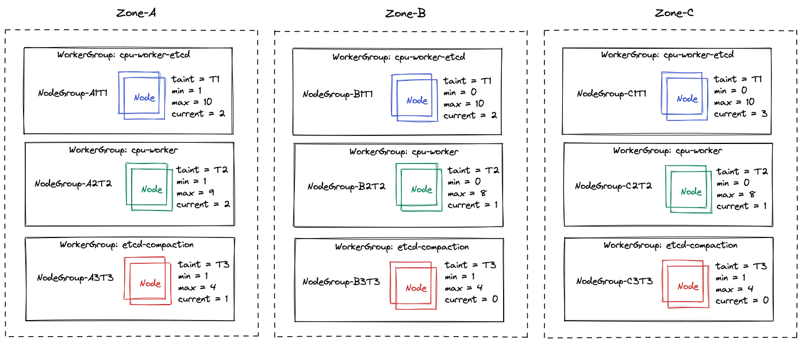

`EndpointSliceController` does the following:
* Computes the overall allocatable CPU across all zones - call it `TotalCPU`
* Computes the allocatable CPU for all nodes per zone - call it `ZoneTotalCPU`
* For each zone, it computes the CPU ratio via `ZoneTotalCPU/TotalCPU`. If the ratio between any two zones is approaching 2x, then it will remove all topology hints.

Given that the cluster-autoscaler can scale the individual node groups based on unscheduled pods or lower than threshold usage, it is possible that topological hints are added and removed dynamically. This results in non-determinism w.r.t request routing across zones, resulting in difficult to estimate cross-zonal network cost and network latencies.

[K8S#110714](https://github.com/kubernetes/kubernetes/issues/110714) has been raised.

## References

1. https://kubernetes.io/docs/concepts/workloads/pods/pod-topology-spread-constraints/
1. https://kubernetes.io/docs/concepts/scheduling-eviction/assign-pod-node/

## Appendix

### etcd Active-Passive Options

In this topology there will be just one `active/primary etcd` instance and all other `etcd` instances will be running as `hot-standby`. Each `etcd` instance serves as an independent single node cluster.
There are three options to setup an `active-passive` etcd.

<details>
<summary>Option-1: Independent single node etcd clusters</summary>

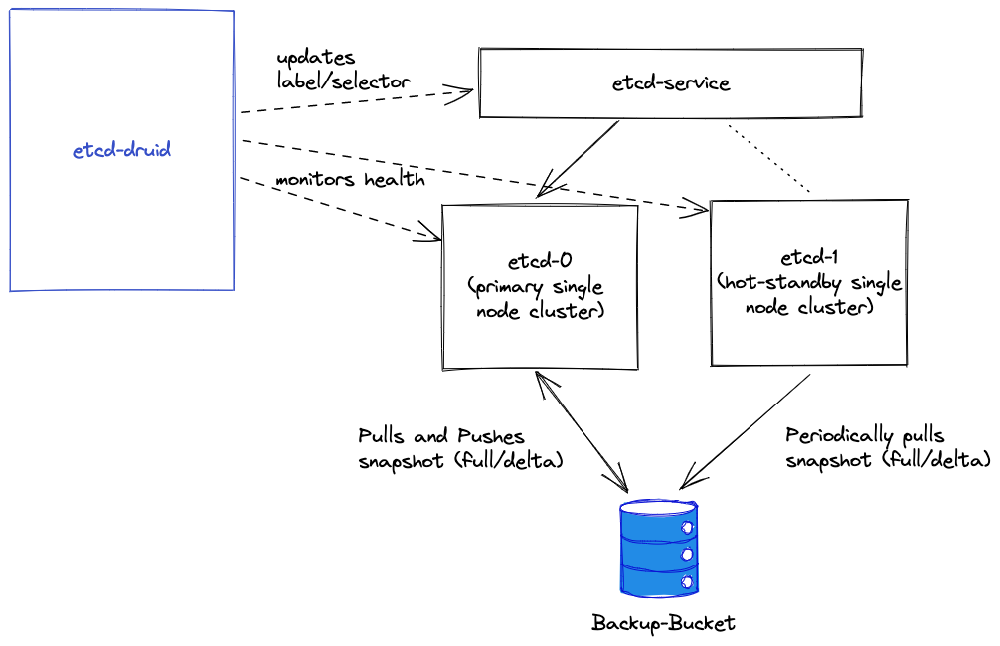

`Primary etcd` will periodically take a snapshot (full and delta) and will push these snapshots to the backup-bucket. `Hot-Standby etcd` instances will periodically query the backup-bucket and sync its database accordingly. If a new full snapshot is available which has a higher revision number than what is available in its local etcd database, then it will restore from a full snapshot. It will additionally check if there are delta snapshots having a higher revision number. If that is the case, then it will apply the delta snapshots directly to its local etcd database.
> **Note:** There is no need to run an embedded etcd to apply delta snapshots.

For the sake of illustration only, assume that there are two etcd pods `etcd-0` and `etcd-1` with corresponding labels which uniquely identify each pod. Assume that `etcd-0` is the current `primary/active` etcd instance.

`etcd-druid` will take an additional responsibility to monitor the health of `etcd-0` and `etcd-1`. When it detects that the `etcd-0` is no longer healthy, it will patch the `etcd` service to point to the `etcd-1` pod by updating the label/selector so that it becomes the `primary` etcd. It will then restart `etc-0` pod and henceforth that will serve as a `hot-standby`.

**Pros**
* There is no leader election, no quorum related issues to be handled. It is simpler to setup and manage.
* Allows you to just have a total of two etcd nodes - one is active and another is passive. This allows high availability across zones in cases where regions only have 2 zones (e.g. CCloud and Azure regions that do not have more than 2 zones).
* For all PUT calls the maximum cost in terms of network bandwidth is one call (cross-zonal) from Kube ApiServer to etcd instance which carries the payload with it. In comparison in a three member etcd cluster, the leader will have to send the PUT request to other members (cross zonal) in the etcd cluster which will be slightly more expensive than just having a single member etcd.

**Cons**
* As compared to an `active-active` etcd cluster, there is not much difference in cost of compute resources (CPU, Memory, Storage).
* The `etcd-druid` will have to periodically check the health of both the `primary` and `hot-standby` nodes and ensure that these are up and running.
* There will be a potential delay in determining that a `primary` etcd instance is no longer healthy, thereby increasing the delay in switching to the `hot-standby` etcd instance, causing longer downtime. It is also possible that at the same time `hot-standby` has also went down or is otherwise unhealthy, resulting in a complete downtime. The amount of time it will take to recover from such a situation would be several minutes (time to start etcd pod + time to restore either from full snapshot or apply delta snapshots).
* Synchronization is always via backup-bucket, which will be less frequent as compared to an `active-active` etcd cluster where there is real-time synchronization done for any updates by the leader to majority or all of its followers.<!-- If the primary crashes, the time. -->
* During the switchover from `primary` to `hot-standby`, if the `hot-standby` etcd is in the process of applying delta snaphots or restoring from a new full snapshot, then `hot-standby` should ensure that the backup-restore container sets the readiness probe to indicate that it is not ready yet, causing additional downtime.
</details>

<details>
<summary>Option-2: Perpetual Learner</summary>
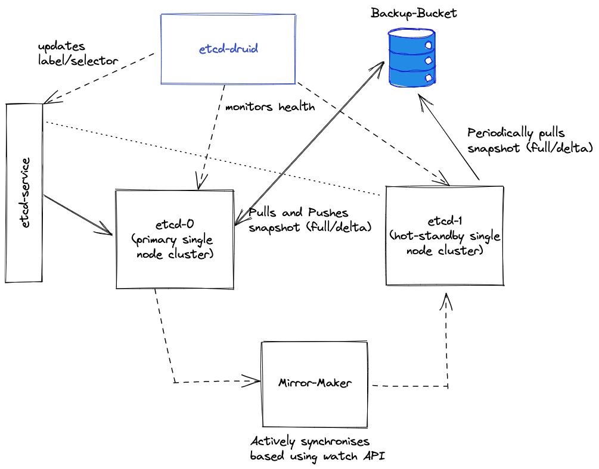

In this option, the etcd cluster and learner facilities are leveraged. `etcd-druid` will bootstrap a cluster with one member. Once this member is ready to serve client requests, then an additional `learner` will be added, which joins the etcd cluster as a non-voting member. The learner will reject client reads and writes requests, and the clients will have to reattempt. Typically, switching to another member in a cluster post retries is provided out-of-the-box by etcd `clientv3`. The only `member` who is also the leader will serve all client requests.

**Pros**
* All the pros in `Option-1` are also applicable for this option.
* The learner will be continuously updated by the leader and will remain in-sync with the leader. Using a learner retains historical data and its ordering and is therefore better in that aspect as compared to `Option-2`.

**Cons**
* All the cons in `Option-1` are also applicable for this option.
* `etcd-druid` will now have to additionally play an active role in managing members of an etcd cluster by adding new members as `learner`s and promoting a `learner` to an active member if the leader is no longer available. This will increase the complexity in the `etcd-druid`.
* To prevent clients from re-attempting to reach the `learner`, `etcd-druid` will have to ensure that the labels on the learner are set differently than the `leader`. This needs to be done every time there is a switch in the leader/learner.
* Since etcd only allows the addition of one learner at a time, this means that the HA setup can only have one failover etcd node, limiting its capability to have more than one `hot-standby`.
</details>

### Topology Spread Constraints Evaluation and Findings

<details>
<summary>Finding #1</summary>

Consider the following setup:

_Single zone & multiple nodes_

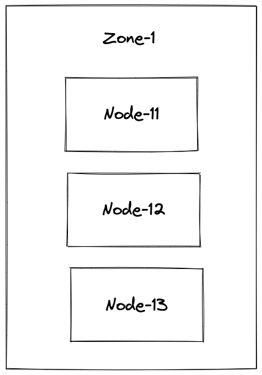

When the constraints defined above were applied, the following findings were made:

* With 3 replicas of etcd, all three got scheduled (one per node). This was a bit unexpected. As per the documentation, if there are multiple constraints, then they will be evaluated in conjunction. The first constraint should only allow 1 etcd pod per zone and the remaining 2 should not have been scheduled and should continue to be stuck in `pending` state. However, all 3 etcd pods got scheduled and started successfully.
</details>

<details>
<summary>Finding #2</summary>

Consider the following setup:

__Multiple zones & multiple nodes_

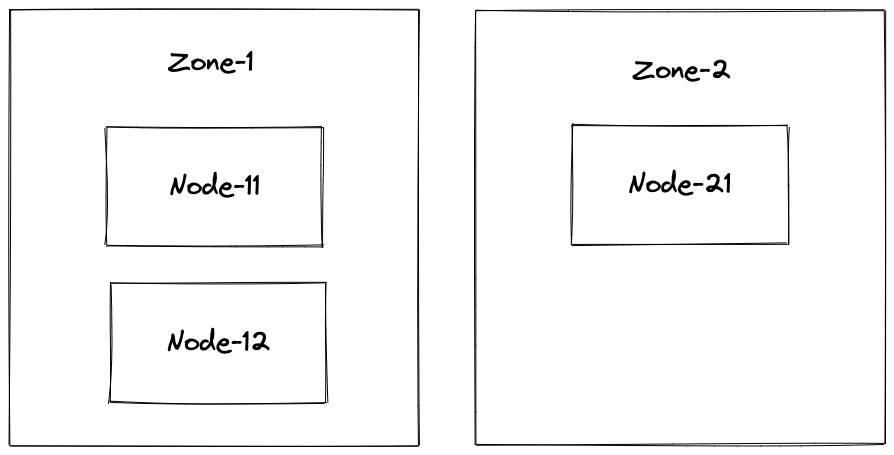

When the constraints defined above were applied, the following findings were made:
* Both constraints are evaluated in `conjunction` and the scheduling is done as expected.
* TSC behaves correctly till replicas=5. Beyond that, TSC fails. This was reported as an issue [kubernetes#109364](https://github.com/kubernetes/kubernetes/issues/109364)

</details>

<details>
<summary>Finding #3</summary>

</details>

> **Note:** Also see the [Known Limitations](https://kubernetes.io/docs/concepts/workloads/pods/pod-topology-spread-constraints/#known-limitations) topic.


### Availability Zone Outage Simulation

A zone outage was simulated by doing the following (Provider:AWS):
*  The network ACL were replaced with empty ACL (which denies all ingress and egress). This was done for all subnets in a zone. Impact of denying all traffic:
   *  The kubelet running on the nodes in this zone will not be able to communicate to the Kube Apiserver. This will in turn result in `Kube-Controller-Manager` changing the status of the corresponding `Node` objects to `Unknown`.
   *  Control plane components will not be able to communicate to the kubelet, thereby unable to drain the node.
*  To simulate the scenario where `Machine-Controller-Manager` is unable to create/delete machines, `cloudprovider` credentials were changed so that any attempt to create/delete machines will be unauthorized.

Worker groups were configured to use `region: eu-west-1` and `zones: eu-west-1a, eu-west-1b, eu-west-1c`. The `eu-west-1a` zone was brought down following the above steps. The state before and after the outage simulation is captured below.

<details>
<summary>State before the outage simulation</summary>

```bash
kubectl get po -n <shoot-control-ns> # list of pods in the shoot control plane
```

|                 NAME                        | READY | STATUS  |                   NODE                     |
|---------------------------------------------|-------|---------|--------------------------------------------|
| cert-controller-manager-6cf9787df6-wzq86     | 1/1   | Running | ip-10-242-20-17.eu-west-1.compute.internal |
| cloud-controller-manager-7748bcf697-n66t7   | 1/1   | Running | ip-10-242-20-17.eu-west-1.compute.internal |
| csi-driver-controller-6cd9bc7997-m7hr6      | 6/6   | Running | ip-10-242-20-17.eu-west-1.compute.internal |
| csi-snapshot-controller-5f774d57b4-2bghj    | 1/1   | Running | ip-10-242-20-17.eu-west-1.compute.internal |
| csi-snapshot-validation-7c99986c85-rr7zk     | 1/1   | Running | ip-10-242-20-17.eu-west-1.compute.internal |
| etcd-events-0    | 2/2   | Running | ip-10-242-60-155.eu-west-1.compute.internal |
| etcd-events-1    | 2/2   | Running | ip-10-242-73-89.eu-west-1.compute.internal |
| etcd-events-2     | 2/2   | Running | ip-10-242-20-17.eu-west-1.compute.internal |
| etcd-main-0     | 2/2   | Running | ip-10-242-73-77.eu-west-1.compute.internal |
| etcd-main-1    | 2/2  | Running | ip-10-242-22-85.eu-west-1.compute.internal |
| etcd-main-2    | 2/2   | Running | ip-10-242-53-131.eu-west-1.compute.internal |
| gardener-resource-manager-7fff9f77f6-jwggx     | 1/1   | Running | ip-10-242-73-89.eu-west-1.compute.internal |
| gardener-resource-manager-7fff9f77f6-jwggx     | 1/1   | Running | ip-10-242-60-155.eu-west-1.compute.internal |
| gardener-resource-manager-7fff9f77f6-jwggx     | 1/1   | Running | ip-10-242-20-17.eu-west-1.compute.internal |
| grafana-operators-79b9cd58bb-z6hc2     | 1/1   | Running | ip-10-242-20-17.eu-west-1.compute.internal |
| grafana-operators-79b9cd58bb-z6hc2     | 1/1   | Running | ip-10-242-20-17.eu-west-1.compute.internal |
| kube-apiserver-5fcb7f4bff-7p4xc     | 1/1   | Running | ip-10-242-20-17.eu-west-1.compute.internal |
| kube-apiserver-5fcb7f4bff-845p7     | 1/1   | Running | ip-10-242-73-89.eu-west-1.compute.internal |
| kube-apiserver-5fcb7f4bff-mrspt     | 1/1   | Running | ip-10-242-60-155.eu-west-1.compute.internal |
| kube-controller-manager-6b94bcbc4-9bz8q     | 1/1   | Running | ip-10-242-20-17.eu-west-1.compute.internal |
| kube-scheduler-7f855ffbc4-8c9pg     | 1/1   | Running | ip-10-242-20-17.eu-west-1.compute.internal |
| kube-state-metrics-5446bb6d56-xqqnt     | 1/1   | Running | ip-10-242-20-17.eu-west-1.compute.internal |
| loki-0     | 4/4   | Running | ip-10-242-60-155.eu-west-1.compute.internal |
| machine-controller-manager-967bc89b5-kgdwx     | 2/2   | Running | ip-10-242-20-17.eu-west-1.compute.internal |
| prometheus-0     | 3/3   | Running | ip-10-242-60-155.eu-west-1.compute.internal |
| shoot-dns-service-75768bd764-4957h     | 1/1   | Running | ip-10-242-20-17.eu-west-1.compute.internal |
| vpa-admission-controller-6994f855c9-5vmh6     | 1/1   | Running | ip-10-242-20-17.eu-west-1.compute.internal |
| vpa-recommender-5bf4cfccb6-wft4b     | 1/1   | Running | ip-10-242-20-17.eu-west-1.compute.internal |
| vpa-updater-6f795d7bb8-snq67     | 1/1   | Running | ip-10-242-20-17.eu-west-1.compute.internal |
| vpn-seed-server-748674b7d8-qmjbm     | 2/2   | Running | ip-10-242-20-17.eu-west-1.compute.internal |

```bash
kubectl get nodes -o=custom-columns='NAME:metadata.name,ZONE:metadata.labels.topology\.kubernetes\.io\/zone' # list of nodes with name, zone and status (was taken separately)
```

|NAME |              STATUS |         ZONE|
| --- | --- | ---|
|ip-10-242-20-17.eu-west-1.compute.internal |  Ready |    eu-west-1a |
|ip-10-242-22-85.eu-west-1.compute.internal |  Ready |    eu-west-1a |
|ip-10-242-3-0.eu-west-1.compute.internal   |  Ready |    eu-west-1a |
|ip-10-242-53-131.eu-west-1.compute.internal|  Ready |    eu-west-1b |
|ip-10-242-60-155.eu-west-1.compute.internal|  Ready |    eu-west-1b |
|ip-10-242-73-77.eu-west-1.compute.internal |  Ready |    eu-west-1c |
|ip-10-242-73-89.eu-west-1.compute.internal |  Ready |    eu-west-1c |

```bash
kubectl get machines # list of machines for the multi-AZ shoot control plane
```

| NAME | STATUS |
| ---- | ------ |
| shoot--garden--aws-ha2-cpu-worker-etcd-z1-66659-sf4wt | Running |
| shoot--garden--aws-ha2-cpu-worker-etcd-z2-c767d-s8cmf | Running |
| shoot--garden--aws-ha2-cpu-worker-etcd-z3-9678d-6p8w5 | Running |
| shoot--garden--aws-ha2-cpu-worker-z1-766bc-pjq6n | Running |
| shoot--garden--aws-ha2-cpu-worker-z2-85968-5qmjh | Running |
| shoot--garden--aws-ha2-cpu-worker-z3-5f499-hnrs6   | Running |
| shoot--garden--aws-ha2-etcd-compaction-z1-6bd58-9ffc7 | Running |

</details>

<details>
<summary>State during outage</summary>

```bash
kubectl get po -n <shoot-control-ns> # list of pods in the shoot control plane
```

|                 NAME                        | READY | STATUS  |                   NODE                     |
|---------------------------------------------|-------|---------|--------------------------------------------|
| cert-controller-manager-6cf9787df6-dt5nw     | 1/1   | Running | ip-10-242-60-155.eu-west-1.compute.internal |
| cloud-controller-manager-7748bcf697-t2bn7   | 1/1   | Running | ip-10-242-73-89.eu-west-1.compute.internal |
| csi-driver-controller-6cd9bc7997-bn82b      | 6/6   | Running | ip-10-242-60-155.eu-west-1.compute.internal |
| csi-snapshot-controller-5f774d57b4-rskwj    | 1/1   | Running | ip-10-242-73-89.eu-west-1.compute.internal |
| csi-snapshot-validation-7c99986c85-ft2qp     | 1/1   | Running | ip-10-242-60-155.eu-west-1.compute.internal |
| etcd-events-0    | 2/2   | Running | ip-10-242-60-155.eu-west-1.compute.internal |
| etcd-events-1    | 2/2   | Running | ip-10-242-73-89.eu-west-1.compute.internal |
| etcd-events-2     | 0/2   | Pending | <none> |
| etcd-main-0     | 2/2   | Running | ip-10-242-73-77.eu-west-1.compute.internal |
| etcd-main-1    | 0/2  | Pending | <none> |
| etcd-main-2    | 2/2   | Running | ip-10-242-53-131.eu-west-1.compute.internal |
| gardener-resource-manager-7fff9f77f6-8wr5n     | 1/1   | Running | ip-10-242-73-89.eu-west-1.compute.internal |
| gardener-resource-manager-7fff9f77f6-jwggx     | 1/1   | Running | ip-10-242-73-89.eu-west-1.compute.internal |
| gardener-resource-manager-7fff9f77f6-lkgjh     | 1/1   | Running | ip-10-242-60-155.eu-west-1.compute.internal |
| grafana-operators-79b9cd58bb-m55sx     | 1/1   | Running | ip-10-242-60-155.eu-west-1.compute.internal |
| grafana-users-85c7b6856c-gx48n     | 1/1   | Running | ip-10-242-73-89.eu-west-1.compute.internal |
| kube-apiserver-5fcb7f4bff-845p7     | 1/1   | Running | ip-10-242-73-89.eu-west-1.compute.internal |
| kube-apiserver-5fcb7f4bff-mrspt     | 1/1   | Running | ip-10-242-60-155.eu-west-1.compute.internal |
| kube-apiserver-5fcb7f4bff-vkrdh     | 1/1   | Running | ip-10-242-73-89.eu-west-1.compute.internal |
| kube-controller-manager-6b94bcbc4-49v5x     | 1/1   | Running | ip-10-242-60-155.eu-west-1.compute.internal |
| kube-scheduler-7f855ffbc4-6xnbk     | 1/1   | Running | ip-10-242-73-89.eu-west-1.compute.internal |
| kube-state-metrics-5446bb6d56-g8wkp     | 1/1   | Running | ip-10-242-73-89.eu-west-1.compute.internal  |
| loki-0     | 4/4   | Running | ip-10-242-73-89.eu-west-1.compute.internal |
| machine-controller-manager-967bc89b5-rr96r     | 2/2   | Running | ip-10-242-60-155.eu-west-1.compute.internal |
| prometheus-0     | 3/3   | Running | ip-10-242-60-155.eu-west-1.compute.internal |
| shoot-dns-service-75768bd764-7xhrw     | 1/1   | Running | ip-10-242-73-89.eu-west-1.compute.internal  |
| vpa-admission-controller-6994f855c9-7xt8p     | 1/1   | Running | ip-10-242-73-89.eu-west-1.compute.internal |
| vpa-recommender-5bf4cfccb6-8wdpr     | 1/1   | Running | ip-10-242-73-89.eu-west-1.compute.internal |
| vpa-updater-6f795d7bb8-gccv2     | 1/1   | Running | ip-10-242-60-155.eu-west-1.compute.internal |
| vpn-seed-server-748674b7d8-cb8gh     | 2/2   | Running | ip-10-242-60-155.eu-west-1.compute.internal |

Most of the pods except `etcd-events-2` and `etcd-main-1` are stuck in `Pending` state. Rest all of the pods are which were running on nodes in `eu-west-1a` zone were rescheduled automatically.

```bash
kubectl get nodes -o=custom-columns='NAME:metadata.name,ZONE:metadata.labels.topology\.kubernetes\.io\/zone' # list of nodes with name, zone and status (was taken separately)
```

|NAME |              STATUS |         ZONE|
| --- | --- | ---|
|ip-10-242-20-17.eu-west-1.compute.internal |  NotReady |    eu-west-1a |
|ip-10-242-22-85.eu-west-1.compute.internal |  NotReady |    eu-west-1a |
|ip-10-242-3-0.eu-west-1.compute.internal   |  NotReady |    eu-west-1a |
|ip-10-242-53-131.eu-west-1.compute.internal|  Ready |    eu-west-1b |
|ip-10-242-60-155.eu-west-1.compute.internal|  Ready |    eu-west-1b |
|ip-10-242-73-77.eu-west-1.compute.internal |  Ready |    eu-west-1c |
|ip-10-242-73-89.eu-west-1.compute.internal |  Ready |    eu-west-1c |

```bash
kubectl get machines # list of machines for the multi-AZ shoot control plane
```

| NAME | STATUS |  AGE |
| ---- | ------ | ---- |
| shoot--garden--aws-ha2-cpu-worker-etcd-z1-66659-jlv56| Terminating | 21m |
| shoot--garden--aws-ha2-cpu-worker-etcd-z1-66659-sf4wt | Unknown | 3d |
| shoot--garden--aws-ha2-cpu-worker-etcd-z2-c767d-s8cmf | Running | 3d |
| shoot--garden--aws-ha2-cpu-worker-etcd-z3-9678d-6p8w5 | Running | 3d |
| shoot--garden--aws-ha2-cpu-worker-z1-766bc-9m45j | CrashLoopBackOff | 2m55s |
| shoot--garden--aws-ha2-cpu-worker-z1-766bc-pjq6n | Unknown | 2d21h |
| shoot--garden--aws-ha2-cpu-worker-z1-766bc-vlflq | Terminating | 28m |
| shoot--garden--aws-ha2-cpu-worker-z2-85968-5qmjh | Running | 3d |
| shoot--garden--aws-ha2-cpu-worker-z2-85968-zs9lr | CrashLoopBackOff | 7m26s |
| shoot--garden--aws-ha2-cpu-worker-z3-5f499-hnrs6   | Running | 2d21h |
| shoot--garden--aws-ha2-etcd-compaction-z1-6bd58-8qzln | CrashLoopBackOff | 12m |
| shoot--garden--aws-ha2-etcd-compaction-z1-6bd58-9ffc7 | Terminating | 3d|

MCM attempts to delete the machines and since it is unable to do so, the machines transition to `Terminating` state and are stuck there. It subsequently attempts to launch new machines, which also fails, and these machines transition to `CrashLoopBackOff` state.

</details>

### Ingress/Egress Traffic Analysis Details

Consider the following etcd cluster:

```bash
$ etcdctl endpoint status --cluster -w table
```

|                                ENDPOINT                                |        ID        | VERSION | DB SIZE | IS LEADER | IS LEARNER | RAFT TERM | RAFT INDEX | RAFT APPLIED INDEX |
|------------------------------------------------------------------------|------------------|---------|---------|-----------|------------|-----------|------------|--------------------|
| `https://etcd-main-0.etcd-main-peer.shoot--ash-garden--mz-neem.svc:2379` | 37e93e9d1dd2cc8e |  3.4.13 |  7.6 MB |     false |      false |        47 |       3863 |               3863 |
| `https://etcd-main-2.etcd-main-peer.shoot--ash-garden--mz-neem.svc:2379` | 65fe447d73e9dc58 |  3.4.13 |  7.6 MB |      true |      false |        47 |       3863 |               3863 |
| `https://etcd-main-1.etcd-main-peer.shoot--ash-garden--mz-neem.svc:2379` | ad4fe89f4e731298 |  3.4.13 |  7.6 MB |     false |      false |        47 |       3863 |               3863 |

<details>
<summary>Multi-zonal shoot control plane ingress/egress traffic in a fresh shoot cluster with no user activity</summary>

The steady state traffic (post all controllers have made initial `list` requests to refresh their informer caches) is depicted below (span = 1hr):


_Observations:_
* Leader to per follower max egress: ~20Kib/s
* One follower to leader max egress: ~20Kib/s
* Follower to follower max egress: ~2Kibs/s

Total ingress + egress traffic amongst etcd members = ~84Kib/s.
</details>

<details>
<summary>Traffic generated during PUT requests to etcd leader</summary>

Generating a load of 100 PUT requests/second for a 30 seconds duration by targeting the etcd leader. This will generate ~100KiB/s traffic (value size is 1kib).

```bash
 benchmark put --target-leader  --rate 100 --conns=400 --clients=400 --sequential-keys --key-starts 0 --val-size=1024 --total=3000 \
     --endpoints=https://etcd-main-client:2379 \
     --key=/var/etcd/ssl/client/client/tls.key \
     --cacert=/var/etcd/ssl/client/ca/bundle.crt \
     --cert=/var/etcd/ssl/client/client/tls.crt
```

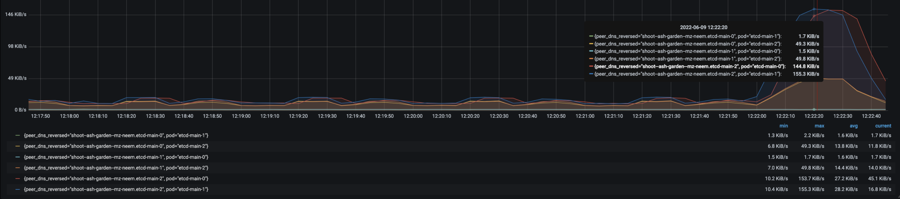

_Observations:_
* Leader to per follower max egress: ~155 KiB/s (pattern duration: 50 secs)
* One follower to leader max egress: ~50Kib/s (pattern duration: 50 secs)
* Follower to follower max egress: ~2Kibs/s

Total ingress + egress traffic amongst etcd members = ~412Kib/s.
</details>

<details>
<summary>Traffic generated during PUT requests to etcd follower</summary>
Generating a load of 100 PUT requests/second for a 30 seconds duration by targeting an etcd follower. This will generate ~100KiB/s traffic(value size is 1kib).

```bash
benchmark put  --rate 100 --conns=400 --clients=400 --sequential-keys --key-starts 3000 --val-size=1024 --total=3000 \
    --endpoints=https://etcd-main-1.etcd-main-peer.shoot--ash-garden--mz-neem.svc:2379 \
    --key=/var/etcd/ssl/client/client/tls.key \
    --cacert=/var/etcd/ssl/client/ca/bundle.crt \
    --cert=/var/etcd/ssl/client/client/tls.crt
```

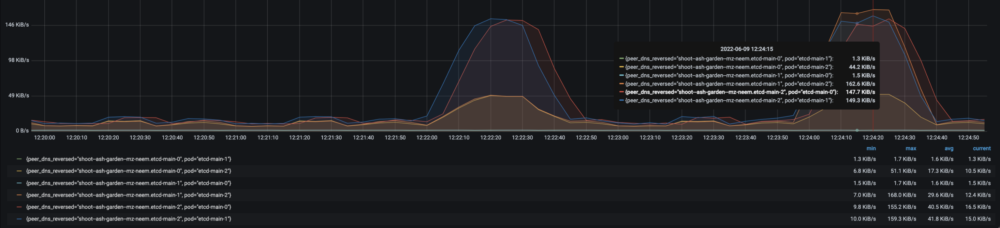

_Observations:_
* In this case, the follower(`etcd-main-1`) redirects the PUT request to leader(`etcd-main2`) max egress: ~168 KiB/s
* Leader to per follower max egress:  ~150 KiB/s (pattern duration: 50 secs)
* One follower to leader max egress: ~45Kib/s (pattern duration: 50 secs)
* Follower to follower max egress: ~2Kibs/s

Total ingress + egress traffic amongst etcd members = ~517KiB/s.
</details>

<details>
<summary>Traffic generated during etcd follower initial sync with large revision difference</summary>

Consider the following etcd cluster:

```bash
$ etcdctl endpoint status --cluster -w table
```

|                                ENDPOINT                                |        ID        | VERSION | DB SIZE | IS LEADER | IS LEARNER | RAFT TERM | RAFT INDEX | RAFT APPLIED INDEX |
|------------------------------------------------------------------------|------------------|---------|---------|-----------|------------|-----------|------------|--------------------|
| https://etcd-main-0.etcd-main-peer.shoot--ash-garden--mz-neem.svc:2379 | 37e93e9d1dd2cc8e |  3.4.13 |  5.1 GB |     false |      false |        48 |      47527 |              47527 |
| https://etcd-main-1.etcd-main-peer.shoot--ash-garden--mz-neem.svc:2379 | ad4fe89f4e731298 |  3.4.13 |  5.1 GB |      true |      false |        48 |      47576 |              47576 |

In this case, new follower or crashed follower `etcd-main-2` joins the etcd cluster with large revision difference (5.1 GB DB size). The etcd follower had its DB size = 14MB when it crashed. There was a flurry of activity and that increased the leader DB size to 5.1GB thus creating a huge revision difference.

>Scale up etcd member to  3

`kubectl scale statefulsets etcd-main --replicas=3 -n  shoot--ash-garden--mz-neem`

|                                ENDPOINT                                |        ID        | VERSION | DB SIZE | IS LEADER | IS LEARNER | RAFT TERM | RAFT INDEX | RAFT APPLIED INDEX |
|------------------------------------------------------------------------|------------------|---------|---------|-----------|------------|-----------|------------|--------------------|
| https://etcd-main-0.etcd-main-peer.shoot--ash-garden--mz-neem.svc:2379 | 37e93e9d1dd2cc8e |  3.4.13 |  5.1 GB |     false |      false |        48 |      50502 |              50502 |
| https://etcd-main-2.etcd-main-peer.shoot--ash-garden--mz-neem.svc:2379 | 65fe447d73e9dc58 |  3.4.13 |  5.0 GB |     false |      false |        48 |      50502 |              50502 |
| https://etcd-main-1.etcd-main-peer.shoot--ash-garden--mz-neem.svc:2379 | ad4fe89f4e731298 |  3.4.13 |  5.1 GB |      true |      false |        48 |      50502 |              50502 |

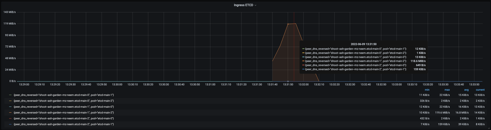

_Observations:_
* Leader to new follower or crashed follower `etcd-main-2` (which joins with large revision difference) max egress: ~120 MiB/s (noticeable pattern duration: 40 secs).
* New follower `etcd-main-2` to leader max egress: ~159 KiB/s (pattern duration: 40 secs).
* Leader to another follower `etcd-main-0` max egress: <20KiB/s.
* Follower `etcd-main-0` to leader max egress: <20> Kib/s.
* Follower to follower max egress: ~2Kibs/s

Total ingress + egress traffic amongst etcd members = ~121MiB/s.
</details>

<details>
<summary>Traffic generated during GET requests to etcd leader</summary>

In this case, trying to get the keys which match between 1 and 17999 by targeting leader `etcd-main-1`. This will dump both keys and values.

Executing the following command from `etcd-client` pod (running in same namespace):

```bash
root@etcd-client:/#  etcdctl --endpoints=https://etcd-main-1.etcd-main-peer.shoot--ash-garden--mz-neem.svc:2379 get 1 17999 > /tmp/range2.txt
root@etcd-client:/# du -h  /tmp/range2.txt
607M	/tmp/range2.txt
```

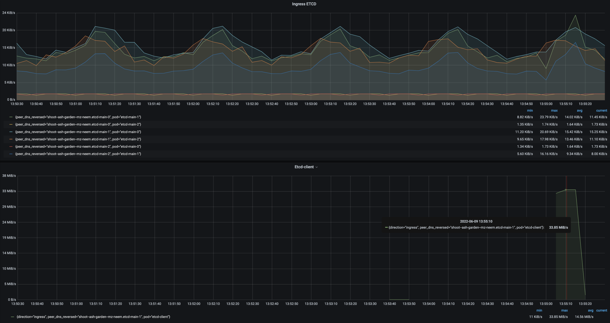

_Observations:_
* Downloaded dump file is around 607 MiB.
* Leader `etcd-main-1` to `etcd-client` max egress ~34MiBs.
* etcd intra cluster network traffic remains the same, observed that there is no change in the network traffic pattern.

</details>

<details>
<summary>Traffic generated during GET requests to etcd follower</summary>

In this case, trying to get the keys which match between 1 and 17999 by targeting follower`etcd-main-2`. This will dump both keys and values.

```bash
root@etcd-client:/# etcdctl --endpoints=https://etcd-main-2.etcd-main-peer.shoot--ash-garden--mz-neem.svc:2379 get 1 17999 > /tmp/range.txt
root@etcd-client:/# du -h  /tmp/range.txt
607M	/tmp/range.txt
root@etcd-client:/#
```

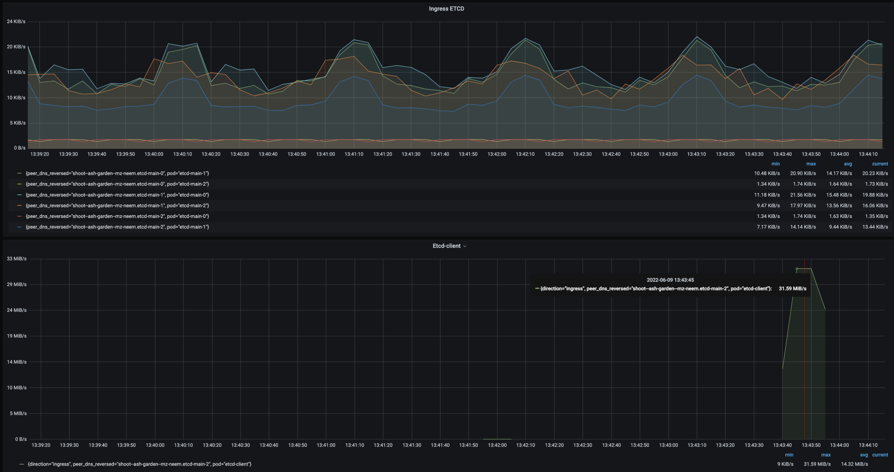

_Observations:_
* Downloaded dump file is around 607 MiB.
* Follower `etcd-main-2` to `etcd-client` max egress ~32MiBs.
* etcd intra cluster network traffic remains same, observed that there is no change in the network traffic pattern.
* **Watch requests are not forwarded to leader `etcd-main-1` from `etcd-main-2`**

</details>

<details>
<summary>Traffic generated during DELETE requests to etcd leader</summary>

In this case, trying to delete the keys which match between 0 and 99999 by targeting leader.

Executing the following command from `etcd-client` pod:

```bash
root@etcd-client:/# time etcdctl --endpoints=https://etcd-main-2.etcd-main-peer.shoot--ash-garden--mz-neem.svc:2379 del 0 99999    --dial-timeout=300s --command-timeout=300s
99999

real	0m0.664s
user	0m0.008s
sys	0m0.016s
root@etcd-client:/#
```
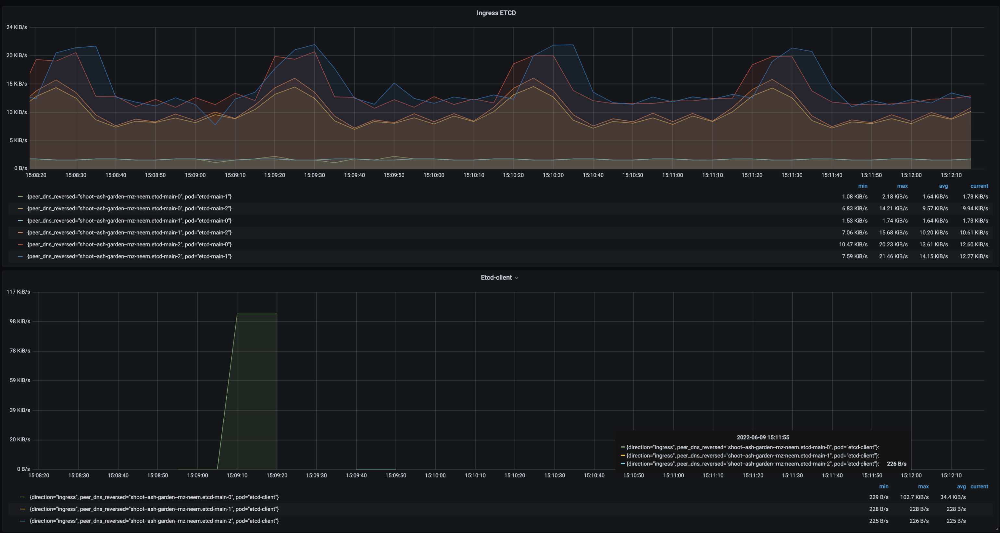

_Observations:_
* Downloaded dump file is around 607 MiB.
* Leader `etcd-main-2` to `etcd-client` max egress ~226B/s.
* etcd intra cluster network traffic remains same, observed that there is no change in the network traffic pattern.

</details>

<details>
<summary>Traffic generated during DELETE requests to etcd follower</summary>

In this case, trying to delete the keys which match between 0 and 99999 by targeting follower.

Executing the following command from `etcd-client` pod:

```bash
root@etcd-client:/# time etcdctl --endpoints=https://etcd-main-1.etcd-main-peer.shoot--ash-garden--mz-neem.svc:2379 del 0 99999    --dial-timeout=300s --command-timeout=300s
99999

real	0m0.664s
user	0m0.008s
sys	0m0.016s
root@etcd-client:/#
```

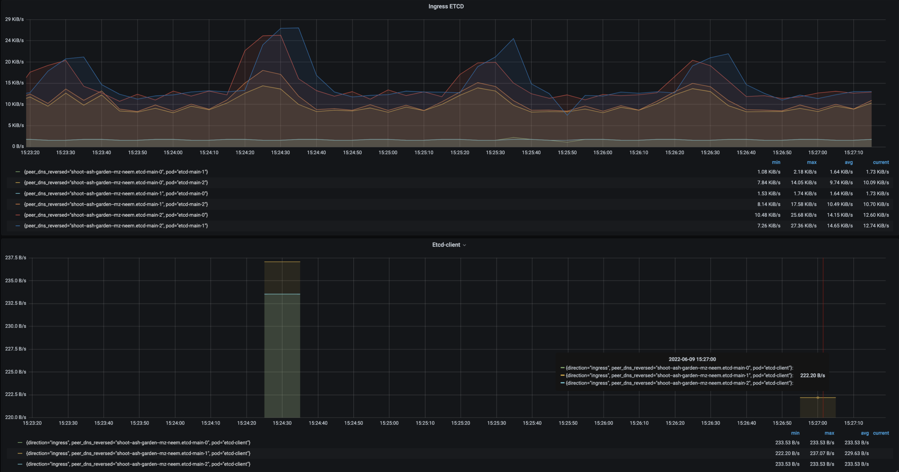

_Observations:_
* Downloaded dump file is around 607 MiB.
* Leader `etcd-main-2` to `etcd-client` max egress ~222B/s.
* etcd intra cluster network traffic remains same, observed that there is no change in the network traffic pattern.

</details>

<details>
<summary>Traffic generated during WATCH requests to etcd</summary>

Etcd cluster state

|                                ENDPOINT                                |        ID        | VERSION | DB SIZE | IS LEADER | IS LEARNER | RAFT TERM | RAFT INDEX | RAFT APPLIED INDEX |
|------------------------------------------------------------------------|------------------|---------|---------|-----------|------------|-----------|------------|--------------------|
| https://etcd-main-0.etcd-main-peer.shoot--ash-garden--mz-neem.svc:2379 | 37e93e9d1dd2cc8e |  3.4.13 |  673 MB |     false |      false |       388 |     970471 |             970471 |
| https://etcd-main-2.etcd-main-peer.shoot--ash-garden--mz-neem.svc:2379 | 65fe447d73e9dc58 |  3.4.13 |  673 MB |     true  |      false |       388 |     970472 |             970472 |
| https://etcd-main-1.etcd-main-peer.shoot--ash-garden--mz-neem.svc:2379 | ad4fe89f4e731298 |  3.4.13 |  673 MB |     false |      false |       388 |     970472 |             970472 |

Watching the keys which match between 0 and 99999 by targeting follower.

Executing the following command from `etcd-client` pod:

```bash
time etcdctl --endpoints=https://etcd-main-1.etcd-main-peer.shoot--ash-garden--mz-neem.svc:2379 watch 0 99999    --dial-timeout=300s --command-timeout=300s
```

In parallel generating `100000` keys and each value size is 1Kib by targeting etcd leader for this case (around 500rps):

```
benchmark put --target-leader  --rate 500 --conns=400 --clients=800 --sequential-keys --key-starts 0 --val-size=1024 --total=100000 \
    --endpoints=https://etcd-main-client:2379 \
    --key=/var/etcd/ssl/client/client/tls.key \
    --cacert=/var/etcd/ssl/client/ca/bundle.crt \
    --cert=/var/etcd/ssl/client/client/tls.crt
```
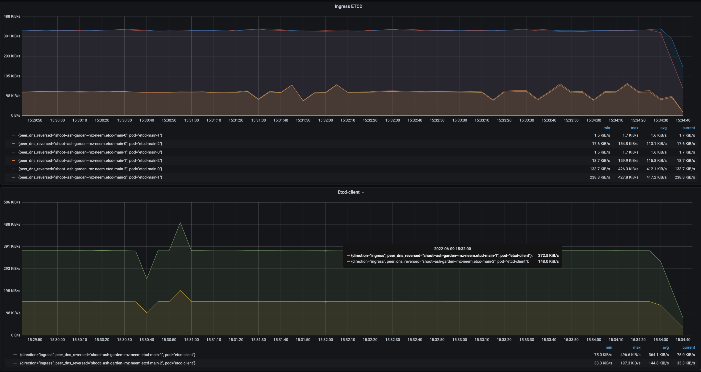


_Observations:_
* etcd intra cluster network traffic remains the same, observed that there is no change in the network traffic pattern.
* Follower `etcd-main-1` to `etcd-client` max egress is 496 KiBs.
* **Watch requests are not forwarded to leader `etcd-main-2` from follower `etcd-main-1`**

Deleting the keys which match between 0 and 99999 by targeting follower and in parallel watching the keys.

```bash
root@etcd-client:/# time etcdctl --endpoints=https://etcd-main-1.etcd-main-peer.shoot--ash-garden--mz-neem.svc:2379 del 0 99999    --dial-timeout=300s --command-timeout=300s
99999

real	0m0.590s
user	0m0.018s
sys	0m0.006s
```


_Observations:_
* etcd intra cluster network traffic remains same, observed that there is no change in the network traffic pattern.
* Follower `etcd-main-1` to `etcd-client` max egress is 222B/s.
* Watch lists the keys which are deleted, not their values.
</details>