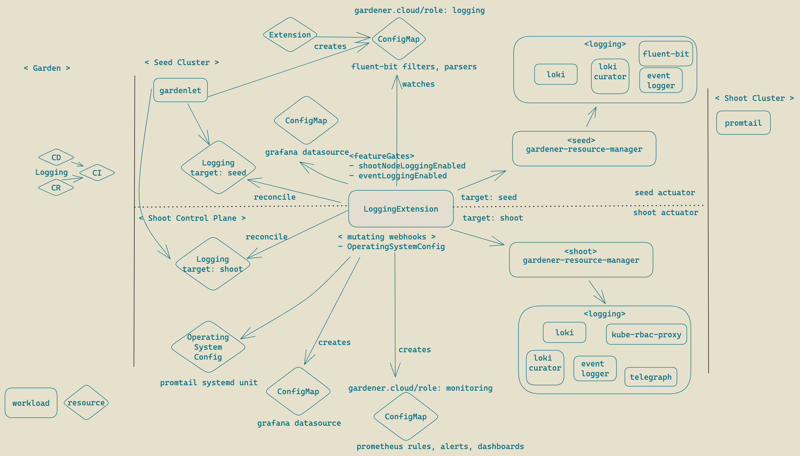

# GEP-21: Gardener logging stack as an extension for Shoot and Seed clusters

## Table of Contents

- [Summary](#summary)
- [Motivation](#motivation)
  - [Goals](#goals)
  - [Non-Goals](#non-goals)
- [Proposal](#proposal)
- [Alternatives](#alternatives)

## Summary

Gardener logging stack is a complex multi-component implementation tightly integrated in the core provisioning functions. It is an essential for collecting and aggregating logs streams from all running parts with many configurations bits. At the moment these configurations as well as the entire lifecycle are also part of the core implementation. The idea of this proposal is to externalize the lifecycle of the logging stack following the Gardener Extension mechanism allowing greater flexibility in both implementation and configuration aspects. At later phase the components that comprise the logging stack may evolve independently from gardener core utilizing its own controllers and operator patterns. Such decoupled architecture contributes directly to the overall system stability and reliability.

## Motivation

By decoupling Gardener core from logging stack lifecycle management we allow independent development of the logging stack and simplifying the Gardener core. We will have the ability if required to change logging stack architecture or even its components like log shippers, indexing backends and visualizations. Components may introduce their own kubernetes operators for grater flexibility and stability of the respective components. This entire complexity shall not be part of the core Gardener and shall remain externalized but in the same time fully integrated by the Gardener extension architecture.

## Goals

We are aiming at achieving following goals:

- Externalize logging stack lifecycle management following Gardener Extension architecture
- Preserve current use-cases depending on the logging stack such as event logging and indexing, searches, visualizations and retention of logs
- Migrate or preserve all current component configurations in regards to the logging stack such as filters and parsers
- Retain the same tool set of the logging stack (loki, grafana, fluent-bit, promtail)
- Preserve the same observability qualities of the logging stack

### Non-Goals

Although intended in the future, following goals are not target of the current proposal:

- migrating logging stack components to other alternatives
- introducing logging stack components operators such as loki-operator or fluent-bit operator

## Proposal



### Logging CRD

- crd
Logging spec is simple and includes the default ProviderConfig spec and status definitions. The CRD provisioning follows the standard CRD extension handling in gardener and the manifests are generated with the standard `kubebuilder` markers. Gardener core is responsible for delivering the CRD into the target seed cluster. The plan is Gardener to deploy the Logging resource as early as possible in the shoot reconciliation and to reconcile it when the cluster is hibernated. The deletion of the resoruce should be one of the latest steps in the flow.

```yaml
spec:
  # type designates different logging stacks provider implementations such as loki, opensearch ...
  type:
  # logging stack target can be seed | shoot
  target:
  # default provider config spec
  providerConfig: {}

  # additional extension configuration
  hvpaEnabled:
status:
  # default status
  providerStatus: {}
  conditions: []
  lastError: {}
  lastOperations: {}
  observedGeneration:
  state: {}
  resources: []
```

### provisioning seed/shoot

The logging extension provides respective `ControllerDeployment` and `ControllerRegistration` resources to plug into the gardener extension lifecycle machinery. There is an extension helm chart bundled in the controller deployment which is referenced by the corresponding controller registration construct.

```yaml
apiVersion: core.gardener.cloud/v1beta1
kind: ControllerDeployment
metadata:
  name: logging
type: helm
providerConfig:
  chart: ---
  values:
    image:
      tag:
```

Deployment policy is set to "Always" since the logging extension is considered a mandatory function for seed clusters.
*Question*: Shall we adapt the policy to be on demand? Where and how the decision is made?

```yaml
apiVersion: core.gardener.cloud/v1beta1
kind: ControllerRegistration
metadata:
  name: logging
spec:
  deployment:
    policy: Always
    deploymentRefs:
    - name: logging
  resources:
  - kind: Logging
    target: seed
    type: ...
  - kind: Logging
    target: shoot
    type: ...
```

The example `ControllerRegistration` resource demonstrates the two specializations of the logging stack based on the `target` field.

- "seed" logging stack <br>
The "seed" logging stack instance fulfills the cluster wide aggregation of container logs which are not part of the "shoots" control plane components. There are *no* changes in the initial release of the logging extension controller, *no* changes in the architecture of the logging stack and there are *no* changes in the component types comprising the "seed"(or "shoot") logging stacks. Maintaining the same component set, the logging extension controller uses the existing helm charts to render:
  - `fluent-bit` for reading containers stdout and stderr from the corresponding host locations
  - `loki` for logs persistance and indexing
  - `curator` for implementing the logs retentions policies
  - `event logger` component fetching k8s events
The "seed" logging stack K8S resources are "managed". The logging extension controller leverages the `ManagedResource` concept to delegate the reconciliation of the logging stack components to the `garden-resource-manager` instance.
*Note*: In case there is a lifecycle dependency or create/delete order among different logging stack components matters then those dependencies must be orchestrated by the logging extension controller.

- "shoot" logging stack <br>
Similarly logging stack workload in "shoot" is "managed" by the respective `ManagedResources`.

- Logging stack downsizing
In both targets (seed, shoot), the down sizing of the logging stacks workloads is tightly coupled with the maintenance windows defined for the cluster. When `hvpaEnabled` filed in the `Logging` resource is set to `true` a logging stack can be downsized based on the recommendations if the target cluster is in its maintenance window.

- Reconciliation
An update in the `ControllerRegistration` of the logging stack extension leads to reconciling the extension controller and rendering the workloads definitions of the corresponding logging stacks. Configuration and dependency management are described in the next section.

### Configuration management

- Logging Extension controller config map
The configuration of the logging extension is rather simple. It contains a set of shoot purposes for which the logging stack will be installed. Here is nan example where shoots with "evaluation" or "development" purpose will get a logging stack. In addition there is a set of feature gates governing capabilities such as event logging.

*Question*: Shall we based decision on `enabled` field instead?

```yaml
config:
  shootPurposesWithNodeLogging:
    - "evaluation"
    - "development"
  featureGates:
    shootNodeLoggingEnabled: true
    eventLoggingEnabled: true
```

### Dependency management

Logging extension controller watches for fluent-bit configuration updates and modifies configurations related to target `grafana` datasources, `prometheus` monitoring scrape configurations, rules, alerts, grafana dashboards and `promtail` systemd service definitions.

- Fluent-bit configurations <br>
The logging stack extension controller watches for ConfigMaps with label `extensions.gardener.cloud/configuration: logging` and merges these configurations in fluent-bit configuration. Core components or other extensions controller need to supply theirs fluent-bit filters and parsers via such config maps. The format of the configurations needs to follow the fluent-bit expected format.

- Grafana datasources <br>
Logging stack uses `Grafana` for container logs searches and visualizations. There are multiple grafana instances depending on the collected logs and audience. There is a central instance connected to the seed logging stack exposing core components and extension logs as well as systemd logs from the seed cluster. Separately each shoot instance has a dedicated grafana instance exposing container logs from the shoot's control plane. To facilitate Grafana configurations logging extension controller creates and labels a config map carrying the Loki datasource definition. A side car in the target grafana pods needs to look for such labeled config maps and aggragete datasource definitions into the grafana configuration. This approach is already present in the [kube-promethues-stack](https://github.com/prometheus-community/helm-charts/blob/43ab750f460356564be1eaa867632422235bd3ec/charts/kube-prometheus-stack/values.yaml#L709) managed grafana instances. The latter uses standard grafana helm chart.
*Proposal*: We may consider switching grafana provisioning to helm chart based or to leverage configuration aggregates side cars.

- The Logging extension controller creates configmaps with label `extensions.gardener.cloud/configuration: monitoring` containing the loki’s scrape-configs, promethues rules, alerts and dashboards.

### OS specific components provisioning

- Promtail instance in Shoots <br>
`Promtail` component on the shoot nodes is delivered via `OperatingSystemConfig` resource further installed as a systemd service. The required promtail configurations are propagated through a mutating webhook provided by the extension controller.

Open Question: Will it be possible to handle more instances of `OperatingSystemConfig` resources? At the moment if we want to supply the systemd unit definitions for the promtail service we need to modify an existing `OperatingSystemConfig` instance. A cleaner option will be the create a new `OperatingSystemConfig` instance only with promtail configurations and the respective controller reconciling the `OperatingSystemConfig` can take care for aggregating and merging those into e single OS configuration.

## Alternatives

The next step in the logging extension controller is to further decouple core gardener components from the logging stack and to introduce additional ProviderExtension types. For example today the logging stack is based on Loki and potentially logging stacks based on OpenSearch can also be developed in the future. This uses case is a mandatory step in the case we want to migrate from one logging stack type to other where there will be cluster setups featuring different stacks.
