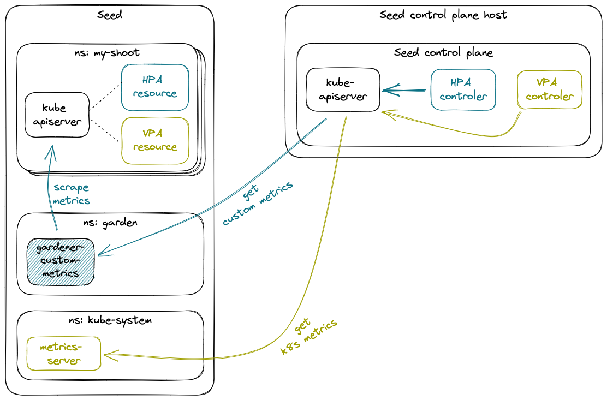

# GEP-23: Autoscaling Shoot kube-apiserver via Independently Driven HPA and VPA

📌 **Replacement Notice**

The GEP is replaced by an autoscaling solution for Kubernetes API server based on native HPA and VPA resources. Kubernetes API server is scaled simultaneously by HPA and VPA on the same metric (CPU and memory usage). For more details, see the [Autoscaling Specifics for Components documentation](../development/autoscaling-specifics-for-components.md). The implementation PR of the replacement feature is [gardener/gardener#9678](https://github.com/gardener/gardener/pull/9678).

---

## Table of Contents
- [GEP-23: Autoscaling Shoot kube-apiserver via Independently Driven HPA and VPA](#gep-23-autoscaling-shoot-kube-apiserver-via-independently-driven-hpa-and-vpa)
  - [Table of Contents](#table-of-contents)
  - [Summary](#summary)
  - [Motivation](#motivation)
    - [Existing Solution](#existing-solution)
    - [Deficiencies of the Existing Solution](#deficiencies-of-the-existing-solution)
    - [Other Benefits to Replacing the Existing Solution](#other-benefits-to-replacing-the-existing-solution)
    - [Goals](#goals)
    - [Non-Goals](#non-goals)
  - [Proposal](#proposal)
    - [Rationale](#rationale)
    - [Design Outline](#design-outline)
    - [Element: Gardener Custom Metrics Provider Component](#element-gardener-custom-metrics-provider-component)
      - [High availability operation](#high-availability-operation)
    - [Element: New Custom Pod Metric for ShootKapis](#element-new-custom-pod-metric-for-shootkapis)
    - [Element: HPA](#element-hpa)
    - [Element: VPA](#element-vpa)
    - [Transition Strategy](#transition-strategy)
  - [Discussion and Limitations](#discussion-and-limitations)
      - [Gardener-custom metrics precludes the use of other sources of custom metrics](#gardener-custom-metrics-precludes-the-use-of-other-sources-of-custom-metrics)
      - [Observed fluctuations in actual compute efficiency affecting ShootKapi workloads](#observed-fluctuations-in-actual-compute-efficiency-affecting-shootkapi-workloads)
  - [Alternatives](#alternatives)
  - [References](#references)

## Summary
When it comes to autoscaling shoot control plane `kube-apiserver` instances (ShootKapi hereafter), Gardener needs
both stability and efficiency (accurate scaling). The existing approach of fusing HPA and VPA into the 2-dimensional
autoscaler which is HVPA, poses severe algorithmic limitations which manifest as stability and efficiency issues in the
field.

This document outlines the main deficiencies in the existing solution and proposes a simple design which overcomes them,
reduces maintenance effort by reducing Gardener's custom code base, and enables subsequent reduction in ShootKapi
compute cost.

## Motivation
Gardener uses a relatively complex approach for scaling shoot control plane `kube-apiserver` instances (ShootKapi).
This need is a consequence of the following concerns:
1. Gardener supplies K8s clusters of highly diverse compute scale and utilization - ranging from a couple of small
   practically idle nodes, to hundreds of heavily utilized giants. Furthermore, the ratio of 'cluster compute capacity'
   to 'ShootKapi load' substantially varies between different applications utilizing Gardener shoots. As a result,
   compute resources required by ShootKapis of different shoots vary by two orders of magnitude.
2. The compute cost of ShootKapi workloads constitutes a major part of Gardener's overall compute cost. Small relative
   waste in sizing ShootKapis results in considerable absolute cost.
3. Kube-apiserver does not scale well horizontally, in a sense that extra replicas come with substantial compute overhead.

In short, ShootKapi needs to be scaled:
- Within a broad range
- With reasonable accuracy, relative to actual resource consumption

The implication is that ShootKapi requires both horizontal and vertical scaling. The existing implementation utilized
to that end is [HVPA].

### Existing Solution
[HVPA] strives to achieve a fusion of HPA and VPA recommendations:
`HvpaRecommendedCapacity = k * HpaRecommendedCapacity + (1 - k) * VpaRecommendedCapacity`
The underlying goal is to allow HPA and VPA to be driven by the same CPU and memory usage metrics, and overcome the
HPA-VPA incompatibility known to exist in that mode.

### Deficiencies of the Existing Solution
There are [known issues in the scaling algorithm implemented by HVPA].
Those substantially restrict the set of features which can be used with the level of reliability required
in productive applications. The issues primarily manifest as the following practical problems:
- To ensure correct operation, HVPA must be configured to do horizontal scaling first: vertical scale is maintained at
  its minimum, unless horizontal scale has reached its maximum. This results in higher number of replicas than strictly
  necessary, wasting resources.\[[1]\]
- To mitigate further waste per previous point, HVPA must be limited to a low number of replicas. That
  limit is inadequate for some applications. Furthermore, the current value of the limit (4) is a poor fit for high
  availability applications which often use 3 availability zones, resulting in uneven replica distribution across zones.
- HVPA uses a stabilisation mechanism which suppresses scaling until a certain 'MinChange' threshold is reached. This
  behaviour is known to prevent the proper response to node CPU exhaustion.\[[2]\]
- HVPA does not make use of the opportunity to update a pod's vertical scale when the pod is created. HVPA can only
  update a pod by purposefully evicting all replicas. This results in a greater number of pod evictions.
- HVPA lacks proper hysteresis support and may make unintended updates to the target.\[[3]\]
- HVPA gets stuck in a state with small number of large replicas in some sutuations in which large replicas are
  unnecessary.\[[4]\]

### Other Benefits to Replacing the Existing Solution
HVPA applies recommendations via direct edits to the controlled object (e.g. `Deployment`). This approach requires
nonobvious special handling by Gardener code outside HVPA, which is error-prone.

### Goals
- Improve ShootKapi autoscaling stability by eliminating the stability issues existing in the current HVPA-based solution.
- Improve ShootKapi operational efficiency at low application load levels, by avoiding excessive replicas driven by
  HVPA's policy for early horizontal scale-out.
- Allow usage of VPA for right-sizing the resource requests during the entire time and not only under certain conditions.
- Enable future migration away from HVPA by removing all dependency on it for scaling ShootKapi.
- Reduce Gardener custom code base and ongoing maintenance effort.

### Non-Goals
There are other components currently scaled via HVPA. Changing the autoscaling mode of these, and of `kube-apiserver`s
other than the one in the shoot control plane, is outside the scope of this GEP. These workloads are subject to a
different mode of autoscaling (e.g. vertical-only, where HVPA is only used to stabilize VPA behavior), and it is
advantageous from project execution perspective to address them as a separate concern.

The scaling approach hereby proposed may be suitable for scaling the `virtual-garden-kube-apiserver` and
`gardener-apiserver` components, which are part of the virtual garden cluster control plane. Scaling those components
is outside the scope of this GEP.

## Proposal
ShootKapi HVPA is replaced by individual HPA and VPA. Undesirable interference between HPA and VPA is avoided through
the use of sufficiently independent driving signals. HPA is driven by the rate of HTTP requests to kube-apiserver. VPA is
driven by CPU and memory usage metrics.

### Rationale
A rough, heuristic horizontal sizing sets the stage for optimal VPA operation (horizontal size is within stable and
reasonably efficient range). Vertical scaling fine-tunes requests, ensuring high efficiency (requests not too high)
and stability (requests not too low).

### Design Outline
One HPA and one VPA resources are deployed alongside each ShootKapi deployment object. The VPA controls CPU and memory
requests but not limits. The HPA is driven by the average rate of API requests per pod of the target kube-apiserver
deployment.

A new component named gardener-custom-metrics is deployed on each seed. It directly scrapes metrics data from all
ShootKapi pods on the seed and derives custom metrics based on it. The component is registered as an extension API
service to the seed kube-apiserver. It occupies the custom metrics API extension point and is responsible for providing
all custom metrics for the seed kube-apiserver, including the one driving the ShootKapi HPA.

_Fig 2: Proposed design_

### Element: Gardener Custom Metrics Provider Component
A new component, named gardener-custom-metrics is added to seed clusters. It periodically scrapes the metrics endpoints
of all ShootKapi pods on the seed. It implements the K8s custom metrics API and provides K8s metrics specific to
Gardener, based on custom calculations. The proposed design can naturally be extended to multiple sources of
input data and a non-volatile cache for acquired data. However, in the scope of this proposal, the only data source
is the aforementioned metrics scrape, and the calculated values only need to be briefly cached in memory.

A kube-apiserver's metrics response measures megabytes in size. To reduce the amount of network traffic, this proposal
utilizes compressed HTTP responses when scraping metrics. Outside the scope of this proposal, a future enhancement is
possible, in which a metrics filter component is added as a sidecar to each ShootKapi pod. Each such sidecar would
mirror the metrics endpoint of its respective ShootKapi, with the only addition of support for filtering based on an
HTTP request parameter (e.g. `GET /metrics?name=apiserver_request_total` would forward a `GET /metrics` request to the
ShootKapi, and then would reduce the response to only `apiserver_request_total` counters, before passing it on to the
caller).

#### High availability operation
A single gardener-custom-metrics replica does not satisfy Gardener's high availability (HA) requirements. Autoscaling
operations can tolerate brief (1-2 minutes) periods of metrics signal outage without disruption to autoscaling service
availability. However, node provisioning delays easily exceed that tolerable amount, and do not allow timely fail over
via creation of a new replica after the existing one fails.

For a seed in high availability mode, gardener-custom-metrics is deployed in a multi-replica active/passive arrangement,
based on the well established controller leader election mechanism used by other Gardener components.
Passive replicas do not respond to metrics requests. Consumers access gardener-custom-metrics through a
K8s service which routes all metrics requests to the one active replica.
That service does not use a selector and endpoints are managed by gardener-custom-metrics itself.
At any time there is at most one endpoint.
When a gardener-custom-metrics replica acquires leadership, as part of the transition from passive to active
state, the replica configures the service with a single endpoint which points to its own metrics server IP
endpoint.

Since gardener-custom-metrics replicas do not interfere with each other, an active/passive arrangement is not
necessitated by functional requirements. A simpler active/active is technically possible, but pragmatically undesirable
due to the substantial amount of cross availability zone network traffic each active replica generates.

### Element: New Custom Pod Metric for ShootKapis
A new `shoot:apiserver_request_total:rate` pod custom metric is made available for each ShootKapi pod on the
seed. It is provided by the gardener-custom-metrics component. It is the rate of API requests per second, broken down
by ShootKapi pod.

### Element: HPA
ShootKapi is scaled horizontally via HPA operating on the aforementioned average kube-apiserver request rate custom
metric. Scale-in is delayed by a stabilization window. This avoids unnecessary flapping, the effects of which would
be further amplified by VPA-driven evictions, and serves as a general precaution against HPA-VPA resonance,
by ensuring that the two autoscalers operate with different frequency.

The scaling threshold value for HPA is initially set to a conservative (lower-biased) estimate of the requests/replica
ratio observed with the existing solution. It will be then gradually fine-tuned to the maximum value which does not
impact quality of service.

This proposal is the first stage of an incremental, two stage approach. It aims primarily at resolving the existing
stability issues inherent to HVPA and enabling (but not executing) scaling efficiency optimizations. The second stage
will be focused solely on further fine-tuning scaling efficiency to optimize ShootKapi compute cost over HVPA.
Details follow in the [Discussion and Limitations](#discussion-and-limitations) section.

### Element: VPA
A standard VPA operates on ShootKapi. Its primary purpose is to improve resource efficiency over what's possible via
HPA's coarse, replica-granularity scaling, by shrinking replicas down to match actual utilization.

This improves over the existing solution by having vertical scaling active the entire time and not only during certain
periods.

### Transition Strategy
The following steps will be executed over time, and provide a non-disruptive transition from the existing implementation
to the one hereby proposed.

1. Proposed scaling approach will be deployed behind a feature gate and disabled by default. Existing HVPA feature flag
   will be preserved at this point, as its use is not limited to kube-apiserver scaling.
2. New feature gate gradually enabled until all ShootKapi workloads scaled by new approach (Note: this step applies to
   individual garden/seed instances, and not to the code base as a whole).
3. At this point, the preexisting HVPA feature flag has no effects on ShootKapi scaling (Note: this step applies to
   individual garden/seed instances, and not to the code base as a whole).
4. New feature flag promoted and eventually removed.
5. (Outside the scope of this proposal) Use of HVPA removed for other workloads and the preexisting HVPA flag removed.

During step 2, the following quantities will be used to evaluate the fitness of the new autoscaling method. Unless
specified otherwise, "resources" refers to memory and CPU:
- Resource utilisation: how much of the requested resources are actually being used
- Insufficient resource requests: how often do the resources used by ShootKapi exceed what the autoscaler requested
- Number of eviction events
- Number of ShootKapi replicas: lower replica count is preferred, as it promotes object cache reuse

The following quantities are also useful, but their accuracy varies greatly, depending on the influence of uncontrolled
variables. They are proposed for opportunistic use at the discretion of the persons performing the evaluation.
- Total resource used by ShootKapi pods
- Total resource requested by ShootKapi pods
- API response latency
- Node count
- Number of HTTP error 429 events

## Discussion and Limitations
Overall, multidimensional autoscaling is a job which cannot be accomplished efficiently with the one-dimensional
autoscalers currently available in the K8s ecosystem. The proposed approach is a compromise which relies on estimating
actual compute resource demand based on an application metric (API request rate). Such estimate is inherently inaccurate,
creating a need for a safety margin (excess replicas), and a risk of resource exhaustion under highly unusual application
loads.

#### Gardener-custom metrics precludes the use of other sources of custom metrics
With current K8s design, only one API extension can serve custom metrics. Per this GEP, the custom metrics extension
point is occupied by gardener-custom-metrics. If necessary in the future, this limitation can be mitigated via
gardener-custom-metrics aggregating other sources of custom metrics, and selectively forwarding queries to them.

#### Observed fluctuations in actual compute efficiency affecting ShootKapi workloads
There is a known source of horizontal scaling inefficiency, which presents an opportunity for substantial further
improvement. It is not addressed by this proposal and instead deferred to a separate implementation stage, as it
requires a strictly incremental effort on top of this GEP.

An approximate 50% reduction (factor 0.5) of the effective compute power per unit of CPU was occasionally observed on
some productive ShootKapi instances. The change occurs with a quick cutoff transition, and has been observed for periods
or up to 2 hours. This variance currently forces substantial safety margin upon HPA's target metric value, effectively
necessitating more replicas to be deployed than required during usual operation.

The source is believed to be competition for compute resources with sibling workloads, either on the K8s, or
infrastructure level, but the circumstances have not been conductive to investigation after the fact.
A subsequent stage, outside the scope of this GEP is planned to focus on understanding the root cause, and further
optimizing HPA's target metric value accordingly.

Once this biggest source of inefficiency has been resolved, yet another round of scaling performance fine-tuning
is planned, where instead of overall request rate, HPA will be driven by a weighted average, reflecting the different
compute cost of different request categories (e.g. a cluster-scoped LIST is more cpu intensive than a resource-scoped PUT).

## Alternatives
Below is a list of the most promising alternatives to the proposed approach.
1. **Using VPA, plus a simple custom horizontal autoscaler which acts when VPA recommendation goes below or above a
   predetermined acceptable range:**
   Initial research indicates to be a promising solution. The solution described in this GEP was ultimately preferred
   because it does not require building custom components.
2. **Adding the missing stabilization features to VPA via a custom recommender which is a minimal fork of the default
   VPA recommender:**
   Not a standalone solution, but a potential part of any solution which leverages VPA but requires less disruptive
   scaling behavior. Research indicates to be a pragmatically viable solution, incurring minimal ongoing maintenance
   cost.

Continued use of (an improved) HVPA does not look promising, due to the inherent algorithmic issues described above.

## References
- [HVPA]
- [Known issues in the scaling algorithm implemented by HVPA]
- \[[1]\]: Known Issues in HVPA Behaviour - Inefficiency induced by initial horizontal-only scaling stage
- \[[2]\]: Known Issues in HVPA Behaviour - 'MinChange' stabilisation prevents response to node CPU exhaustion
- \[[3]\]: Known Issues in HVPA Behaviour - Algorithmic limitation: fusing the behavior of two blackbox systems
- \[[4]\]: Known Issues in HVPA Behaviour - HVPA stuck in unintended stable equilibrium due to feedback of non-deterministic "replica count" signal

[HVPA]: https://github.com/gardener/hvpa-controller
[Known issues in the scaling algorithm implemented by HVPA]: https://github.com/gardener/hvpa-controller/blob/08b69b947b93cc054eb3476e2ab7479860a08acd/docs/KnownIssues.md
[1]: https://github.com/gardener/hvpa-controller/blob/08b69b947b93cc054eb3476e2ab7479860a08acd/docs/KnownIssues.md#inefficiency-induced-by-initial-horizontal-only-scaling-stage
[2]: https://github.com/gardener/hvpa-controller/blob/08b69b947b93cc054eb3476e2ab7479860a08acd/docs/KnownIssues.md#minchange-stabilisation-prevents-response-to-node-cpu-exhaustion
[3]: https://github.com/gardener/hvpa-controller/blob/08b69b947b93cc054eb3476e2ab7479860a08acd/docs/KnownIssues.md#algorithmic-limitation-fusing-the-behavior-of-two-blackbox-systems
[4]: https://github.com/gardener/hvpa-controller/blob/08b69b947b93cc054eb3476e2ab7479860a08acd/docs/KnownIssues.md#hvpa-stuck-in-unintended-stable-equilibrium-due-to-feedback-of-non-deterministic-replica-count-signal
