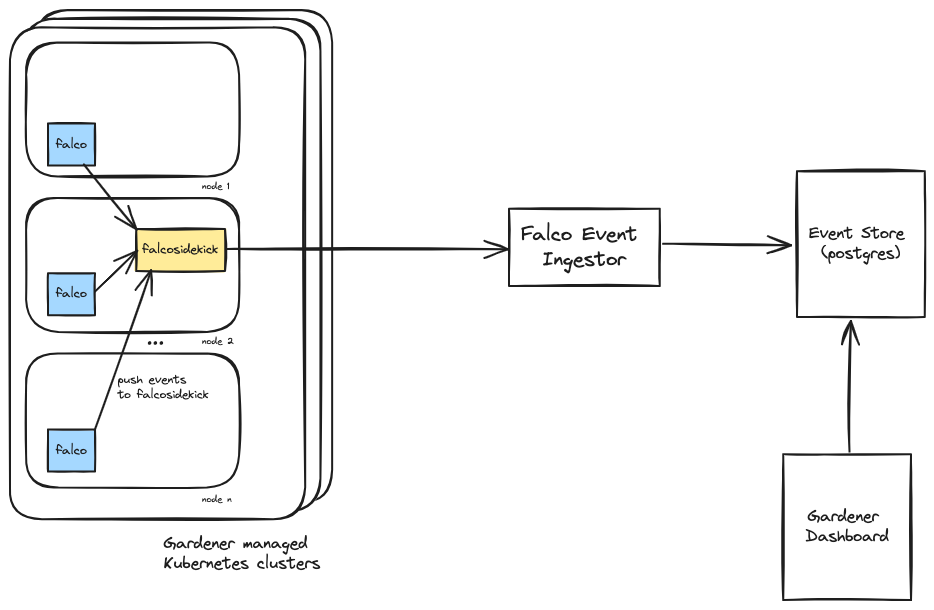

# GEP-27: Falco Extension - an extension to deploy and manage Falco in shoot clusters

## Table of Contents

- [Summary](#summary)
- [Motivation](#motivation)
    - [Goals](#goals)
    - [Non-Goals](#non-goals)
- [Proposal](#proposal)
    - [Gardener Falco Extension](#gardener-falco-extension)
    - [Falco Versioning](#falco-versioning)
    - [Falco Rules](#falco-rules)
    - [Falcoctl](#falcoctl)
    - [Falco Event Ingestor](#falco-event-ingestor)
    - [Gardener Dashboard](#gardener-dashboard)
    - [Alerting](#alerting)
- [Alternatives](#alternatives)
- [What next](#what-next)
- [References](#references)

## Summary

Falco is a cloud native runtime security tool for Linux operating systems. It
is designed to detect and alert on abnormal behavior and potential security 
threats in real-time [1]. We have deployed it in the Gardener landscape and
can confirm that it is well suited for detecting events that are not ordinary
runtime events. This includes but is not limited to debugging activities,
changing host configurations or installing software in containers. Apart from
legal debugging activities those types of events most likely indicate malicious
behavior.

Falco is a powerful runtime threat detection engine but comes with limited
means to deploy on many Kubernetes clusters or sophisticated event analysis
and visualization for many clusters. These features are usually provided by
commercial products: some of them rely on Falco as the threat detection
engine, for example from [Sysdig](https://sysdig.com/products/platform/) and
[Trend Micro](https://www.trendmicro.com/en_us/business/products/one-platform.html).

This enhancement proposal describes a consistent way for deploying Falco into
the Gardener infrastructure as well as into shoot clusters operated by Gardener
users in a "Gardener native" way. This includes managing it, providing Falco
updates and bringing a central infrastructure for viewing and analyzing events.

## Motivation

While we have invested into Gardener security and carry out regular
penetration tests we currently do not have sufficient runtime detection of 
potentially malicious activities in our Kubernetes clusters, unless we install
3rd party commercial tools which some of our users do. Malicious activities
include but are not limited to security breaches through misconfigurations or
0-day vulnerabilities.

We are planning to close this gap by deploying the Falco runtime security
tool.

### Goals

- Deploy Falco into the Gardener infrastructure.
- Allow Gardener users to deploy Falco into their shoot clusters by adding a
  configuration into their shoot manifests.
- View and analyze Falco events in the Gardener dashboard.
- Deploy an optimized ruleset for Gardener managed Kubernetes clusters based 
  on the Falco rules [5]. Optionally allow deployment of incubating-, and
  sandbox rules as well as custom rules.
- Offer multiple Falco versions to users including options for manual- and 
  automated updates.
- Allow users to simply turn on Falco in their clusters with a reasonable 
  default configuration as well as allow power users to fine tune the 
  configuration (rules, plug-ins).
- Investigate existing Falco plug-ins or develop new ones in the Gardener
  context to broaden the detection scope
- Provide means for users to configure Falco themselves using `falcoctl` and
  configure their own event store.

### Non-Goals

We do not compete with commercial products. While we have plans to develop
Falco plugins, our goal is not to provide a comprehensive solution provided
by security vendors.

## Proposal

We are planning to provide a Gardener extension that deploys Falco and 
Falcosidekick into shoot clusters. Falco is deployed as a Kubernetes DaemonSet
on each worker node and Falcosidekick is deployed as a Kubernetes Deployment. 
All events that are generated by Falco are sent to a central event store 
via Falcosidekick. The Falco event ingestor authenticates the event and stores
it with the correct cluster identity.

The drawing below provides an overview of the default setup.



### Gardener Falco Extension

Users can configure the Falco extensions by adding the following configuration
to the `extensions` section of their shoot manifest:

```
  - type: shoot-falco-service
    providerConfig:
      apiVersion: falco.extensions.gardener.cloud/v1alpha1
      kind: FalcoServiceConfig
      # optional, will use the latest version tagged as "supported"
      falcoVersion: 0.37.0
      # optional, will always default to true
      autoUpdate: true|false
      # optional, "gardener" or "falcoctl", will default to "gardener"
      resources: gardener
      gardener:
        # optional, defaults to true
        useFalcoRules: true
        # optional, defaults to false
        useFalcoIncubatingRules: false
        # optional, defaults to false
        useFalcoSandboxRules: false
        # references configmaps in project namespace containing custom rules
        ruleRefs:
        - ref: rules1
      falcoctl:
        # Falcoctl configuration as defined in 
        # https://github.com/falcosecurity/charts/blob/master/charts/falco/values.yaml#L366
      # publish Falco events to other event store (optional)
      customWebhook:
        enabled: true|false
        address: <http...>
        customHeaders: ...
        # check if ssl certificate of the output is valid
        checkCerts: ...
```

In a simple setup the following default configuration is sufficient to
deploy Falco:

```
  - providerConfig:
      apiVersion: falco.extensions.gardener.cloud/v1alpha1
      kind: FalcoServiceConfig
    type: shoot-falco-service
```

In this case the extension will deploy the current Falco version and will 
take care of automated updates. The ruleset will be managed by Gardener and 
will only provide the standard rules which are designed to offer basic 
detection capabilities but to avoid too many false positives. Visualization 
of events will be provided in the Gardener dashboard.

This will correspond to the following configuration which will be reflected
in the shoot manifest:

```
  - providerConfig:
      apiVersion: falco.extensions.gardener.cloud/v1alpha1
      kind: FalcoServiceConfig
      falcoVersion: <latest Falco version marked as "supported">
      falcoAutoUpdate: true
      resources: gardener
      gardener:
        useFalcoRules: true
        useFalcoIncubatingRules: false
        useFalcoSandboxRules: false
    type: shoot-falco-service
```

Falco versions are maintained by the extension in the same way operating
system-, and Kubernetes versions are maintained by Gardener. If no 
version is specified the Falco extension will select the currently supported
version.

There are two methods for managing rules and plugins: either use setup 
provided by Gardener by setting `resources` to `gardener` or use 
`falcoctl` by setting `resources` to `falcoctl`.

Custom rules in the Gardener setup can be stored in a ConfigMap and applied 
to the same project as the cluster. The ConfigMap must be configured as a 
resource in the cluster as described in [6]:

```
  resources:
  - name: customRules
    resourceRef:
      apiVersion: v1
      kind: ConfigMap
      name: my-custom-rules
```

This is a template ConfigMap which contains the custom rules. They will be
deployed and ordered based on the result of the Go programming language
`strings.Compare` function.

```
kind: ConfigMap
  name: my-custom-rules
  namespace: garden-myproject
data:
  myrules.yaml: |-
    # custom rules go here
    ...
```

Events that are generated by Falco are forwarded to Falcosidekick that is 
deployed alongside Falco. The Falcosidekick webhook output is configured
to send events to a central location. In the default configuration it will be
the [Falco event ingestor](#falco-event-ingestor).
Falcosidekick webhooks are not to be confused with Kubernetes webhooks, they
are used to post events to arbitrary locations identified by a URL, see 
[Webhook](https://github.com/falcosecurity/falcosidekick/blob/master/docs/outputs/webhook.md).
for its configuration. The Falco extension issues JWT tokens containing the
cluster identity.

As an alternative users can opt to send events to a custom location by
defining a `customWebhook` key and configuration. In this case no events 
will be forwarded to the default event ingestor, events will not be visible
in the Gardener dashboard, and there will be no alerting.

#### Falco Versioning

New Falco releases come with new features and might also discontinue existing
features. Rule sets are usually bound to a particular Falco version. This
means that updating Falco and/or rules may either break Falco, generate 
false positive events or might not generate expected events anymore. 

For these reasons we have decided to offer multiple Falco versions to
allow limited control over which version to choose and provide time for 
necessary updates. We want to roughly follow the shoot versioning policy 
set out in [7], however with simplifications as the policy has proven to 
be very complex especially in the operating system area. 

We plan to implement the versioning policy with the following simplifications:

- A linear update path without differentiation of major, minor, and patch 
  versions.
- Automated updates always update to the latest supported version.
- Forced updates always update to the latest supported version.
- There may be multiple supported versions.

#### Falco Rules

The Gardener extension will deploy matching rules for the Falco release from
[8]. `falco_rules.yaml` will be deployed by default and Gardener will bring 
extensions to the rule set to remediate false positives if necessary. 
`falco-incubating_rules.yaml` and `falco-sandbox_rules.yaml` will only be 
deployed if selected and there will be no exceptions by Gardener for 
false positve events.

#### Falcoctl

Users with many clusters requested support for falcoctl [9]. There is 
extra effort for configuration as an external repository for rules files
and plug-ins is required for the benefit of controlling rules and 
plugins centrally. We plan to pass the falcoctl configuration and disable 
all Gardener managed rules for this use case.

#### Falco Event Ingestor

The Falco event ingestor receives Falco events from Falcosidekick, verifies
the JWT token as well as the event body and stores it into an event store
(currently a Postgres database). Due to receiving events from potentially 
thousands of clusters the Falco event ingestor must be highly scalable as
well as to provide additional hardening including the following checks:

- event rate limiting based on cluster identities
- strict validation of events

The implementation of the event store is deliberately not specified in this
enhancement proposal. There are however several requirements toward the
event store:

- The event store must be able to store events generated from a whole Gardener 
  landscape with potentially thousands of clusters.
- Events must be kept for a configurable amount of time based on regulatory
  requirements.
- The events store must be highly available.
- A backup/restore implementation is required.

#### Gardener Dashboard

Research and prototyping work is ongoing. Our current working assumption is
to add a tab to the shoot cluster details page to visualize events. We also
consider adding the event page to the project overview and allow users to 
filter by cluster.

#### Alerting

Research is ongoing.

## Alternatives

Our initial focus was to protect the Gardener infrastructure by deploying
Falco to seed clusters directly using a `ControllerDeployment` containing
a Falco helm chart [2]. We deployed a central Loki log aggregation system [3]
to store Falco events and used Grafana [4] for visualization. While this
provided great insights on what is happening in the Gardener infrastructure
it was not optimal in several ways:

1. The solution was tailored towards the Gardener infrastructure which
cannot be applied to user shoot clusters. Deploying Falco into user clusters
demands a solution as outlined in this proposal.

2. The Gardener ecosystem is licensed under the Apache 2.0 open-source license
while Loki and Grafana are not. We therefore cannot rely on central components
which must licensed separately by adopters.

## What next

### Rule filtering and assessment

Events are read-only and immutable, nevertheless users will see lots of 
events that are not relevant or false positives. There shall be means to 
reduce the noise for events already generated. 

- Assess events as being false positives and don't display them in the 
  standard view anymore.
- Filter events based on certain rules based on user configured filters.

### Falco Plugins

Falco can be extended by using [plugins](https://falco.org/docs/plugins/).
There is a list of [registered plugins](https://falco.org/docs/plugins/registered-plugins/)
that we can integrate as well as provide specific plugins, e.g. for validating
container signatures and integrity.

## References

[1] https://falco.org/docs/

[2] https://github.com/gardener/gardener/blob/master/docs/extensions/controllerregistration.md#scenario-1-deployed-by-gardener

[3] https://grafana.com/oss/loki/

[4] https://grafana.com/grafana/

[5] https://github.com/falcosecurity/rules/blob/main/rules

[6] https://github.com/gardener/gardener/blob/44e5d3ad6060633ee14a1013306e5f1191d2b523/example/90-shoot.yaml#L380

[7] https://github.com/gardener/gardener/blob/master/docs/usage/shoot_versions.md

[8] https://github.com/falcosecurity/rules/tree/main/rules

[9] https://github.com/falcosecurity/falcoctl
