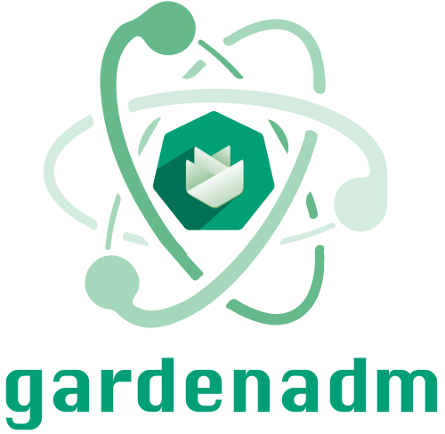

# GEP-28: Autonomous Shoot Clusters

## Table of Contents

- [GEP-28: Autonomous Shoot Clusters](#gep-28-autonomous-shoot-clusters)
  - [Table of Contents](#table-of-contents)
  - [Summary](#summary)
  - [Motivation](#motivation)
    - [Goals](#goals)
    - [Non-Goals](#non-goals)
  - [Proposal](#proposal)
    - [Prerequisites](#prerequisites)
    - [Commands](#commands)
      - [`gardenadm discover`](#gardenadm-discover)
      - [`gardenadm init`](#gardenadm-init)
        - [Problems \& Solutions](#problems--solutions)
          - [Faking a Kubernetes API](#faking-a-kubernetes-api)
          - [Host Network vs. Pod Network](#host-network-vs-pod-network)
          - [Dealing with Webhooks for Control Plane Components](#dealing-with-webhooks-for-control-plane-components)
          - [`etcd` Management via `etcd-druid`](#etcd-management-via-etcd-druid)
      - [`gardenadm token`](#gardenadm-token)
      - [`gardenadm join`](#gardenadm-join)
      - [`gardenadm connect`](#gardenadm-connect)
      - [`gardenadm version`](#gardenadm-version)
    - [`Shoot` API](#shoot-api)
    - [Scenarios](#scenarios)
      - [High Touch](#high-touch)
      - [Medium Touch](#medium-touch)
        - [`gardenadm bootstrap`](#gardenadm-bootstrap)
    - [Disaster Recovery](#disaster-recovery)
      - [Single-Node Failure](#single-node-failure)
      - [Multi-Node Failure](#multi-node-failure)
      - [Data Center Failure](#data-center-failure)
  - [Future Work](#future-work)
    - [Autonomous Shoot Clusters for End-Users](#autonomous-shoot-clusters-for-end-users)
    - [Network Connectivity to Garden Cluster](#network-connectivity-to-garden-cluster)
    - [Changes to Shoot Components](#changes-to-shoot-components)
    - [Air-Gapped Gardener Landscapes](#air-gapped-gardener-landscapes)
    - [Scaling the Control Plane of Autonomous Shoot Clusters](#scaling-the-control-plane-of-autonomous-shoot-clusters)
  - [Alternatives](#alternatives)
    - [Using Existing Tools](#using-existing-tools)
    - [Using Existing Services](#using-existing-services)
    - [Using Existing Gardener](#using-existing-gardener)

## Summary

Gardener ships with functionality that would allow the creation of "autonomous" shoot clusters.
Such "autonomous" clusters would be regular shoot clusters with the main difference that their control plane runs on dedicated nodes within the cluster itself (instead of a seed cluster which typically resides in another infrastructure account and network domain).
This deployment model is known as the typical/standard Kubernetes deployment model, while Gardener's regular shoot clusters today follow the "Kubeception" deployment model.


> [!IMPORTANT]
> This shall not be a drop-in replacement for [`k3s`](https://k3s.io) or [`kubeadm`](https://kubernetes.io/docs/setup/production-environment/tools/kubeadm) (that would be too far away from Gardener's mission statement, TCO goals, and current implementation), but we want to offer this new type of shoot clusters as a separate flavor to enable on-prem use-cases that cannot be served with Gardener today.
> By allowing the remote management through Gardener, "autonomous" clusters will meet our mission statement (e.g., in regards to low TCO) while operating without the need of a seed cluster.

Such autonomous shoot clusters are meant to operate autonomously, but not to exist completely independently of Gardener.
Hence, after initial creation, they shall be connected to an existing Gardener system such that the established cluster management functionality via the `Shoot` API can be applied.

Furthermore, autonomous shoot clusters are not considered a replacement or alternative for regular shoot clusters.
They should be only used for special use-cases or requirements as their creation time will be longer and their costs will be higher.
In this light, a high cluster creation/deletion churn rate is neither expected nor in scope.

Gardener's APIs and cluster topology are defined in a way such that seed clusters are a separate "security domain" and not accessible to end-users.
With autonomous shoot clusters, seed clusters do not exist anymore, hence, running a `gardenlet` and certain seed system components (like extensions) within the end-user's infrastructure requires rework and adaptation of some of today's concepts.
As operating autonomous shoot clusters is a challenge big enough on its own, we'll start with focusing only on how Gardener operators can create and connect autonomous shoot clusters.
Allowing "untrusted" end-users to create such clusters is out of scope of this GEP and considered to be future work ([see below](#autonomous-shoot-clusters-for-end-users)).

## Motivation

Gardener is a great tool for creating and managing clusters with very low TCO.
Part of this success is its architecture, i.e., running control planes in seed clusters under joint supervision by Gardener and Kubernetes (a.k.a. Kubeception deployment model).

However, there is sufficient pull to also find a way to create autonomous shoot clusters using Gardener (e.g., for the edge or for temporarily air-gapped scenarios) where the control plane must run side-by-side and cannot run in seed clusters.
We want to establish Gardener in (new) environments where clusters cannot run their control plane "somewhere else", but where it needs to be co-located with the worker nodes, e.g., to avoid costly or exposed network traffic, firewall the entire cluster off, rely on the control plane while the cluster is air-gapped/has no internet access, generally avoid runtime dependencies, fulfill compliance obligations, etc.

In addition, Gardener itself requires to run in a conformant Kubernetes cluster satisfying the [minimum Kubernetes version requirements](../usage/shoot-operations/supported_k8s_versions.md#garden-clusters), but so far there was no way of setting up or managing this initial cluster via Gardener itself.
It was always required to leverage third-party tools or services, which is not only inconvenient but also somewhat paradoxical, given that Gardener itself already is a tool for managing Kubernetes clusters.
Augmenting Gardener's capability to also manage the initial cluster will help to reduce operational complexity and enable new use-cases and scenarios.

### Goals

- Creation of autonomous shoot clusters running dedicated nodes for control plane components
- Maximize re-use of existing code/functionality to prevent re-inventing the wheel
- Enable cluster management and upgrades via the `Shoot` API of an existing Gardener

### Non-Goals

- Creation/deletion of autonomous shoot clusters with high churn rates and convenience compared to regular shoot clusters
- Allow end-users to create autonomous shoot clusters and connect them to a Gardener system - this aspect will be covered in a future GEP after this one has been implemented
- Provide functionality to create autonomous shoot clusters via the API of an existing Gardener system
- Support day-2 operations without connecting the cluster to an existing Gardener system

## Proposal

In short, the basic idea is to develop a new command line tool that is going to be shipped with every Gardener release, `gardenadm`, which can be used to bootstrap an autonomous shoot cluster.



In order to reduce cognitive load, we'll align the user experience of this new tool with what [`kubeadm`](https://kubernetes.io/docs/reference/setup-tools/kubeadm/) provides (note that `gardenadm` is not meant to replace `kubeadm` - we just want to reduce the entry barrier for people already familiar with `kubeadm`, [similar to how we have aligned the Gardener architecture with Kubernetes concepts](../../README.md#gardener)).
After a cluster has been set up with `gardenadm`, the next step is to deploy a stripped-down version of [`gardenlet`](../concepts/gardenlet.md) into it.
This `gardenlet` has coordinates for an existing Gardener system it can connect to such that it can register the `Shoot` resource (similar to how it registers the `Seed` resource today when running in a seed cluster).
Any day-2 operations like updates or upgrades will be performed by the `gardenlet` and via the `Shoot` API.
As a consequence, there will be no command in `gardenadm` similar to [`kubeadm upgrade`](https://kubernetes.io/docs/reference/setup-tools/kubeadm/kubeadm-upgrade/).
It is explicitly out of scope to support cluster management without a `gardenlet` connected to a Gardener system (see [`gardenadm connect` section](#gardenadm-connect) for more details).

### Prerequisites

Similar to [`kubeadm`'s prerequisites](https://kubernetes.io/docs/setup/production-environment/tools/kubeadm/install-kubeadm/#before-you-begin), `gardenadm` will assume that the following requirements are met for the machines:

- One or more compatible Linux hosts.
- Sufficient CPU and RAM (to be specified more concretely later).
- Full network connectivity between all machines in the cluster (public or private network is fine).
- [Certain ports](https://kubernetes.io/docs/reference/networking/ports-and-protocols/) must be open.
- [systemd](https://www.freedesktop.org/wiki/Software/systemd/), [containerd](https://containerd.io/), and its [ctr (client CLI)](https://github.com/projectatomic/containerd/blob/master/docs/cli.md/) must be pre-installed.

### Commands

`gardenadm` will have the following commands:

- [`gardenadm discover`](#gardenadm-discover) to discover the configuration of the Gardener system the autonomous shoot cluster shall be connected to later.
- [`gardenadm init`](#gardenadm-init) to bootstrap a first control plane node.
- [`gardenadm token`](#gardenadm-token) to manage bootstrap and discovery tokens for `gardenadm join`.
- [`gardenadm join`](#gardenadm-join) to bootstrap further control plane nodes, or to bootstrap worker nodes and join them to the cluster.
- [`gardenadm connect`](#gardenadm-connect) to deploy a `gardenlet` for further cluster management.
- [`gardenadm version`](#gardenadm-version) to print the `gardenadm` version.

The general flow for bootstrapping an autonomous shoot cluster will be as follows:

1. The user installs `gardenadm` on the first control plane node and runs `gardenadm discover`.
   This will download relevant configuration from the Gardener system the autonomous shoot cluster shall be later connected to (e.g., `Controller{Registration,Deployment}`s, `CloudProfile`s, etc.).
   If there is no existing Gardener system yet, the needed configuration must be provided manually.
2. The downloaded configuration and a `Shoot` manifest are provided to the `gardenadm init` command.
   This will bootstrap the first control plane node.
3. Optionally, additional control plane nodes can be joined.
   In order to do so, the user runs `gardenadm token generate` which generates a random bootstrap token, and then `gardenadm token create <token>` which creates it on the server.
   Now connected to the new node that shall be joined, the user runs the `gardenadm join` command which bootstraps another control plane node.
4. Optionally, worker nodes can be joined.
   The flow is the same - a bootstrap token must be generated and created, and then `gardenadm join` must be executed to bootstrap the worker node.
5. Once above steps are completed, the user runs `gardenadm connect` to deploy a `gardenlet` into the cluster which connects to an existing Gardener system for further cluster management.

A more detailed description of the commands is following.

#### `gardenadm discover`

This command takes a kubeconfig to an existing Gardener system, and a `Shoot` manifest.
It downloads the required `CloudProfile`, `ControllerRegistration` and `ControllerDeployment` resources and stores them locally for usage of other `gardenadm` commands.
This simplifies the crafting of these documents, and it also ensures that the configuration and versions used for the bootstrapping of the autonomous shoot cluster fit to the configuration later found in the connected Gardener system.

#### `gardenadm init`

This command bootstraps the first control plane node of the autonomous shoot cluster.
The configuration is specified via separate files.
It needs a `Shoot` manifest and some additional configuration files, which usually reside in the garden cluster, e.g., a `CloudProfile` (best downloaded with `gardenadm discover`).
For the initial cluster Gardener bootstrapping use-case however, these won't come from a pre-existing garden cluster as it doesn't exist yet.
They can then be provided locally (that's why `gardenadm discover` and `gardenadm init` are separate commands), reflecting the to-be-deployed Gardener system later.

The high-level steps executed by the command are as follows:

1. Generate certificate authorities, certificates and keys using the [secrets manager](../development/secrets_management.md).
2. Generate [`OperatingSystemConfig` resource](../extensions/resources/operatingsystemconfig.md) (in memory) containing `systemd` units and files.
   This includes the files for the minimal standard Kubernetes control plane, i.e., `kubelet`, `etcd`, `kube-apiserver`, `kube-controller-manager`, and `kube-scheduler`.
   Also, it should be OS-agnostic (since there is no operating system config extension running anywhere yet).
3. Reconcile the `OperatingSystemConfig` resource using the controller logic of [`gardener-node-agent`](../concepts/node-agent.md).
4. `kubelet` starts and runs the static pods for the minimal standard Kubernetes control plane (`etcd`, `kube-apiserver`, `kube-controller-manager` and `kube-scheduler`).
5. Deploy [`gardener-resource-manager`](../concepts/resource-manager.md) in [host network mode](#host-network-vs-pod-network) into the `kube-system` namespace.
6. Apply the corresponding provider and networking extensions in [host network mode](#host-network-vs-pod-network).
7. Deploy `kube-proxy` and CoreDNS for service routing and domain name resolution.
8. Create a [`Network` resource](../extensions/resources/network.md) and apply it to generate `ManagedResource` associated with the pod network.
9. Apply the corresponding provider and networking extensions in [pod network mode](#host-network-vs-pod-network).
   Also deploy the operating system config extensions.
10. Redeploy `gardener-resource-manager` in [pod network mode](#host-network-vs-pod-network).
11. Create the [`OperatingSystemConfig` resource](../extensions/resources/operatingsystemconfig.md) now in the cluster and activate the `gardener-node-agent` process via its `systemd` unit.
12. Apply [`ControlPlane` resource](../extensions/resources/controlplane.md).

##### Problems & Solutions

As we intend to re-use code as much as possible, we need to jump through some hoops to make this work.

###### Faking a Kubernetes API

Most of the Gardener code base assumes an always existing garden cluster or the API server of a seed cluster, which might not be available during bootstrapping.
A somewhat simple solution for components running as part of the same process is to use a fake client, e.g., `sigs.k8s.io/controller-runtime/pkg/client/fake` or `github.com/gardener/gardener/pkg/client/kubernetes/fake`.
Those fake clients, which are usually used for unit testing, can be utilized to create the necessary resources in memory without a real API server.
It allows to simulate/fake the API server until the real one becomes available.

In the `gardenadm init` flow, the initial application of the `OperatingSystemConfig` by components of the `gardener-node-agent` is an example of this.
The `gardener-node-agent` retrieves the `OperatingSystemConfig` from a `Secret`.
Furthermore, it also checks its local `Node` resource.
Both are not available until after the control plane starts running.
Therefore, a fake client is useful for bootstrapping.

Another example is the deployment of the extensions.
The existing implementation requires a garden cluster with `Controller{Registration,Deployment}` resources to apply `ControllerInstallation`s.
However, this also works with the fake client so that extensions can be deployed during bootstrapping.

###### Host Network vs. Pod Network

Typically, the `gardener-resource-manager` is always deployed in the pod network.
The same is true for the Gardener extensions.

In general, it is desirable to be able to use the pod network as it offers a better separation and less potential for clashes, e.g., with regards to port reuse.
Components most likely need to be adapted to make some ports configurable so that they do not clash, e.g., metrics and webhooks ports of extensions.
During bootstrapping, the circular dependencies between the components makes it impossible to start with the pod network.

It is obvious, that the networking extension, which should create the manifests to be used to create a working pod network, can initially not run in the pod network itself.
As `gardener-resource-manager` is utilized to deploy the manifests via a `ManagedResource`, it cannot run in the pod network initially either.

Once the pod network is established, theses components can be restarted in the pod network.

###### Dealing with Webhooks for Control Plane Components

The minimal standard Kubernetes control plane components (`etcd`, `kube-apiserver`, `kube-controller-manager`, `kube-scheduler`) run as static pods in this setup.
However, some extensions might want to mutate them [via webhooks](../extensions/controlplane-webhooks.md).
Previously, this was done by mutating the `Deployment`/`StatefulSet` of the components.
With static pods, those resources do not exist, though.

To make it possible to use webhooks as before, we propose to create dummy `Deployment`/`StatefulSet` resources for the control plane components with `replicas=0`.
These resources will be watched and updates will be translated to the manifests of the static pods.
The manifests are then rolled out via the `OperatingSystemConfig` applied by `gardener-node-agent`.

###### `etcd` Management via [`etcd-druid`](https://github.com/gardener/etcd-druid)

Gardener itself will only be capable of running a minimal deployment of `etcd` for the bootstrapping process (i.e., no [`backup-restore`](https://github.com/gardener/etcd-backup-restore) sidecar or any sophisticated configuration for running `etcd` productively).
After the initial bootstrapping has been completed, we would like to leverage what has already been implemented in Gardener's `etcd` operator, `etcd-druid`, for the management of `etcd` clusters (including backup & restore functionality, data compaction, and more).

The idea is to deploy `etcd-druid` into the cluster, and create a corresponding `druid.gardener.cloud/v1alpha1.Etcd` resource.
As part of its reconciliation, `etcd-druid` typically generates a `StatefulSet`.
In this scenario, it can still do that, though it should set the `replicas=0`.
Perhaps it's even easier to create dedicated `StatefulSet`s for multi-node `etcd` clusters.
This way, they can be easily translated into static pods and distributed to the respective control plane nodes.
The static pod manifest can then be exchanged on the host and replace the "bootstrap `etcd`" with the "productive `etcd`" generated by `etcd-druid` whilst reusing the same data directory.

> [!NOTE]
> At the time of writing this GEP, it is not yet fully clear how/whether this approach fits into the design plans for `etcd-druid`.
> An alternative idea is to make `etcd-druid` aware of the concept of autonomous shoot clusters and give it further control into the management of static `etcd` pods.
> The details are still subject to discussion and will become clearer in the future.
> Since we need a "bootstrap `etcd`" anyway to get the cluster up and running, we can proceed with this GEP and its implementation in parallel while the discussion around how `etcd-druid` can take over the management is ongoing.

#### `gardenadm token`

After the first control plane node has been bootstrapped, it is very likely that we want to join additional nodes (either more control plane nodes to achieve high-availability, or worker nodes).
As for regular shoot clusters, we will leverage the [`kubelet` TLS bootstrapping](https://kubernetes.io/docs/reference/access-authn-authz/kubelet-tls-bootstrapping/) process.
This means that a [bootstrap token](https://kubernetes.io/docs/reference/access-authn-authz/bootstrap-tokens/) is used by `kubelet` to request a client certificate via the `CertificateSigningRequest` API.

We will provide commands to create and manage such bootstrap tokens:

- `gardenadm token generate` will generate a random bootstrap token.
- `gardenadm token create [token]` will create a bootstrap token on the server.
  If no `[token]` is provided, the command will generate a random token instead.
- `gardenadm token delete [token-id]` will delete a bootstrap token.
- `gardenadm token list` will list all bootstrap tokens on the server.

> [!NOTE]
> `kubeadm` goes one step further and implements a discovery process for the certificate authority of the control plane.
> For this purpose, so-called "discovery tokens" are used.
>
> First, the CA certificate is retrieved via an insecure connection from a `ConfigMap` that got created as part of the `kubeadm init` process.
> Next, the downloaded CA certificate is validated based on a hash of the public key that must be provided as part of `kubeadm join`.
> Finally, as additional validation, the CA certificate is retrieved via secure connection and compared with the CA retrieved initially.
>
> We might implement a similar discovery mechanism for `gardenadm` as this project evolves.
> However, we plan to first focus on the other, "more functional" aspects.

#### `gardenadm join`

Joining additional worker nodes is very similar to how it works for regular shoot clusters.
This command instruments `gardener-node-agent` reconciliation logic to write the `systemd` units and needed files for the [`gardener-node-init`](../concepts/node-agent.md#installation-and-bootstrapping) component onto the disk of the machine.
When this unit is started, it extracts the `gardener-node-agent` binary from its container image, and creates the `systemd` unit for it.
`gardener-node-agent` will then use the provided bootstrap token to fetch the `OperatingSystemConfig` from a `Secret` residing in the `kube-system` namespace of the cluster.
This `OperatingSystemConfig` contains the actual components like `kubelet`, `valitail`, etc.
With the help of the same bootstrap token, `kubelet` will come up and register its `Node` resource, hence, successfully joins the cluster.

The process for joining additional control plane nodes is very similar.
The main difference is that the `OperatingSystemConfig` will contain the manifests of the static pods for the minimal standard Kubernetes control plane.
Depending on the `etcd` management, it may be necessary to have individual `OperatingSystemConfig`s for each control plane node.
However, this is not yet fully clear and needs further investigation (see [`etcd` Management via `etcd-druid`](#etcd-management-via-etcd-druid)).
Apart from this, `etcd` also needs to be re-configured to have the new node join the `etcd` cluster.

#### `gardenadm connect`

This command deploys a `gardenlet` into the autonomous shoot cluster and connects it to an existing garden cluster.
As part of this operation, the corresponding `Shoot` resource will be created in the garden cluster.
Afterwards, the `gardenlet` will reconcile the autonomous shoot cluster similarly to regular shoot clusters.

> [!NOTE]
> When there is no existing Gardener system yet (for example, because the created autonomous shoot cluster is the initial cluster), then [`gardener-operator`](../concepts/operator.md) must be deployed first, and the [`Garden`](../../example/operator/20-garden.yaml) must be created, before the `gardenlet` can be deployed.
>
> Also, it is not yet clear whether the existing `gardenlet` binary will be re-used, or whether we better create a dedicated, new binary with slimmed down functionality catered for only managing autonomous shoot clusters.

Depending on the scenario, an autonomous shoot cluster may be air-gapped for periods of time.
Therefore, please note that the cluster should function also when air-gapped/when it has limited or no network connectivity.
Updates can not be performed during that time, but ordinary operations with the cluster itself (e.g., creating pods or services) should still be possible.
It is important that the [version skew](../deployment/version_skew_policy.md) is always respected.

#### `gardenadm version`

This command prints the version of `gardenadm`.

### `Shoot` API

We need some mechanism to distinguish regular shoot clusters from autonomous shoot clusters.
As the most prominent difference is that there are dedicated machines for the control plane components, we propose to notice the difference based on the existence of a worker pool for the control plane:

```yaml
spec:
  provider:
    workers:
    - name: control-plane
      controlPlane: {}
```

An alternative is to augment `.spec.controlPlane` with this information, however, we think adding a dedicated worker pool is the better and more natural fit (we need it anyways to enable re-use of most of the existing code).

### Scenarios

We distinguish between two different scenarios (for now):

- [High Touch](#high-touch), meaning that there is no programmable infrastructure available.
  We consider this the "bare metal" or "edge" use-case, where at first machines must be (often manually) prepared by human operators.
  In this case, network setup (e.g., VPCs, subnets, route tables, etc.) and machine management are out of scope.
- [Medium Touch](#medium-touch), meaning that there is programmable infrastructure available where we can leverage [provider extensions](../../extensions/README.md#infrastructure-provider) and [`machine-controller-manager`](https://github.com/gardener/machine-controller-manager) in order to manage the network setup and the machines.

The general procedure of bootstrapping an autonomous shoot cluster is similar in both scenarios.

#### High Touch

In this scenario, the starting point is right on the first machine that shall be transformed into a control plane node.
It is assumed that the network was set up properly (see [Prerequisites](#prerequisites)).
Since machine management is out of scope, upgrades requiring to roll out the nodes (e.g., Kubernetes version upgrades, operating system upgrades, CA rotation, [see more](../usage/shoot_updates.md#rolling-update-triggers)) must be performed in-place.
We will leverage the functionality that is to be developed in the scope of [#10219](https://github.com/gardener/gardener/issues/10219).
This will also include operating system upgrades [planned for Garden Linux](https://github.com/gardener/gardener/issues/10219#issuecomment-2262299606).

#### Medium Touch

In this scenario, we can leverage the existing [`extensions.gardener.cloud/v1alpha1.Infrastructure` API](../extensions/resources/infrastructure.md) in order to let the respective provider extension generate the necessary network resources (VPCs, subnets, etc., whatever is needed for the respective infrastructure).
`machine-controller-manager` can be used to create the control plane nodes (and later also the worker nodes) of the autonomous shoot cluster.

The challenge is that both Gardener provider extensions and `machine-controller-manager` depend on a pre-existing Kubernetes cluster or in general an API server.
Hence, we propose to use a [KinD cluster](https://kind.sigs.k8s.io), deploy the needed components into it, and create the necessary `Infrastructure`, `MachineClass`, and `MachineDeployment` resources.
This way, these components can be reused as-is, without big changes or re-wiring of these complex components to run in-process with a fake client (as we do during the `gardenadm init` flow for the simpler components).
Once the controllers have reconciled successfully, we can export the created infrastructure state and the `Machine` resources, bootstrap the autonomous shoot cluster similar to the [general flow](#commands) also needed for the [High Touch scenario](#high-touch), and import the state again into the created cluster.

There is no special assumption about the location of the KinD cluster.
It should run somewhere where it can access the API of the target infrastructure.
In a public cloud environment, that means anywhere with internet access.
In a private cloud environment, e.g. with OpenStack, the KinD cluster should be in a network being able to access the corresponding API, e.g., by being in the same infrastructure or having a VPN tunnel.
It can run on the laptop of the operator if the network connectivity is ensured, or it could be a virtual machine next to the target.

> [!NOTE]
> Since worker node management will be taken over by `machine-controller-manager`, [step 4](#commands) (joining worker nodes) from above list can be omitted.
> `machine-controller-manager` will also take over the creation of the control plane nodes, however, bootstrapping and joining them must still be performed by the user (meaning that [step 3](#commands) remains).
> It still needs to be investigated how much automation by `machine-controller-manager` is possible for the control plane nodes.
> As bootstrapping/joining of control plane nodes is a manual process for now, `machine-controller-manager` should not roll control plane nodes automatically.

Since we assume that this scenario will be the prominent one, we plan to add another command, `gardenadm bootstrap`, which shall simplify these steps.

##### `gardenadm bootstrap`

This command creates the virtual network and machines to be used for the control plane of the autonomous shoot cluster.
It uses an existing KinD cluster to temporarily deploy existing Gardener components (unaware of the autonomous shoot cluster use-case).
These components, such as provider extensions and `machine-controller-manager`, are used to create the necessary infrastructure and machines.

The high-level steps are as follows:

1. Deploy `gardener-resource-manager` to be able to create provider extensions.
2. Deploy the required provider extension.
3. Apply the `Infrastructure` resource to create the virtual network.
4. Deploy `machine-controller-manager` to be able to create the machines.
5. Apply the `Worker` resource to create the control plane nodes.
6. Wait for the machines to be created.
7. Stop `machine-controller-manager` to prevent deletion of the machines as they will not become ready since there is no Kubernetes cluster yet to join.
8. Create a `Bastion` resource to be able to access the machines and execute `gardenadm init` (can be later optimized via `cloud-init` through a cloud config that invokes `gardenadm init` directly when creating the machines).

The states of the `Infrastructure` and `Machine` resources need to be exported from the KinD cluster.
Once the autonomous shoot cluster control plane is running, the state should be imported so that it can be managed by the provider extension and `machine-controller-manager` respectively.

The KinD cluster can be deleted afterwards.

### Disaster Recovery

Disasters can strike in many different ways.
This section discusses disasters in ascending order of severity.
Some scenarios can be handled by autonomous shoot clusters automatically, others require manual intervention.

#### Single-Node Failure

The simplest of failures is the outage of a single control plane node, e.g., due to a power outage.
Assuming no damage from the outage itself, the node should start up again and resume operation automatically once the outage has been resolved.
As the `kubelet` is installed as a systemd service, it will automatically run after a reboot and start the static pods for the control plane components.
Assuming there is no hard disk failure, `etcd` will recover after restart and continue serving the cluster.

In case the local `etcd` data is corrupt after the outage, it is assumed that the `backup-restore` sidecar restores the last backup automatically for non-HA clusters.
If the cluster is set up in HA mode, i.e., with at least three control plane nodes, the local `etcd` instance may learn new changes from its peers afterwards.

A hard disk failure requires manual intervention as the disk needs to be replaced anyway.
The node needs to be bootstrapped again, and the `etcd` data needs to be restored from a backup.
If the affected node was part of a highly available control plane, the bootstrapping process may be simplified via [`gardenadm join`](#gardenadm-join).

The effect of a single node failure on the cluster depends on whether the control plane is highly available or not.
If the control plane consists only of the single node, the control plane is not available during the outage.
In case the control plane consists of at least three nodes, i.e., is highly available, the control plane remains available during the outage with only minor disruptions, i.e., loss of existing connections.

#### Multi-Node Failure

Multi-node failures are only relevant to highly available control planes as otherwise there is only a single control plane node.

Simple failures, e.g., due to power outages, can be handled as described in the [Single-Node Failure](#single-node-failure) section.
Even with multiple nodes restarting, we assume that `etcd` will eventually reach a quorum again and fully recover.

However, if the hard disks of multiple nodes fail around the same point in time, `etcd` looses quorum (permanently) and may need manual intervention to restore it.
In the worst case, the entire control plane must be manually re-bootstrapped (running `gardenadm init` again) on new or fresh machines whilst providing the latest available backup.

Apart from transient failures such as power outages, multi-node failures usually result in the complete unavailability of the control plane.

#### Data Center Failure

If the whole data center fails catastrophically, manual intervention is always required.
While `etcd` backups are hopefully replicated to a second site, restoring the control plane nodes requires similar manual effort as mentioned above.

The resolution/handling of data center failures is out of scope of this GEP.

## Future Work

### Autonomous Shoot Clusters for End-Users

As implicitly mentioned in the [Non-Goals](#non-goals) section, the focus of this GEP is to allow Gardener operators to create autonomous shoot clusters.
However, the creation of such clusters by end-users is not covered by this GEP.
This could become a future topic if we consider it relevant enough.

Handling creation of autonomous shoot clusters by end-users requires refined access controls for the `gardenlet`.
Currently, the `gardenlet` runs as part of a seed cluster and has access to some resources, which are not accessible to end-users but only to operators.
An example resource is the `ControllerDeployment`, which may contain credentials, e.g., for certificate management or domain name services.
In case this scenario is desired and the security boundary between Gardener operators and end-users should stay as is, the extension deployment needs to be adapted.

While it may be appealing to have support for autonomous shoot cluster for end-users, it is important to understand that this feature may complicate the world for both operators and end-users.
The benefits of autonomous shoot clusters for the garden runtime cluster and/or soil clusters, i.e., unmanaged seed clusters, is fairly obvious:
It allows to create a Gardener landscape without external dependency to a Kubernetes service provider.
However, the benefits for end-users are less clear (except for the mentioned edge/on-prem/air-gapped use cases).
It needs to be carefully considered and documented for what scenarios autonomous shoot clusters are the right choice, and when ordinary shoot clusters with their control plane running on a seed cluster are the better way to go.
Without this consideration, the feature may increase the operational complexity for Gardener operators, and the cognitive load for end-users.

### Network Connectivity to Garden Cluster

Another aspect that was only barely touched in this GEP is the reliability of the network connectivity between the autonomous shoot cluster and Gardener.
In the [`gardenadm connect` section](#gardenadm-connect), it was mentioned that the cluster should function also when air-gapped/when it has limited or no network connectivity.
However, we are deliberately vague what "limited network connectivity" means.
Detailing this aspect out can be considered future work.
As mentioned in the corresponding section, the [version skew](../deployment/version_skew_policy.md) plays an important role in this context, determining the maximum time the autonomous shoot cluster can be disconnected from Gardener.
Long term support of Gardener and associated components may also be considered future work.

### Changes to Shoot Components

Due to the changed network layout of autonomous shoot clusters, the usage of some shoot components needs to be reconsidered.
Examples are the VPN connection between control plane and data plane, the `apiserver-proxy` and the way metrics are scraped.
This GEP does not cover these changes in detail, but they are important to be considered when implementing it.
The following examples are just used to illustrate the need for changes, but are not meant to be exhaustive:
- The VPN connection between control plane and data plane is not needed anymore as the control plane runs on the same network as the data plane.
Previously, the VPN connection was used to secure the communication between the control plane and the data plane.
This was important as the control plane and the data plane were running in different networks with a potentially untrusted network in between.
In the autonomous shoot cluster scenario, this is no longer the case.
The control plane can directly communicate with the data plane without the need for a VPN connection.

- The `apiserver-proxy` (see [GEP-11](11-apiserver-network-proxy.md) for details) is used to forward requests from the data plane directed at `kubernetes.default.svc.cluster.local` to the control plane.
  In the autonomous shoot cluster scenario, this can be simplified by directly pointing `kubernetes.default.svc.cluster.local` to the actual endpoints of the `kube-apiserver`.
  This way, the `apiserver-proxy` is no longer needed.
  Another aspect is the [mutating webhook for injecting the `KUBERNETES_SERVICE_HOST` environment variable](../concepts/resource-manager.md#kubernetes-service-host-injection), which can be disabled in the autonomous shoot cluster scenario as well.
- In ordinary shoot clusters, the metrics of components running in the data plane are scraped indirectly via the `kube-apiserver`.
  This allows the observability stack to use the VPN connection without explicitly configuring it.
  As stated above, the VPN connection is no longer needed in the autonomous shoot cluster scenario.
  Therefore, the observability stack could also directly scrape metrics from the data plane components instead of going through the `kube-apiserver`.

There may be other components, which are affected by the changed network layout and need to be adapted.

### Air-Gapped Gardener Landscapes

While it is already possible today to run a Gardener landscape in an air-gapped environment, the autonomous shoot cluster feature will make it easier to set up such a landscape.
This is due to the fact that it removes the dependency on an external Kubernetes cluster to run the Garden and act as the initial seed cluster. 
Therefore, it may be worthwhile to take a closer look at the requirements for air-gapped Gardener landscapes and document them properly.

Topics to consider (without any claim of completeness) are:
- OCI container registry for providing container images/binaries
- Configuration of image vector overrides to consume only local images/binaries
- Local DNS configuration for managing Gardener landscape domains
- TLS certificate handling, e.g. for connections between components, but also for authentication

The goal would be to provide a comprehensive guide on how to set up an air-gapped Gardener landscape, which can be applied on various infrastructures.
It may also be useful for scenarios that are not fully air-gapped, but only desire selected parts of the sovereignty this provides.

### Scaling the Control Plane of Autonomous Shoot Clusters

The control plane components of ordinary Gardener shoot clusters are scaled horizontally and vertically in various ways.
Autoscaling is not covered in this GEP, but it is important in the long run to ensure efficient resource usage.

As far as this GEP is concerned, the control plane of autonomous shoot clusters is scaled horizontally by adding more control plane nodes (see [`gardenadm join`](#gardenadm-join)).

This approach can be problematic in various ways.
As this GEP proposes to always deploy the full set of default control plane components on each control plane node, there may be more instances running for `kube-scheduler` and `kube-controller-manager` than practically necessary.
While this may be a good approach in scaling `kube-apiserver` horizontally, it may cause additional synchronisation overhead for `etcd` where having more `etcd` cluster members automatically also means more replication.
Furthermore, from `etcd`'s perspective the amount of control plane nodes should ideally be odd and no more than seven (see [etcd faq](https://etcd.io/docs/v3.4/faq/)).
This further limits the scalability of the control plane.

Therefore, it may be a good idea to investigate how node roles can help improve efficiency in a scale-out autonomous shoot cluster scenario.
Some control plane nodes could include the full set of default control plane components while others may use a reduced set of components.
This could be achieved by having roles for either individual components or different set of components.

An alternative solution would be to expand for example `kube-apiserver` beyond the control plane nodes, i.e. deploy additional instances on ordinary worker nodes.
This could provide true scaling via deployments with ordinary horizontal/vertical pod autoscaling, but it would remove the strict separation between control and data plane nodes.

Yet another option in the contrary direction would be to allow non-control plane workloads to be deployed to control plane nodes.
This would allow to use the control plane nodes to their full capacity, but it would also blur the separation between control and data plane nodes.
While it may improve the resource utilisation of control plane nodes, it may also introduce security risks.

In any case, revisiting the scaling problem is required to ensure efficient resource usage with growing control plane usage in the context of autonomous shoot clusters.

## Alternatives

### Using Existing Tools

Existing tools, e.g., [`k3s`](https://k3s.io) or [`kubeadm`](https://kubernetes.io/docs/setup/production-environment/tools/kubeadm), could be used to create the initial Kubernetes cluster.
This cluster could then be "adopted" by Gardener and managed by the `gardenlet` as described for the day-2 operations in the autonomous shoot cluster case.
It was deemed much more complex to align a cluster created by a third-party tool with Gardener's expectations than to create the cluster directly with Gardener.
The fact that these tools evolve independently from Gardener and may introduce breaking changes was another reason to prefer the direct creation with Gardener.

### Using Existing Services

Existing services, e.g., [AWS EKS](https://aws.amazon.com/eks), [Azure AKS](https://azure.microsoft.com/en-us/services/kubernetes-service), or [Google GKE](https://cloud.google.com/kubernetes-engine), could be used to create the initial Kubernetes cluster.
As these services are managed, it is not possible to "adopt" the cluster and manage its control plane.
Furthermore, this approach is limited in where it can be used.
For example, it may be undesirable/impossible for an air-gapped environment to have a dependency to a cloud provider.

### Using Existing Gardener

Using an existing Gardener to create an autonomous cluster is an option, yet it requires a more complex satisfaction of prerequisites to make this approach work.
For example, network connectivity from a seed cluster (where extensions and a `gardenlet` runs) to the target infrastructure must exist.
When the initial cluster shall be created, pivoting from a local KinD cluster can be an option, but it also requires to solve the challenge of migrating the Gardener control plane.
In summary, we considered this approach more complex to develop and use.
