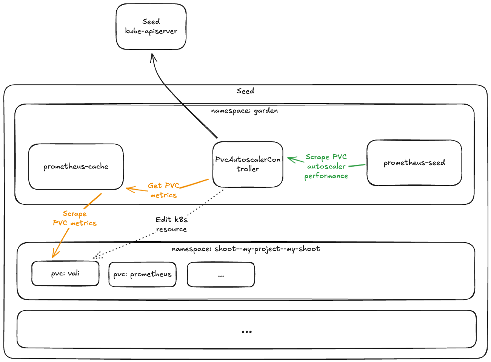
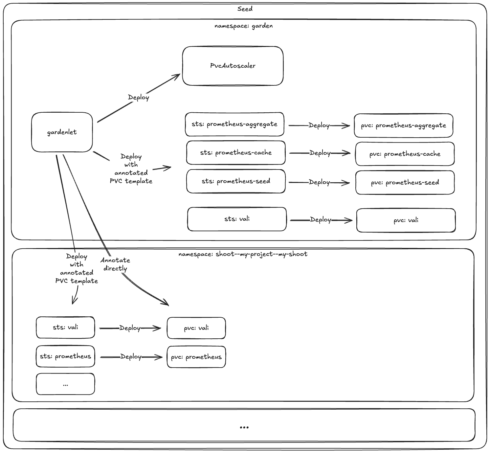
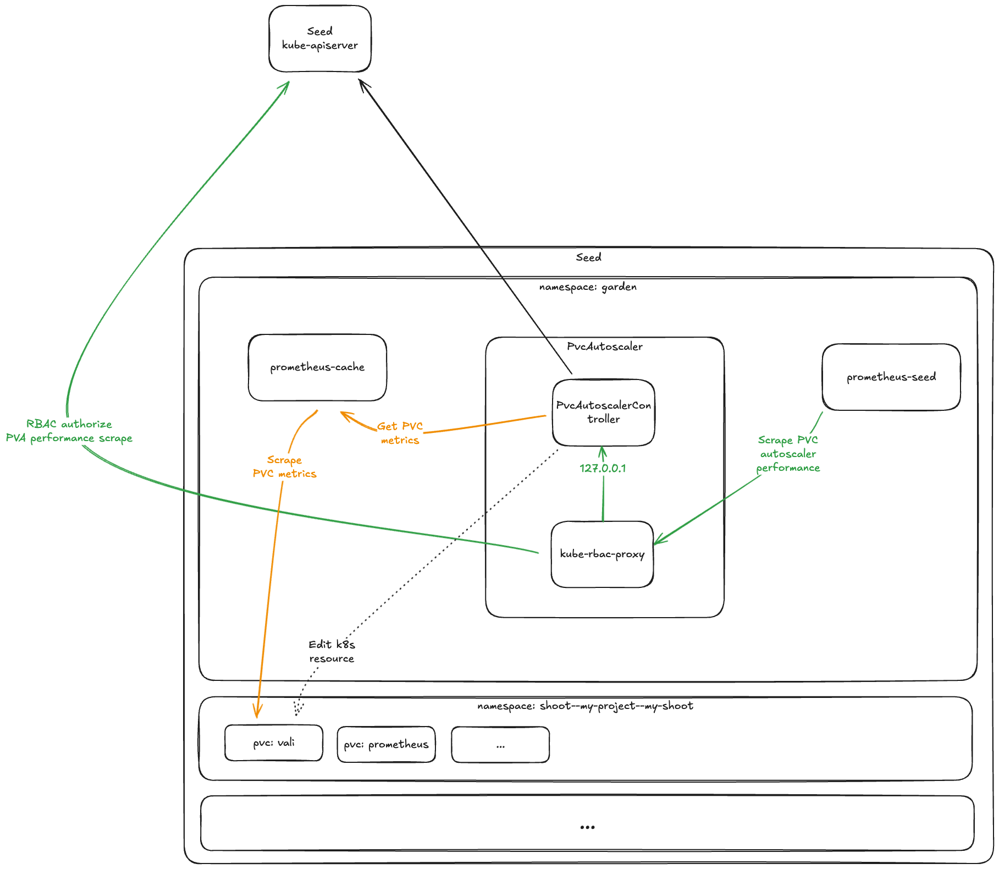

# GEP-29: Autoscaling Storage Volumes - Phase 1: Observability Volumes

## Table of Contents
<!-- TOC -->
* [Summary](#summary)
* [Motivation](#motivation)
  * [Goals](#goals)
  * [Non-Goals](#non-goals)
* [Proposal](#proposal)
  * [PVC Autoscaler - Runtime Structure](#pvc-autoscaler---runtime-structure)
  * [PVC Autoscaler - Deployer Structure](#pvc-autoscaler---deployer-structure)
    * [Initial volume size and MaxAllowed](#initial-volume-size-and-maxallowed)
  * [Transition Strategy](#transition-strategy)
  * [Future Enhancements](#future-enhancements)
* [Discussion and Limitations](#discussion-and-limitations)
  * [Alternatives](#alternatives)
  * [Limitations](#limitations)
* [References](#references)
<!-- TOC -->

## Summary
A "one size fits all" strategy is a poor fit for the persistence volumes of Gardener observability workloads.
This document proposes a simple design to enable flexible, dynamic PV resizing in cases where the underlying
infrastructure supports it.
 
## Motivation
Logs are vital for understanding and troubleshooting Gardener clusters. Yet we operate under tight resource constraints
and logging stack PVs default to a static size of 30GB, for ALL shoots. To prevent reaching this limit and bringing down
the logging stack, there is a curator sidecar which periodically removes older logs. As a result, in some very large or
busy clusters, this strategy allows retention of logs only for 2-3 days.

On the other hand, while some clusters experience storage starvation, others operate with just 5-10% of their observability
volumes utilised.

The present initiative is focused on observability storage volumes, and aims to:
- Optimise volume utilisation
- Ensure that high-throughput clusters receive sufficient observability storage space

The goals are achieved by the following means:
- A Gardener controller is introduced to auto-scale PVs (expand only)
- Observability volumes are selectively marked for action by said controller
- Initial volume size is reduced
- Where the storage infrastructure does not support volume resizing, the preexisting, static-size volume sizing strategy is employed

The current initiative is limited to scaling observability components - _Vali_ and _Prometheus_.
However, the long term vision is, once the PV autoscaling implementation matures enough, to also use it to offer PV
auto-scaling for shoot (i.e. customer) volumes.

There are no plans to extend the present initiative to shoot Etcd volumes. Instead, a more advanced, Etcd-specific
storage management functionality is envisioned in `etcd-druid`. For details, see
[`etcd-druid` feature request issue#481](https://github.com/gardener/etcd-druid/issues/481#issuecomment-1346402013).

### Goals
- General ability to autoscale seed PVs (expand only).
  - Ability is conditional on PVC's storage class supporting resizing.
  - Autoscaling is inactive by default.
  - Ability to selectively activate autoscaling per PVC.
  - Ability to trigger scaling based on relative volume utilisation ratio (`<used bytes> / <capacity bytes>`). Trigger
    threshold configurable via code.
  - Ability to configure absolute upper scaling limit per PVC.
  - Autoscaling causes minimal interruption to scaled workloads.
- Autoscaling ability activated for observability volumes (`prometheus` and `vali`) in seeds'
  `garden` namespace, and in shoot namespaces.
- Absolute upper scaling limit configured on each observability volume.
- If autoscaling is enabled for a newly created volume, reduce the initial size of that volume, as long as such reduction
  does not contradict Gardener's overall reliability goals. For instance, Prometheus instances display sharp storage
  allocation spikes; the choice of initial size must should accommodate those in an acceptable manner.
- Some metrics, which represent an overview of the PVC autoscaling state per seed, available through one or more of the seed
  system's Prometheus instances.
- Provide operational documentation for Gardener Operators.
- Ability to enable/disable the feature per seed, via feature gate.

### Non-Goals
- Ability to scale down PVCs as function of autoscaling.
- Ability to activate autoscaling on a group of PVCs, other than specifying each PVC individually. Activate by selector
  or namespace is not supported.
- Ability to selectively deactivate autoscaling, e.g. by PVC selector or namespace.
- Ability to scale a PVC if the storage class does not support resizing.
- Ability to deactivate autoscaling for any of the observability volumes specified in the 'Goals' section.
- Ability to scale volumes in shoot clusters.

### Notes:
- Shrinking a PVC is not supported. A limitation imposed by the underlying infrastructure, PVC size can only be
  increased, and not decreased.
- The newly introduced auto-scaling mode is predicated on the underlying infrastructure supporting volume resizing.
  This ability is expressed through the K8s StorageClass type. The respective StorageClass must have
  `allowVolumeExpansion: true`. For details, see the K8s volume expansion documentation: [[5]], [[6]].
  
## Proposal
The existing, recently implemented Gardener PVC autoscaler application[[1]], hereafter referred to as `pvc-autoscaler`,
is deployed to seeds, and takes the responsibility of scaling PVs. PVCs (seed and shoot `vali` and `prometheus` at this time) are
annotated as to instruct the autoscaler to act on them, and to prescribe specific settings. New volumes are deployed with
smaller initial capacity. Each time the free space of a volume drops below 90% (referred to as "trigger threshold"),
`pvc-autoscaler` expands capacity by 10%.

### PVC Autoscaler - Runtime Structure
The overall runtime structure of the component is outlined in _Fig.1_:

_Fig.1: Runtime structure_

`pvc-autoscaler` is integrated as a seed system component, and runs as a deployment in the seed's `garden` namespace.
Its primary driving signal is the PVC metrics from the seed's cache Prometheus instance, which it
periodically examines, and if capacity is found to be near exhaustion, `pvc-autoscaler` takes action by updating the
PVC's storage request.

In this initial iteration, `pvc-autoscaler` scales two categories of `vali` and `prometheus` volumes:
those in shoot namespaces, and those in the seed's `garden` namespace.

`pvc-autoscaler` publishes Prometheus metrics to anonymous scrapers via a `/metrics` HTTP endpoint. A `ServiceMonitor`
object is created in the `garden` namespace, and drives the seed's `prometheus-operator` to configure a scrape on that
endpoint by `prometheus-seed`.

`pvc-autoscaler` runs in active/passive replication mode, based on the standard leader election mechanism, supplied by
the K8s controller runtime library. Only the active replica is shown in _Fig.1_.

### PVC Autoscaler - Deployer Structure
The `pvc-autoscaler` application and its supporting artefacts are deployed by `gardener`, as part of the seed
reconciliation flow.

The `vali` and `prometheus` deployers, part of `gardenlet`'s shoot reconciliation flow, ensure that the PVC template section in
the respective StatefulSet objects contains the annotations, necessary to instruct `pvc-autoscaler` how to act on the
PVCs, created from those templates.

This `gardenlet` mechanism, based on PVC templates, only affects PVCs upon creation. To enable PVC autoscaling on
existing shoots, and on the observability PVCs of existing seed clusters, the deployers also directly annotate
`vali` and `prometheus` PVCs. Those volumes have large, fixed capacity, which in most cases is severely underutilised.
Enabling autoscaling on them allows them to grow if necessary, but does not release the unused storage space.
Shrinking existing PVCs is beyond the scope of the present initiative.

_Fig.2: Operator structure_

VPA is used to scale `pvc-autoscaler`. For the future security enhancement scenario, where `kube-rbac-proxy` is used
(see [section 'Future Enhancements'](#future-enhancements)),
that container is expected to be excluded from autoscaling, and to run with fixed resource requests. Pod evictions
driven by that lean container are unjustified, as they would only achieve minimal resource savings, and disrupt
the main container.

The feature is deployed behind a dedicated feature gate. When disabled, `pvc-autoscaler` is removed, and related
annotations are removed from the shoot control plane observability StatefulSets, and the seed observability StatefulSets.

#### Initial volume size and MaxAllowed

| Component type | Component            | Old size | Initial size    | Max size |
|----------------|----------------------|----------|-----------------|----------|
| Shoot          | prometheus           | 20Gi     | 1Gi             | 40Gi     |
| Shoot          | vali                 | 30Gi     | 1Gi             | 60Gi     |
| Seed           | prometheus-aggregate | 20Gi     | 2Gi             | 40Gi     |
| Seed           | prometheus-cache     | 10Gi     | 6Gi* | 20Gi     |
| Seed           | prometheus-seed      | 100Gi    | 5Gi             | 200Gi    |
| Seed           | vali                 | 100Gi    | 5Gi             | 200Gi    |

* The greater initial size mitigates [risk due to circular dependency](#reliance-on-prometheus). 
### Transition Strategy
The following steps will be executed over time, to minimise the risk of disruption to existing Gardener instances:

1. The proposed scaling approach will be deployed behind a feature gate and disabled by default.
2. The new feature will be gradually enabled on seed-by-seed basis:
   1. The feature gate will be enabled for the seed
   2. Correct operation will be verified via direct observation
3. The feature flag will be promoted and eventually removed.

The following metrics will be recorded before and/or after the transition of the seed to the new functionality,
in order to evaluate the economical effect, and the reliability of the scaling solution:
   - Average utilisation of observability volumes:
     - Preexisting volumes (before)
     - Newly created volumes (after)
   - Percentage of observability volumes above 90% utilisation (before and after)
   - Utilisation of observability volumes at p10, p50, p90:
     - Preexisting volumes (before)
     - Newly created volumes (after)
   - Peak volume utilisation (after)
   - Observability volume size of newly created volumes: at p10, p50, p90, and average size (after)
   - Observability volume average size and count (before)

### Future Enhancements
#### Metrics authorization
`pvc-autoscaler` supports access control over its `/metrics` endpoint. This feature will not be utilised by the first
implementation round. It is envisioned as a future enhancement. In that operation mode,
the primary `pvc-autoscaler` container publishes unauthorized, plain text metrics only on the loopback interface.
Peer pods are configured to look for `/metrics` at a different port, which is served by a secondary container, running
the `kube-rbac-proxy`[[2]] application. It serves HTTPS and authenticates and authorizes each request against the runtime
cluster via the TokenReview[[3]] and SubjectAccessReview[[4]] K8s APIs, before forwarding it to the internal, insecure
loopback port.

_Fig.3: Runtime structure with secure metrics_

## Discussion and Limitations
### Alternatives
The following existing 3rd party PVC autoscalers were evaluated:
- [topolvm/pvc-autoresizer](https://github.com/topolvm/pvc-autoresizer)
- [lorenzophys/pvc-autoscaler](https://github.com/lorenzophys/pvc-autoscaler)
- [DevOps-Nirvana/Kubernetes-Volume-Autoscaler](https://github.com/DevOps-Nirvana/Kubernetes-Volume-Autoscaler)

**Note:** The evaluation of each autoscaling option also accounts for the utility it adds to the envisioned future
scenario of offering PVC autoscaling service to shoot (customer) volumes.

#### Alternative: topolvm/pvc-autoscaler
**Overview:**
An immature solution, closer to the proof-of-concept stage, than to the production-ready stage. Has some core
design issues. The project is gaining a bit of traction, possibly because of no good alternatives in the market niche.

**Recommendation:**
To use it, we'd need to become the primary maintainer and rework core logic. However, the existing functionality does 
not have sufficient critical mass to justify the burden of coordinating with other maintainers.
`pvc-autoscaler` is a better fit for us.

**Details:**
- Works only on a golden path. Lacks the intermittent fault countermeasures, necessary for reliable operation, e.g:
  - Reconciliation is aborted upon first fault, without retrying.
  - Silently skips a PVC when any of its metrics is missing - a PVC with exhausted capacity will not be scaled if it is
    missing an unrelated inode metric.
- Does not emit events to support operating/troubleshooting.
- There is an inherent inefficiency coded in the very core logic, for the case where only a small fraction of PVCs are
    under scaling. 
- On the positive side, the project seems to be gaining a bit of traction, so rough edges will likely be smoothed over
    time.

#### Alternative: lorenzophys/pvc-autoscaler
**Overview:**
A decent minimal solution, in early alpha. Lacks some features needed by Gardener. Maintained but no longer actively
developed.

**Recommendation:**
From the Gardener perspective, it has no advantages over `pvc-autoscaler`, which has broader functional support.

**Details:**
The lack of inode scaling, event recorder, and exposed metrics, would mean that we'd need to implement these on our own.
The lack of active development means that we would likely need to take over the project completely.

#### Alternative: DevOps-Nirvana/Kubernetes-Volume-Autoscaler
**Overview:**
An (estimated) early alpha Python implementation. No longer actively developed.

**Recommendation:**
From the Gardener perspective, it has no advantages over `pvc-autoscaler`.

**Details:**
Uses a custom Prometheus query, which is an interesting approach.

#### Alternative: Scale via controller in `gardenlet`
**Overview:**
Scaling in `gardenlet` does not offer advantages which can justify burdening the already large and complex `gardenlet`.
It also cannot effectively support scaling of shoot PVCs.
PVC autoscaling is a prime candidate for running as a separate process, as that only imposes the minimal overhead of an
in-memory PVC object cache and leader election activity.

**Recommendation:**
It has a major disadvantage, compared to `pvc-autoscaler`.

#### Alternative: Business as usual
**Overview:**
The existing approach of statically allocating storage has the average observability volume severely underutilised, yet
bears a risk of high-load shoots exhausting their allocated storage. 

**Recommendation:**
The use of `pvc-autoscaler` would result in a substantial economy of storage space. 

**Details:**
The average observability volume utilisation, observed on a set of typical Gardener shoots, running with the current
default settings, was:
- Prometheus average utilisation: 16.6%; &plusmn;1&sigma;: (8.0 - 25.2)
- Vali average utilisation: 8.3%; &plusmn;1&sigma;: (4.2 - 12.3)

The above aggregations include both shoot and seed volumes.

### Limitations
#### Reliance on Prometheus
`pvc-autoscaler` relies on metrics from the seed's cache Prometheus instance. The availability of the otherwise simple,
and lightly and predictably loaded, autoscaler is thus limited to the availability level of the complex Prometheus, which
may be subject to load spikes and autoscaling evictions. By itself, this limitation is deemed acceptable, as the trigger
thresholds, configured for PVC autoscaling, usually afford tolerance to substantial delays.

Using the seed's cache Prometheus instance creates a dependency loop - `pvc-autoscaler` needs `prometheus-cache` in order
to perform scaling, and `prometheus-cache` needs `pvc-autoscaler` to scale its database volume. That dependency results
in one mode of persistent failure:
1. `prometheus-cache` exhausts its storage before `pvc-autoscaler` resizes it
2. `prometheus-cache` enters a fault loop, due to inability ot expand database
3. `pvc-autoscaler` enters fault loop, due to driving metrics signal unavailable
4. At this point, autoscaling seizes for all PVs on the seed

To mitigate the risk of such failure, a larger initial storage request is used for `prometheus-cache` - 6Gi. It offers a
1Gi headroom over the 5Gi storage retention limit, configured on `prometheus-cache`. Field data suggests 1Gi should
suffice to accommodate the occasional usage spikes which exceed the data retention limit.

#### Latency
The pipeline which propagates the volume metrics, driving `pvc-autoscaler`, is as follows:
1. `kubelet` collects PV state data and publishes resource metrics. Default poll interval: 1 minute
   ([source](https://kubernetes.io/docs/reference/config-api/kubelet-config.v1beta1/))
2. `metrics-server` polls `kubelet` resource metrics. Default poll interval: 1 minute
   ([source](https://github.com/kubernetes-sigs/metrics-server/blob/master/FAQ.md))
3. `kube-apiserver` forwards metrics API calls to `metrics-server`, which is the registered APIService for metrics. Call
   forwarding is instantaneous, so the delay is minimal.
4. The seed's cache Prometheus polls the metrics provided by `kube-apiserver`. Default poll interval: 1 minute.
5. `pvc-autoscaler` polls the seed's cache Prometheus instance. Poll interval: 1 minute.

The reaction time, until `pvc-autoscaler` **initiates** a volume resize, can thus exceed 4 minutes. The resize operation
itself, including the file system resize, can further take a few minutes. The cumulative delay, roughly estimated to up
to 10 minutes, is mitigated via an appropriate safety margin, provided by the choice of utilisation level, configured
as a scaling trigger threshold.

## References
- [[1]] `pvc-autoscaler` GitHub repo
- [[2]] `kube-rbac-proxy` GitHub project
- [[3]] Kubernetes TokenReview API
- [[4]] Kubernetes SubjectAccessReview API
- [[5]] Kubernetes Blog: Resizing Persistent Volumes using Kubernetes
- [[6]] Kubernetes Documentation: Storage Classes, section "Volume expansion"

[1]: https://github.com/gardener/pvc-autoscaler
[2]: https://github.com/brancz/kube-rbac-proxy
[3]: https://kubernetes.io/docs/reference/kubernetes-api/authentication-resources/token-review-v1/
[4]: https://kubernetes.io/docs/reference/kubernetes-api/authorization-resources/subject-access-review-v1/
[5]: https://kubernetes.io/blog/2018/07/12/resizing-persistent-volumes-using-kubernetes/
[6]: https://kubernetes.io/docs/concepts/storage/storage-classes/#allow-volume-expansion
