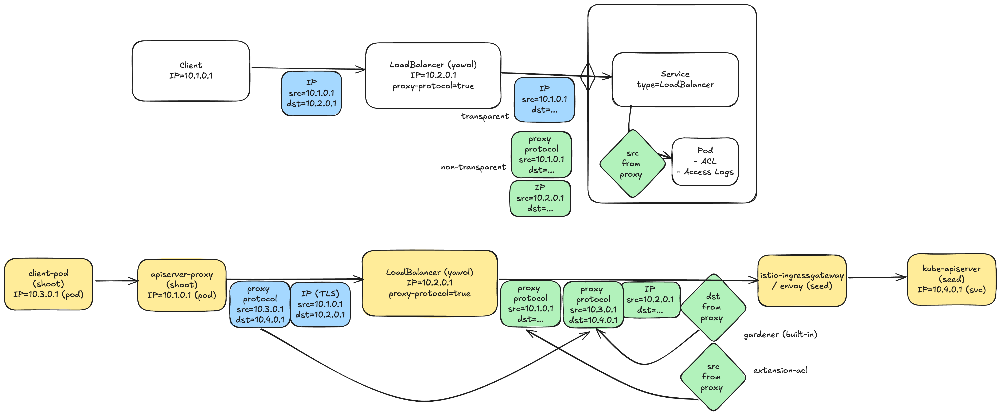
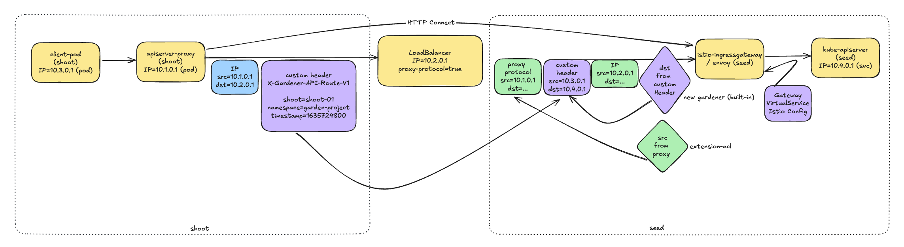
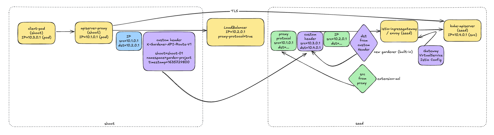

# GEP-30: Rework apiserver-proxy to drop PROXY protocol

## Table of Contents

- [Summary](#summary)
- [Motivation](#motivation)
    - [Goals](#goals)
    - [Non-Goals](#non-goals)
- [Proposal](#proposal)
- [Current Architecture](#current-architecture)
- [Proposed Changes](#proposed-changes)
- [Custom Header Specification](#custom-header-specification)
- [HTTP CONNECT Implementation](#http-connect-implementation)
    - [Technical Implementation Details](#technical-implementation-details)
    - [Istio IngressGateway Configuration](#istio-ingressgateway-configuration)
    - [EnvoyFilter for Custom Header Processing](#envoyfilter-for-custom-header-processing)
    - [Implementation Steps](#implementation-steps)
- [Feature Gate Implementation](#feature-gate-implementation)
    - [Feature Gate 1: APIServerSecureRouting](#feature-gate-1-apiserversecurerouting)
    - [Feature Gate 2: APIServerLegacyPortDisable](#feature-gate-2-apiserverlegacyportdisable)
    - [Configuration Example](#configuration-example)
- [Drawbacks](#drawbacks)
- [Alternatives](#alternatives)

## Summary
This proposal introduces secure routing mechanisms for Gardener's API server proxy to prevent security vulnerabilities when using opaque LoadBalancers.

## Motivation
The current architecture of Gardener, when used with opaque/instransparent LoadBalancer configurations and the ACL extension, can result in a security vulnerability. This vulnerability stems from the addition of multiple proxy protocol headers to network packets, which can lead to possible unauthorized access attempts to incorrect kube-api servers.

Alternatively, reducing the number of supported connection architectures by removing the proxy protocol method would simplify the system. The remaining two architectures already utilize HTTP CONNECT and are inherently immune to these security concerns, making them more reliable choices for secure communication.

The proposed solution involves implementing a custom header for secure routing using HTTP CONNECT (as currently used by the VPN listener), introducing a new port or path for API traffic, and gradually transitioning to this system through a feature gate.

### Goals
- Eliminate the vulnerability caused by dual proxy protocol headers
- Ensure secure routing of traffic to the correct API server
- Provide a clear migration path for existing Gardener deployments
- Allow [`gardener-extension-acl`](https://github.com/stackitcloud/gardener-extension-acl) to be used with proxy protocol on (non-transparent) LoadBalancers

### Non-Goals
- Modifying the core functionality of the ACL extension

## Proposal

The proposed solution involves the following key changes:

- Reconfigure the `istio-ingressgateway` to use the new routing method
    - Introduce a new port/path for API traffic from apiserver-proxy
    - Implement a new custom header for secure API server routing
- Reconfigure the `apiserver-proxy` to use HTTP CONNECT for secure tunneling
- Develop a feature gate to control the rollout of the new routing mechanism
- Provide a phased implementation approach for gradual adoption

## Concerns with the [Current Architecture](./11-apiserver-network-proxy.md)
The `apiserver-proxy` creates a proxy protocol header for each connection, containing information about the source and destination of the traffic. This header gets forwarded by the LoadBalancer towards the `istio-ingressgateway`.

A second proxy protocol header may be created when:
- The LoadBalancer is configured through the [ACL extension](https://github.com/stackitcloud/gardener-extension-acl)
- The LoadBalancer is operating in an opaque/intransparent mode
- Proxy protocol is explicitly enabled in the LoadBalancer configuration

In cases where dual proxy protocol headers exist, we require specific information from each header:
- The destination IP address from the `apiserver-proxy`'s proxy protocol header
- The source IP address from the LoadBalancer's proxy protocol header

However, the `istio-ingressgateway` processes these headers sequentially, reading the first proxy protocol header and then overwriting its information with the second proxy protocol header. This behavior means only the information from the second header is ultimately used for traffic filtering decisions in the [ACL extension](https://github.com/stackitcloud/gardener-extension-acl).

This situation becomes problematic under these conditions:
- When [ACL extension](https://github.com/stackitcloud/gardener-extension-acl) is actively filtering traffic based on source IP addresses
- When multiple shoot clusters are using overlapping private IP ranges
- When the LoadBalancer is not maintaining the original client source IP information

The issue does not impact environments where:
- The LoadBalancer operates in transparent mode
- Only a single proxy protocol header is present
- Alternative authentication methods are the primary security control
- Client IP ranges are strictly segregated between shoots



## Proposed Changes

1. Custom Header Implementation
    - Introduce a new custom header `X-Gardener-API-Route`
    - Define the structure and encoding of the header value to include necessary routing information

2. New Port/Path
    - Implement a new port or path on the `istio-ingressgateway` for the new routing mechanism
    - Ensure this new route is separate from any existing VPN or tunnel infrastructure

3. HTTP CONNECT Reconfiguration:
    - Reconfigure the `apiserver-proxy` to use HTTP CONNECT for establishing a secure tunnel
    - This will replace the current TCP proxy protocol method
    - The HTTP CONNECT method will be used on the newly implemented port/path

4. Feature Gate
    - Implement a feature gate to control the rollout of the new routing mechanism
    - Define stages for the feature gate: alpha, beta, and stable

5. Phased Implementation
    - Phase 1: Add the new port/path and custom header processing
    - Phase 2: Gradually reconfigure shoots to use the new routing method
    - Phase 3: Deprecate and remove the old routing method



    
    
## Custom Header Specification

The new custom header will be structured as follows:

```
X-Gardener-API-Route: <routing-information>
```

The routing information will be a concatenated string, joined by pipes, containing the following fields:

- `direction`: The direction of traffic.
- `port`: The destination port.
- `subset`: Istio subset/version.
- `destination`: The destination.

Putting this to practice should result in a header formatted like this:

`X-Gardener-API-Route: outbound|8134||kube-apiserver.foobar.svc.cluster.local`

During the transition period, the system should be able to handle both the new custom header and the existing routing method. This can be controlled via the feature gate.

If the header is missing, malformed, or fails verification, the error should be logged with appropriate details for debugging and return an HTTP 400 (Bad Request) status code. It should never fall back to the old routing method to ensure security.

## HTTP CONNECT Implementation

The `apiserver-proxy` will be reconfigured to use HTTP CONNECT for establishing a secure tunnel to the `kube-apiserver`. This involves:

1. Initiating an HTTP CONNECT request to the new port/path on the `istio-ingressgateway`
2. Including the new custom header in the CONNECT request
3. Creating a secure connection over the established tunnel once the CONNECT request is accepted
4. Forwarding the original API server request through this secure tunnel

### Technical Implementation Details

The `apiserver-proxy` will be required to be updated to use HTTP CONNECT. This should involve modifying its configuration and potentially its code. One example of how the configuration might look like after reusing its Envoy tunneling config:

```yaml
...
- domains: 
  - api.*
  name: gardener-api-route
  routes:
  - match:
      connect_matcher: {}
    route:
     cluster_header: X-Gardener-API-Route
     upgrade_configs:
     - connect_config: {}
       upgrade_type: CONNECT
...
```

This solution would be reusing existing Envoy filtering on the `apiserver-proxy` pod and simply exchange its Proxy Protocol configuration for the new proposed header.

### Istio IngressGateway Configuration

Similarly, it would be required to configure the Istio IngressGateway to accept HTTP CONNECT requests and route them appropriately. This could e.g. be achieved utilizing Istio Custom Resources (Gateway, VirtualService):

```yaml
apiVersion: networking.istio.io/v1alpha3
kind: Gateway
metadata:
  name: api-gateway
  namespace: istio-system
spec:
  selector:
    istio: ingressgateway
  servers:
    ...
---
apiVersion: networking.istio.io/v1alpha3
kind: VirtualService
metadata:
  name: api-routes
  namespace: istio-system
spec:
  ...
  gateways:
  - api-gateway
  http:
  - match:
    - method:
        exact: CONNECT
      headers:
        X-Gardener-API-Route:
          regex: ".*"
    ...
```

This configuration sets up the Istio IngressGateway to accept HTTPS traffic and route HTTP CONNECT requests with the proposed custom header to the `kube-apiserver`.

### EnvoyFilter for Custom Header Processing

To process the proposed custom header and make routing decisions based on it, it will be required to additionally add and/or modify an EnvoyFilter. Again, existing configuration may be reused adjusted to this new use case to keep convention parity within the code base.

```yaml
{{- if eq .Values.vpn.enabled true -}}
apiVersion: networking.istio.io/v1beta1
kind: Gateway
metadata:
  name: reversed-vpn-auth-server
  namespace: {{ .Release.Namespace }}
spec:
  selector:
{{ .Values.labels | toYaml | indent 4 }}
  servers:
  - hosts:
    - reversed-vpn-auth-server.garden.svc.cluster.local
    port:
      name: tls-tunnel
      number: 8134
      protocol: HTTP
{{- end }}
```
### Implementation Steps

1. Apply the Istio Gateway and VirtualService configurations.
2. Deploy the EnvoyFilter for custom header processing.
3. Update any relevant Istio authorization policies to allow the new traffic flow.
4. Update the `apiserver-proxy` code or configuration to use HTTP CONNECT and include the custom header.
5. Deploy the updated `apiserver-proxy` configuration.

## Phased Rollout

The implementation will be controlled by two distinct feature gates that handle different aspects of the solution. Each feature gate can be disabled per shoot to allow testing of the old implementation via E2E tests.

### Feature Gate 1: `APIServerSecureRouting`
Controls whether shoots use the new secure routing implementation with HTTP CONNECT and custom headers.

**Rollout Plan:**
- Initially introduced as disabled by default
- Once stability is proven in production environments, enabled by default for new shoots
- Existing shoots will retain their previous setting until explicitly migrated
- When fully proven, the feature gate will be removed and the functionality will become permanent

### Feature Gate 2: `APIServerLegacyPortDisable`
Controls whether the legacy port is available. This feature gate can only be enabled after `APIServerSecureRouting` has been fully rolled out.

**Rollout Plan:**
- Introduced as disabled by default
- Once all shoots have migrated to secure routing, enabled by default for new shoots
- Existing shoots will be notified to migrate during reconciliation
- When migration is complete, the feature gate will be removed and the legacy port will be permanently disabled

## Alternatives

We are not aware of any other alternative solution to address this issue, as requiring a transparent Load Balancer for Gardener is no solution.