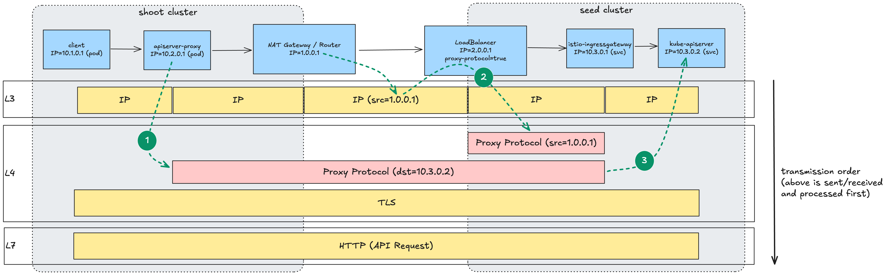
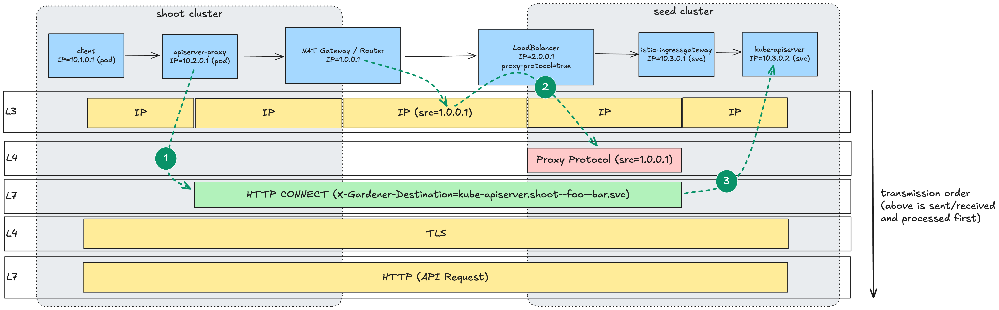

# GEP-30: Rework API Server Proxy to Drop Proxy Protocol

## Table of Contents

- [Summary](#summary)
- [Motivation](#motivation)
  - [Goals](#goals)
  - [Non-Goals](#non-goals)
- [Proposal](#proposal)
  - [Reconfiguring the API Server Proxy](#reconfiguring-the-api-server-proxy)
  - [Reconfiguring the Istio Ingress Gateway](#reconfiguring-the-istio-ingress-gateway)
  - [Unifying the HTTP Proxy Infrastructure](#unifying-the-http-proxy-infrastructure)
  - [Rollout Plan](#rollout-plan)
- [Alternatives](#alternatives)
- [Appendix](#appendix)
  - [Visualization of the Current Architecture](#visualization-of-the-current-architecture)
  - [Visualization of the Proposed Architecture](#visualization-of-the-proposed-architecture)

## Summary

This proposal reworks the API server proxy (originally introduced in [GEP-08](08-shoot-apiserver-via-sni.md)) to use [HTTP CONNECT requests](https://datatracker.ietf.org/doc/html/rfc7231#section-4.3.6) (i.e., HTTP proxy) instead of the [proxy protocol](https://www.haproxy.org/download/3.2/doc/proxy-protocol.txt) for connecting in-cluster clients on the shoot side to the corresponding API server on the seed side.
With this, the API server proxy uses the same network infrastructure and protocol to connect to the shoot control plane as the shoot's VPN client (see [GEP-14](14-reversed-cluster-vpn.md)).

The rework allows more scenarios like using the [ACL extension](https://github.com/stackitcloud/gardener-extension-acl) with opaque (non-transparent) LoadBalancers on the seed side that rely on the proxy protocol themselves to preserve the client's IP.

## Motivation

Since [GEP-08](08-shoot-apiserver-via-sni.md) introduced shared LoadBalancers for shoot control planes on the seed side, clients need to indicate which control plane they want to connect to through the LoadBalancer.
The Envoy proxy in the Istio ingress gateway receives the traffic from the shared LoadBalancer and is responsible for routing traffic to the indicated control plane.
For this, Gardener currently uses different protocols based on the connection type:

- When connecting to a shoot's API server directly, this is done using TLS SNI (Server Name Indication). I.e., the destination API server is indicated by the hostname in the SNI extension of the TLS client hello packet.
- When connecting to a shoot's API server via the `kubernetes` Service in the shoot cluster itself, the SNI extension is set to the same value (`kubernetes.default.svc.cluster.local`) on all shoots and cannot be used to indicate the destination API server. Therefore, the API server proxy handles traffic on this service and prepends a proxy protocol header with a shoot-specific destination IP to indicate the destination.
- When connecting to a shoot's VPN server, the shoot VPN client sends an HTTP CONNECT request to the shared LoadBalancer and indicates the destination by adding the `Reversed-VPN` HTTP header with the Envoy cluster string as a value (e.g., `outbound|1194||vpn-seed-server-0.shoot--foo--bar.svc.cluster.local`). I.e., it uses the ingress gateway as an HTTP proxy. In contrast to usual HTTP proxies, the target in the CONNECT request line is discarded.

Note that in all cases the payload (HTTP request or OpenVPN tunnel) is end-to-end encrypted even if it is tunneled via an unencrypted HTTP connection.

Shoot owners can use the [ACL extension](https://github.com/stackitcloud/gardener-extension-acl) for restricting traffic to the control plane based on client IPs – on all three of the described connection types.
In seed setups where only opaque LoadBalancers are available, the Gardener operator needs to configure the LoadBalancer to use the proxy protocol to preserve the original client IP.
Without the proxy protocol, the original client IP is lost and the ACL extension cannot restrict the traffic as configured.

Restricting control plane traffic in such setups works for traffic using the TLS SNI and the HTTP CONNECT protocol.
However, this doesn't work for traffic using the proxy protocol (API server proxy) because it contains two proxy protocol headers and Envoy only allows using the information from the last header.
Because the last header is the one added by the API server proxy (indicating the destination), traffic is routed correctly to the desired destination API server.
However, the original client IP from the first proxy protocol header (added by the LoadBalancer) is lost and replaced by the client IP connecting to the API server proxy (typically a pod IP).
In short, the ACL extension cannot restrict traffic using the proxy protocol if an opaque LoadBalancer is used on the seed side.

In addition to supporting this use case, reworking the API server proxy to use HTTP CONNECT instead of proxy protocol removes one the connection protocols and reduces complexity.

### Goals

- allow [gardener-extension-acl](https://github.com/stackitcloud/gardener-extension-acl) to work with opaque LoadBalancers using proxy protocol
- reduce complexity by removing one protocol for connections to the shoot control plane
- reuse existing network infrastructure (e.g., existing ingress gateway ports)
  - opening new LoadBalancer ports could require manual actions and shoot owner alignment
- share the network infrastructure for both the API server proxy and VPN connection path
- implement a migration path for existing shoot clusters

### Non-Goals

- change the core architecture of the ACL extension
- change the functionality of the API server proxy

## Proposal

### Reconfiguring the API Server Proxy

The API server proxy's Envoy config is changed to stop adding proxy protocol headers and start using HTTP CONNECT as a tunneling mechanism instead.

Essentially, the config will be changed like this (assuming a shoot `shoot--foo--bar`):

```diff
 static_resources:
   listeners:
   - name: kube_apiserver
     filter_chains:
     - filters:
       - name: envoy.filters.network.tcp_proxy
         typed_config:
           "@type": type.googleapis.com/envoy.extensions.filters.network.tcp_proxy.v3.TcpProxy
           cluster: kube_apiserver
+          tunneling_config:
+            hostname: "api.bar.foo.internal.local.gardener.cloud:443"
+            headers_to_add:
+            - header:
+                key: X-Gardener-Destination
+                value: "outbound|443||kube-apiserver.shoot--foo--bar.svc.cluster.local"

# ...

 clusters:
 - name: kube_apiserver
   load_assignment:
     cluster_name: kube_apiserver
     endpoints:
     - lb_endpoints:
       - endpoint:
           address:
             socket_address:
               address: api.bar.foo.internal.local.gardener.cloud
-               port_value: 8443
+               port_value: 8132
-  transport_socket:
-    name: envoy.transport_sockets.upstream_proxy_protocol
-    typed_config:
-      "@type": type.googleapis.com/envoy.extensions.transport_sockets.proxy_protocol.v3.ProxyProtocolUpstreamTransport
-      config:
-        version: V2
-      transport_socket:
-        name: envoy.transport_sockets.raw_buffer
-        typed_config:
-          "@type": type.googleapis.com/envoy.extensions.transport_sockets.raw_buffer.v3.RawBuffer
```

The TCP proxy filter of the listener is extended with a `tunneling_config` that configures the proxy to tunnel the TCP payload over HTTP CONNECT (see the [Envoy reference](https://www.envoyproxy.io/docs/envoy/latest/api-v3/extensions/filters/network/tcp_proxy/v3/tcp_proxy.proto#envoy-v3-api-field-extensions-filters-network-tcp-proxy-v3-tcpproxy-tunneling-config)).
The `hostname` field is sent in the CONNECT request to the upstream proxy (ingress gateway).
This value is discarded, but required in the config.
Additionally, the custom header `X-Gardener-Destination` is added to the CONNECT request to indicate the destination API server.
We don't reuse the `Reversed-VPN` header which fulfills the same purpose to avoid confusion.
However, the value of the `X-Gardener-Destination` header follows the same format (i.e., the Envoy cluster string format):

```text
outbound|443||kube-apiserver.<technical-shoot-id>.svc.cluster.local
```

In the corresponding upstream cluster section of the config, the destination port to connect to on istio-ingressgateway is changed from 8443 (`proxy`) to 8132 (`tls-tunnel`).
This configures the API server proxy to reuse the existing VPN infrastructure on the seed side.
Finally, the `transport_socket` is removed which disables adding the proxy protocol headers.

With this, a connection is established as follows:

1. An in-cluster client (e.g., pod) opens a TLS connection to `kubernetes.default.svc.cluster.local`. This service domain name points to an address which the API Server proxy listens on.
2. The Envoy process in the API server proxy pod on the same node sends an HTTP CONNECT request to the API server domain of the shoot, i.e., to the ingress gateway on the corresponding seed.
3. The ingress gateway discards the target from the HTTP request line and opens a TCP connection to the upstream cluster indicated by the `X-Gardener-Destination` header, i.e., in-cluster service of the shoot cluster.
4. The TLS payload is proxied from the in-cluster client via the API server proxy and the ingress gateway to the shoot API server.

### Reconfiguring the Istio Ingress Gateway

By configuring the API server proxy to connect to the existing VPN port on the Istio ingress gateway, we can reuse most of the existing VPN network infrastructure on the seed side without changes.
The existing `EnvoyFilter` `reversed-vpn` is changed to handle the new use case as follows:

```diff
 apiVersion: networking.istio.io/v1alpha3
 kind: EnvoyFilter
 metadata:
   name: reversed-vpn
 spec:
   configPatches:
   - applyTo: NETWORK_FILTER
     match:
       context: GATEWAY
       listener:
         filterChain:
           filter:
             name: envoy.filters.network.http_connection_manager
         portNumber: 8132
     patch:
       operation: MERGE
       value:
         name: envoy.filters.network.http_connection_manager
         typed_config:
           '@type': type.googleapis.com/envoy.extensions.filters.network.http_connection_manager.v3.HttpConnectionManager
           route_config:
             virtual_hosts:
             - domains: 
               - api.*
               name: reversed-vpn
               routes:
               - match:
                   connect_matcher: {}
+                  headers:
+                  - name: Reversed-VPN
+                    string_match:
+                      safe_regex: '^outbound\|1194\|\|vpn-seed-server(-[0-4])?\..*\.svc\.cluster\.local$'
                 route:
                   cluster_header: Reversed-VPN
                   upgrade_configs:
                   - connect_config: {}
                     upgrade_type: CONNECT
+              - match:
+                  connect_matcher: {}
+                  headers:
+                  - name: X-Gardener-Destination
+                    string_match:
+                      # see https://regex101.com/r/m0ZAAj/1
+                      safe_regex: '^outbound\|(1194\|\|vpn-seed-server(-[0-4])?|443\|\|kube-apiserver)\..*\.svc\.cluster\.local$'
+                route:
+                 cluster_header: X-Gardener-Destination
+                 upgrade_configs:
+                 - connect_config: {}
+                   upgrade_type: CONNECT
               - match:
                   headers:
                   - invert_match: true
                     name: :method
                     string_match:
                       exact: CONNECT
                   prefix: /
                 redirect:
                   https_redirect: true
                   port_redirect: 443
-                typed_per_filter_config:
-                  envoy.filters.http.ext_authz:
-                    '@type': type.googleapis.com/envoy.extensions.filters.http.ext_authz.v3.ExtAuthzPerRoute
-                    disabled: true

# ...

-  - applyTo: HTTP_FILTER
-    match:
-      context: GATEWAY
-      listener:
-        filterChain:
-          filter:
-            name: envoy.filters.network.http_connection_manager
-            subFilter:
-              name: envoy.filters.http.router
-        portNumber: 8132
-    patch:
-      filterClass: AUTHZ
-      operation: INSERT_BEFORE
-      value:
-        name: envoy.filters.http.ext_authz
-        typed_config:
-          '@type': type.googleapis.com/envoy.extensions.filters.http.ext_authz.v3.ExtAuthz
-          grpc_service:
-            envoy_grpc:
-              cluster_name: outbound|9001||reversed-vpn-auth-server.garden.svc.cluster.local
```

The existing route matcher in the `reversed-vpn` virtual host is extended to additionally check the `Reversed-VPN` header.
The header's value must match the given regex, so that only VPN servers can be specified as the proxy destination.
Then, a new route is added to the same virtual host that matches and validates the new `X-Gardener-Destination` header but allows both shoot API servers and VPN servers as valid destinations.
The VPN servers are accepted as valid destinations in preparation for [unifying the network infrastructure](#unifying-the-http-proxy-infrastructure) later on.
As before, all unmatched CONNECT requests are redirected to port 443.

Finally, the external authorization server configuration is removed, because the route matchers fulfill the same functionality but without an externally developed component (see the [ext-authz-server](https://github.com/gardener/ext-authz-server) repository).
With the removal of the `ext_authz` filter, we can also remove the explicit disablement of the filter in the route for unmatched requests.

With this, the 8132 port of the ingress gateway acts as a generic HTTP proxy and allows clients to open an HTTP tunnel to selected seed services (shoot API servers and VPN servers).
An individual HTTP CONNECT request is handled as follows:

1. The HTTP connection manager on the gateway port 8132 matches requests by the `api.*` host header.
2. It then matches the CONNECT type and the content of the `X-Gardener-Destination` header. It only matches requests that indicate a valid destination (shoot API server or VPN server).
3. If the request is matched, the gateway opens a connection to the specified destination and proxies the raw TCP payload from the client over this connection.

### Unifying the HTTP Proxy Infrastructure

Once the API server proxy and VPN connection use the same protocol, we want to unify the network infrastructure for handling these HTTP CONNECT requests on the seed side.
With this, we want to ensure that all related components have intuitive names to avoid confusion and that the names and implementation will match potential future connections using the same protocol.
For this, we ensure the following:

- the VPN connection is switched to the new `X-Gardener-Destination` header and the old `Reversed-VPN` header is dropped
- both API server proxy and shoot VPN client connect to the same port on the ingress gateway named `http-proxy`
  - we reuse the previous `proxy` port 8443 once it is no longer used for the old API server proxy config (see [Rollout Plan](#rollout-plan))
- all related Istio objects like `Gateway`, `EnvoyFilter`, etc. are named `http-proxy` 

### Rollout Plan

To ensure a disruption-free transition for existing shoot clusters, we follow the steps described in this section.
Here, we focus on the high-level steps that depend on each other.
For the detailed implementation steps, see the corresponding [umbrella issue](https://github.com/gardener/gardener/issues/11214).

The first part is related to reworking the API server proxy to drop the proxy protocol:

1. Prepare the existing VPN network infrastructure for reuse by the API server proxy.
   - Handle the new `X-Gardener-Destination` header as described in [this section](#reconfiguring-the-istio-ingress-gateway).
2. Reconfigure the API server proxy as described in [this section](#reconfiguring-the-api-server-proxy).
   - Report a new constraint `APIServerProxyUsesHTTPProxy` in the `Shoot` status once the API server proxy has been reconfigured to use the new protocol.
   - Can be released together with the previous step.
3. Introduce a new feature gate `RemoveAPIServerProxyLegacyPort` to gardenlet.
   - If enabled, gardenlet removes the old API server proxy network infrastructure on the seed side (ingress gateway port `proxy`, `Gateway`, `EnvoyFilter`, etc.)
   - The gardenlet only allows activating the feature gate if all shoot clusters on its seed cluster report that the API server proxy has been reconfigured.
4. Graduate the `RemoveAPIServerProxyLegacyPort` feature gate to GA and lock to `True`.
   - Remove the `APIServerProxyUsesHTTPProxy` constraint in the `Shoot` status.

After these steps, the proxy protocol is no longer used and the related network infrastructure (including the `proxy` port 8443) is removed.
The remaining steps are related to unifying the HTTP proxy infrastructure:

1. Introduce the unified HTTP proxy network infrastructure as described in [this section](#unifying-the-http-proxy-infrastructure).
   - Reconfigure the API server proxy and shoot VPN client to connect to the unified port.
   - Report a new constraint `UsesUnifiedHTTPProxyPort` in the `Shoot` status once both components have been reconfigured to use the new port.
2. Introduce a new feature gate `RemoveHTTPProxyLegacyPort` to gardenlet.
   - If enabled, gardenlet removes the old HTTP proxy network infrastructure on the seed side (ingress gateway port `tls-tunnel`, `Gateway`, `EnvoyFilter`, etc.)
   - The gardenlet only allows activating the feature gate if all shoot clusters on its seed cluster report that the API server proxy and shoot VPN client have been reconfigured.
3. Graduate the `RemoveHTTPProxyLegacyPort` feature gate to GA and lock to `True`.
   - Remove the `UsesUnifiedHTTPProxyPort` constraint in the `Shoot` status.

After these steps, the legacy VPN network infrastructure on the seed side (including the `tls-tunnel` port 8132) is removed. Instead, the unifying infrastructure using the `http-proxy` port 8443 is used.

In this plan, we need the feature gates for guarding the removal of one of the ingress gateway ports because we cannot be sure that a given Gardener version has been able to successfully reconfigure the related components in all shoot clusters.
I.e., we cannot assume that the port in question is no longer used, because the shoot reconciliation flow might not have reached the relevant tasks.
This might be because the shoot is marked to be ignored or an `Extension` with lifecycle `BeforeKubeAPIServer` cannot be reconciled successfully.
The feature gate allows the Gardener operator to delay the removal of the ingress gateway port if it's still used in the environment.
With this, we ensure the Gardener operator is not blocked in upgrading to a newer version.

The constraints are used as a mechanism for reporting which shoot clusters still use the old configuration of API server proxy and shoot VPN client.
This helps the Gardener operator to determine easily whether the corresponding feature gate can be enabled.
Additionally, gardenlet can prevent misconfiguration by iterating the relevant shoot constraints.

## Alternatives

We are not aware of any other alternative solution to address this issue, as requiring a transparent LoadBalancer for Gardener is no solution.

## Appendix

### Visualization of the Current Architecture



### Visualization of the Proposed Architecture


