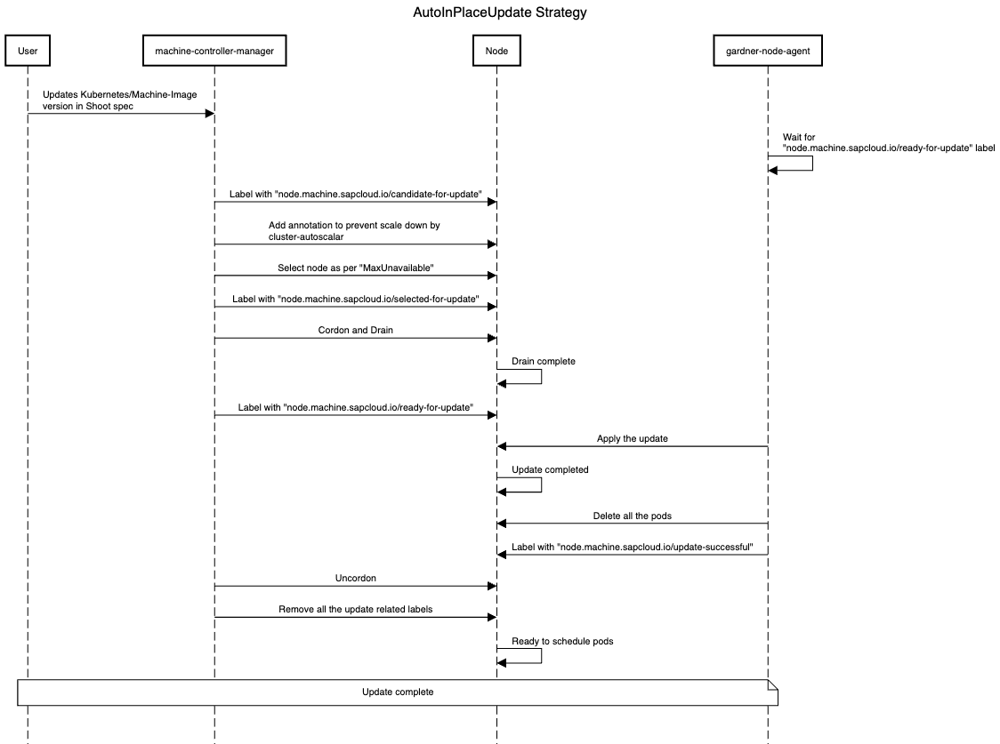
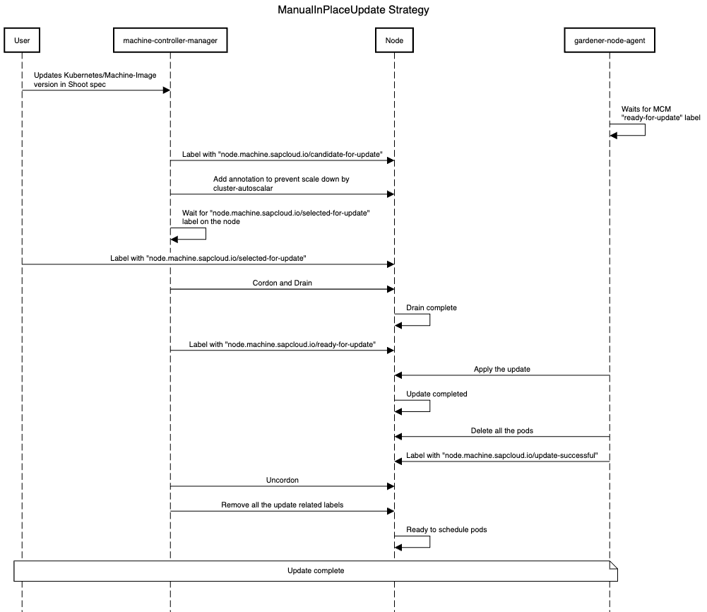
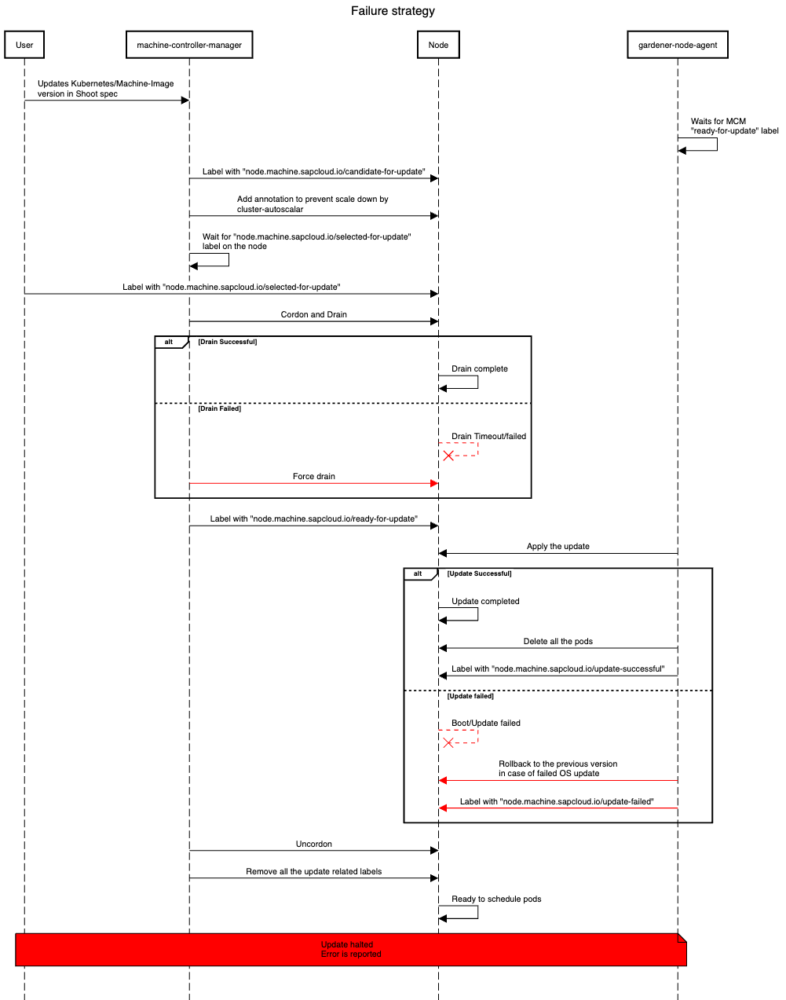

# GEP-31: In-Place Node Updates of Shoot Clusters

## Table of Contents

- [GEP-31: In-Place Node Updates of Shoot Clusters](#gep-31-in-place-node-updates-of-shoot-clusters)
  - [Table of Contents](#table-of-contents)
  - [Summary](#summary)
  - [Motivation](#motivation)
    - [Goals](#goals)
    - [Non-Goals](#non-goals)
  - [Proposal](#proposal)
    - [Approach](#approach)
    - [Prerequisites](#prerequisites)
    - [Update Strategies](#update-strategies)
      - [`AutoInPlaceUpdate` strategy](#autoinplaceupdate-strategy)
      - [`ManualInPlaceUpdate` strategy](#manualinplaceupdate-strategy)
    - [Gardener](#gardener)
      - [`CloudProfile` API](#cloudprofile-api)
      - [`Shoot` API](#shoot-api)
      - [`Worker` API](#worker-api)
      - [`OperatingSystemConfig` API](#operatingsystemconfig-api)
      - [Gardener Node Agent](#gardener-node-agent)
    - [Machine Controller Manager](#machine-controller-manager)
      - [`MachineDeployment` API](#machinedeployment-api)
    - [Dependency Watchdog](#dependency-watchdog)
    - [Extensions](#extensions)
      - [OS extensions](#os-extensions)
    - [Worker pool hash calculations](#worker-pool-hash-calculations)
    - [Failures and Recovery Strategy](#failures-and-recovery-strategy)
      - [Types of Failures During Update](#types-of-failures-during-update)
        - [Drain Timeout/Failure](#drain-timeoutfailure)
        - [Kubernetes Update Failures](#kubernetes-update-failures)
        - [OS Update Failures](#os-update-failures)
      - [Roles in Failure Handling](#roles-in-failure-handling)
  - [Future Work](#future-work)
  - [Alternatives](#alternatives)
    - [Using Only Gardener Node Agent](#using-only-gardener-node-agent)
    - [Using the same name for `MachineClass`](#using-the-same-name-for-machineclass)

## Summary

Gardener should support new update strategies for nodes that do not require the deletion and recreation of the nodes. These strategies aim to minimize the overhead traditionally associated with node replacement and offer an alternative approach to updates, which is particularly important for physical machines or bare-metal nodes.

The in-place update strategy is not intended to replace the current rolling update strategy provided by the [`machine-controller-manager`](https://github.com/gardener/machine-controller-manager). Instead, it offers an alternative that is especially useful in situations where physical machines or bare metal nodes are involved (manually joined or programmatically provisioned) that cannot be rolled easily. Additionally, this update strategy can be useful in scenarios where rolling machines is undesirable, such as when dealing with large machines or limited resources on the cloud provider.

## Motivation

In Gardener, certain changes to the worker pool configuration trigger a rolling update, during which nodes in the worker pool are replaced. This process involves creating new nodes with the updated configuration while systematically deleting the old ones. A comprehensive list of changes that initiate a rolling update is documented under [Rolling Update Triggers](https://github.com/gardener/gardener/blob/master/docs/usage/shoot-operations/shoot_updates.md#rolling-update-triggers).

This process presents challenges for **physical machines** or **bare-metal nodes**, which are not as interchangeable as virtual machines because of factors such as:

- **Long boot times**: Physical machines often have longer boot processes, especially when running Power-On Self-Tests (POST), such as memory checks, unless they are fully booted already and can fast-boot.
- **Slow cleanup/sanitization**: Erasing data from physical machines can take significant time before they can be repurposed or returned to a resource pool.
- **Locally attached storage**: Physical machines often have locally attached disks, which cannot be easily moved or re-attached to other machines, unlike network-attached volumes in virtual environments.
- **Limited interchangeability**: Physical machines are typically larger in size, fewer in number, and not as easily replaced or repurposed as virtual machines, making their replacement more challenging.

In addition, this process also presents challenges for **virtual machines**, e.g. if the virtual machine type is scarce (in general or because of an ongoing capacity crunch) or if certain scarce resources are connected/attached, e.g. GPUs that may not be available for additional or even replaced machines once released (as other customers are waiting for them).
To address this, we aim to support new update strategies that do not require the deletion and recreation of nodes, reducing the need for node replacement, especially in environments with limited physical resources. Additionally, there are scenarios where users want control over node updates, allowing them to select specific nodes to be updated. Our goal is to support a new way to update these dependencies that avoids node deletion and recreation, while also giving users the flexibility to orchestrate (=trigger) updates themselves as they see fit, e.g. after executing custom pre-update checks.

### Goals

- Provide functionality to support updating nodes in-place for rolling update triggers listed under [Rolling Update Triggers](https://github.com/gardener/gardener/blob/master/docs/usage/shoot-operations/shoot_updates.md#rolling-update-triggers) except the following:
  - `.spec.provider.workers[].machine.image.name`
  - `.spec.provider.workers[].machine.type`
  - `.spec.provider.workers[].volume.type`
  - `.spec.provider.workers[].volume.size`
  - `.spec.provider.workers[].cri.name`
  - `.spec.systemComponents.nodeLocalDNS.enabled`
- Provide two strategies for in-place - `AutoInPlaceUpdate` and `ManualInPlaceUpdate`. The former will be orchestrated by the `machine-controller-manager` and the latter by the users themselves.
- Switching between `AutoInPlaceUpdate` and `ManualInPlaceUpdate` strategies.

### Non-Goals

- Provide a way to schedule the pods on the same node after the in-place update.
- Downgrading of Kubernetes/machine image version after successful update.
- Switching between in-place and rolling update strategies.
- Provide an update strategy without draining the node.
- Provide in-place updates only for the Kubernetes version in worker pools where the OS does not support in-place updates.

## Proposal

In short, Gardener should support new update strategies that do not require deleting and recreating the node when a rolling update trigger occurs except in cases where the underlying hardware, such as the machine type, or critical software components, like the container runtime (CRI), are being modified.

### Approach

The `machine-controller-manager` and `gardener-node-agent` components will be used to perform in-place updates. `machine-controller-manager` will provide an interface that prepares the machine/node for an update. This interface can be used by other components to determine if a node is ready for an update, allowing the other component to perform the update on the node and then notify the `machine-controller-manager` that the node is successfully updated. _In the case of Gardener, this component will be the `gardener-node-agent`._

This design was chosen to leverage the `machine-controller-manager`'s node rollout orchestration functionality while ensuring that it remains a standalone component.

### Prerequisites

To perform an in-place OS update, the following prerequisites must be met:

- The node's machine image or operating system must support in-place updates, providing a tool or utility to initiate the update process.
- The update mechanism should ensure reliability by:
  - Booting into the new version upon a successful update.
  - Falling back to the previous version in case of failure.

Additionally, the update tool or utility may offer configuration options, such as:

- Retry Configuration: The ability to define the number of retries for the update process.
- Registry Configuration: The option to specify the registry from which the OS image is pulled.

### Update Strategies

Gardener will introduce two additional update strategies, `AutoInPlaceUpdate` and `ManualInPlaceUpdate`, for worker pools, in addition to the existing rolling update which will be now named as `AutoReplaceUpdate` strategy. In the future, there could also be `ManualReplaceUpdate` which could give more control to the users in rolling updates as well. The two new strategies are described as follows:

#### `AutoInPlaceUpdate` strategy

1. On a shoot spec change for a worker pool, `machine-controller-manager` will label all nodes of the updated worker pool with the `node.machine.sapcloud.io/candidate-for-update` label. This label is used to identify nodes that require an update.
2. `machine-controller-manager` will add the necessary annotation to the nodes to prevent them from being scaled down by [`cluster-autoscaler`](https://github.com/gardener/autoscaler/tree/machine-controller-manager-provider/cluster-autoscaler) during the update process.
3. `machine-controller-manager` will select as many nodes as are permitted by the `maxUnavailable` setting for the worker pool and label it/them with `node.machine.sapcloud.io/selected-for-update`. This label can be used to identify nodes that are about to or are currently undergoing an update.
4. `machine-controller-manager` will cordon and drain the node/nodes and label it/them with the `node.machine.sapcloud.io/ready-for-update` label once the drain is completed.
5. `gardener-node-agent` will detect the `node.machine.sapcloud.io/ready-for-update` label and perform the update on the machine. It will wait for the update to complete (with a specified timeout).
6. Once the machine is updated, `gardener-node-agent` will delete all the pods in the node so that they will get recreated and the node will be labelled by the `gardener-node-agent` with the `node.machine.sapcloud.io/update-successful` label.
7. `machine-controller-manager` will `uncordon` any node with the `node.machine.sapcloud.io/update-successful` label and remove this and all other update-related labels. Once the node becomes `Ready`, it can host workload again.



#### `ManualInPlaceUpdate` strategy

1. On a shoot spec change for a worker pool, `machine-controller-manager` will label all nodes of the changed worker pool with the `node.machine.sapcloud.io/candidate-for-update` label. This label is used to identify nodes that require an update.
2. `machine-controller-manager` will add the necessary annotation to the nodes to prevent them from being scaled down by `cluster-autoscaler` during the update process.
3. `machine-controller-manager` will wait for the `node.machine.sapcloud.io/selected-for-update` label on the node. The user is solely responsible for orchestrating the update and is free to select the nodes to be updated at will.
4. Once the user adds the `node.machine.sapcloud.io/selected-for-update` label, steps 4-7 of the `AutoInPlaceUpdate` strategy will be performed.



A new optional [constraint](https://github.com/gardener/gardener/blob/master/docs/usage/shoot/shoot_status.md#constraints) will be introduced in the Shoot status to indicate that some worker pools are undergoing a manual in-place update. Although the Shoot will be marked as successfully reconciled, these worker pools might remain outdated. Furthermore, a field (can be called `pendingWorkersInPlaceUpdate`) will be introduced in the Shoot status to track worker pools awaiting in-place updates.

Subsequent updates to the worker pool will be blocked by validation if an in-place update is already in progress. This ensures that worker pools do not skip intermediate Kubernetes minor versions or machine image versions. However, if an in-place update fails and a fix - such as a patch to the current updated minor version - is required, it will be allowed, if the Shoot has the `shoot.gardener.cloud/force-in-place-update: true` annotation.

### Gardener

#### `CloudProfile` API

A new field `minVersionForInPlaceUpdate` is introduced under `.spec.machineImages[].versions[]` in the `CloudProfile`. This field specifies the minimum machine image version eligible for direct in-place upgrades to a newer version. If the current version is lower than `minVersionForInPlaceUpdate`, the update will be disallowed by validation.

```yaml
apiVersion: core.gardener.cloud/v1beta1
kind: CloudProfile
metadata:
  name: cloudprofile1
spec:
  type: <some-provider-name>
  providerConfig: <some-provider-specific-cloudprofile-config>
  kubernetes:
    versions:
      - version: 1.31.1
  machineImages:
    - name: gardenlinux
      versions:
        - version: 1443.8.0
          expirationDate: "2025-02-28T23:59:59Z"
          minVersionForInPlaceUpdate: 1312.3.0
        - version: 1443.7.0 # if minVersionForInPlaceUpdate is not specified, in-place update cannot be performed on this version
  machineTypes:
    - name: m5.large
      cpu: "2"
      gpu: "0"
      memory: 8Gi
      usable: true
  regions:
    - name: <region-name>
```

#### `Shoot` API

A new field `updateStrategy` is introduced under `spec.provider.workers[]` in the Shoot spec. This field will be passed on to the worker extension. Once set, changing the `updateStrategy` between in-place and replace strategies is prohibited through validation. Additionally, when `AutoInPlaceUpdate` or `ManualInPlaceUpdate` is configured as an update strategy, skipping an intermediate Kubernetes minor version is no longer allowed, because of potential breaking changes that are then not carried out anymore when skipping versions (only allowed with `AutoReplace` as the machines/nodes are created from scratch in this case).

```yaml
apiVersion: core.gardener.cloud/v1beta1
kind: Shoot
metadata:
  name: crazy-botany
  namespace: garden-dev
spec:
  secretBindingName: my-provider-account
  cloudProfile:
    name: cloudprofile1
  region: europe-central-1
  provider:
    type: <some-provider-name> # {aws,azure,gcp,...}
    workers:
      - name: cpu-worker
        minimum: 5
        maximum: 5
        maxSurge: 0
        maxUnavailable: 2
        updateStrategy: AutoInPlaceUpdate # AutoReplaceUpdate/AutoInPlaceUpdate/ManualInPlaceUpdate, defaulted for now to AutoReplaceUpdate
        machine:
          type: m5.large
          image:
            name: <some-image-name>
            version: <some-image-version>
          architecture: <some-cpu-architecture>
        providerConfig: <some-machine-image-specific-configuration>
  kubernetes:
    version: 1.27.3
  networking:
    type: <some-network-extension-name> # {calico,cilium}
```

#### `Worker` API

New field `updateStrategy` and `kubelet` are introduced under `.spec.pools[]` in the Worker API. The `updateStrategy` field will be used to set the `machineDeploymentStrategy` for the `machinev1alpha1.MachineDeployment` resource and `kubelet` field corresponds to the kubelet configuration for this worker pool.

```yaml
apiVersion: extensions.gardener.cloud/v1alpha1
kind: Worker
metadata:
  name: worker
  namespace: shoot--foobar--aws
spec:
  type: aws
  region: eu-west-1
  secretRef:
    name: cloudprovider
    namespace: shoot--foobar--aws
  infrastructureProviderStatus: <infra-status>
  pools:
    - name: cpu-worker-1
      machineImage:
        name: gardenlinux
        version: 1.2.2
      minimum: 5
      maximum: 5
      maxSurge: 0
      maxUnavailable: 2
      updateStrategy: AutoInPlaceUpdate # AutoReplaceUpdate/AutoInPlaceUpdate/ManualInPlaceUpdate
      kubelet:
        evictionHard:
          memoryAvailable: 100Mi
          imageFSAvailable: 5%
```

#### `OperatingSystemConfig` API

New fields `osVersion`, `kubeletVersion`, and `credentialsRotation` are introduced in the `OperatingSystemConfig` spec and `inPlaceUpdateConfig` in the `OperatingSystemConfig` status.

- `osVersion` specifies the machine image version.
- `kubeletVersion` specifies the version of the kubelet.
- `credentialsRotation` contains two subfields:
  - `certificateAuthorities` contains `lastInitiationTime` which records the timestamp of the most recent Certificate Authority (CA) rotation initiation.
  - `serviceAccountKey` contains `lastInitiationTime` which records the timestamp of the most recent `ServiceAccount` signing key rotation initiation.
- `inPlaceUpdateConfig` contains a subfield `osUpdateCommand` which defines the command responsible for performing machine image updates. The command could be invoking an inbuilt utility/tool or a custom script, optionally accompanied by additional arguments or flags like the target version or the OCI registry from which the updated machine image should be pulled, offering flexibility tailored to the needs of different OS extensions.

```yaml
apiVersion: extensions.gardener.cloud/v1alpha1
kind: OperatingSystemConfig
metadata:
  name: pool-01-original
  namespace: default
spec:
  type: gardenlinux
  osVersion: 1631.0
  kubeletVersion: 1.30.4
  credentialsRotation:
    certificateAuthorities:
      lastInitiationTime: "2024-01-01T12:30:00Z"
    serviceAccountKey:
      lastInitiationTime: "2024-01-01T12:30:00Z"
  units:
    - ...
  files:
    - ...
status:
  inPlaceUpdateConfig:
    osUpdateCommand: /opt/gardener/bin/inplace-update.sh --version 1631.0 --repo <someOCIregistry>
```

#### Gardener Node Agent

The `gardener-node-agent` will function as the component responsible for carrying out in-place updates on the node.

Currently, when a dependency in the Operating System Configuration (OSC) changes, `gardener-node-agent` detects the differences between the current OSC and the last applied OSC and updates any modified units on the node. When the in-place update strategy is configured, if changes are detected that cannot be applied immediately (ie; if the change contains any of the update triggers listed in the [Goals](#goals)), `gardener-node-agent` will pause the update and wait for the `node.machine.sapcloud.io/ready-to-update` label to appear on the node before proceeding with the update.

For machine image updates, `gardener-node-agent` executes the command present in the `inPlaceUpdateConfig.osUpdateCommand` field within the OperatingSystemConfig status.

For Kubelet minor version or configuration updates, `gardener-node-agent` will apply the changed files and restart the `kubelet` unit and there are no additional steps involved.

For credential rotation, in the case of Certificate Authority (CA) rotation, the `kubelet` needs to be bootstrapped again so that it can request client certificates signed by the new CA. `gardener-node-agent` will use the existing kubeconfig used by the `kubelet` (passed in the `--kubeconfig` flag. See [`kubelet` Options](https://kubernetes.io/docs/reference/command-line-tools-reference/kubelet/)) and use it as bootstrap kubeconfig (`--bootstrap-kubeconfig` flag in the kubelet). It will remove the kubelet certificate directory (`--cert-dir` flag in the kubelet) `/var/lib/kubelet/pki`, and the `kubelet.service` unit is restarted. This makes the kubelet request new client certificates through [Certificate signing requests (CSR)](https://kubernetes.io/docs/reference/access-authn-authz/certificate-signing-requests/#certificate-signing-requests).
In case of `ServiceAccount` signing key rotation, `gardener-node-agent` will fetch the new service account token using its [`token` controller](https://github.com/gardener/gardener/blob/master/docs/concepts/node-agent.md#token-controller) automatically.

After executing an update, `gardener-node-agent` will determine the outcome and apply the corresponding label to the node: either `node.machine.sapcloud.io/update-successful` or `node.machine.sapcloud.io/update-failed`, indicating the status of the update. In the case of a successful update, before labelling the node as `node.machine.sapcloud.io/update-successful`, the `gardener-node-agent` will restart all pods running on the node. This step ensures that DaemonSet pods and pods with local storage are properly recreated post-update.

### Machine Controller Manager

The `machine-controller-manager` acts as an orchestrator for the update, ensuring changes are rolled out in a controlled manner.

In the current implementation, when there is a change which triggers a rolling update, the provider extension creates a new `MachineClass`, and the `MachineDeployment` is updated to reference this new `MachineClass`. `machine-controller-manager` detects this change and creates a new `MachineSet` with the new `MachineClass` and machines are rolled out based on the `RollingUpdate` strategy in the `MachineDeployment` spec.
In the case of the `RollingUpdate` strategy, new machines are created in the new `MachineSet` using the new `MachineClass`, and the old ones are deleted from the old `MachineSet`. For in-place updates, instead of creating new machines for the new `MachineSet`, the old ones are moved from the old `MachineSet` to the new one after the `gardener-node-agent` has successfully performed the update. This process preserves the old machines (their `Machine` and `Node` resources).

There are two ways to achieve this:

1. **Owner Reference Update**: Move the old `Machine` to the new `MachineSet` by updating the owner reference. The downside of this method is that the `Machine` name will stay the same through updates, which breaks the current naming convention of including the `MachineSet` name as a prefix in the `Machine` name.
2. **Shallow Delete**: Instead of directly moving a `Machine` from one `MachineSet` to another, first perform a shallow delete of the old `Machine` object (without deleting the underlying physical/virtual machine), then create a new `Machine` object in the new `MachineSet` (for the same physical/virtual machine).

> [!NOTE]
> At the time of writing this GEP, it is undecided which method to proceed with. The first method has been evaluated, but the feasibility of the second method is yet to be assessed. If feasible, the second method is preferred.

#### `MachineDeployment` API

A new strategy type `InPlaceUpdate` and a new field, `inPlaceUpdate`, are introduced under the `.spec.strategy` field. `inPlaceUpdate` can be configured when the selected strategy type is `InPlaceUpdate`.

```yaml
apiVersion: machine.sapcloud.io/v1alpha1
kind: MachineDeployment
metadata:
  name: <name>
  namespace: <shoot-namespace>
spec:
  replicas: 1
  selector:
    matchLabels:
      name: <label>
  strategy:
    inPlaceUpdate:
      maxUnavailable: 1
      maxSurge: 0
      manualUpdate: false # true/false, defaulted to false
    type: InPlaceUpdate # RollingUpdate/InPlaceUpdate/Recreate, defaulted to RollingUpdate
  template: {}
    spec: {}
status: {}
```

`maxUnavailable`: Specifies the maximum number of unavailable machines during the update process. Any machine undergoing an in-place update or with an update failed will be counted as unavailable.

`maxSurge`: Specifies the maximum number of machines that can be scheduled above the desired number of machines. Set `maxSurge` to zero if you don't want any new machines/nodes to be provisioned during the update. You can set it to a value greater than zero if you like to avoid pending pods because of lack of capacity during the update; in that case, first new machines/nodes will be created with the updated configuration and then the old machines/nodes will undergo in-place updates.

`manualUpdate`: If the update strategy is `ManualInPlaceUpdate` in the worker spec, the worker controller will set this field to true.

### Dependency Watchdog

Currently, the [`dependency-watchdog`](https://github.com/gardener/dependency-watchdog) monitors the leases of the nodes in the shoot cluster. If more nodes than a configured threshold are unhealthy, it scales down the `machine-controller-manager`, `kube-controller-manager`, and `cluster-autoscaler` to prevent a meltdown. During an ongoing in-place update, DWD can make use of the labels added by the `machine-controller-manager` during `in-place` update to exclude nodes undergoing updates from its health check.

### Extensions

#### OS extensions

The OS extensions are responsible for populating the `inPlaceUpdateConfig` field within the `OperatingSystemConfig` status. This configuration specifies the command to be executed by the `gardener-node-agent` to perform the update. The command could be invoking an inbuilt utility/tool or a custom script.

### Worker pool hash calculations

The worker pool hash calculation is derived from the rolling update triggers detailed [here](https://github.com/gardener/gardener/blob/master/docs/usage/shoot-operations/shoot_updates.md#rolling-update-triggers).

For in-place updates, the following fields are excluded from the hash calculation to ensure that the secret name for the `gardener-node-agent` remains unchanged:

- `.spec.kubernetes.version` or `.spec.provider.workers[].kubernetes.version`
- `.spec.provider.workers[].machine.image.version`
- `.status.credentials.rotation.{certificateAuthorities,serviceAccountKey}.lastInitiationTime`
- `.spec.kubernetes.kubelet.{kubeReserved,systemReserved,evictionHard,cpuManagerPolicy}` or `.spec.provider.workers[].kubernetes.kubelet.{kubeReserved,systemReserved,evictionHard,cpuManagerPolicy}`

However, these fields are included in the [`WorkerPoolHashV2` function](https://github.com/gardener/gardener/blob/81e6fd096f8725d0b374315fe134cb35f604bd68/extensions/pkg/controller/worker/machines.go#L163-L175) to ensure changes to the `MachineClass` are properly reflected.

### Failures and Recovery Strategy

In-place updates may fail because of several factors ranging from network issues to compatibility problems. This section outlines the failure scenarios, error classifications, and the specific roles `gardener-node-agent` and `machine-controller-manager` play in failure handling and recovery to ensure minimal disruption. The error will be reported in the `node.machine.sapcloud.io/update-failure-message` annotation on the node which can be used subsequently by the Shoot care controller.

#### Types of Failures During Update

##### Drain Timeout/Failure

- A node is marked as `node.machine.sapcloud.io/ready-for-update` only after a successful drain.
- We use the existing [drain logic](https://github.com/gardener/machine-controller-manager/tree/v0.54.0/pkg/util/provider/drain) provided by the `machine-controller-manager`.
- If a drain operation times out or fails, the node will be forcefully drained.

##### Kubernetes Update Failures

- **Update Halt on Failure:** `gardener-node-agent` will label the failed node with an `node.machine.sapcloud.io/update-failed` label. This label signals `machine-controller-manager` to stop further updates when the number of unhealthy machines reaches configured `maxUnavailable`.

##### OS Update Failures

- **Before rebooting for update** - Update cannot start if the machine image version is unavailable, network issues prevent the image pull, or disk storage is insufficient (although proper garbage collection should prevent this); classified as retriable or non-retriable.
- **Failed to boot the new OS** - If the node fails to boot into the new OS version and reverts to the previous version, `gardener-node-agent` will annotate it to mark an update attempt, but the root cause may remain unlogged as filesystems mount later in the booting process; classified as non-retriable.
- **Total failure** - In cases where the system fails to boot into either of the OS versions, the update attempt will timeout and be marked as failed; classified as non-retriable.



#### Roles in Failure Handling

**`gardener-node-agent`**:

`gardener-node-agent` is responsible for initiating updates, with specific timeouts set for Kubernetes and machine image updates. When an error occurs it will be classified as follows:

- **Retriable Error**: Temporary errors, such as network interruptions, prompt `gardener-node-agent` to retry the update after a delay. Retriable error will also get classified as non-retriable error after a certain number of retries and `gardener-node-agent` labels the node with an `node.machine.sapcloud.io/update-failed` label.
- **Non-Retriable Error**: For critical issues, such as incompatible OS versions, `gardener-node-agent` labels the node with a `node.machine.sapcloud.io/update-failed` label.

**`machine-controller-manager`**:

`machine-controller-manager` prepares nodes for updates by adding the `node.machine.sapcloud.io/ready-to-update` label and waits for `gardener-node-agent` to perform the update. `machine-controller-manager` monitors for status labels applied by `gardener-node-agent`:

- **Timeout Handling**: After the `machine-controller-manager` adds the `node.machine.sapcloud.io/ready-for-update` label to a node, it waits for the `gardener-node-agent` to complete the update within the timeout configured in `machine-controller-manager`. The timeout on the `machine-controller-manager` side is essential for handling cases where `gardener-node-agent` fails to report any status, such as during a total failure of the OS update. If the update is unsuccessful after a certain number of retries, `machine-controller-manager` will add the `node.machine.sapcloud.io/update-failed` label to the node.
- **Failed Update Handling**: If the nodes labeled with `node.machine.sapcloud.io/update-failed` reaches configured `maxUnavailable`, `machine-controller-manager` stops further updates. The failed machines remain with the old `MachineSet`, and no additional machines in that `MachineDeployment` will be updated until the nodes with the `node.machine.sapcloud.io/update-failed` label are fixed. The failure is propagated to the shoot status, notifying the operator or user, who may need to investigate the issue manually.
To resolve the issue, the error must be fixed manually, and the `node.machine.sapcloud.io/update-failed` label should be removed from the node. This allows the `machine-controller-manager` to proceed with the update process.

> [!NOTE]
> All mentioned timeouts and retries are subject to change, with exact values to be decided during implementation.

## Future Work

- Support node updates without draining the scheduled pods first/at all.
- Allow to switch the update strategy from `AutoReplaceUpdate` to `AutoInPlaceUpdate`/`ManualInPlaceUpdate` or vice-versa.
- Evaluate whether nodes can consistently be updated in-place for supported update triggers, eliminating the need to offer a choice between in-place and rolling updates.

## Alternatives

### Using Only Gardener Node Agent

Instead of using both the `machine-controller-manager` and the `gardener-node-agent` for in-place updates, use only `gardener-node-agent`. However, this method has the following drawbacks:

- `machine-controller-manager` natively provides rolling update logic through `MachineDeployment` and `MachineSet`, which helps track the progress of updated and pending nodes. Additionally, `machine-controller-manager` includes logic to select machines based on `maxUnavailable/maxSurge`, ensuring machines are rolled in a controlled manner. If only `gardener-node-agent` was used, we would need to implement new logic to track node update progress and to manage the number of nodes updated at a time before proceeding to the next set.
- `machine-controller-manager`'s drain logic, which offers special handling, cannot be utilized.

### Using the same name for `MachineClass`

As mentioned in the selected approach, the same machine object is transferred from one machine set to another, which would create a naming drift, leading to machine names not having the machine set name as a prefix. To prevent this, an alternative approach was evaluated, where the `MachineClass` name would not change when the machine image or Kubernetes minor version is updated. This way, no new machine set would be created, and the machine transfer between sets would be avoided, preserving naming consistency. However, this approach has the same disadvantage as the previous one: a new logic would need to be written to track the progress of the rolling update.
