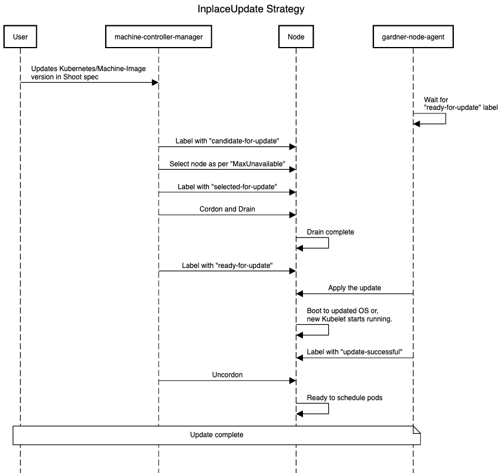
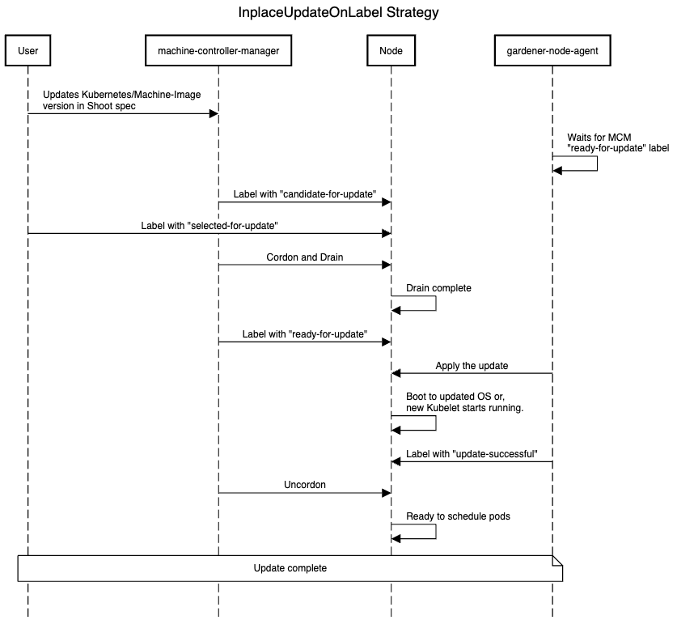
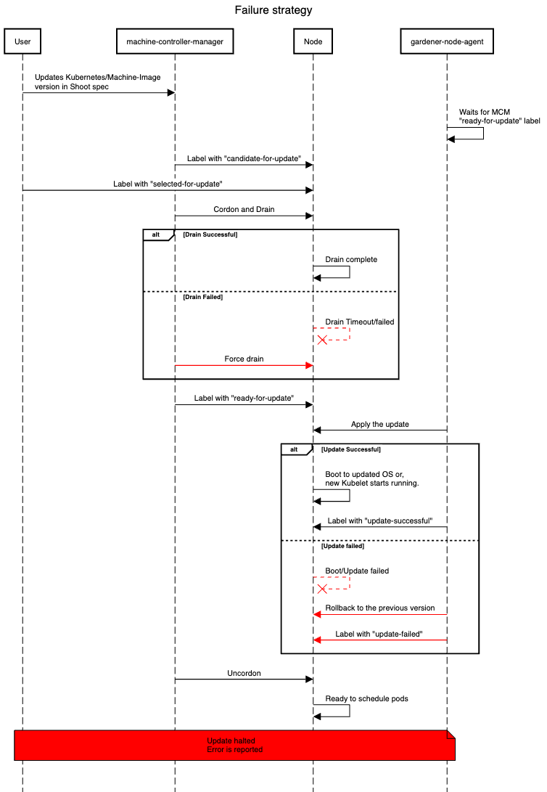

# GEP-31: In-Place Node Updates of Shoot Clusters

## Table of Contents

- [GEP-31: In-Place Node Updates of Shoot Clusters](#gep-31-in-place-node-updates-of-shoot-clusters)
  - [Table of Contents](#table-of-contents)
  - [Summary](#summary)
  - [Motivation](#motivation)
    - [Goals](#goals)
    - [Non-Goals](#non-goals)
  - [Proposal](#proposal)
    - [Approach](#approach)
    - [Prerequisites](#prerequisites)
    - [Update Strategies](#update-strategies)
      - [InplaceUpdate strategy](#inplaceupdate-strategy)
      - [InplaceUpdateOnLabel strategy](#inplaceupdateonlabel-strategy)
    - [Gardener](#gardener)
      - [`CloudProfile` API](#cloudprofile-api)
      - [`Shoot` API](#shoot-api)
      - [`Worker` API](#worker-api)
      - [`OperatingSystemConfig` API](#operatingsystemconfig-api)
      - [Gardener Node Agent](#gardener-node-agent)
    - [Machine Controller Manager](#machine-controller-manager)
      - [`MachineDeployment` API](#machinedeployment-api)
    - [Dependency Watchdog](#dependency-watchdog)
    - [Extensions](#extensions)
      - [OS extensions](#os-extensions)
    - [Failures and Recovery Strategy](#failures-and-recovery-strategy)
      - [Types of Failures During Update](#types-of-failures-during-update)
        - [Drain Timeout/Failure](#drain-timeoutfailure)
        - [Kubernetes Update Failures](#kubernetes-update-failures)
        - [OS Update Failures](#os-update-failures)
      - [Roles in Failure Handling](#roles-in-failure-handling)
    - [Additional Validations](#additional-validations)
  - [Future Work](#future-work)
  - [Alternatives](#alternatives)
    - [Using Only Gardener Node Agent](#using-only-gardener-node-agent)
    - [Using the same name for Machine Class](#using-the-same-name-for-machine-class)

## Summary

Gardener should support new update strategies for nodes that allow updates to Kubernetes minor versions and/or Machine image/OS versions without requiring the deletion and recreation of the nodes. These strategies aim to minimize the overhead traditionally associated with node replacement and offer an alternative approach to updates, particularly important for physical machines or bare-metal nodes.

The in-place update strategy is not intended to replace the current rolling update strategy provided by the [`machine-controller-manager`](https://github.com/gardener/machine-controller-manager). Instead, it is designed for specific scenarios where physical machines or bare metal nodes—whether manually joined or programmatically provisioned, cannot be easily rolled. Additionally, this update strategy can be useful in scenarios where rolling machines are undesirable, such as when dealing with large machines or limited resources on the cloud provider. For all other scenarios where preserving nodes is not critical, the rolling update strategy remains the preferred approach.

## Motivation

In Gardener, when the Kubernetes minor version and/or Machine image version of a worker pool in a shoot is updated, the nodes of the worker pool are typically rolled. This involves creating new nodes with an updated configuration and deleting the old nodes.

This process presents challenges for **physical machines** or **bare-metal nodes**, which are not as interchangeable as virtual machines because of factors such as:

- **Long boot times**: Physical machines often have longer boot processes, especially when running Power-On Self-Tests (POST), such as memory checks, unless they are fully booted already and can fast-boot.
- **Slow cleanup/sanitization**: Erasing data from physical machines can take significant time before they can be repurposed or returned to a resource pool.
- **Locally attached storage**: Physical machines often have locally attached disks, which cannot be easily moved or re-attached to other machines, unlike network-attached volumes in virtual environments.
- **Limited interchangeability**: Physical machines are typically larger in size, fewer in number, and not as easily replaced or repurposed as virtual machines, making their replacement more challenging.

To address this, we aim to support new update strategies that do not require the deletion and recreation of nodes when the Kubernetes minor version and/or machine image version is updated, reducing the need for node replacement—especially in environments with limited physical resources. Additionally, there are scenarios where users want control over node updates, allowing them to select specific nodes to be updated. Our goal is to support a new way to update these dependencies that avoids node deletion and recreation, while also giving users the flexibility to manage updates on particular nodes.

### Goals

- Provide functionality to update the nodes in-place for Kubernetes minor versions and Machine image versions.
- Two strategies for in-place - `InPlaceUpdate` and `InplaceUpdateOnLabel`.
- Maximize re-use of the existing functionality from `machine-controller-manager` and [`gardener-node-agent`](https://github.com/gardener/gardener/blob/master/docs/concepts/node-agent.md).

### Non-Goals

- Provide a way to schedule the pods on the same node after the in-place update.
- Downgrading of Kubernetes/Machine image version after successful update.
- Switching between in-place and rolling update strategies.
- Provide an update strategy without draining the node.
- Provide in-place updates only for the Kubernetes version in worker pools where the OS does not support in-place updates.

## Proposal

In short, Gardener should support new update strategies that do not require deleting and recreating the node when the Kubernetes minor or Machine image version is updated.

### Approach

The `machine-controller-manager` and `gardener-node-agent` components will be used to perform in-place updates. `machine-controller-manager` will provide an interface that prepares the machine/node for an update. This interface can be used by other components to determine if a node is ready for an update, allowing the other component to perform the update on the node and then notify the `machine-controller-manager` that the node has been successfully updated. _In the case of Gardener, this component will be the `gardener-node-agent`._

This design was chosen to leverage the `machine-controller-manager`'s node rollout orchestration functionality while ensuring that it remains a standalone component.

### Prerequisites

The only prerequisite is that the machine image/OS on the node must support in-place updates and provide a tool or utility to initiate the OS update. This update tool/utility should meet the following requirements:

1. **Failure Recovery**: In case of a failure, the OS should be able to revert to the previous version.
2. **Retry Configuration**: Support for configuring the number of update retries.
3. **Registry Configuration**: Ability to specify the registry from which to pull the OS image.

### Update Strategies

Gardener will introduce two additional update strategies, `InPlaceUpdate` and `InPlaceUpdateOnLabel`, for worker pools, in addition to the existing `RollingUpdate`. The two new strategies are described as follows:

#### InplaceUpdate strategy

1. On shoot spec change for Kubernetes/Machine image version, `machine-controller-manager` will label all the nodes with `candidate-for-update` label. This label can be used to identify nodes that will be selected for updates in the future.
2. `machine-controller-manager` will add the necessary annotation to the nodes to prevent it from being scaled down by [`cluster-autoscaler`](https://github.com/gardener/autoscaler/tree/machine-controller-manager-provider/cluster-autoscaler) during the update process.
3. `machine-controller-manager` will select the nodes based on the configured `maxUnavailable` and label them with `selected-for-update`. This label can be used to identify nodes that are currently undergoing an update.
4. `machine-controller-manager` will cordon and drain the node and label it with `ready-for-update` label.
5. `gardener-node-agent` will detect the `ready-for-update` label and perform the update on the node. And it will wait for the update to complete within the specified timeout.
6. Once the Kubernetes/Machine image version is updated, the node will be labeled by the `gardener-node-agent` with `update-successful` label.
7. `machine-controller-manager` will `uncordon` the node, and remove all the added labels. The node is then ready to schedule the workloads.



#### InplaceUpdateOnLabel strategy

1. On shoot spec change, nodes will be labeled with `candidate-for-update`.
2. `machine-controller-manager` will add the necessary annotation to the nodes to prevent it from being scaled down by `cluster-autoscaler` during the update process.
3. `machine-controller-manager` will wait for the `selected-for-update` label on the node. The orchestration of the update is solely the responsibility of the user. They are free to select the nodes to be updated at will.
4. Once the `selected-for-update` label is added by the user on the node, steps 4-7 of the `Inplace` strategy will performed.



### Gardener

#### `CloudProfile` API

A new field `minSupportedVersionInPlaceUpdate` is introduced under `.spec.machineImages[]` under the CloudProfile spec. This field can be used to specify the minimum supported version from which the current machine image version can be in-place updated to.

```yaml
apiVersion: core.gardener.cloud/v1beta1
kind: CloudProfile
metadata:
  name: cloudprofile1
spec:
  type: <some-provider-name>
  providerConfig: <some-provider-specific-cloudprofile-config>
  kubernetes:
    versions:
      - version: 1.31.1
  machineImages:
    - name: gardenlinux
      versions:
        - version: 1443.8.0
          expirationDate: "2025-02-28T23:59:59Z"
          minSupportedVersionInPlaceUpdate: 1312.3.0
        - version: 1443.7.0
  machineTypes:
    - name: m5.large
      cpu: "2"
      gpu: "0"
      memory: 8Gi
      usable: true
  regions:
    - name: <region-name>
```

#### `Shoot` API

A new field `UpdateStrategy` is introduced under `spec.provider.workers[]` in the Shoot spec. This field will be passed on to the worker extension. Once set, changing the `UpdateStrategy` is prohibited through validation. Additionally, when the `InPlaceUpdate/InplaceUpdateOnLabel` update strategy is configured, skipping the worker pool's Kubernetes minor version is not allowed.

```yaml
apiVersion: core.gardener.cloud/v1beta1
kind: Shoot
metadata:
  name: crazy-botany
  namespace: garden-dev
spec:
  secretBindingName: my-provider-account
  cloudProfile:
    name: cloudprofile1
  region: europe-central-1
  provider:
    type: <some-provider-name> # {aws,azure,gcp,...}
    workers:
      - name: cpu-worker
        minimum: 5
        maximum: 5
        maxSurge: 0
        maxUnavailable: 2
        updateStrategy: InPlaceUpdate # RollingUpdate/InPlaceUpdate/InplaceUpdateOnLabel
        machine:
          type: m5.large
          image:
            name: <some-image-name>
            version: <some-image-version>
            providerConfig: <some-machine-image-specific-configuration>
          architecture: <some-cpu-architecture>
  kubernetes:
    version: 1.27.3
  networking:
    type: <some-network-extension-name> # {calico,cilium}
```

#### `Worker` API

A new field `updateStrategy` is introduced under `.spec.pools[]` in the Worker API. This field will be used to set the `machineDeploymentStrategy` for the `machinev1alpha1.MachineDeployment` resource.

```yaml
apiVersion: extensions.gardener.cloud/v1alpha1
kind: Worker
metadata:
  name: worker
  namespace: shoot--foobar--aws
spec:
  type: aws
  region: eu-west-1
  secretRef:
    name: cloudprovider
    namespace: shoot--foobar--aws
  infrastructureProviderStatus: <infra-status>
  pools:
    - name: cpu-worker-1
      machineType: m4.large
      machineImage:
        name: gardenlinux
        version: 1.2.2
      minimum: 5
      maximum: 5
      maxSurge: 0
      maxUnavailable: 2
      updateStrategy: InPlaceUpdate # RollingUpdate/InPlaceUpdate/InplaceUpdateOnLabel
```

#### `OperatingSystemConfig` API

A new field `version` is introduced in the `OperatingSystemConfig` spec. It specifies the machine image/OS version of the worker pool.

```yaml
apiVersion: extensions.gardener.cloud/v1alpha1
kind: OperatingSystemConfig
metadata:
  name: pool-01-original
  namespace: default
spec:
  type: <os-type>
  version: <operating-system-version>
  units:
    - ...
  files:
    - ...
```

#### Gardener Node Agent

The `gardener-node-agent` will function as the tool responsible for updating Kubernetes minor version and Machine image version dependencies on the node.

Currently, when a dependency changes in the Operating System Configuration (OSC), `gardener-node-agent` detects the difference between the current OSC and the last applied OSC, and updates any changed unit on the node. When the in-place update strategy is configured, and either the Kubernetes minor version or the machine image version is changed, `gardener-node-agent` will not immediately apply the updates to the node. Instead, it will wait for the `ready-to-update` label on the node. Once the label is present, `gardener-node-agent` will proceed with the update.

In the case of OS updates, `gardener-node-agent` expects an "update-script" to be present in the `.spec.files[]` of the OSC at a predefined path, and the same will be executed to perform the update.

After the update, based on its success or failure, `gardener-node-agent` will add the appropriate label(`update-successful` or `update-failed`) to the node to indicate the status of the update.

### Machine Controller Manager

The `machine-controller-manager` acts as an orchestrator for the update, ensuring changes are rolled out in a controlled manner.

In the current implementation, when a Kubernetes minor version or Machine Image/OS version is updated in the shoot (worker pool), the provider extension creates a new `MachineClass`, and the `MachineDeployment` is updated to reference this new `MachineClass`. `machine-controller-manager` detects this change and creates a new `MachineSet` with the new `MachineClass` and machines are rolled out based on the `RollingUpdate` strategy.

In the case of the `RollingUpdate` strategy, new machines are created in the new `MachineSet` using the new `MachineClass`, and the old ones are deleted from the old `MachineSet`. For in-place updates, instead of creating new machines for the new `MachineSet`, the old ones are moved from the old `MachineSet` to the new one after the `gardener-node-agent` has successfully updated the dependencies. This process preserves the old nodes.

There are two ways to achieve this:

1. **Owner Reference Update**: Move the old machine to the new `MachineSet` by updating the owner reference. The downside of this method is that the machine name will stay the same through updates, which breaks the current naming convention of including the `MachineSet` name as a prefix in machine names.
2. **Shallow Delete**: Instead of directly moving a machine from one `MachineSet` to another, first perform a shallow delete of the old machine object (without deleting the underlying VM), then create a new machine object in the new `MachineSet` for the same VM.

> [!NOTE]
> At the time of writing this GEP, it is undecided which method to proceed with. The first method has been evaluated, but the feasibility of the second method is yet to be assessed. If feasible, the second method is preferred.

#### `MachineDeployment` API

A new strategy type `InPlaceUpdate` and a new field, `inPlaceUpdate`, have been introduced under the `.spec.strategy` field. `inPlaceUpdate` can be configured when the selected strategy type is `InPlaceUpdate`.

```yaml
apiVersion: machine.sapcloud.io/v1alpha1
kind: MachineDeployment
metadata:
  name: <name>
  namespace: <shoot-namespace>
spec:
  replicas: 1
  selector:
    matchLabels:
      name: <label>
  strategy:
    inPlaceUpdate:
      maxUnavailable: 1
      maxSurge: 0
      onLabel: false # true/false
    type: InPlaceUpdate # RollingUpdate/InPlaceUpdate/Recreate
  template: {}
    spec: {}
status: {}
```

`maxUnavailable`: Specifies the maximum number of unavailable machines during the update process.

`maxSurge`: Specifies the maximum number of machines that can be scheduled above the desired number of machines. Set `maxSurge` to zero if you don't want any new nodes to be provisioned during the update. You can set it to a value greater than zero if you don't want unavailable nodes during the update; in that case, first new nodes will be created with the updated configuration and then the old nodes will undergo in-place updates.

`onLabel`: If the update strategy is `InPlaceUpdateOnLabel` in the worker spec, the worker controller will set this field to true.

### Dependency Watchdog

Currently, the [`dependency-watchdog`](https://github.com/gardener/dependency-watchdog) monitors the leases of the nodes in the shoot cluster. If nodes more than a configured threshold are unhealthy, it scales down the `machine-controller-manager`, `kube-controller-manager`, and `cluster-autoscaler` to prevent a meltdown. During an ongoing in-place update, DWD can make use of the labels added by `machine-controller-manager` during the `in-place` update to exclude nodes undergoing updates from its health check.

### Extensions

#### OS extensions

The OS extension that wants to support in-place updates should add an "update-script" to the `.spec.files[]` of the OSC with a pre-defined path that will be executed by the `gardener-node-agent` to perform the update. This script should trigger the OS-provided update tool/utility to update the OS.

### Failures and Recovery Strategy

In-place updates may fail because of several factors ranging from network issues to compatibility problems. This section outlines the failure scenarios, error classifications, and the specific roles `gardener-node-agent` and `machine-controller-manager` play in failure handling and recovery to ensure minimal disruption.

#### Types of Failures During Update

##### Drain Timeout/Failure

- A node is marked as `ready-for-update` only after a successful drain.
- We use the existing [drain logic](https://github.com/gardener/machine-controller-manager/tree/v0.54.0/pkg/util/provider/drain) provided by the `machine-controller-manager`.
- If a drain operation times out or fails, the node will be forcefully drained.

##### Kubernetes Update Failures

- **Rollback on Failure:** If a Kubernetes version update fails, `gardener-node-agent` will roll back the `kubelet` to the version specified in the last applied `OperatingSystemConfig`. This ensures that the node remains operational.
  - **Update Halt on Failure:** `gardener-node-agent` will label the node with an `update-failed` label. This label signals `machine-controller-manager` to stop further updates.

##### OS Update Failures

- **Before rebooting for update** - Update cannot start if the machine image version is unavailable, network issues prevent the image pull, or disk storage is insufficient (although proper garbage collection should prevent this); classified as retriable or non-retriable.
- **Failed to boot the new OS** - If the node fails to boot into the new OS version and reverts to the previous version, `gardener-node-agent` will annotate it to mark an update attempt, but the root cause may remain unlogged as filesystems mount later in the booting process; classified as non-retriable.
- **Total failure** - In cases where the system fails to boot into either of the OS versions, the update attempt will timeout and be marked as failed; classified as non-retriable.



#### Roles in Failure Handling

**`gardener-node-agent`**
`gardener-node-agent` is responsible for initiating updates, with specific timeouts set for Kubernetes and machine image updates. When an error occurs it will be classified as follows:

- **Retriable Error**: Temporary errors, such as network interruptions, prompt `gardener-node-agent` to retry the update after a delay. Retriable error will also get classified as non-retriable error after a certain number of retries and `gardener-node-agent` labels the node with an `update-failed` label.
- **Non-Retriable Error**: For critical issues, such as incompatible OS versions, `gardener-node-agent` labels the node with an `update-failed` label.

**`machine-controller-manager`**
`machine-controller-manager` prepares nodes for updates by adding the `ready-to-update` label and waits for `gardener-node-agent` to perform the update. `machine-controller-manager` monitors for status labels applied by `gardener-node-agent`:

- **Timeout Handling**: After the `machine-controller-manager` adds the `ready-for-update` label to a node, it waits for the `gardener-node-agent` to complete the update within the timeout configured in `machine-controller-manager`. If `gardener-node-agent` does not complete the update within this timeout, `machine-controller-manager` will retry the rollout after a specified delay. The timeout on the `machine-controller-manager` side is essential for handling cases where `gardener-node-agent` fails to report any status, such as during a total failure of the OS update. If the update is unsuccessful after a certain number of retries, `machine-controller-manager` will add the `update-failed` label to the node.
- **Failed Update Handling**: If a node is labeled with `update-failed`, `machine-controller-manager` stops further updates. The machine remains with the old `MachineSet`, and no additional nodes in that `MachineDeployment` will be updated until the node with `update-failed` label is fixed. The failure is propagated to the shoot status, notifying the operator or user, who may need to investigate the issue manually.
  To resolve the issue, the error must be fixed manually, and the `update-failed` label should be removed from the node. This allows `machine-controller-manager` to proceed with the update process.

> [!NOTE]
> All mentioned timeouts and retries are subject to change, with exact values to be decided during implementation.

### Additional Validations

In addition to Kubernetes or Machine image updates, several other factors can trigger the rolling updates of nodes in the shoot clusters. These include:

1. Modification of the following fields in the Shoot specification:
   - `.spec.provider.workers[].machine.type`
   - `.spec.provider.workers[].volume`
   - `.spec.provider.workers[].cri`
   - `.spec.systemComponents.nodeLocalDNS`
2. Rotation of the `CA` or `ServiceAccount` signing key.
3. Changes in the `kubelet` configuration (for eg., kubeReserved).

In-place updates will support (2) and (3) but will disallow (1) with validations in the Shoot API. This ensures that certain critical changes, such as machine type or volume adjustments, follow the traditional rolling update process in which nodes are replaced.

## Future Work

- Support node updates without graceful termination of the pods (via node drain) scheduled onto the node.
- Allow to switch the update strategy from `RollingUpdate` to `InplaceUpdate`/`InplaceUpdateOnLabel` or vice-versa.

## Alternatives

### Using Only Gardener Node Agent

Instead of using both the `machine-controller-manager` and the `gardener-node-agent` for in-place updates, use only `gardener-node-agent`. However, this method has the following drawbacks:

- `machine-controller-manager` natively provides rolling update logic through `Machine Deployment` and `Machine Set`, which helps track the progress of updated and pending nodes. Additionally, `machine-controller-manager` includes logic to select machines based on `maxUnavailable/maxSurge`, ensuring machines are rolled in a controlled manner. If only `gardener-node-agent` is used, new logic would need to be implemented to track node update progress and to manage the number of nodes updated at a time before proceeding to the next set.
- `machine-controller-manager`'s drain logic, which offers special handling, cannot be utilized.

### Using the same name for Machine Class

As mentioned in the selected approach, the same machine object is transferred from one machine set to another, which would create a naming drift, leading to machine names not having the machine set name as a prefix. To prevent this, an alternative approach was evaluated, where the Machine Class name would not change when the machine image or Kubernetes minor version is updated. This way, no new machine set would be created, and the machine transfer between sets would be avoided, preserving naming consistency. However, this approach has the same disadvantage as the previous one: a new logic would need to be written to track the progress of the rolling update.
