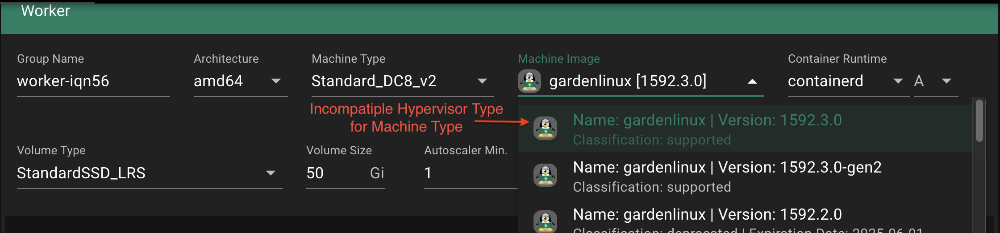
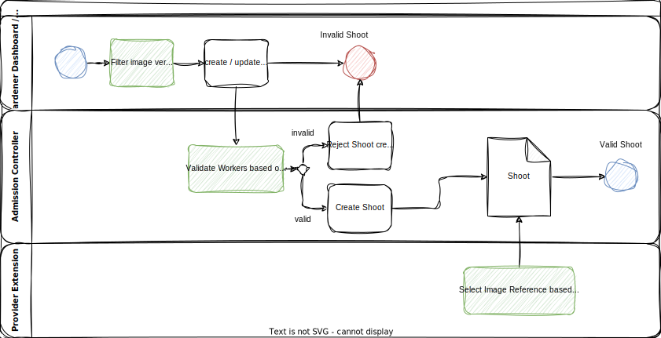

# GEP-33: Machine Image Capabilities

## Table of Contents

- [Summary](#summary)
- [Motivation](#motivation)
  - [Goals](#goals)
  - [Non-Goals](#non-goals)
- [Proposal](#proposal)
- [Alternatives](#alternatives)

## Summary

This GEP proposes the introduction of capabilities for machineType and machineImage in the Gardener CloudProfile to ensure only shoots with a matching set of capabilities on machine type and image will be admitted by Gardener.
This will prevent the creation of incompatible worker pools on shoot creation and maintenance operations.
It will also provide a mechanism to filter out incompatible images for a machine type in the Gardener Dashboard.

> [!Note]
> One decision in this GEP is to deprecate the current `architecture` fields in the `CloudProfile`. Otherwise the information will be duplicated as the architecture is mandatory to be included into capability combinations.

## Motivation

On cloud providers, not every machine type is compatible with every machine image.
Gardener currently relies on end-users to select the proper machine image for a given machine type.

There are 3 use cases where capabilities will ensure a correct image selection:

1. Shoot Admission Control

When applying a shoot manifest to the Gardener API, the shoot admission controller checks if the selected machine type is supported by the selected machine image.
If the machine type is not supported by the machine image, the shoot admission controller rejects the shoot creation request.

2. Operating System Maintenance Operations

When performing maintenance operations on a cluster, Gardener has to know which machine image can be used for a given machine type.
This is important to ensure that the maintenance operation is performed correctly and does not break the worker nodes.

3. Gardener Dashboard Shoot Creation

During shoot creation via the Gardener Dashboard, the user has to select a machine type and a machine image.
Currently also incompatible combinations can be selected.

### Use Case Example

One such example is on Azure: machine types have a `generation` [attribute](https://learn.microsoft.com/en-us/azure/virtual-machines/generation-2) which - at the time of writing - supports two values `gen1` and `gen2`.
While `gen1` machine types boot with legacy BIOS support, `gen2` machine types make use of UEFI.
While most machine types actually support both, `gen1` and `gen2`, there are certain machine types which support only one.
Machine images in Azure also have the generation in their metadata, however, while a machine type can be `gen1` **and** `gen2`, a machine image can only be `gen1` **or** `gen2`.
For machine types, that support either generation, it depends on the selected machine image whether the machine will be booted with legacy BIOS or with UEFI.
For those machines however, that only support a single generation, providing a mismatching machine image in the `create_or_update` API call will result in an error.

The information given on the Gardener Dashboard provide no information about that incompatibility.
The user has to know about that and select the proper machine image manually AND disable Operating System maintenance as the machine image might be updated to a version that is incompatible with the machine type.



### Context: `CloudProfile`

For each infrastructure provider Gardener operators must provide a CloudProfile.
It describes the catalog of machines, images and other resources of the infrastructure provider.
Only machines and images that are described in the CloudProfile can be used to create a shoot.


There are three places in the CloudProfile where metadata is required:

```Go
type CloudProfileSpec struct {
...
	MachineImages []MachineImage
	MachineTypes []MachineType
	ProviderConfig *runtime.RawExtension
...
}
```

The `MachineImages` and `MachineTypes` are visible to Gardener core.
This means all information required to decide if an image is compatible with a machine type must be stored in these two arrays.

The `ProviderConfig` is only visible to Gardener extensions, meaning filtering based on these information is not possible in Gardener core or the Gardener dashboard.

Here is a current CloudProfile example with exactly one machineType and one machineImage version.
Note that there are two versions in `spec.machineImages.versions` as the pre-release tag is used to distinguish between `gen1` and `gen2` machine images.

<details>
  <summary>Click to show the example</summary>

```yaml
# CloudProfile
spec:
  machineImages:
    - name: gardenlinux
      updateStrategy: minor
      versions:
        - architectures: [arm64, amd64]
          version: 1592.2.0-gen2 # First entry of 1592.2.0 with gen2 marked by version preview tag
        - architectures: [amd64]
          classification: supported
          version: 1592.2.0 # second entry of 1592.2.0 with gen1

  machineTypes:
    - architecture: amd64
      cpu: "896"
      gpu: "0"
      memory: 12Ti
      name: Standard_S896om
      usable: true

  providerConfig: # can have additional fields depending on the cloud provider
    machineImages:
      - name: gardenlinux
        versions:
          - acceleratedNetworking: true
            architecture: arm64
            communityGalleryImageID: /CommunityGalleries/xzy/Images/gardenlinux-nvme-arm64-gen2/Versions/1592.2.0
            version: 1592.2.0-gen2 # first entry of 1592.2.0 with gen2 AND arm64
          - acceleratedNetworking: true
            architecture: amd64
            communityGalleryImageID: /CommunityGalleries/xzy/Images/gardenlinux-nvme-gen2/Versions/1592.2.0
            version: 1592.2.0-gen2 # second entry of 1592.2.0 with gen2 AND amd64
          - acceleratedNetworking: true
            architecture: amd64
            communityGalleryImageID: /CommunityGalleries/xzy/Images/gardenlinux-nvme/Versions/1592.2.0
            version: 1592.2.0 # third entry of 1592.2.0 with gen1 AND amd64

    machineTypes: # provider specific capabilities
      - acceleratedNetworking: true
        name: Standard_S896om
```

</details></br>

While a machineType in `spec.machineType` always refers to exactly one resource in the cloud provider, the `spec.machineImages` section is a bit confusing.
A machineImage defines an operating system, like GardenLinux or SUSE.
That operating system in turn can have multiple versions.
And going further down, each version can have multiple architectures or other capabilities that are in fact different resources in the cloud provider.

This means there are three decisions to be made, two by Gardener core, one by the Gardener extension:

- **Gardener Core / Dashboard**: filter the **machineImage version** for a machineType
- **Gardener Core**: admit the **machineImage version** for a machineType
- **Provider Extension**: select the correct **machineImage Reference** within a machineImage version



### Current Workaround

Multiple workarounds are currently in place:

1. In the Gardener Dashboard and the CloudProfile the pre-release tag is used to distinguish between `gen1` and `gen2` machine images on Azure e.g `gardenLinux:1592.2.0-gen2` or on openstack for the hypervisor type `gardenLinux:1592.2.0-baremetal`.
As images with pre-release tag will not be regarded during maintenance operations, the user has to disable Operating System maintenance for the shoot.

2. In the cloud profile only one OS image version can be in state `classification: supported`.
When another capability set for that version like Azures `generation` must to be supported, the `classification` key is omitted by Gardener Operators.
This will display the version as supported in the Gardener Dashboard.
This is not the intended use of the classification key.

3. Currently extension providers define their own capabilities that are processed after shoot admission, like `acceleratedNetworking` in the [gardener-extension-provider-azure](https://github.com/gardener/gardener-extension-provider-azure/blob/28c977612898ed40e9d179052633fee0b9600d3e/pkg/apis/azure/types_cloudprofile.go#L78).
This can lead to a situation where the machine supports accelerated networking but the machine image does not.
In this case it does not result in an error but in performance loss.

### Goals

- Define a pattern to ensure only shoots with compatible machine types and images are admitted by Gardener.
- Provide a mechanism to filter out incompatible images for a machine type in the Gardener Dashboard.
- Provide a pattern and process to add new or remove deprecated capabilities in the future.
- Minimize the additional data size introduced to cloud profiles to prevent bloating.
- Obsolete existing workarounds described in the "Current Workarounds" section.

### Non-Goals

- Introduce capability options that are not utilized by Gardener in the future.
- Introduce feature flag to control the usage of a capability, e.g. secure boot.

## Proposal

Introduce a top level capabilities map in the CloudProfile `spec.capabilities`.

Capabilities are very specific to the provider and the selected catalog offered by Gardener in the cloud profile.
To minimize complexity and data size in the cloud profile, the capabilities are defined as a map with string keys and string arrays as values.
The key is the capability name and the value is an array of possible values.

```go
type Spec struct {
    Capabilities map[string][]string `json:"capabilities"`
}
```

For each cloud profile the capabilities are defined in the `spec.capabilities` map.
The full set of possibilities for each capability is defined here.
As some capabilities can have multiple values at the same time an array of possible values is used instead of a single value.

This structure defines the **default set** of capabilities.
If no further information is provided each machine type and machine image will be assigned the default set of capabilities.

```yaml
# CloudProfile Example
spec:
  capabilities:
    hypervisorType: ["gen2", "gen1"]
    network: ["accelerated", "standard"]
    storageAccess: ["NVMe", "SCSI"]
    secureBoot: ["secure", "none"]
    bootMode: ["uefi-preferred", "uefi", "legacy-bios"]
    ...
```

Please note the following characteristics:
- The array of a capability is ordered.
- The order defines the priority of the values in case of multiple supported images.
- The first value in the array is the most preferred value.
- The last value is the least preferred value.

Example: A machine supports hypervisor `gen2` AND `gen1` and an image version offers `gen1` OR `gen2`.
Then the image with `gen2` will be preferred.

Other edge cases will be deterministic solved as well to ensure a consistent behavior.

In addition to the default capabilities, the `spec.machineTypes` is extended with the `capabilities` structure described above.
The image versions in `spec.machineImages.versions` will be extended with `capabilityCombinations` - an array of capabilities structures, one entry for each image reference of an image version in the cloud provider.

The architecture is also added to the capabilityCombinations. This is required as the architecture is a capability itself. 

> [!NOTE]
> To avoid duplication and remove the possibility of inconsistencies the existing `architecture` field in `machineImages.versions` and `machineTypes` will be marked as deprecated. `architecture` will become the only mandatory capability and will take precedence over the deprecated field if both are present.

```yaml
# CloudProfile
spec:
  capabilities: # <-- Full list of possible capabilities used as default
    architecture: ["amd64", "arm64"]
    hypervisorType: ["gen2", "gen1"]
    network: ["accelerated", "standard"]

  machineImages:
    - name: gardenlinux
      updateStrategy: minor
      versions:
        # - architectures: [arm64, amd64] # not required anymore
        #   version: 1592.2.0-gen2

        - architectures: [amd64, arm64] # <-- marked as deprecated
          capabilitySets:
            - architecture: [arm64] # <-- architecture must be added to the capabilities to ensure compatibility
              hypervisorType: ["gen2"]
              network: ["accelerated", "standard"] # <-- not required as its the default
            - architecture: [amd64]
              hypervisorType: ["gen2"]
            - architecture: [amd64]
              hypervisorType: ["gen1"]
          classification: supported
          version: 1592.2.0

        - classification: supported
          version: 1592.1.0 # <-- if no capabilityCombinations are defined the default capabilities are assigned as only combination

  machineTypes:
    - architecture: amd64 # <-- marked as deprecated
      cpu: "896"
      gpu: "0"
      memory: 12Ti
      name: Standard_S896om
      usable: true
      capabilities:
        hypervisorType: ["gen2"] # <-- hypervisorType is overwritten
        architecture: ["amd64"] # <-- architecture is overwritten

    - cpu: "896" # <-- as no capabilities are defined the default capabilities are assigned
      gpu: "0"
      memory: 12Ti
      name: Standard_S896
      usable: true
```

The changes to the gardener `CloudProfile` above are sufficient to select the correct image version selection. This enables:
- The shoot admission controller to check if the selected machine image is supported by the selected machine type. 
- The maintenance controller to performed automated upgrades correctly without breaking worker nodes.
- The Gardener Dashboard to filter out incompatible images for a machine type.

The selection of the actual image reference is still done by the provider extension. Therefore the provider extension must be updated to include the capabilities in the cloud profile as well in `spec.providerConfig.machineImages.versions` also here the architecture field will be marked as deprecated.

```yaml 
  providerConfig:
    machineImages:
      - name: gardenlinux
        versions:
          - architecture: arm64 # <-- deprecated
            capabilities:
              architecture: ["arm64"] # <-- architecture is overwritten as only amd64 is supported
              hypervisorType: ["gen2"]
              network: ["accelerated", "standard"] # <-- not required as its the default
            communityGalleryImageID: /CommunityGalleries/xzy/Images/gardenlinux-nvme-arm64-gen2/Versions/1592.2.0
            version: 1592.2.0 # <-- no pre-release tag required anymore
            #acceleratedNetworking: true # <-- not required anymore

          - capabilities:
              architecture: [amd64]
              hypervisorType: ["gen2"]
            communityGalleryImageID: /CommunityGalleries/xzy/Images/gardenlinux-nvme-gen2/Versions/1592.2.0
            version: 1592.2.0
          - capabilities:
              architecture: [amd64]
              hypervisorType: ["gen1"]
            communityGalleryImageID: /CommunityGalleries/xzy/Images/gardenlinux-nvme/Versions/1592.2.0
            version: 1592.2.0
```

All capability combination provided in the `spec.machineImages.versions.capabilitySets` must have an matching entry in the `spec.providerConfig.machineImages.versions.capabilities` to ensure that the provider extension can select the correct image reference.
Each provider extension must validate its part of the cloud profile to ensure that the capability combinations are correctly defined.

## Matching Algorithm

The algorithm to determine if an image is valid for a machine type is given as follows: 

For every capability the union of values that is supported by the machine type and the machine image must not be empty.
In other words, the machine image must support at least one value of each capability of the machine type.

```js
for capabilityName, machineCapabilities in machineType.capabilities:
  if union(imageVersion.capabilities[capabilityName], machineCapabilities) is empty:
    return false
      
return true
```

## Implications on NamespacedCloudProfiles. 

The following implications are to be considered in regards to `NamespacedCloudProfile`s:
 
* `NamespacedCloudProfile`s won't have a global `capabilities` definition.
* For overridden machine image versions, no `capabilities` must be defined, as they are inherited from the machine image versions of the parent `CloudProfile`.
* For custom machine image versions, the `capabilities` need to be defined in the `NamespacedCloudProfile`, as they would be in the `CloudProfile` (as well as for the `providerConfig`).
   
* This has also implications on later-added equal machine image versions to the parent `CloudProfile`: On conflicting definition, the machine image version of the `NamespacedCloudProfile` will be rendered in the resulting status (see [this PR](https://github.com/gardener/gardener/pull/11093) for reference).


### Migration Strategy

Capabilities are **OPT-IN** and not all infrastructure providers or Gardener installations might use them.
All API changes in Gardener core are backwards compatible.
They can be implemented first including its filter and admission logic.
In a second step each provider extension can be updated to include the capabilities in the cloud profile.
In a third wave cloud profiles and the Gardener Dashboard can be updated to react to the capabilities.

> [!IMPORTANT]
> When the `architecture` field is marked as deprecated the eventual removal in the `CloudProfile` API will be a breaking change. Latest at this point all `CloudProfile`s must be updated to include the architecture in the capabilities. It will no longer be opt in.

### Considerations

#### Hard Limitations

The CloudProfile must not exceed its maximum size of 1.5 MiB.

etcd is designed to handle small key value pairs typical for metadata.
Larger requests will work, but may increase the latency of other requests.
By default, the maximum size of any request is 1.5 MiB.
This limit is configurable through --max-request-bytes flag for etcd server. - [System limits](https://etcd.io/docs/v3.5/dev-guide/limit/)

#### How should a Capability be designed?

Every Capability must be defined in a way that each value is framed positively.
This means that a capability must define all values that are supported by the machine image or machine type.
This way the capability values can be matched using a union operation.
With a mixed or boolean framing its harder to compare values in a consistent way or to add a new value as option to the capability.

E.g. Disc Controller Types:

✅ positively framed: 

- capability name: discControllerType
- capability values: SCSI, NVMe, SCSI_MULTIQUEUE

❌ mixed framed:

- capability name: supportsNVMe
- capability values: true, false

#### How frequently are new capabilities added?

Of course the capabilities have different lifecycles.
The Boot mode [UEFI](https://de.wikipedia.org/wiki/Unified_Extensible_Firmware_Interface) was introduces in 1998 and is still very relevant and critical today.
Yet other capability options like NVMe disc support are now supported by all major operating systems.

This means: **Capabilities might be deprecated and removed**

Also the lifecycle of capabilities is pretty long and they are not added frequently but rather when new hardware standards are introduced: **Capabilities are added less than once per year**

#### How much should upgrades be automated?

One mayor goal is that the number of manual interventions on cluster maintenance should be minimized.
This means that the capabilities should be designed in a way that they can be used to automate the selection of machine images and machine types even when multiple images are suitable for a machine type.

For most capabilities there is a clear direction in terms of deprecation.
Bios is being deprecated and UEFI is the future.
Or Images that support NVMe also support SCSI, but not the other way around.

That indicates that capability values should have a preferred value or better a clear order of preference in case multiple values are supported.
This way the selection of the machine image can be automated and it is ensured that clusters are updated into the preferred direction so less legacy systems have to be maintained.

> Note: Some capabilities like secure boot might be disrupting but the activation of such features must be designed in a separate feature.
Capabilities just ensure that a machine with a capability is served an image that also supports it.

### Component changes

The Capability struct must be added to the following component:

- Gardener Core:

  - MachineImageVersion\* in [gardener/pkg/apis/core
    /types_cloudprofile.go](https://github.com/gardener/gardener/blob/c0486a3187b5e2e0697f9e373c008c588689960a/pkg/apis/core/types_cloudprofile.go#L96)
  - MachineType in [gardener/pkg/apis/core/types_cloudprofile.go](https://github.com/gardener/gardener/blob/c0486a3187b5e2e0697f9e373c008c588689960a/pkg/apis/core/types_cloudprofile.go#L121)
  - Worker in [gardener/pkg/apis/core
    /types_shoot.go](https://github.com/gardener/gardener/blob/c0486a3187b5e2e0697f9e373c008c588689960a/pkg/apis/core/types_shoot.go#L1161)

\* an array of Capability structs must be added

- Provider Extension MachineImageVersion Implementation:

  - AliCloud RegionIDMapping in [pkg/apis/alibabacloud/types_cloudprofile.go](https://github.com/gardener/gardener-extension-provider-alicloud/blob/deb6055ca74bc97be78e9345a3c4d2d1b3e6e561/pkg/apis/alicloud/types_cloudprofile.go#L31)
  - AWS RegionAMIMapping in [pkg/apis/aws/types_cloudprofile.go](https://github.com/gardener/gardener-extension-provider-aws/blob/36022bb62ee7636582f961e5a9ae7fc1e852e264/pkg/apis/aws/types_cloudprofile.go#L39)
  - Azure MachineImageVersion in [pkg/apis/azure/types_cloudprofile.go](https://github.com/gardener/gardener-extension-provider-azure/blob/8d846a38b44f364a3bc90f92ee7c719ea20163fc/pkg/apis/azure/types_cloudprofile.go#L54)
  - GCP MachineImageVersion in [pkg/apis/gcp/types_cloudprofile.go](https://github.com/gardener/gardener-extension-provider-gcp/blob/e33768d814936ba33a348779c0fb2d0df572d0e3/pkg/apis/gcp/types_cloudprofile.go#L32)
  - OpenStack RegionIDMapping in [pkg/apis/openstack/types_cloudprofile.go](https://github.com/gardener/gardener-extension-provider-openstack/blob/661b49aca0f05d29f9847638fd7f9ce76538d413/pkg/apis/openstack/types_cloudprofile.go#L177)

- Gardener Dashboard

## Alternatives

### 1: No change

Don't introduce new capabilities and continue to use the existing metadata to describe the machine images and machine types. This are:

- Architecture
- Pre-Release Image Tags

#### Pros

- No new design and implementation needed.

#### Cons

- The existing metadata is not sufficient to describe all the needed information.
- All current issues remain.

### 2: Aggregated Capabilities

Instead of defining each capability set of an image version in `spec.machineImages.versions` the capabilities are aggregated into one union set.
This set is then compared to the capabilities of the machine type.

```yaml
# CloudProfile
spec:
  machineImages:
    - name: gardenlinux
      updateStrategy: minor
      versions:
        - architectures: [arm64, amd64]
          classification: supported
          capabilities: # all values in provider config aggregated per capability
            hypervisorType: ["gen2", "gen1"]
            network: ["accelerated", "standard"]
          version: 1592.2.0
```

#### Pros

- straightforward to generate as all capabilities are independent from each other.
- human readable and easy to understand.

#### Cons

- Edge cases are possible where an image version is valid for Gardener core but the specific capability combination is not published to the provider.

<details>
  <summary>Click to show the example</summary>

```yaml
#CAUTION
spec:
  machineTypes:
    - architecture: arm64
      capabilities:
        hypervisorType: ["gen2"]
      name: Standard_S896om # This machine type matches to the machine image version 1592.2.0 with architecture arm64 and hypervisorType gen2
  machineImages:
    - name: gardenlinux
      versions:
        - architectures: [arm64, amd64]
          capabilities:
            hypervisorType: ["gen2", "gen1"]
          version: 1592.2.0 # union of capabilities of all published images is valid for this machine type
        - ...
  providerConfig:
    machineImages:
      - name: gardenlinux
        versions:
          - architecture: arm64
            communityGalleryImageID: ...
            version: 1592.2.0
            capabilities:
              hypervisorType: ["gen1"] # <--- not valid because the machine type requires gen2
          - architecture: amd64 # <--- not valid because the machine type requires gen1
            communityGalleryImageID: ...
            version: 1592.2.0
            capabilities:
              hypervisorType: ["gen2"]
```

</details></br>

### 3: Provider Specific Capabilities

Instead of being verbose in the cloud profile, the capabilities are defined in a separate CRD.
This CRD is then referenced in the cloud profile.

<details>
  <summary>Click to show the example</summary>

```yaml
spec:
  machineTypes:
    - architecture: arm64
      capabilities: class1
      name: Standard_S896om
  machineImages:
    - name: gardenlinux
      versions:
        - architectures: [arm64, amd64]
          capabilities: [class2, class3, ....]
          version: 1592.2.0
  providerConfig:
    machineImages:
      - architecture: amd64
        communityGalleryImageID: ...
        version: 1592.2.0
        capabilities: class2
      ...
```

```yaml
# CapabilityClass
apiVersion: gardener.cloud/v1alpha1
kind: CapabilityClass
metadata:
  name: class1
spec:
  hypervisorType: ["gen2"]
  network: ["accelerated", "standard"]
---
apiVersion: gardener.cloud/v1alpha1
kind: CapabilityClass
metadata:
  name: class2
spec:
  hypervisorType: ["gen2", "gen1"]
  network: ["standard"]
```

</details></br>

#### Pros

- The CloudProfile is as small as possible.
- Trivial filter/admission algorithm.
If the image version has the same CapabilityClass as the machineType it is valid.

#### Cons

- As the capabilities are not listed directly in the cloud profile its impossible to understand them without looking at the CapabilityClass.
- Higher implementation effort as a new CRD is needed.
- Capability class generation is offloaded to CloudProfile generation.
As well as the matching algorithm to determine which classes an image belongs to.
- Harder to deprecate capabilities as various MachineCapabilityClasses must be updated.

### 4: Remove Extension Mapping

The whole mapping from ImageVersions to the provider specific image reference is generalized and moved to Gardener core.

<details>
  <summary>Click to show the example</summary>

```yaml
# CloudProfile
spec:
  machineImages:
    - name: gardenlinux
      updateStrategy: minor
      versions:
        - architectures: arm64
          classification: supported
          capabilities:
            hypervisorType: ["gen2"]
            network: ["accelerated", "standard"]
          imageReference: someIDstring
          version: 1592.2.0
          region: eu-west-1
        - architecture: amd64
          classification: supported
          capabilities:
            hypervisorType: ["gen2"]
          imageReference: someIDstring
          version: 1592.2.0
          region: eu-west-2
        - architecture: amd64
          capabilities:
            hypervisorType: ["gen1"]
          imageReference: someIDstring
          version: 1592.2.0
          region: eu-west-1

  machineTypes:
    - architecture: amd64
      cpu: "896"
      gpu: "0"
      memory: 12Ti
      name: Standard_S896om
      usable: true
      capabilities:
        hypervisorType: ["gen2"]
```

</details></br>

#### Pros

- Array of Capabilities in `spec.machineImages.versions` is not required anymore.
Also the mapping step in the provider extension is removed.
- The CloudProfile is reduced in size.
- Reduced complexity overall.

#### Cons

- Immense migration effort as CloudProfile API completely changes.
- Gardener Core part of the CloudProfile holds a ton of provider specific information.
- May limit the flexibility of the provider extension.
