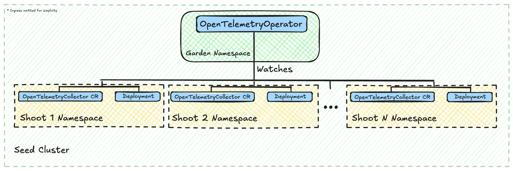
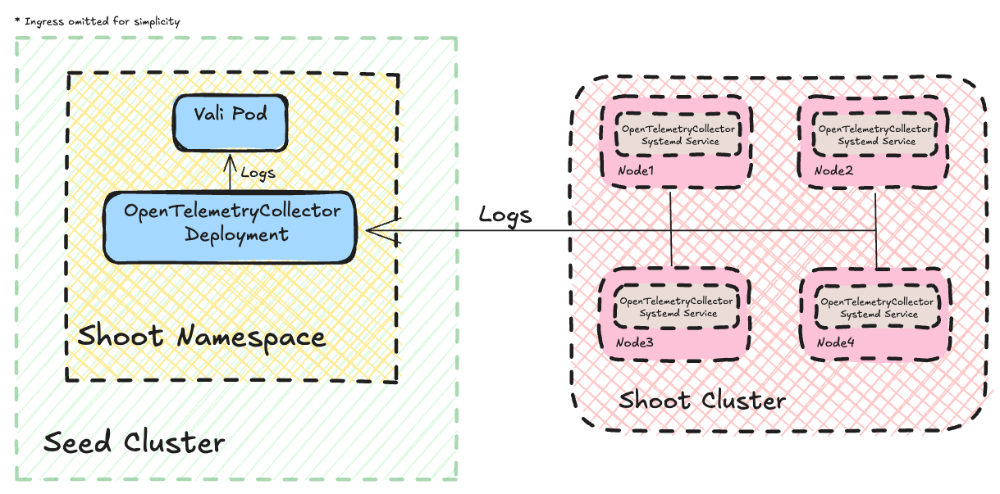
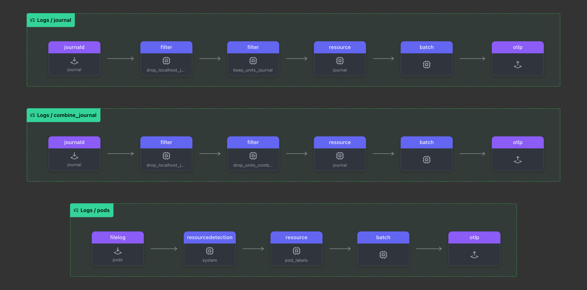

# GEP-34: Introducing OpenTelemetry Operator and Collectors in Shoot Control Planes

## Table of Contents

- [Summary](#summary)
- [Motivation](#motivation)
  - [Goals](#goals)
  - [Non-Goals](#non-goals)
- [Proposal](#proposal)
- [Alternatives](#alternatives)

---

## Summary

This proposal introduces the OpenTelemetry Operator and deploys OpenTelemetry Collectors within the shoot control plane namespaces of Gardener-managed clusters. Building on the foundation laid by [GEP-19](./19-migrating-observability-stack-to-operators.md) (migration to Prometheus and Fluent-bit operators) and the [Observability 2.0](https://github.com/gardener/logging/blob/master/docs/observability-2.0/Observability%202.0.md) vision, this GEP advances Gardener's observability stack by adopting OpenTelemetry standards. The initiative aims to layout the foundation for building a more cohesive and interoperable observability framework. This GEP takes the first step by introducing OpenTelemetry for logging, aligning with the [Observability 2.0](https://github.com/gardener/logging/blob/master/docs/observability-2.0/Observability%202.0.md) vision, with future enhancements planned to include metrics and optionally traces.

---

## Motivation

Gardener's current observability stack, while improved by the operator-based approach in [GEP-19](./19-migrating-observability-stack-to-operators.md), still relies on vendor specific format and protocols for collecting, processing and storing observability signals. This brings challenges in extending both components and scenarios used to process these signals and enforces lock-in integration scenarios with external consumers. By introducing the OpenTelemetry Operator and Collectors, this proposal addresses these challenges, aligning Gardener with industry trends and preparing it for future observability enhancements, such as unified visualization and tracing support.

### Goals

- **Deploy the OpenTelemetry Operator on Seed Clusters:** Install and configure the OpenTelemetry Operator to manage Collector instances across shoot control plane namespaces.
- **Deploy Gardener OpenTelemetry Collector Distribution in Shoot Control Planes:** Provision a dedicated Gardener OpenTelemetry Collector distribution instance via the OpenTelemetry Operator in each shoot control plane namespace to handle observability data.
- **Transport Logs signals through the OpenTelemetry Collector Distribution:** Configure fluent-bits to send logs to the Collectors receivers and wire the Collector exporters to the current logging backend.
- **Replace valitail system service with OpenTelemetry Collectors on shoot nodes:** Replace current valitail system service on shoot nodes with an OpenTelemetry Collector, keeping parity in the collected type of logs.

### Non-Goals

- **Immediate Replacement of Existing Tools:** This proposal does not aim to immediately decommission tools like Vali, Fluent-bit, or Prometheus; the migration will be phased.
- **Unified Visualization Implementation:** Developing a single UI for logs, metrics, and traces is out of scope, as no mature open-source solution currently exists (per [*Observability 2.0*](https://github.com/gardener/logging/blob/master/docs/observability-2.0/Observability%202.0.md)).
- **Full Tracing Adoption:** While tracing support is enabled, widespread instrumentation of Gardener components for distributed traces is a future step.

---

## Proposal

This section outlines the implementation plan to introduce the OpenTelemetry Operator and OpenTelemetry Collectors into Gardener's shoot control plane namespaces and in shoot nodes as a systemd service, aligning with Step 2 of the [*Observability 2.0*](https://github.com/gardener/logging/blob/master/docs/observability-2.0/Observability%202.0.md) roadmap.

### 1. Deploy the OpenTelemetry Operator on Seed Clusters

- **Objective:** Establish centralized management of OpenTelemetry Collectors across all shoot control planes.
- **Details:** Deploy the OpenTelemetry Operator (e.g., from the [OpenTelemetry Operator for Kubernetes](https://github.com/open-telemetry/opentelemetry-operator)) in the `garden` namespace of each seed cluster using `ManagedResources`, similar to the Prometheus operator deployment in [*GEP-19*](./19-migrating-observability-stack-to-operators.md).
- **Configuration:** The OpenTelemetry Operator will be deployed following the `botanist` workflow in the same way as the current `prometheus` and `fluent-bit` operators. This means that during the `Seed` reconciliation flow the OpenTelemetry Operator will be deployed into the `garden` namespace.

### 2. Create OpenTelemetry Collector Instances per Shoot

- **Objective:** Provide each shoot control plane with a dedicated OpenTelemetry Collector to process its observability data.
- **Details:** For each shoot, deploy an OpenTelemetry Collector instance in its control plane namespace (e.g., `shoot--project--name`). The collector will run as a `Deployment` managed by the OpenTelemetry Operator.
- **Configuration:** During the `Shoot` reconciliation flow, an [`OpenTelemetryCollector` Custom Resource](https://github.com/open-telemetry/opentelemetry-operator/blob/main/apis/v1beta1/opentelemetrycollector_types.go) will be created in the `Shoot` namespace. This Custom Resource will trigger the Operator to create an OpenTelemetry Collector Deployment & Ingress inside the namespace.
- **Example OpenTelemetryCollector CR:**

```yaml
apiVersion: opentelemetry.io/v1beta1
kind: OpenTelemetryCollector
metadata:
  labels:
    resources.gardener.cloud/managed-by: gardener
  name: opentelemetry-collector
spec:
  mode: deployment
  config:
    extensions:
      bearertokenauth:
        filename: {{ .pathAuthToken }}

    exporters:
      loki:
        endpoint: https://v-local--local.ingress.local.seed.local.gardener.cloud/vali/api/v1/push
        auth:
          authenticator: bearertokenauth
        tls:
          ca_file: {{ .pathCACert }}

    receivers:
      otlp:
        protocols:
          http:
            endpoint: 0.0.0.0:4317
    service:
      extensions: [bearertokenauth]
      pipelines:
        logs:
          exporters:
          - loki
          receivers:
          - otlp
```



### 3. Integrate with Existing Components

- **Objective:** Ensure a smooth transition by interfacing with the current observability stack.
- **Details:**
  - **Fluent-bit Integration:** Configure Fluent-bit to forward logs to the collector’s `loki` receiver, maintaining compatibility with the Vali-based setup from [*GEP-19*](./19-migrating-observability-stack-to-operators.md).
  - **Vali Integration:** Use the `loki` exporter to output the shoot logs to the existing Vali backend.
  - **Valitail Replacement:** Replace the current `valitail` system service on shoot nodes with the OpenTelemetry Collector, ensuring it collects the same types of logs as before. This will be done by deploying a systemd service for the collector on each shoot node, in the same way as the current `valitail` service.
  - **Event Logger Replacement:** In a later stage the current `event logger` shall be replaced with the [`k8s-event` receiver](https://github.com/open-telemetry/opentelemetry-collector-contrib/tree/main/receiver/k8seventsreceiver) in the Collector shoot instance.



Example Systemd unit for the OpenTelemetry Collector in the shoot node:

```ini
[Unit]
Description=opentelemetry-collector daemon
Documentation=https://github.com/open-telemetry/opentelemetry-collector
[Install]
WantedBy=multi-user.target
[Service]
CPUAccounting=yes
MemoryAccounting=yes
CPUQuota=3%
CPUQuotaPeriodSec=1000ms
MemoryMin=29M
MemoryHigh=400M
MemoryMax=800M
MemorySwapMax=0
Restart=always
RestartSec=5
EnvironmentFile=/etc/environment
ExecStart=/opt/bin/opentelemetry-collector --config=/var/lib/opentelemetry-collector/config/config
```

Example configuration for the OpenTelemetry Collector in the shoot node can be found [here](assets/gep-34-shoot-collector-config.yaml). For an overview of how it works, you can view the official [docs](https://opentelemetry.io/docs/collector/configuration/).

A visualisation of the example config (Image generated with [otelbin](https://github.com/dash0hq/otelbin)):


---

## Alternatives

### Direct Collector Deployment Without an Operator

- **Description:** Deploy OpenTelemetry Collectors in each shoot reconcile directly without using an operator.
- **Pros:** Simplifies initial setup, avoids operator overhead.
- **Cons:** Lacks scalability and management features (e.g., automatic upgrades, CR-based configuration), which are critical in Gardener’s multi-tenant environment.
- **Reason Rejected:** The operator aligns with [*GEP-19*](./19-migrating-observability-stack-to-operators.md)’s precedent of using operators for observability components, ensuring consistency and scalability.

---

This GEP establishes a critical milestone in Gardener’s journey toward [*Observability 2.0*](https://github.com/gardener/logging/blob/master/docs/observability-2.0/Observability%202.0.md). By deploying the OpenTelemetry Operator and OpenTelemetry Collectors, Gardener gains a standardized, extensible observability framework that integrates with its existing stack while paving the way for future enhancements like tracing and OpenTelemetry native backends.
