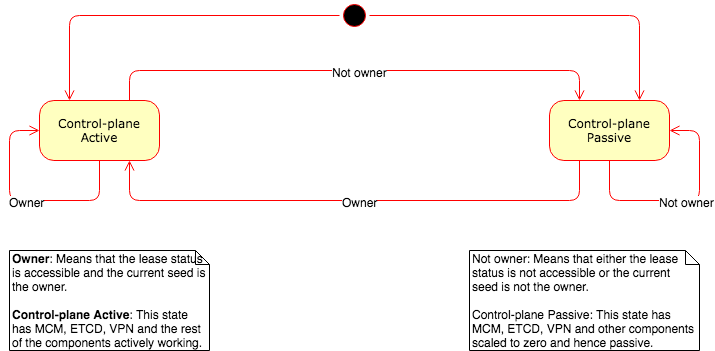

# Shoot Control-plane Migration

## Background

Gardener uses the seed-shoot architecture where the control-plane of multiple shoot clusters are hosted on a managed seed cluster. There can be many such seed clusters depending on the cloud provider, region etc.

## Motivation

The availability and health of the shoot control-planes is the responsibility of the corresponding seed cluster. But there can be many challenges to the task of the seed cluster to keep the shoot control-planes available and healthy. Some such challenges might be as below.

* The seed cluster might run out of resources to run the control-planes.
* The seed cluster's control-plane might become unavailable.
* Network between the shoot control-plane in the seed and the actual shoot cluster might become unavailable.
* The whole of the seed cluster might go down.

Such challenges might appear and last for different time periods ranging between transient to permanent.

There is also a future possibility of having a set of seed clusters serving a particular set of shoot clusters on a cloud provider, region etc. to address both reliability as well as load distribution among other issues.

Given such challenges and requirements, we need some mechanism to migrate/move a shoot cluster's control plane between seed clusters.

## Goal

* Provide a mechanism to migrate/move a shoot cluster's control-plane between seed clusters.
* The mechanism should make it possible to reuse the shoot cluster nodes that are already available and healthy. Such existing available and healthy nodes should be reused after the control-plane is moved to the destination seed cluster.
* The mechanism should be extensible in the future to support migration across regions/availability zones.
* The mechanism should be automated.
* The mechanism should work regardless whether the source seed cluster and the shoot control-plane running there is available and healthy or not. I.e., the mechanism should work for the disaster recovery scenario as well as a scenarios such as seed load-balancing.

To be more explicit, the following scenarios should be supported.

| Scenario | Source Seed Reachable from Garden Cluster | Source Seed Running | Source Seed Can Reach Anything Outside |
| ---:| --- | --- | --- |
| 1 | Yes | Yes/No | Yes/No |
| 2 | No | Yes | Yes |
| 3 | No | No | No |
| 4 | No | Yes | No |

## Non-goal

* The proposed mechanism need not right away implement a solution for migration across regions/availability zones.

## Reuse

* [Machine Controller Manager](https://github.com/gardener/machine-controller-manager) already has the capability to adopt existing machines in the IaaS layer based on proper machine definitions.
* [Etcd Backup Restore](https://github.com/gardener/etcd-backup-restore) already backs up the shoot etcd which is running in the shoot namespace of the source seed cluster. We can re-use this completely while restoring the shoot etcd on the destination seed cluster.

## Proposed Solution

### Backup and Restoration

The backup and restoration of the following resources that are currently not stored in the shoot apiserver/etcd is not covered by the [reuse](#reuse) mentioned above.

* Resources from the shoot namespace in the seed.
  * Terraform resources such as configmaps and secrets.
  * Machine Controller Manager resources such as machinedeployments, machinesets, machines, machineclasses, secrets etc.
* Resources from the shoot backup namespace in the seed.
  * Terraform resources such as configmaps and secrets.

All the additional resources listed above will be backed up in the same object store as what is used for backing up the shoot etcd.

1. The backup will be watch-based and not schedule based.

   But the granularity of the changes stored at the incremental backups would be at the object level and not the actual field-level changes. This is different from the etcd continuous/incremental backups where the incremental changes are recorded at the field level.

   Options for storage format might be as follows.
   1. The backup will be full backups at longer intervals followed by incremental backups at smaller intervals similar to the etcd continuous/incremental backup.
      1. While taking backup it will take care of dependencies. This is needed since while restoring from it, validation checks needs to be passed.

   2. Alternatively, the backups might be file-for-file with only the current/latest version being maintained.

#### Components of the solution

Taking the idea from the framework setup for etcd-backup-restore, we will introduce new component named 
**shoot-backup-restore** per shoot in shoot namespace in the seed cluster. This will backup the control plane component of shoot only from shoot namespace in the seed cluster.

##### shoot-backup-restore implementation

* It will get list of objects to be backed up via configmap shoot-resources.

  * TODO: Come up json format for dependencies configmap
  * Initial thought (not fool-proof) is to have nested dependency fields list  
  * Example configmap content:
  ```yaml
  awsmachineclass: spec.sercretRef
  machines: spec.class
  machineset: ...
  machinedeployment: ...
  configmap: ...
  secret: ...
  roles: ...       # May not be required?
  rolebinding: ... # May not be Required?
  service: ...     # May not be Required?

  ```

  * TODO: Consider OwnerReferences
  * TODO: Consider dependency hooks

* It will apply watch on seed's apiserver for those objects and takes backup of full object including its dependency.

* It will have an `/initialize` endpoint to initialize cluster.
  * This endpoint will be called by gardener in each reconcile.
  * As a part of endpoint, it should try to restore the objects from backups stored in bucket only if resource revision is older than last backup.
  * While restoring it should take care of dependencies.
  * Till the time of restoration, we will freeze backup to ignore updates.

* On container restart, it will take backup of all objects.

##### Gardener modification

* Gardener controller manager component config will have configuration of unique gardener-backup-bucket {can be bucket or private git repo} accessible. This will have backup of backup infrastructure related resources.
* Gardener will create seed namespace for shoot.
* It will create backup namespace and restore backup infrastructure related configmaps and secrets. Again restoration will be ignored in case of existing resources with higher revision.
* Wait until Backup-infrastructure controller create/reconcile backup resources successfully.
* Gardener will deploy shoot-backup-restore deployment.
* Gardener call `/initialize` endpoint and will wait until it succeeds.(Logic similar to etcd bootstrap script can be used for optimization.)
* Gardener will proceed with rest of shoot reconciliation.

#### Extensibility of backup/restore mechanism for the across-region scenario

This approach can be extended to support migration across regions by replicating the object store across regions. Such replication across regions might be required to be setup as a part of the regular backup mechanism to avoid risking the unavailability of the backups in the case of a downtime for the object store in the source seed's region. AWS, Azure and GCP support multi-region object store.

### Migration Co-ordination

Some of the components deployed as part of the shoot control-plane such as those listed below require careful co-ordination during migration to avoid split-brain or other sorts of problems in co-ordination and race conditions.

* Shoot Machine-controller-manager

  The possibility of two machine-control-managers (in source and destination seed clusters) managing the same set of machines should be avoided.

* Shoot Etcd StatefulSet

  The possibility of two etcd statefulsets (in source and destination seed clusters) backing up data to the same object store should be avoided.

* VPN?

#### Landscape Diagram


#### Components of the solution

##### Lease Service

The Lease Service will act as the central point of truth for all the seed clusters about which seed owns a particular shoot.

* It needs to be accessible from all the seed clusters among which the shoot control-plane can be moved.
* It needs to be highly available to reduce chances of false positives/negatives.
* Given the particular scenario of garden/seed/shoot architecture, shoot resource in the garden cluster is already the true single point of truth. The Lease Service would be just a secondary source of the truth. Hence, there is no need for any explicit mechanism for lease renewal or leader promotion. That can be done automatically based on the shoot resource.

###### Lease data structure for a shoot

* Owning seed cluster
* Lease Period
  * Lease start timestamp
  * Lease end timestamp or TTL

DNS seems well suited to address this problem of lease service. We can use DNS records with short TTL to
publish/broadcast the owning seed for any particular shoot. DNS is highly available and the short TTL can act like
the lease. Garden shoot-controller or some additional controller can populate or renew the DNS records based on the 
shoot resource records in the garden cluster.

##### Shoot Control-plane Co-ordinator

The Shoot Control-plane Co-ordinator is a pod (actually, a deployment) deployed as a part of each of the shoot control-plane in the seed clusters.

It has the responsibility to monitor whether the current seed cluster where it is deployed has the lease for the given shoot using any of the mechanisms chosen [above](#advertising-current-seed-cluster-lease-for-a-shoot-cluster) and take appropriate action to activate/passivate the relevant shoot control-plane components such as machine-controller-manager, etcd statefulset, VPN etc.

It has two states.

1. Active

In the active state, the co-ordinator is able to reach the lease service and knows that the current seed is the owner for the given shoot according to the lease service.

In such a scenario, the co-ordinator makes sure the shoot control-plane components such as machine-controller-manager, etcd statefulset, VPN etc. are scaled up and active.

2. Passive

In the passive state, the co-ordinator is either not able reach the lease service or knows that the current seed is not the owner of the given shoot according to the lease service.

In such a scenario, the co-ordinator passivates the shoot control-plane components such as machine-controller-manager, etcd statefulset, VPN etc. by scaling them down to zero.

It should not scale itself down, of course.

##### State Diagram



This component should also expose a `/healthz` endpoint which returns healthy only if it can get the current lease status and if the current seed cluster is the owner of the lease for the given shoot. This `/healthz` endoint can be used for livenessProbe in the shoot machine-controller-manager, shoot etcd and also perhaps in the VPN components to avoid co-ordination problems in case the shoot control-plane co-ordinator itself crashes.

###### Melt-down scenario

In the [above](#shoot-control-plane-co-ordinator) approach, there is a possibility of a melt-down-like scenario where the co-ordinator is not able to access the lease status for some long period even though it actually owns the lease during that period, but the gardener is able to access the seed cluster. In such a scenario, co-ordinator will scale down the relevant component to zero while a gardener reconciliation will scale them back up to the original values. This cycle can potentially keep happening while the scenario persists.

To address this issue, the co-ordinator can be supplied an additional source for the current lease status via some resource within the same namespace as the co-ordinator. The co-ordinator can choose to use the lease status from such a local resource or the remote/global/distributed resource depending on the validity of the lease periods in both locations. The gardener reconciliation can update the lease status on the local resource in the namespace of the co-ordinator.

The remote/global/distributed source for lease status is still required to handle the scenario where the gardener is not able to access the shoot control-plane on the seed cluster.

The assumption is that the opposite melt-down scenario of co-ordinator scaling up the control-plane components while gardener reconciliation scales it down will not happen because in such a scenario the gardener reconciliation would actually delete the shoot control-plane rather than just scale down.

### Pros

* No changes to existing shoot control-plane components except for additional livenessProbes.
* Works for different mechanisms for advertising the current seed cluster lease for a shoot cluster.

### Cons

* One more additional component (shoot control-plane co-ordinator) in the shoot control-plane. Gardener reconciliation should be enhanced to handle the shoot control-plane co-ordinator.
* Needs some sort of mechanism to advertise current seed cluster lease for a shoot cluster which need to be actively or passively kept up-to-date with changes to the shoot resource in the garden cluster.

### Changes Required in Gardener Reconciliation

On movement of seed for a shoot control-plane,

1. Update the lease status (this is optional if the lease status is calculated based on shoot resource).
2. Deploy the new control-plane on the destination seed cluster. This can done even before the current lease expires.
3. Garbage-collect the old shoot control-plane on the source seed cluster. This should be done after the new shoot control-plane is available and ready on the destination seed cluster.
   * Some care would be required while deleting the old shoot control-plane on the source seed cluster to avoid deleting the actual backup object store or even trigger the deletion grace period for it. Only the backup resources should be deleted without actually deleting the object store.

## Alternatives

Let individual components in the shoot control-plane (machine-controller-manager, etcd statefulset, VPN etc.) manage lease and co-ordination themselves.

This approach was discarded because of unnecessary duplication of responsibility.