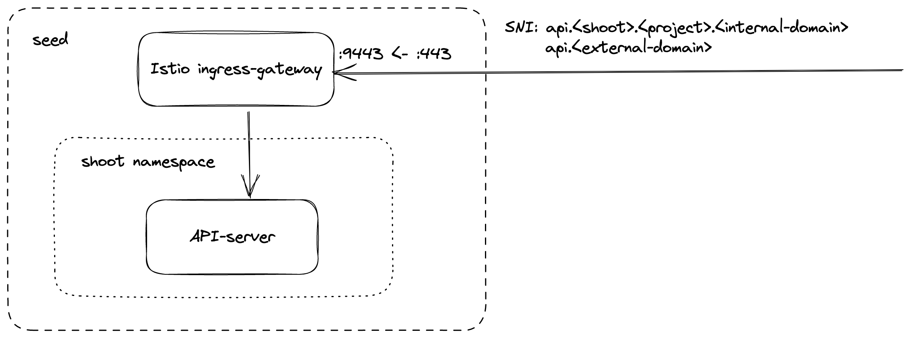
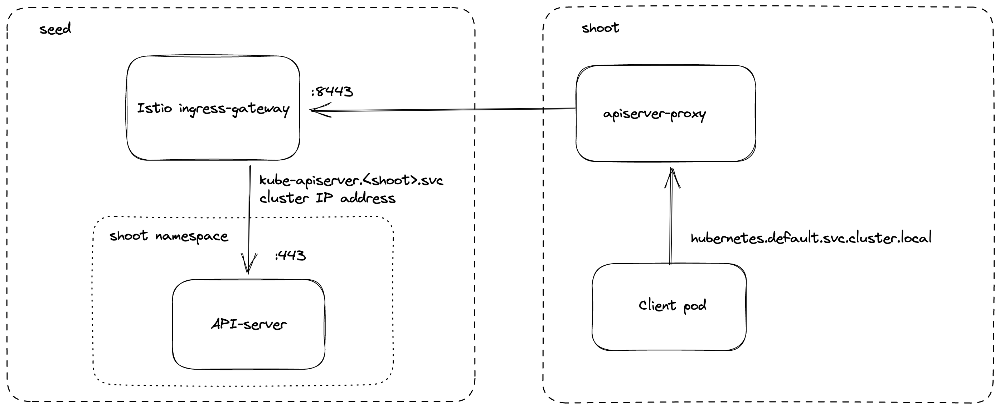
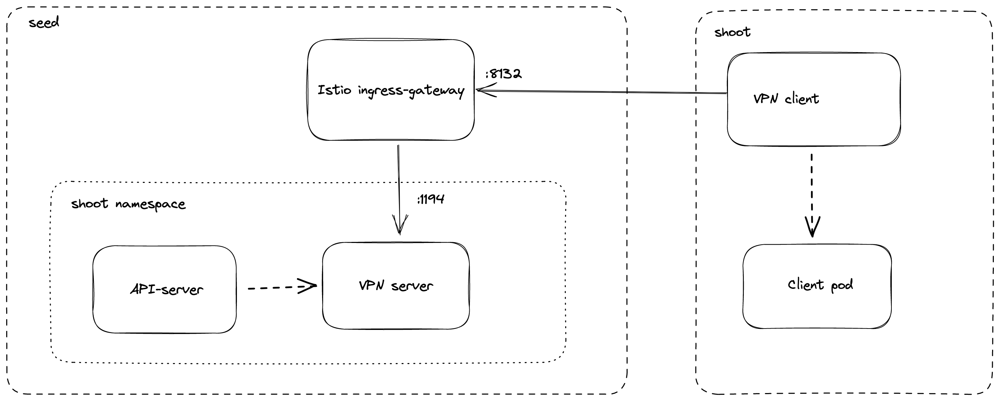

# Endpoints and Ports of a Shoot Control-Plane

With the [reversed VPN](../../development/reversed-vpn-tunnel.md) tunnel, there are no endpoints with open ports in the shoot cluster required by Gardener.
In order to allow communication to the shoots control-plane in the seed cluster, there are endpoints shared by multiple shoots of a seed cluster.
Depending on the configured zones or [exposure classes](../networking/exposureclasses.md), there are different endpoints in a seed cluster. The IP address(es) can be determined by a DNS query for the API Server URL.
The main entry-point into the seed cluster is the load balancer of the Istio ingress-gateway service. Depending on the infrastructure provider, there can be one IP address per zone.

The load balancer of the Istio ingress-gateway service exposes the following TCP ports:

* **443** for requests to the shoot API Server. The request is dispatched according to the set TLS SNI extension.
* **8443** for requests to the shoot API Server via `api-server-proxy`, dispatched based on the proxy protocol target, which is the IP address of `kubernetes.default.svc.cluster.local` in the shoot.
* **8132** to establish the reversed VPN connection. It's dispatched according to an HTTP header value.

## `kube-apiserver` via SNI 

DNS entries for `api.<external-domain>` and `api.<shoot>.<project>.<internal-domain>` point to the load balancer of an Istio ingress-gateway service.
The Kubernetes client sets the server name to `api.<external-domain>` or `api.<shoot>.<project>.<internal-domain>`.
Based on SNI, the connection is forwarded to the respective API Server at TCP layer. There is no TLS termination at the Istio ingress-gateway.
TLS termination happens on the shoots API Server. Traffic is end-to-end encrypted between the client and the API Server. The certificate authority and authentication are defined in the corresponding `kubeconfig`.
Details can be found in [GEP-08](../../proposals/08-shoot-apiserver-via-sni.md).

## `kube-apiserver` via `apiserver-proxy`

Inside the shoot cluster, the API Server can also be reached by the cluster internal name `kubernetes.default.svc.cluster.local`. 
The pods `apiserver-proxy` are deployed in the host network as daemonset and intercept connections to the Kubernetes service IP address.
The destination address is changed to the cluster IP address of the service `kube-apiserver.<shoot-namespace>.svc.cluster.local` in the seed cluster.
The connections are forwarded via the [HaProxy Proxy Protocol](https://www.envoyproxy.io/docs/envoy/latest/configuration/listeners/listener_filters/proxy_protocol) to the Istio ingress-gateway in the seed cluster.
The Istio ingress-gateway forwards the connection to the respective shoot API Server by it's cluster IP address.
As TLS termination happens at the API Server, the traffic is end-to-end encrypted the same way as with SNI.

Details can be found in [GEP-11](../../proposals/11-apiserver-network-proxy.md).

## Reversed VPN Tunnel

As the API Server has to be able to connect to endpoints in the shoot cluster, a VPN connection is established.
This VPN connection is initiated from a VPN client in the shoot cluster. 
The VPN client connects to the Istio ingress-gateway and is forwarded to the VPN server in the control-plane namespace of the shoot.
Once the VPN tunnel between the VPN client in the shoot and the VPN server in the seed cluster is established, the API Server can connect to nodes, services and pods in the shoot cluster.

More details can be found in the [usage document](../../development/reversed-vpn-tunnel.md) and [GEP-14](../../proposals/14-reversed-cluster-vpn.md).
