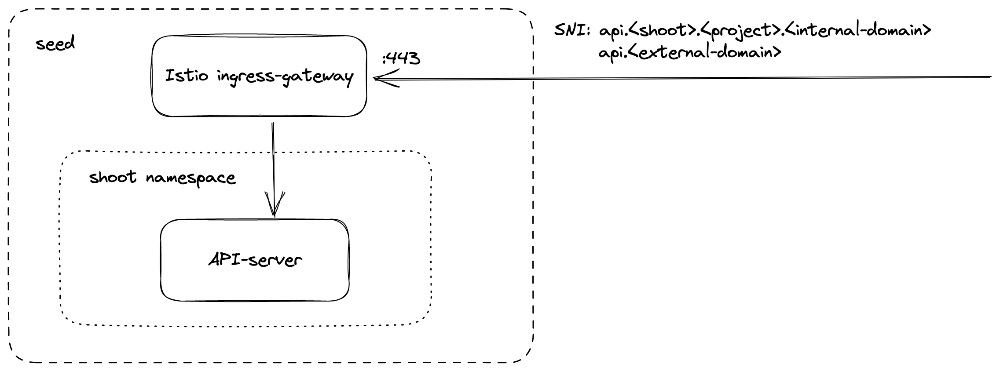
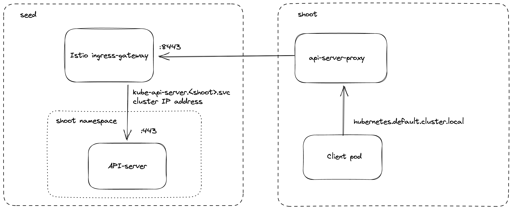

# Endpoints and Ports of a Shoot Control-Plane

With the reversed VPN tunnel, there are no endpoints with open ports in the shoot cluster required by gardener.
In order to allow communication to the shoots control-plane in the seed cluster, there are shared endpoints for all shoots of a seed cluster.
The main entry-point into the seed cluster is the loadbalancer of the Istio ingress-gateway service. Depending on the infrastructure provider, there can be one IP address per zone.

The Istio ingress-gateway exposes the following TCP ports:

* **443** for requests to the shoot API-server. The request is dispatched according to the set TLS SNI extension.
* **8443** for requests to the shoot API-server via `api-server-proxy`. 
* **8132** to establish the reversed VPN connection.

## Kube API-server via SNI 

DNS entries for `api.<external-domain>` and `api.<shoot>.<project>.<internal-domain>` point to the loadbalancer of an Istio ingress-gateway service.
The kubernetes client sets the server name to `api.<external-domain>` or `api.<shoot>.<project>.<internal-domain>`.
Based on SNI, the connection is forwarded to the respective API-server at TCP layer. There is no TLS termination at the Istio ingress-gateway.
TLS termination happens on the shoots API-server. Traffic is end-to-end encrypted between the client and the API-server. The certificate authority and authentication are defined in the corresponding `kubeconfig`.
Details can be found in [GEP-08](../proposals/08-shoot-apiserver-via-sni.md).

## Kube API-server via api-server-proxy

Inside the shoot cluster, the API-server can also be reached by the cluster internal name `kubernetes.default.svc.cluster.local`. 
The pods `api-server-proxy` are deployed in the host network as daemonset and intercepts connections to the kubernetes service IP address.
The destination address is changed to the cluster IP address of the service `kube-apiserver.<shoot-namespace>.svc.cluster.local` in the seed cluster.
The connections are forwarded via an HTTP tunnel to the Istio ingress-gateway in the seed cluster.
The Istio ingress-gateway forwards the connection to the respective shoot API-server by it's cluster IP address.

Details can be found in [GEP-11](../proposals/11-apiserver-network-proxy.md).

## Reversed VPN tunnel

As the API-server has to be able to connect to endpoints in the shoot cluster, a VPN connection is established.
This VPN connection is initiated from a VPN client in the shoot cluster. 
The VPN client connects to the Istio ingress-gateway and is forwarded to the VPN server in the control-plane namespace of the shoot.
Once the VPN tunnel between the VPN client in the shoot and the VPN server in the seed cluster is established, the API-server can connect to nodes, 
services and pods in the shoot cluster.

More details can be found [usage document](./reversed-vpn-tunnel.md) and [GEP-14](../proposals/14-reversed-cluster-vpn.md).

