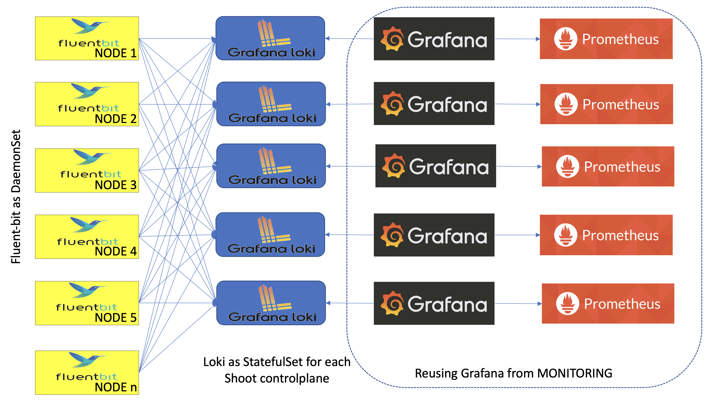
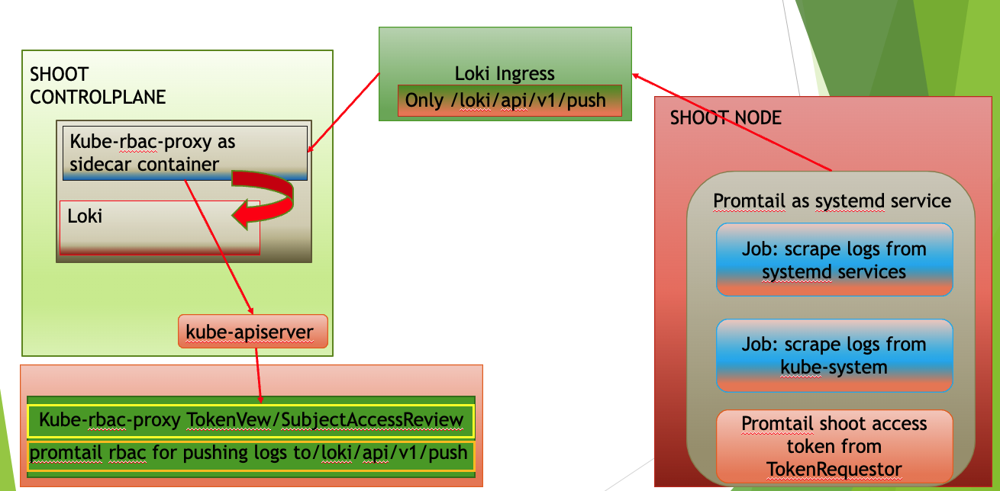
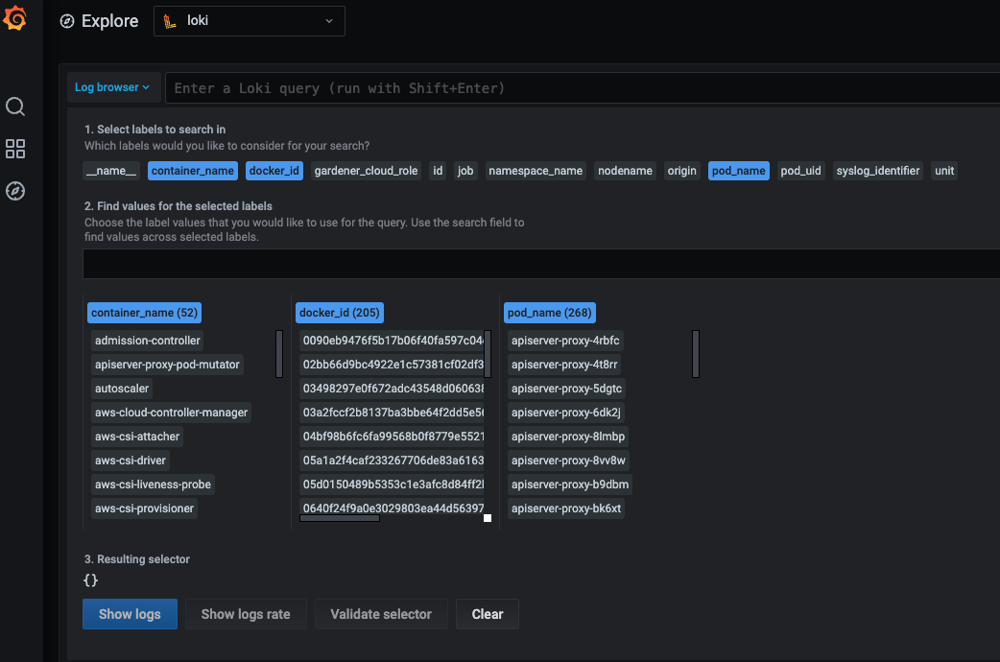

# Logging Stack

## Motivation

Kubernetes uses the underlying container runtime logging, which does not persist logs for stopped and destroyed containers. This makes it difficult to investigate issues in the very common case of not running containers. Gardener provides a solution to this problem for the managed cluster components by introducing its own logging stack.

## Components

* A Fluent-bit daemonset which works like a log collector and custom Golang plugin which spreads log messages to their Vali instances.
* One Vali Statefulset in the `garden` namespace which contains logs for the seed cluster and one per shoot namespace which contains logs for shoot's controlplane.
* One Plutono Deployment in `garden` namespace and two Deployments per shoot namespace (one exposed to the end users and one for the operators). Plutono is the UI component used in the logging stack.



## Container Logs Rotation and Retention

It is possible to configure the `containerLogMaxSize` and `containerLogMaxFiles` fields in the Shoot specification. Both fields are optional and if nothing is specified, then the `kubelet` rotates on the size `100M`. Those fields are part of provider's workers definition. Here is an example:

```yaml
spec:
  provider:
    workers:
      - cri:
          name: containerd
        kubernetes:
          kubelet:
            # accepted values are of resource.Quantity
            containerLogMaxSize: 150Mi
            containerLogMaxFiles: 10
```

The values of the `containerLogMaxSize` and `containerLogMaxFiles` fields need to be considered with care since container log files claim disk space from the host. On the opposite side, log rotations on too small sizes may result in frequent rotations which can be missed by other components (log shippers) observing these rotations.

In the majority of the cases, the defaults should do just fine. Custom configuration might be of use under rare conditions.

## Extension of the Logging Stack

The logging stack is extended to scrape logs from the systemd services of each shoots' nodes and from all Gardener components in the shoot `kube-system` namespace. These logs are exposed only to the Gardener operators.

Also, in the shoot control plane an `event-logger` pod is deployed, which scrapes events from the shoot `kube-system` namespace and shoot `control-plane` namespace in the seed. The `event-logger` logs the events to the standard output. Then the `fluent-bit` gets these events as container logs and sends them to the Vali in the shoot control plane (similar to how it works for any other control plane component).


## How to Access the Logs

The logs are accessible via Plutono. To access them:

  1. Authenticate via basic auth to gain access to Plutono.  
  The secret containing the credentials is stored in the project namespace following the naming pattern `<shoot-name>.monitoring`.
  In this secret you can also find the Plutono URL in the `plutono-url` annotation.
  For Gardener operators, the credentials are also stored in the control-plane (`shoot--<project-name>--<shoot-name>`) namespace in the `observability-ingress-users-<hash>` secret in the seed.

  1. Plutono contains several dashboards that aim to facilitate the work of operators and users.
  From the `Explore` tab, users and operators have unlimited abilities to extract and manipulate logs.

  > **Note:** Gardener Operators are people part of the Gardener team with operator permissions, not operators of the end-user cluster!

### How to Use the `Explore` Tab

If you click on the `Log browser >` button, you will see all of the available labels.
Clicking on the label, you can see all of its available values for the given period of time you have specified.
If you are searching for logs for the past one hour, do not expect to see labels or values for which there were no logs for that period of time.
By clicking on a value, Plutono automatically eliminates all other labels and/or values with which no valid log stream can be made.
After choosing the right labels and their values, click on the `Show logs` button.
This will build `Log query` and execute it.
This approach is convenient when you don't know the labels names or they values.


Once you feel comfortable, you can start to use the [LogQL](https://github.com/credativ/plutono) language to search for logs.
Next to the `Log browser >` button is the place where you can type log queries.

Examples:

1. If you want to get logs for `calico-node-<hash>` pod in the cluster `kube-system`:
  The name of the node on which `calico-node` was running is known, but not the hash suffix of the `calico-node` pod.
  Also we want to search for errors in the logs.

    ```{pod_name=~"calico-node-.+", nodename="ip-10-222-31-182.eu-central-1.compute.internal"} |~ "error"```

     Here, you will get as much help as possible from the Plutono by giving you suggestions and auto-completion.

2. If you want to get the logs from `kubelet` systemd service of a given node and search for a pod name in the logs:

    ```{unit="kubelet.service", nodename="ip-10-222-31-182.eu-central-1.compute.internal"} |~ "pod name"```

  > **Note:** Under `unit` label there is only the `docker`, `containerd`, `kubelet` and `kernel` logs.

3. If you want to get the logs from `gardener-node-agent` systemd service of a given node and search for a string in the logs:

    ```{job="systemd-combine-journal",nodename="ip-10-222-31-182.eu-central-1.compute.internal"} | unpack | unit="gardener-node-agent.service"```

> **Note:** `{job="systemd-combine-journal",nodename="<node name>"}` stream [pack](https://github.com/credativ/plutono) all logs from systemd services except `docker`, `containerd`, `kubelet`, and `kernel`. To filter those log by unit, you have to [unpack](https://github.com/credativ/plutono) them first.

4. Retrieving events:

* If you want to get the events from the shoot `kube-system` namespace generated by `kubelet` and related to the `node-problem-detector`:

    ```{job="event-logging"} | unpack | origin_extracted="shoot",source="kubelet",object=~".*node-problem-detector.*"```

* If you want to get the events generated by MCM in the shoot control plane in the seed:

    ```{job="event-logging"} | unpack | origin_extracted="seed",source=~".*machine-controller-manager.*"```

  > **Note:** In order to group events by origin, one has to specify `origin_extracted` because the `origin` label is reserved for all of the logs from the seed and the `event-logger` resides in the seed, so all of its logs are coming as they are only from the seed. The actual origin is embedded in the unpacked event. When unpacked, the embedded `origin` becomes `origin_extracted`.

## Expose Logs for Component to User Plutono

Exposing logs for a new component to the User's Plutono is described in the [How to Expose Logs to the Users](../../extensions/logging-and-monitoring.md#how-to-expose-logs-to-the-users) section.

## Configuration

### Fluent-bit

The Fluent-bit configurations can be found on `pkg/component/observability/logging/fluentoperator/customresources`
There are six different specifications:

* FluentBit: Defines the fluent-bit DaemonSet specifications
* ClusterFluentBitConfig: Defines the labelselectors of the resources which fluent-bit will match
* ClusterInput: Defines the location of the input stream of the logs
* ClusterOutput: Defines the location of the output source (Vali for example)
* ClusterFilter: Defines filters which match specific keys
* ClusterParser: Defines parsers which are used by the filters

### Vali

The Vali configurations can be found on `charts/seed-bootstrap/charts/vali/templates/vali-configmap.yaml`

The main specifications there are:

* Index configuration: Currently the following one is used:

```
    schema_config:
      configs:
      - from: 2018-04-15
        store: boltdb
        object_store: filesystem
        schema: v11
        index:
          prefix: index_
          period: 24h
```

* `from`: Is the date from which logs collection is started. Using a date in the past is okay.
* `store`: The DB used for storing the index.
* `object_store`: Where the data is stored.
* `schema`: Schema version which should be used (v11 is currently recommended).
* `index.prefix`: The prefix for the index.
* `index.period`: The period for updating the indices.

**Adding a new index happens with new config block definition. The `from` field should start from the current day + previous `index.period` and should not overlap with the current index. The `prefix` also should be different.**

```
    schema_config:
      configs:
      - from: 2018-04-15
        store: boltdb
        object_store: filesystem
        schema: v11
        index:
          prefix: index_
          period: 24h
      - from: 2020-06-18
        store: boltdb
        object_store: filesystem
        schema: v11
        index:
          prefix: index_new_
          period: 24h
```

* chunk_store_config Configuration

```
    chunk_store_config:
      max_look_back_period: 336h
```

**`chunk_store_config.max_look_back_period` should be the same as the `retention_period`**

* table_manager Configuration

```
    table_manager:
      retention_deletes_enabled: true
      retention_period: 336h
```

`table_manager.retention_period` is the living time for each log message. Vali will keep messages for (`table_manager.retention_period` - `index.period`) time due to specification in the Vali implementation.

### Plutono

This is the Vali configuration that Plutono uses:

```
    - name: vali
      type: vali
      access: proxy
      url: http://logging.{{ .Release.Namespace }}.svc:3100
      jsonData:
        maxLines: 5000
```

* `name`: Is the name of the datasource.
* `type`: Is the type of the datasource.
* `access`: Should be set to proxy.
* `url`: Vali's url
* `svc`: Vali's port
* `jsonData.maxLines`: The limit of the log messages which Plutono will show to the users.

**Decrease this value if the browser works slowly!**
