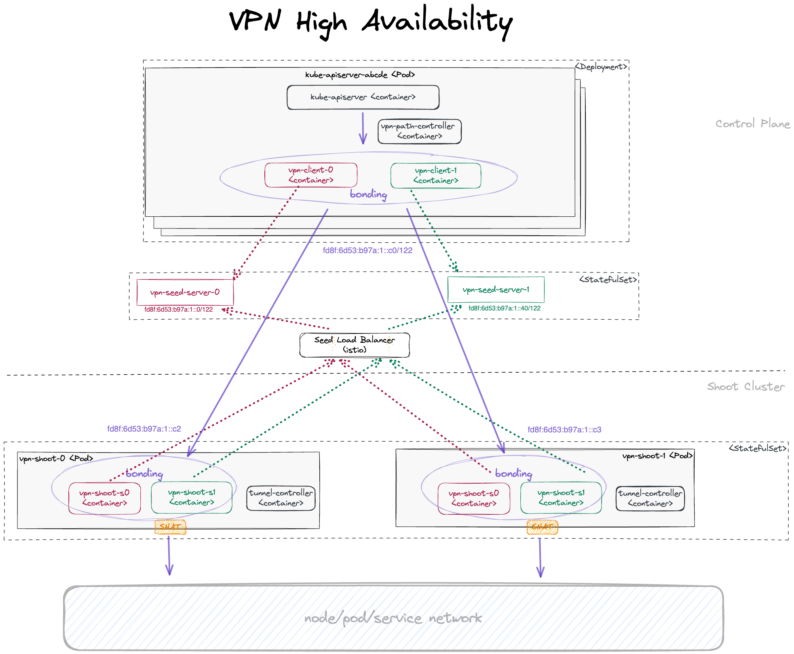
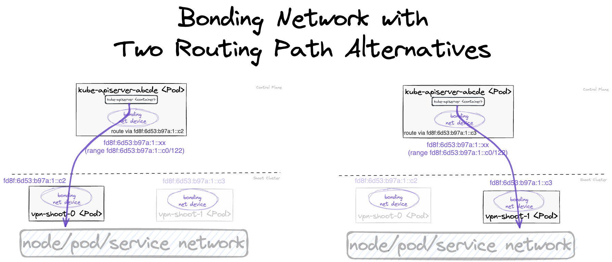

# Reversed VPN Tunnel Setup and Configuration 

The Reversed VPN Tunnel is enabled by default.
A highly available VPN connection is automatically deployed in all shoots that configure an HA control-plane.

## Reversed VPN Tunnel

In the first VPN solution, connection establishment was initiated by a VPN client in the seed cluster.
Due to several issues with this solution, the tunnel establishment direction has been reverted.
The client is deployed in the shoot and initiates the connection from there. This way, there is no need to deploy a special purpose
loadbalancer for the sake of addressing the data-plane, in addition to saving costs, this is considered the more secure alternative.
For more information on how this is achieved, please have a look at the following [GEP](../proposals/14-reversed-cluster-vpn.md).

Connection establishment with a reversed tunnel:

`APIServer --> Envoy-Proxy | VPN-Seed-Server <-- Istio/Envoy-Proxy <-- SNI API Server Endpoint <-- LB (one for all clusters of a seed) <--- internet <--- VPN-Shoot-Client --> Pods | Nodes | Services`

## High Availability for Reversed VPN Tunnel

Shoots which define `spec.controlPlane.highAvailability.failureTolerance: {node, zone}` get an HA control-plane, including a
highly available VPN connection by deploying redundant VPN servers and clients. 

Please note that it is not possible to move an open connection to another VPN tunnel. Especially long-running
commands like `kubectl exec -it ...` or `kubectl logs -f ...` will still break if the routing path must be switched 
because either VPN server or client are not reachable anymore. A new request should be possible within seconds.

### HA Architecture for VPN

Establishing a connection from the VPN client on the shoot to the server in the control plane works nearly the same
way as in the non-HA case. The only difference is that the VPN client targets one of two VPN servers, represented by two services 
`vpn-seed-server-0` and `vpn-seed-server-1` with endpoints in pods with the same name.
The VPN tunnel is used by a `kube-apiserver` to reach nodes, services, or pods in the shoot cluster.
In the non-HA case, a kube-apiserver uses an HTTP proxy running as a side-car in the VPN server to address
the shoot networks via the VPN tunnel and the `vpn-shoot` acts as a router.
In the HA case, the setup is more complicated. Instead of an HTTP proxy in the VPN server, the kube-apiserver has
additional side-cars, one side-car for each VPN client to connect to the corresponding VPN server.
On the shoot side, there are now two `vpn-shoot` pods, each with two VPN clients for each VPN server.
With this setup, there would be four possible routes, but only one can be used. Switching the route kills all
open connections. Therefore, another layer is introduced: link aggregation, also named [bonding](https://www.kernel.org/doc/Documentation/networking/bonding.txt).
In Linux, you can create a network link by using several other links as slaves. Bonding here is used with
active-backup mode. This means the traffic only goes through the active sublink and is only changed if the active one
becomes unavailable. Switching happens in the bonding network driver without changing any routes. So with this layer, 
vpn-seed-server pods can be rolled without disrupting open connections.

With bonding, there are 2 possible routing paths, ensuring that there is at least one routing path intact even if
one `vpn-seed-server` pod and one `vpn-shoot` pod are unavailable at the same time.

As multi-path routing is not available on the worker nodes, one routing path must be configured explicitly.
For this purpose, the `path-controller` app is running in another side-car of the kube-apiserver pod.
It pings all shoot-side VPN clients regularly every few seconds. If the active routing path is not responsive anymore,
the routing is switched to the other responsive routing path.

Using an IPv6 transport network for communication between the bonding devices of the VPN clients, additional
tunnel devices are needed on both ends to allow transport of both IPv4 and IPv6 packets.
For this purpose, `ip6tnl` type tunnel devices are in place (an IPv4/IPv6 over IPv6 tunnel interface).

The connection establishment with a reversed tunnel in HA case is:

`APIServer[k] --> ip6tnl-device[j] --> bond-device --> tap-device[i] | VPN-Seed-Server[i] <-- Istio/Envoy-Proxy <-- SNI API Server Endpoint <-- LB (one for all clusters of a seed) <--- internet <--- VPN-Shoot-Client[j] --> tap-device[i] --> bond-device -->  ip6tnl-device[k] --> Pods | Nodes | Services`

Here, `[k]` is the index of the kube-apiserver instance, `[j]` of the VPN shoot instance, and `[i]` of VPN seed server.

For each kube-apiserver instance, an own `ip6tnl` tunnel device is needed on the shoot side.
Additionally, the back routes from the VPN shoot to any new kube-apiserver instance must be set dynamically. 
Both tasks are managed by the `tunnel-controller` running in each VPN shoot client.
It listens for `UDP6` packets sent periodically from the `path-controller` running in the kube-apiserver pods.
These `UDP6` packets contain the `IPv6` address of the bond device.
If the tunnel controller detects a new kube-apiserver this way, it creates a new tunnel device and route to it.

For general information about HA control-plane, see [GEP-20](../proposals/20-ha-control-planes.md). 
