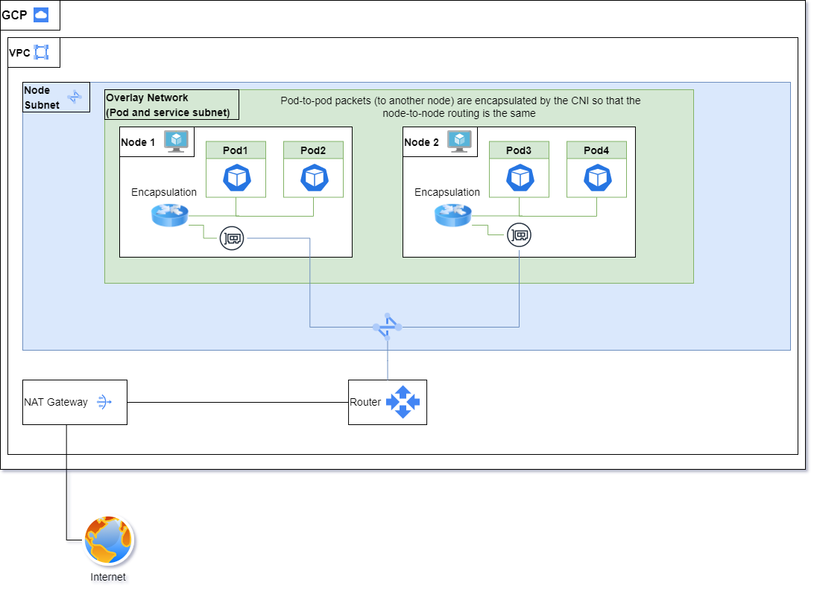
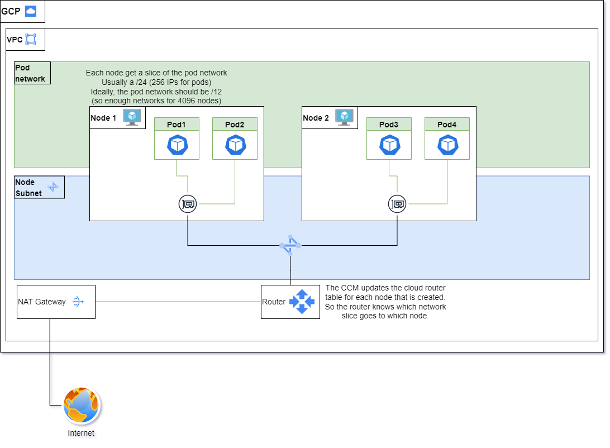

# Enable / disable overlay network for shoots with Calico
Gardener can be used with or without the overlay network. From now on, the default configuration of shoot clusters is without overlay network.

## Understanding overlay network
The Overlay networking permits the routing of packets between multiples pods located on multiple nodes, even is the pod and the node network are not the same.

This is done through the encapsulation of pod packets in the node network so that the routing can be done as usual. We use `ipip` encapsulation with calico in case the overlay network is enabled. This (simply put) sends an IP packet as workload in another IP packet.



In order to simplify the troubleshooting of problems and reducing the latency of packets travelling between nodes, the no overlay network is now enabled by default for all new clusters



This means that the routing is done directly through the VPC routing table. Basically, when a new node it created, it is assigned a slice (usually a /24) of the pod network. All future pods in that node are going to be in this slice. Then, the cloud-controller-manager updated the cloud provider router to add the new route (all packets with in the network slice as destination should go to that node).

This has the advantage of :
- Doing less work for the node as encapsulation takes some CPU cycles.
- The maximum transmission unit (MTU) is slightly bigger resulting in slightly better performance, i.e. potentially more workload bytes per packet.
- More direct and simpler setup, which makes the problems much easier to troubleshoot.

## Enabling the overlay network
In certain cases, the overlay network might be preferable if, for example, the customer wants to create multiple cluster in the same VPC. 

**In that case (multiple shoot in the same VPC), if the pod's network is not configured properly, there is a very strong chance that some pod IP address might overlay, which is going to cause all sorts of funny problems.** So, if someone asks you how to avoid that, they need to make sure that the podCIDR for each shoot **do not overlap with each other**.

To enable the overlay network, add the following to the shoot's YAML
```yaml
apiVersion: core.gardener.cloud/v1alpha1
kind: Shoot
metadata:
...
spec:
...
  networking:
    type: calico
    providerConfig:
      apiVersion: calico.networking.extensions.gardener.cloud/v1alpha1
      kind: NetworkConfig
      backend: bird
      ipv4:
        mode: Always
  ...
```

## Disabling the overlay network
Inversly, here is how to disable the overlay network
```yaml
apiVersion: core.gardener.cloud/v1alpha1
kind: Shoot
metadata:
...
spec:
...
  networking:
    type: calico
    providerConfig:
      apiVersion: calico.networking.extensions.gardener.cloud/v1alpha1
      kind: NetworkConfig
      backend: None
      ipv4:
        mode: Never
  ...
```

## How to know if a cluster is using overlay or not ?
You can look at any of the old nodes. If there are tunl0 devices at least at some point in time the overlay network was used.
Another way is to look into the Network object in the shoot namespace on the seed (see example above)

## Do we have some documentation somewhere on how to do the migration?
No, not yet. The migration from no overlay to overlay is fairly simply by just setting the configuration as specified above. The other way is more complicated as the Network configuration needs to be changed AND the local routes need to be cleaned.
Unfortunately, the change will be rolled out slowly (one calico-node at a time). Hence, it implies some network outages during the migration.

## AWS implementation
On AWS, we cannot use the cloud controller manager for managing the routes as it does not support multiple route tables, which Gardener creates. Therefore, we created a custom controller to manage the routes.

Also, the removal of the overlay network is only possible with Kubernetes >= 1.22. This is due to the machine controller manager only setting the source/destination flag accordingly for these Kubernetes versions.