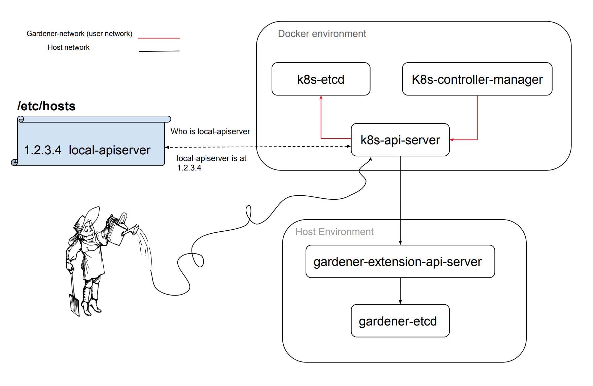

# Local-Garden

This is a small guide on how the local-garden directory is structured.
To learn how you can use the nodeless setup in this directory, please see [this document](../../../docs/development/local_setup.md).

## Components

Local-Garden consists of the following main directories:

- *Certificates:* This directory contains all the certificates/keys/configs required for this setup.
- *Kubeconfigs:* Contains the necessary configuration required for creating the admin and the controller-manager kubeconfigs.

The rest of the directory consists of scripts to run the node-less cluster components `kube-apiserver`, `kube-controller-manager`,
`etcd`. As well as scripts required for the Gardener aggregated API-server `gardener-etcd` and `apply-proxy-rbac`.

The below figure describes how these components interact with one another.


The only requirement to run this setup is to have `docker` installed. In addition there are a few other steps required
to get this setup to work:

- A user-defined docker network called `gardener-dev` is created. This is to enable DNS between the containers (e.g., curl http://kube-apiserver)
- A DNS mapping in the hosts `/etc/hosts` file. This is to enable connectivity from `kube-apiserver` to the `gardener-apiserver` which is applied to the container's DNS. hosts file.

These steps are automated and can be executed simply by running `make local-garden-up`.

## Certificate Generation

Certificate Generation for all the components are automated, and can be re-generated by simply
executing the `./garden-certificate-generator.go` optionally with one or more of the following
flags:

```bash
  -certs-path string
    	path to keys directory (default "./certificates/certs")
  -keys-path string
    	path to certs-directory (default "./certificates/keys")
  -kubeconfigs-path string
    	path to kubeconfigs (default "./kubeconfigs")
```
